# Mixture-of-Models: from picking a model to building a system

Chinese: `../../zh/vllm/blog/serving/semantic-router-mom.md`  
Release-page community stats (5k stars / 150+ contributors / 300k HF downloads) are theirs, then.

MoM ≠ MoE: MoE gates experts per token inside one forward; MoM orchestrates different architectures, even different boxes, per request. Timeline: 14-class fast/slow → Iris signals → Athena control plane → Themis operable contract → Fusion / Micro-Agent pick a **collaboration recipe**. Next: one versioned contract to train, eval, export, deploy, invoke. Algorithms: [micro-agent](semantic-router-micro-agent.md).

Local figures (copyright remains with the original site; study copies):

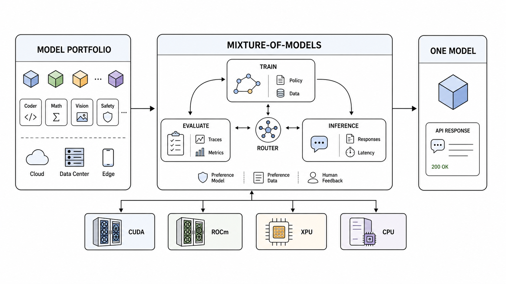

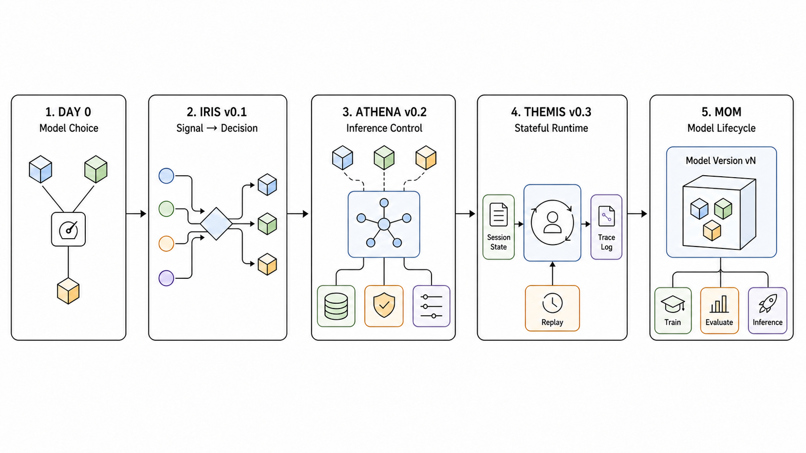

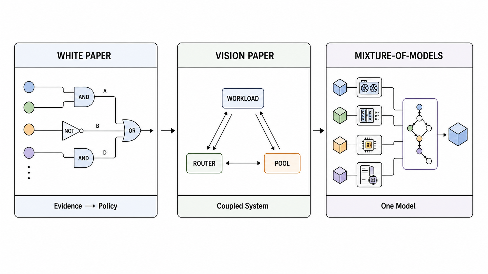

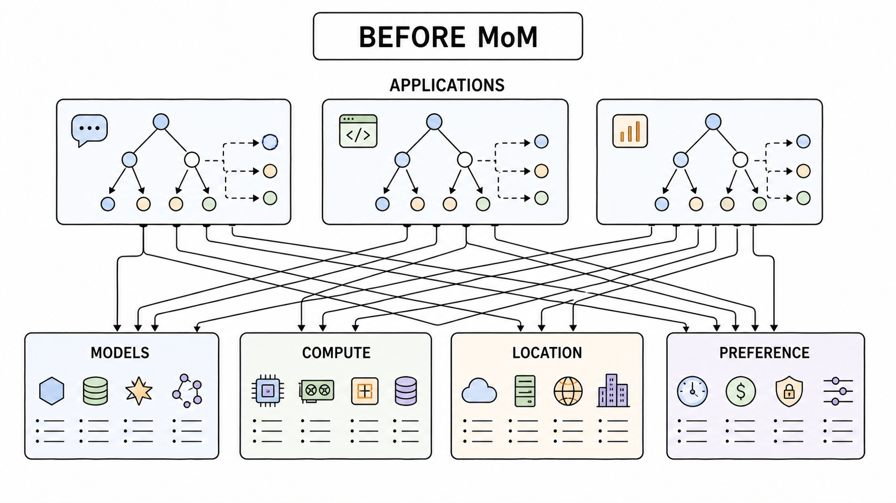

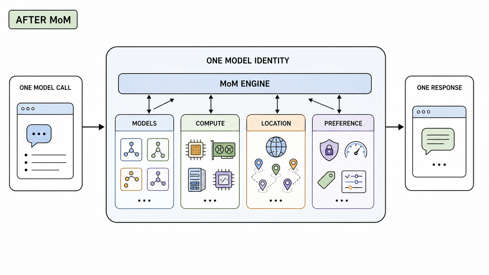

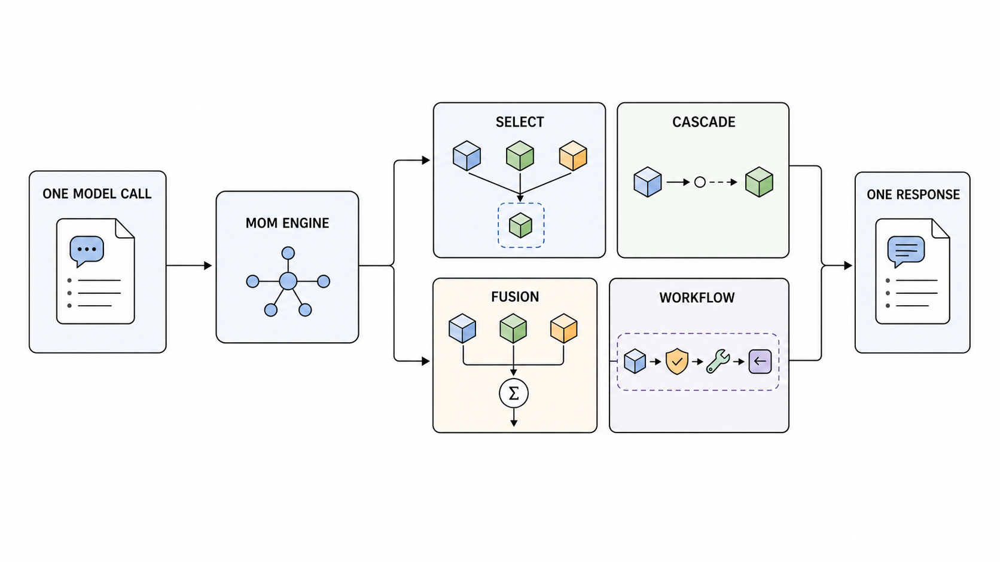

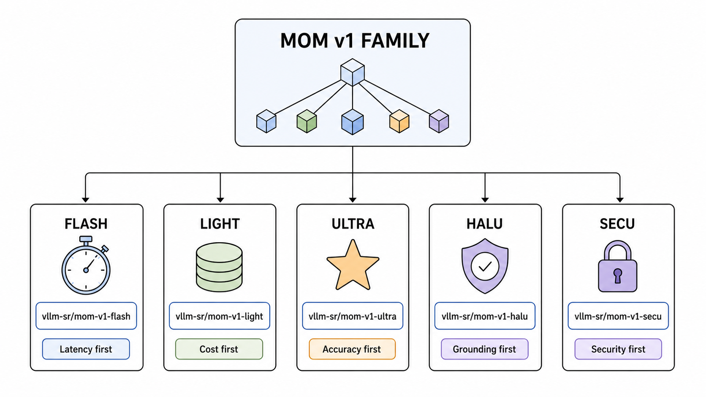

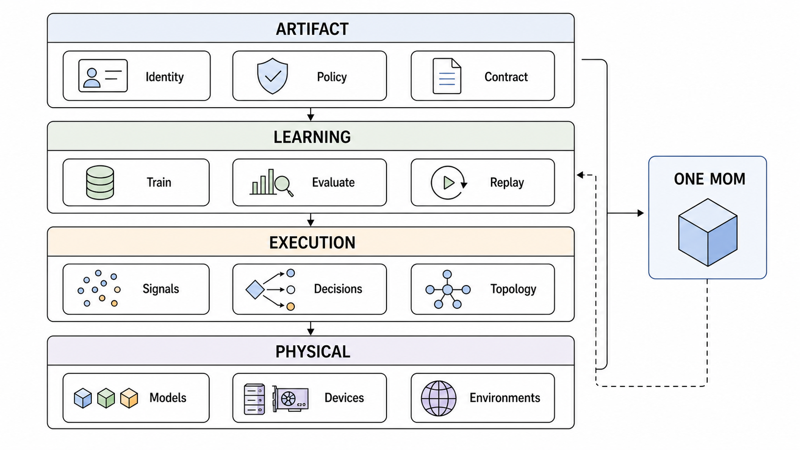

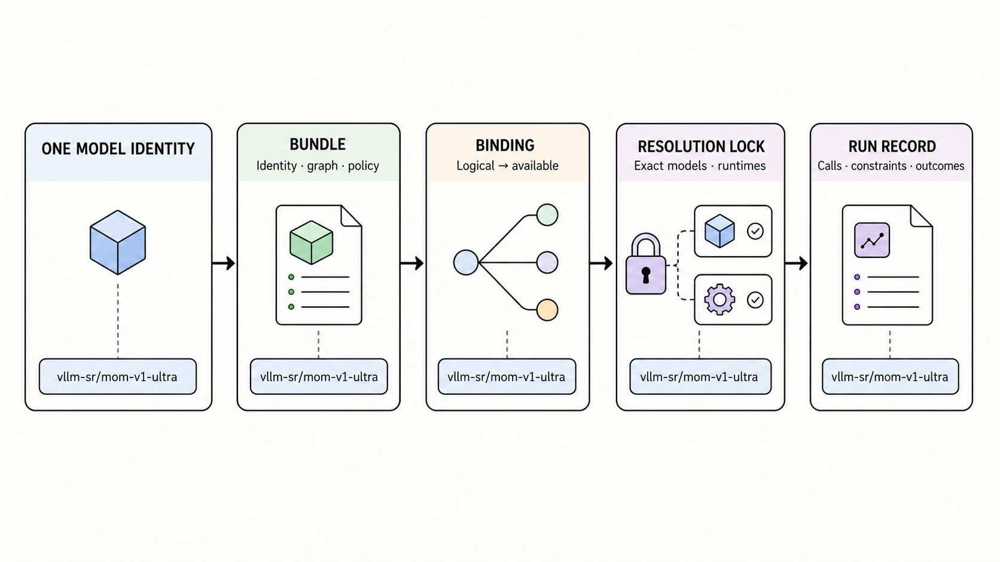

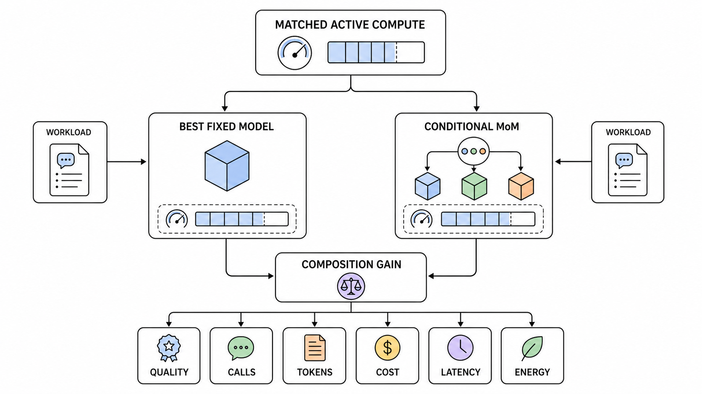

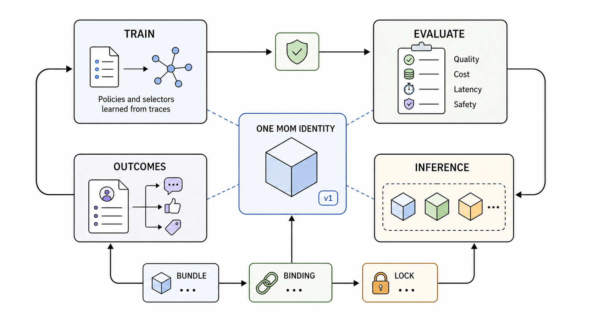

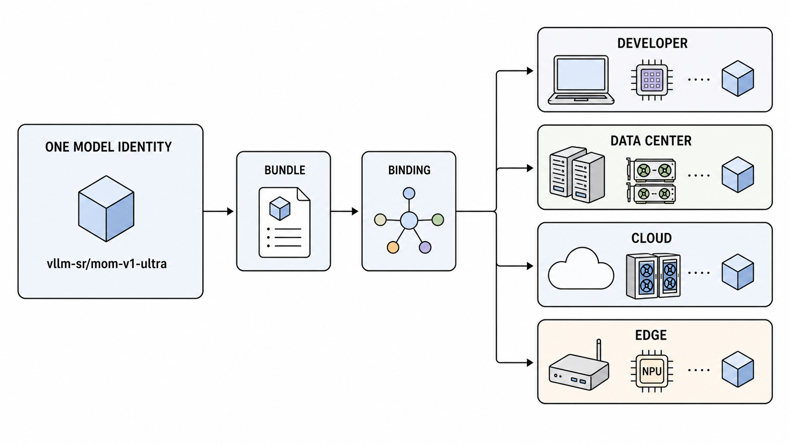

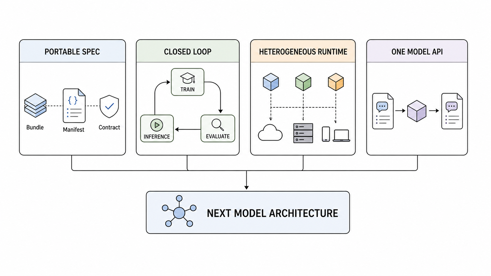

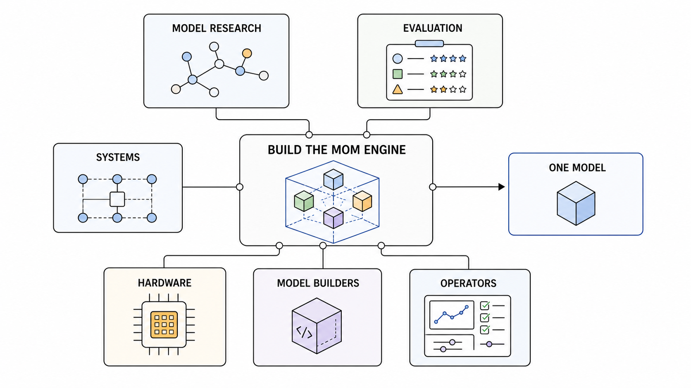
