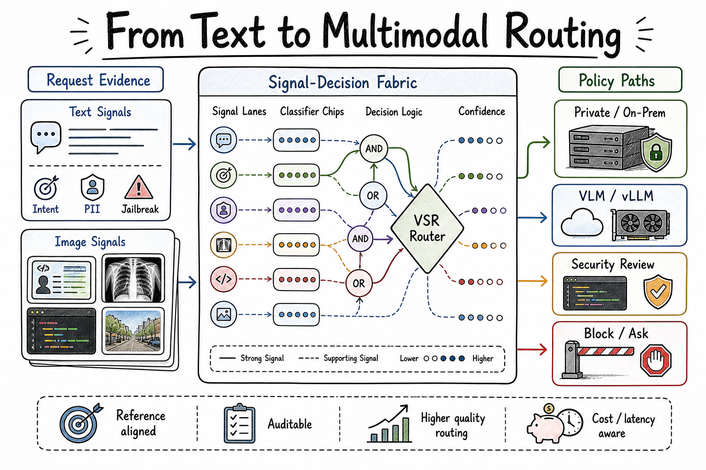
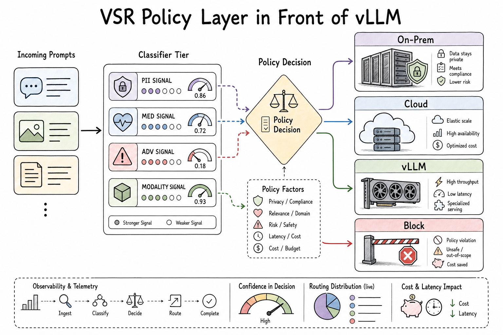
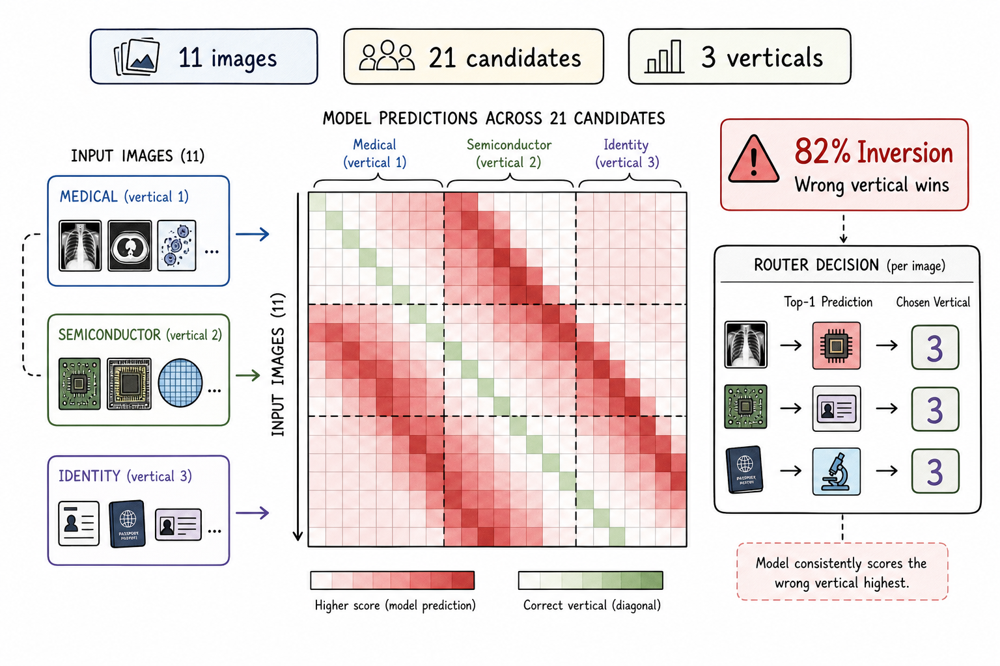
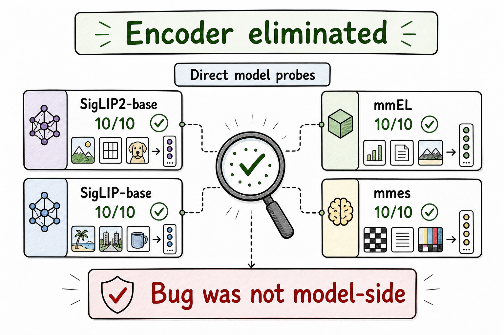
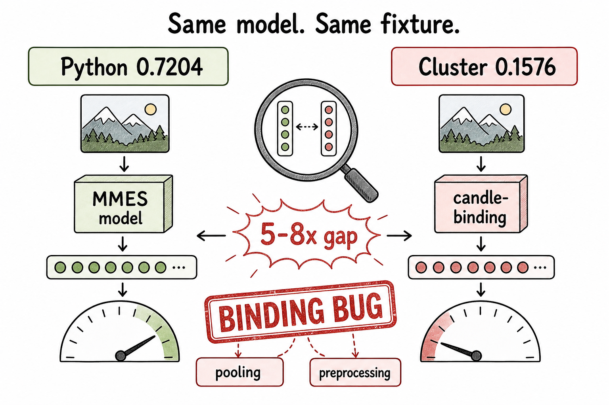
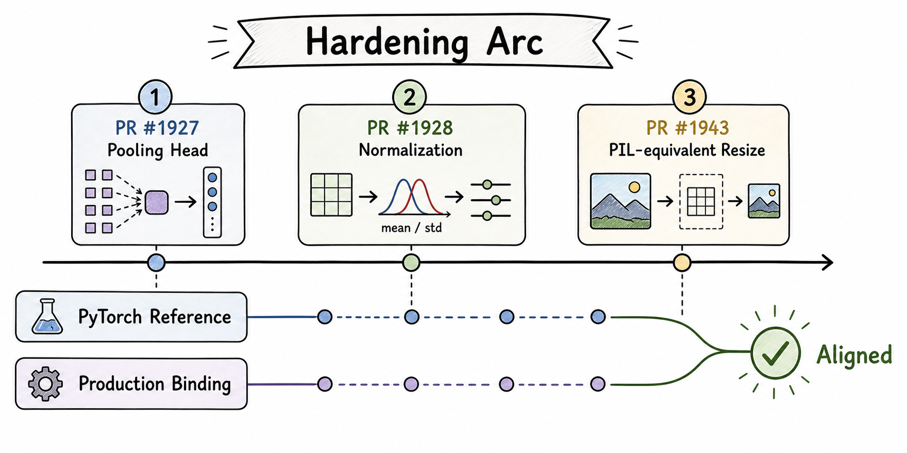
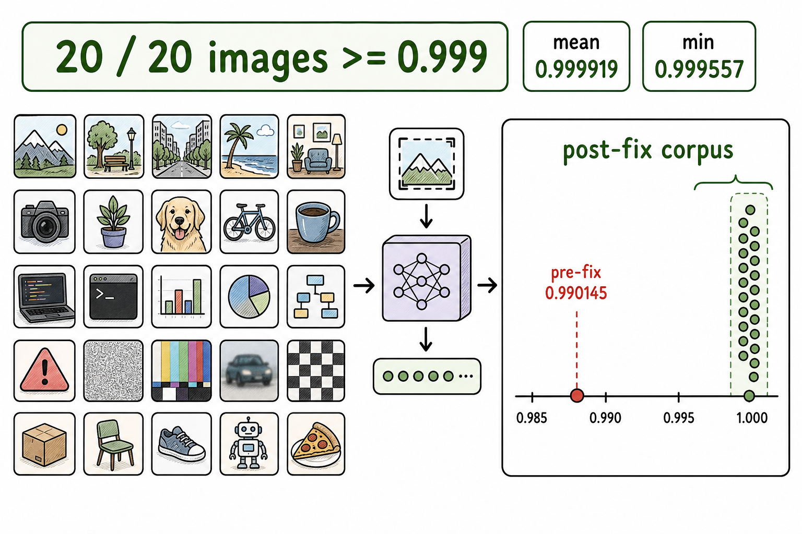
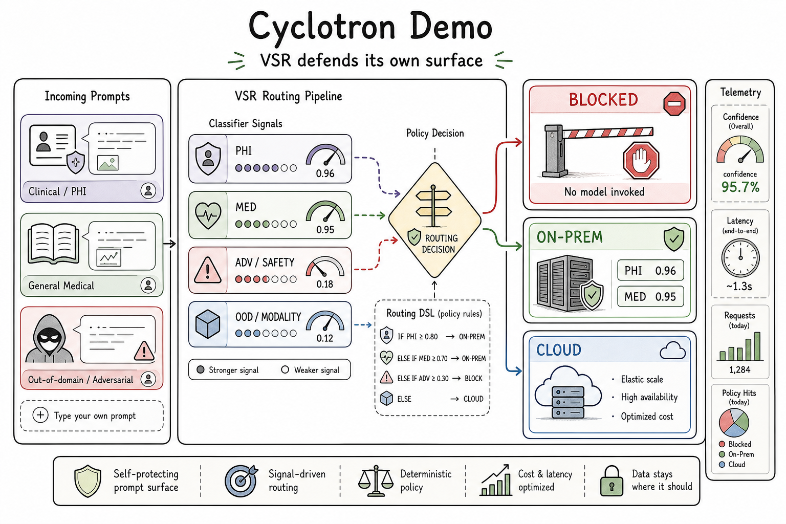
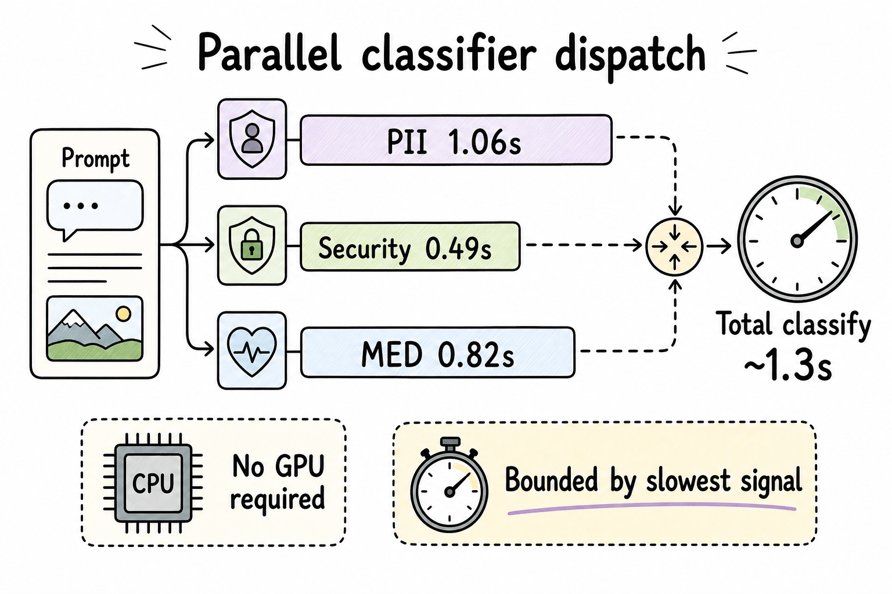
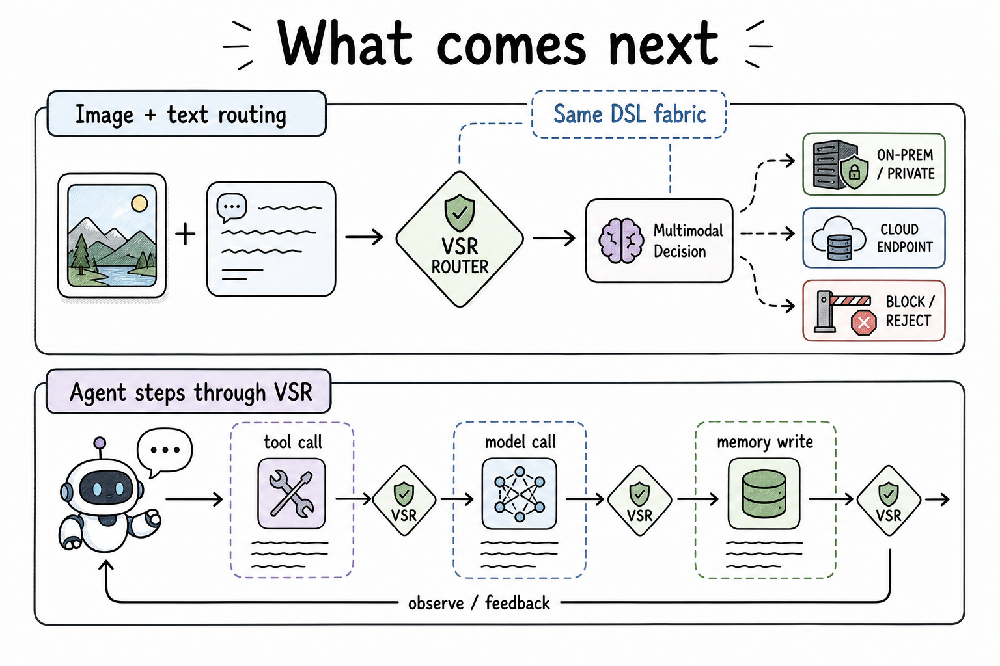

# Vision signals: not a bigger encoder — Candle missed the reference

Chinese: [zh/vllm/blog/serving/semantic-router-vision.md](../../../../zh/vllm/blog/serving/semantic-router-vision.md)  
Follows Athena’s `multi-modal-embed-small`.

11-image probe, 21 labels: deployed path inverted the vertical on 9/11 (82%). Same mmes checkpoint: PyTorch passport-anchor cosine 0.7204 vs Candle 0.1576. SigLIP2 / HF SigLIP / mmEL / PyTorch mmes all 10/10 — the weights were fine. Three cuts: pooling BERT-mean+Linear+tanh → SigLIP attentional probe (PR#1927); `(x-0.5)/0.5` norm (#1928); preprocess in Rust, Catmull-Rom ≈ PIL bicubic (#1943). Branch-stack 20 images vs Python: min cosine 0.999557. Until merge, PR validation, not production. Text classifiers can run concurrent; wall clock is the slowest (their CPU trace ~1.3s).

Local figures (copyright remains with the original site; study copies):

