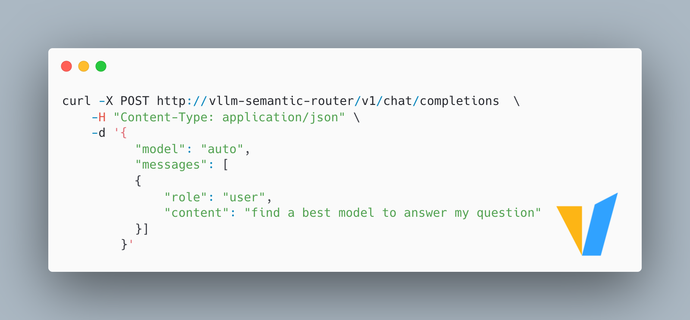
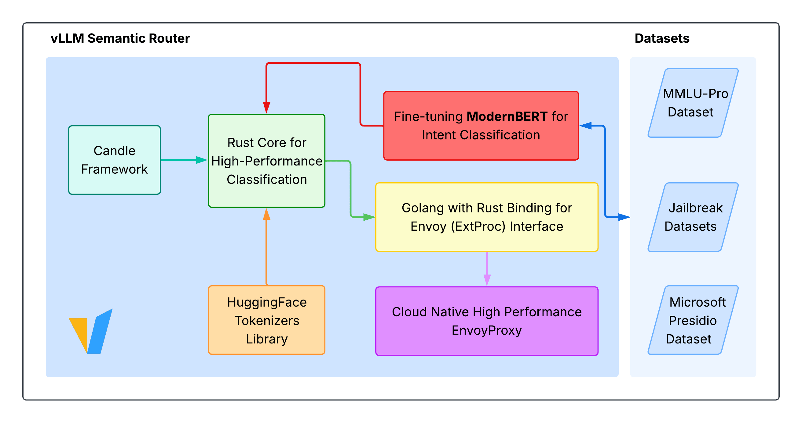

# Semantic Router: intent decides whether to reason

Chinese: `../../zh/vllm/blog/serving/semantic-router.md`  
September 2025 launch. v0.1 rewrite: [Iris](semantic-router-iris.md).

vLLM will fill the GPU; it will not ask “does this need CoT?” Always-on reasoning is expensive; always-off drops hard questions. Semantic Router classifies intent: easy queries take the fast path, hard ones take a reasoning model. Four pillars then: ModernBERT, fast/slow routing, Rust + Candle, K8s / Envoy `ext_proc`. Trial numbers ~**+10%** accuracy, **~50%** latency, **~50%** tokens; business domains higher still — demos.

Traps: unbounded reasoning budgets blow TTFT/p95; fat tool catalogs hurt accuracy — filter tools at the router. The classifier lived in-process, not as a vLLM embedding server. This is a **control plane**, not a replacement for the Rust P/D [Router](router.md) — same word, different job.

Local figures (copyright remains with the original site; study copies):

