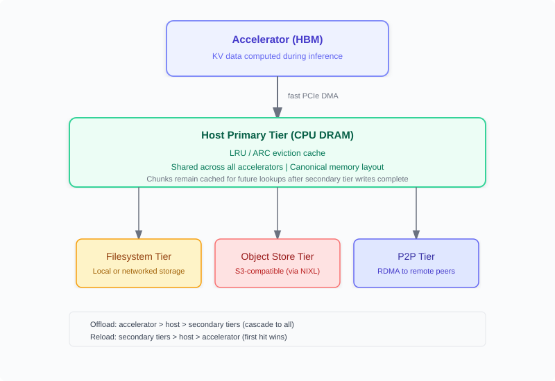
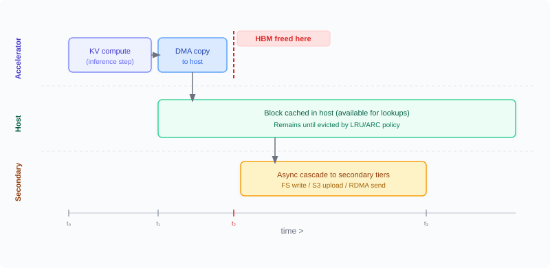
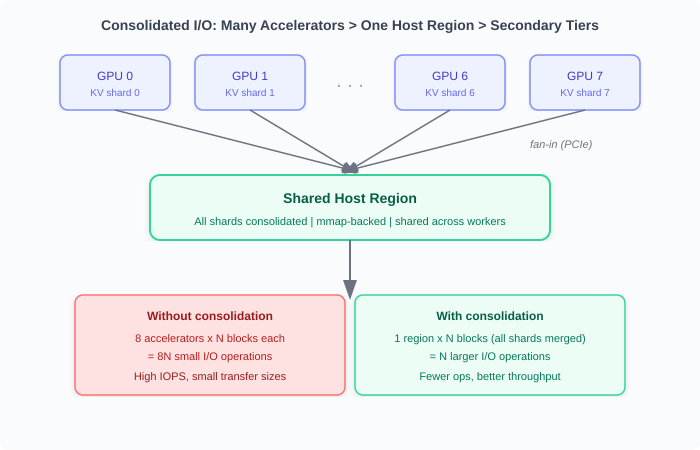
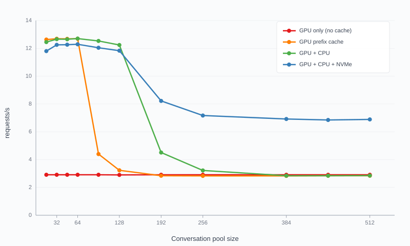

# Tiered KV Cache Offloading in vLLM

Chinese: [zh/vllm/blog/serving/tiered-kv-offload.md](../../../../zh/vllm/blog/serving/tiered-kv-offload.md)

2026-09-10. **Or Ozeri, Danny Harnik, Ronen Schaffer, Itay Etelis, Varun Sundar Rabindranath**. Study extract, not an official reprint. Host-centric follow-on to the CPU offload in [kv-offload.md](kv-offload.md). Same KVConnector family as [mooncake.md](mooncake.md) and [pegaflow.md](pegaflow.md). In vLLM since **v0.22**. Usage: [docs.vllm.ai … kv_offloading_usage](https://docs.vllm.ai/en/latest/features/kv_offloading_usage/). Hybrid sibling: [glm53-hisparse.md](glm53-hisparse.md). Agent routing: [agentx.md](agentx.md).

Long-context models and multi-turn conversations generate large KV caches. When accelerator memory (GPU HBM) fills, previously computed KV is evicted. The next request that needs it must recompute from scratch.

**Tiered KV cache offloading keeps evicted KV** across host memory, storage, and remote peers. Instead of recomputing, vLLM reloads from a lower tier. With secondary tiers, KV also becomes **shareable across nodes**: horizontal cache scaling, warm-starting new instances from shared storage, and peer transfer for disaggregated serving or load balancing.

## The host-centric design

Core rule: **all KV data flows through host memory (CPU DRAM)**.

Offload: accelerator → host first, then host → filesystem / object store / remote peers. Reload: reverse. A secondary tier promotes into host memory, then the accelerator loads from the host.



**Figure (page architecture diagram).** All KV flows through the host primary tier. Secondary tiers extend capacity beyond host DRAM. On offload, chunks cascade to all tiers. On reload, the first tier that holds the chunk serves it.

### Fast accelerator release, just-in-time allocation

Copying accelerator → host is a local PCIe transfer. **Accelerator memory is freed as soon as this copy completes** — before any secondary-tier transfer starts. Storage writes, network sends, and remote RDMA proceed from the host copy without touching accelerator memory again. **On reload, accelerator memory is allocated only once the data is ready in the host**, not reserved while waiting for tier transfers. Accelerator memory is held only while actively needed.



**Figure (offload timeline).** Accelerator memory is freed at t2 — as soon as the host copy completes. Secondary-tier writes continue asynchronously from the host copy.

### Consolidated I/O

With `tensor_parallel_size=8`, each device holds a KV shard. The framework **consolidates all shards into one shared host memory region**.



**Figure (consolidated I/O).** Multiple accelerator shards fan into one shared host region. Secondary tiers see fewer, larger I/Os.

### Canonical memory layout

The host region uses a canonical layout: each page stores one block of one layer, with all KV heads from across TP ranks gathered into one contiguous region. Locating a chunk is an offset calculation.

The fixed host-side layout keeps sharing correct even when GPU layouts differ across nodes — accelerator type, attention backend (FlashAttention, FlashInfer, Triton), or parallelism. **Nodes with different setups share KV directly**; no remapping. A TP=2 node and a TP=4 node produce identical host-side chunks for the same KV data.

### Simple secondary tiers

Secondary tiers are a single process per vLLM instance. They transfer with CPU libraries (POSIX I/O, S3 SDKs, RDMA verbs) and never touch accelerator memory or APIs. No multi-process coordination and no accelerator-specific layouts.

## How offloading and reloading work

The unit is a **chunk** — a fixed-size piece of KV covering a group of tokens. By default a chunk maps to one accelerator block. `blocks_per_chunk` can enlarge chunks (larger I/Os to host and secondary tiers).

### Offload path

New KV chunks move accelerator → host via async DMA. **Accelerator memory is freed immediately**, before secondary-tier transfers. The tiering manager then cascades chunks to **all** configured secondary tiers at once, reading from the host copy.

The host primary tier is a **proper LRU/ARC cache**, not a staging buffer. Chunks stay in host memory and serve future hits. Only when host capacity is exhausted are LRU chunks evicted — and even then they survive in whichever secondary tier received them.

### Reload path

The scheduler checks the host cache first. On host miss, secondary tiers are queried in configured order; the first that holds the chunk serves it. The tier promotes the chunk back into host memory asynchronously; during that time the scheduler receives `RETRY` and re-checks next cycle.

Different chunks in the same request can come from different tiers (filesystem vs remote peer).

## Secondary tiers

### Filesystem

Each KV chunk is a file on local or networked storage. Content-addressed naming: identical token sequences map to the same key, so matching inputs share cached data automatically.

When multiple vLLM instances share the same mount (NAS, or several instances on one node), they **share KV automatically** with no extra config.

Highlights: **non-blocking lookups**, **atomic writes**, **separate read/write thread pools**.

```bash
vllm serve Qwen/Qwen3.6-35B-A3B \
    --kv-transfer-config '{
        "kv_connector_extra_config": {
            "spec_name": "TieringOffloadingSpec",
            "cpu_bytes_to_use": 107374182400,
            "secondary_tiers": [{"type": "fs", "root_dir": "/mnt/kv-cache"}]
        }
    }'
```

`cpu_bytes_to_use` **107374182400** is 100 GiB.

### Object storage

KV chunks in S3-compatible stores via NIXL. Same content-addressed scheme. Typically cheaper per GB than high-performance file storage; still shared across instances.

```bash
--kv-transfer-config '{
    "kv_connector_extra_config": {
        "spec_name": "TieringOffloadingSpec",
        "cpu_bytes_to_use": 107374182400,
        "secondary_tiers": [{
            "type": "obj",
            "bucket": "my-kv-cache",
            "endpoint_override": "http://minio:9000"
        }]
    }
}'
```

### Peer-to-peer (P2P)

Cross-instance KV sharing over the network. ZMQ for coordination, RDMA via NIXL for bulk transfer. **Host-to-host only** — no accelerator memory on either side.

The P2P tier does **not** choose which peer to pull from. That is the orchestration layer (e.g. [llm-d](https://github.com/llm-d/llm-d)). The orchestrator drives transfers through the request's `kv_transfer_params`. Details: [usage guide — orchestration-layer protocol](https://docs.vllm.ai/en/latest/features/kv_offloading_usage/#orchestration-layer-protocol).

```bash
--kv-transfer-config '{
    "kv_connector_extra_config": {
        "spec_name": "TieringOffloadingSpec",
        "cpu_bytes_to_use": 107374182400,
        "secondary_tiers": [{"type": "p2p", "host": "10.0.0.1", "port": 5710}]
    }
}'
```

Two uses:

#### Prefill/Decode disaggregation

The prefill instance computes KV chunks and leaves them in its host tier. The decode instance pulls from the prefiller's host memory via RDMA.

Advantage over GPU-based P/D: **consolidated I/O turns many small per-GPU transfers into fewer, larger RDMA operations**. With *chunked prefill*, each completed prefill-chunk is immediately available for transfer — compute and movement overlap, which lowers TTFT.

#### Load balancing

Move KV from an overloaded instance to one with capacity. Any node can pull from any peer.

More on P2P with llm-d: [llm-d.ai blog](https://llm-d.ai/blog/p2p-kv-cache-sharing-llm-d).

## Hybrid model support

Integrates with vLLM's hybrid memory allocator. Full attention, sliding window, MLA, Mamba — handled transparently.

The canonical layout normalizes all KV formats into a uniform byte buffer. **Each chunk has a fixed byte size on the host**, regardless of layer types inside it. Different layer types pack different token counts into the same chunk — Mamba state layers cover many more tokens per chunk than full-attention layers, so they offload less often.

- **Sliding window layers** reload only tokens inside the window, not full history.
- **State-space layers** (Mamba) offload and reload their state alongside attention KV.

Named architectures: DeepSeek V4, GLM 5.3, Nemotron 3, and others.

## Observability

Prometheus metrics on vLLM's `/metrics`:

- **Host cache utilization** — fill ratio of the primary tier
- **Transfer throughput** — bytes and time for accelerator ↔ host
- **Per-tier latencies** — lookups and data transfers
- **Per-tier hit rates**

Secondary tiers can **define custom metrics** (counters, histograms, gauges) that register automatically.

## KV events

As chunks move, the framework emits structured **KV events**: which chunks were stored or evicted, from which tier, locality (local vs remote). Secondary tiers can emit their own.

Orchestrators consume these events to route to the instance most likely to hit cache. [llm-d](https://github.com/llm-d/llm-d) and [Dynamo](https://github.com/ai-dynamo/dynamo) are named. llm-d also uses events to orchestrate P2P transfers.

## Adding a new secondary tier

Four core methods:

```python
class SecondaryTierManager(ABC):

    def lookup(self, key, req_context) -> LookupResult:
        """Does this tier have a chunk? Returns HIT, MISS, or RETRY."""

    def submit_store(self, job_metadata: JobMetadata) -> None:
        """Start async store from host to this tier."""

    def submit_load(self, job_metadata: JobMetadata) -> None:
        """Start async load from this tier to host."""

    def get_finished_jobs(self) -> Iterable[JobResult]:
        """Poll completed transfers."""
```

Each tier receives a **direct memoryview** into the shared host region at construction. `submit_store()` reads from it; `submit_load()` writes into it. **No intermediate copies or serialization.** Each secondary tier manages its own eviction.

In-tree reference: [`vllm/v1/kv_offload/tiering/example/`](https://github.com/vllm-project/vllm/tree/main/vllm/v1/kv_offload/tiering/example). Out-of-tree tiers: set `module_path` in the tier config; vLLM loads a custom `SecondaryTierManager` without core changes.

## Performance — scaling to more users

Main benefit: avoid repeated prefills by reloading from a cheaper tier.

With few concurrent conversations, all caching methods look good — HBM holds the working set. As the pool grows:

- **Up to ~64 conversations** — HBM holds the working set; all methods perform well.
- **64–128 conversations** — HBM fills; throughput drops without offloading. CPU offloading holds performance.
- **Beyond 128 conversations** — CPU cache also fills. Storage offloading keeps a high hit ratio, more than doubling throughput versus the alternatives.



**Figure (page performance plot).** Storage has higher latency than CPU, so it does not reach peak throughput. At scale the choice is a storage-backed hit versus full recompute — storage wins.

**Benchmark setup (page):**

- Model: `Qwen/Qwen3.6-35B-A3B` on 2× NVIDIA H100 (TP=2)
- Storage tier: filesystem on local NVMe
- Workload: multi-turn, 12K-token initial prompts + 4K tokens per round, 8 rounds
- Max request concurrency: 64
- Measures prefiller throughput only (P/D disaggregated)

Reproduction: [neuralmagic/fs-offload-experiments](https://github.com/neuralmagic/fs-offload-experiments).

## Acknowledgements

Liran Schour, Chang Guo, Srinivas Krovvidi, Rotem Shavitt, Effi Ofer, Omer Paz, Kfir Toledo, Michal Malka, plus community code, reviews, and feedback.
