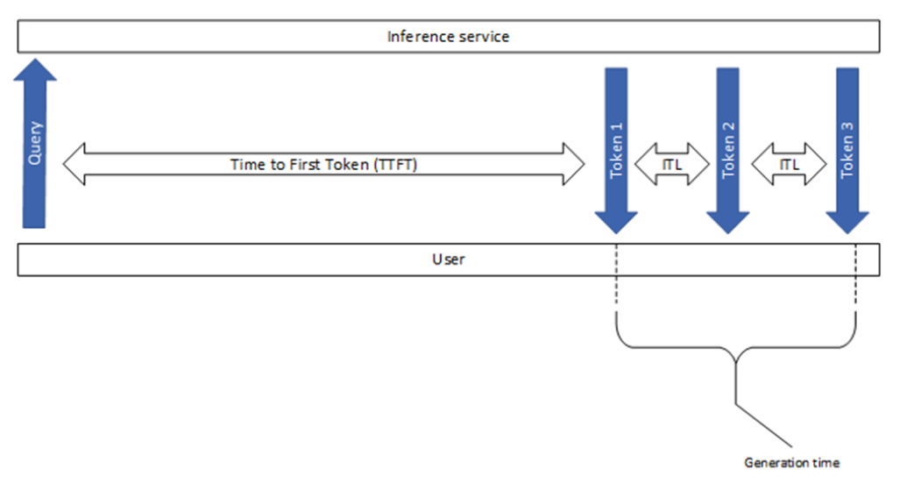
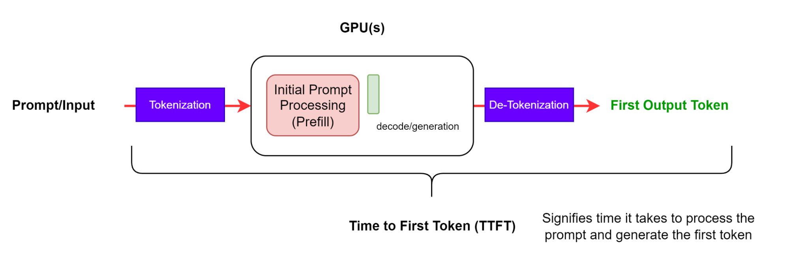
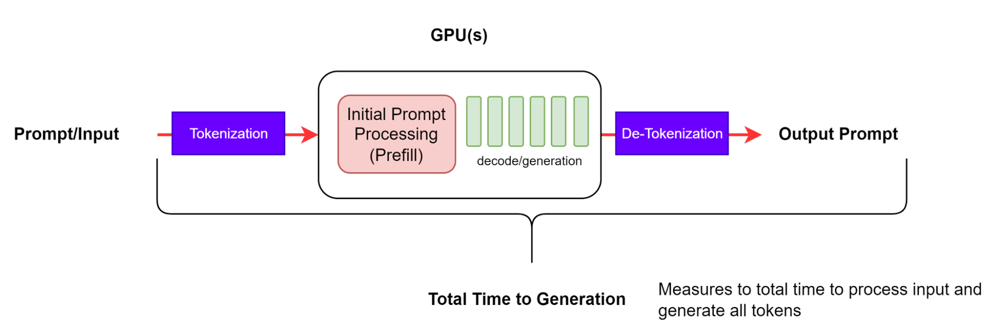
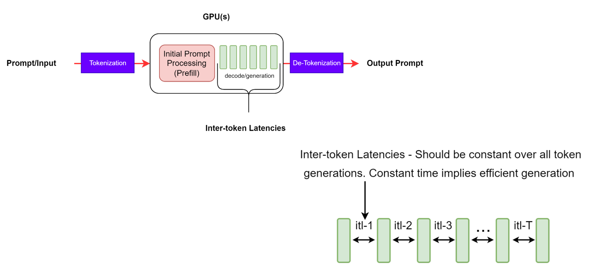
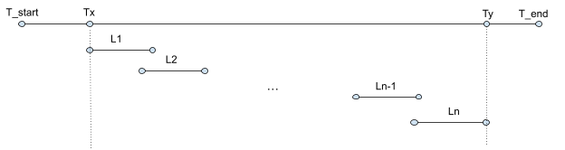

# LLM 推理基准测试：基本概念

系列第 1 篇。英文对照：`en/nvidia/benchmarking/blog-01-fundamental-concepts.md`

有人在等第一个字。可能是客服窗口里那个才亮起来的光标，也可能是你自己——对着一张还没长出句子的空白。LLM 推理的全部戏剧，几乎都发生在这个等待里：排队、把整段 prompt 读进记忆、然后一个 token 一个 token 地往外递。

企业铺 LLM 应用时，真正贵的不是「模型在论文里有多聪明」，而是：在用户还愿意等、答案还够准的前提下，每秒能打发走多少请求。本文只谈吞吐和延迟。精度请另开一桌，不要和秒表混在一起喝酒。

NVIDIA 的推理栈里有 Dynamo、TensorRT-LLM、NIM。他们一度主推 **GenAI-Perf**，现在请改用 **AIPerf**——换了名字，尺子的刻度还在。

不同客户端对同一指标的定义、测量、除法常常对不齐。数字不能直接横比。在你拿着两张表互相羞辱之前，先问一句：你们说的 TTFT，是不是同一种等待？


本地图（原文版权仍归原站；学习对照用）：











## 压测 vs 性能基准

- **Load testing（压测）**：模拟大量并发，看真实流量下的容量、弹性伸缩、网络延迟、资源占用。问的是系统。
- **Performance benchmarking（性能基准）**：在受控条件下测模型本身的吞吐、延迟、token 级指标。问的是模型在给定负载下有多快、配置有没有把路走歪。

两者都要做。只压系统，你会不知道模型是不是在用一把钝刀；只测模型，你会在第一个真实高峰到来时，发现门厅根本不够站。

## 推理怎么走

一次请求，像一封信穿过四间屋子：

1. **Prompt**：用户开口。
2. **Queuing**：排队。没有空闲的推理槽位时，时间就在这里变长，而模型还什么都没算。
3. **Prefill**：模型把整段输入读完，建起 KV cache。这是「开始说话之前」的那口深呼吸。
4. **Generation / Decode**：一次吐一个 token。呼吸变成脚步。

Token 是 LLM 的最小处理单位。很多主流模型大约 1 token ≈ 0.75 个英文词。中文没有这么整齐的换算——别用词数去跟别人的 token 数对赌。

- **ISL**：吃进去的 token（用户问题、system、历史、CoT、RAG 文档）。长输入让 prefill 更饿、TTFT 更大。
- **OSL**：吐出来的 token。长输出让 decode 走得更久，ITL 更容易被 KV 的长大拖累。
- **Context length**：每一步生成时能看见的总 token（已输入 + 已生成），被最大窗口拦住。窗口是屋顶，不是地板。

**Streaming** 边生成边把 token 块推给用户，聊天体感快——人会原谅一个正在说话的人。非流式则整段生成完再返回，像一封写完才寄出的信。

更深的背景：[Mastering LLM Techniques: Inference Optimization](https://developer.nvidia.com/blog/mastering-llm-techniques-inference-optimization/)（本地导读在 `../performance-tuning/mastering-llm-techniques.md`）。

## 指标

### TTFT

从提交查询到收到**第一个非空** token。这就是用户要等多久才看见输出开始生长。GenAI-Perf 和 LLMPerf 都会丢掉空内容的初始响应——没有字的「第一包」不算第一口呼吸。

TTFT ≈ 排队 + prefill + 网络。Prompt 越长，attention 越要在完整输入上建 KV cache，TTFT 越大。多请求并行时，一个请求的 prefill 可以和另一个的 generation 重叠：你的等待里，可能藏着别人的生成。

### e2e latency

从发出请求到收到最后一个 token。流式模式下 detokenize 可能发生很多次，像把一句话拆成许多封短信。

```
e2e_latency = TTFT + generation_time
```

`generation_time` 是第一个 token 到最后一个 token。GenAI-Perf 会去掉最后的 done / 空响应，免得你把「再见」也算进说话的时间。

### ITL / TPOT

连续输出 token 之间的平均时间。**GenAI-Perf / AIPerf 不含 TTFT；LLMPerf 常常把 TTFT 算进去。** 这是两把尺子最容易打架的地方。

GenAI-Perf：

```
ITL = (e2e_latency - TTFT) / (output_tokens - 1)
```

只刻画 decode。输出变长时 KV 变大，attention 对已有长度近似线性，但 decode 通常不是 compute-bound，而是在显存带宽上走路。ITL 稳定，说明房子（显存）和走廊（带宽）还健康。

### TPS

**系统 TPS**：所有并发请求合计的输出 token/秒。并发升高时上升，直到 GPU 饱和；再往上，有时会往下掉——像往已经满员的车厢里继续塞人。

- GenAI-Perf：总输出 token /（第一个请求发出 → 最后一个请求的最后响应）
- LLMPerf：总输出 token / 整个测试墙钟。会把造 prompt、准备请求、存响应算进去。单并发时这些开销有时能占到 **33%**。同一场戏，一种算法在给演员计时，另一种在给整座剧院计时。

GenAI-Perf 用滑动窗口取稳态，warmup / cooldown 不计入。

**单用户 TPS** = OSL / e2e_latency，输出足够长时趋近 `1/ITL`。系统并发升高时，系统 TPS 升、单用户 TPS 降：整体更热闹，每一个人说话更慢。这不是bug，这是物理。

### RPS

平均每秒成功完成的请求数。请求有大有小，RPS 自己很少能讲完故事；它要和 ISL/OSL 手挽手出现。

## 参数与实践

### 业务决定 ISL/OSL

| 场景 | ISL | OSL |
|---|---|---|
| 翻译（语言/代码） | ~500–2000 | ~500–2000 |
| 生成（代码/故事/邮件） | ~100 | ~1000 |
| 摘要 / RAG / 多轮 | ~1000 | ~100 |
| 推理模型（显式 CoT） | ~100 | ~1000–10000 |

有生产流量，就用真实 prompt。合成数据很干净，真实用户很脏——脏才是你上线以后要住的房子。

### 负载控制

**Concurrency N**：始终保持 N 个在途请求。一个走了，立刻补上一个。这是控负载最常用的方式，像让厨房里永远有 N 道菜在火上。

注意：LLMPerf 按批发 N 个，等整批结束再发下一批，批末并发会掉到 0。**GenAI-Perf / AIPerf 全程维持 N 个活跃请求。** 两种工具说的「并发」不是同一个夜晚。

**Max batch size**：引擎同时真正在算的请求数，可以小于并发。`concurrency > max_batch × 副本` 时，多出来的人在排队，TTFT 会涨——涨的不是算力，是门厅。

**Request rate**：按到达率发。到达超过吞吐时，在途请求会无限堆积。官方建议 benchmark 用 **concurrency**。QPS 压测留给你真的想模拟泊松到达的时候。

扫描并发：从 1 扫到略大于 max batch。超过 max batch 后吞吐饱和、延迟继续涨。那条弯下去的曲线，就是你以后谈 SLA 时要指给别人看的地图。

### 其他

- 基准测试设 **`ignore_eos=True`**，生成到 `max_tokens`，OSL 才可控。生产里请尊重 EOS——人说完了就该停。测试里让它说到钟响，是为了让尺子公平。
- 采样（greedy / top_p / top_k / temperature）会影响速度。greedy 不用归一化排序。同一套测试采样必须固定。换温度等于换了天气再比跑步成绩。

## 小结

先对齐指标定义，再用 concurrency 扫出延迟–吞吐曲线，才谈得上成本和 SLA。后续：系列第 2 篇 NIM 实测、第 3 篇 TensorRT-LLM 调优、第 4 篇 TCO。
