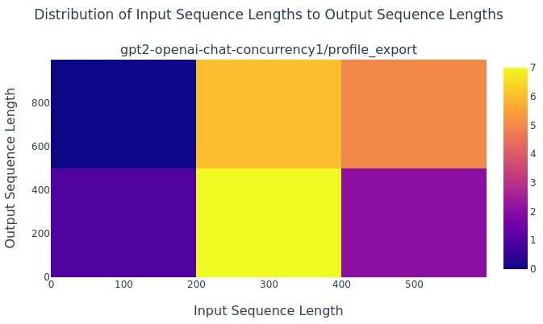
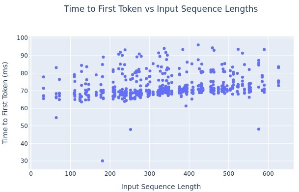

# 用 GenAI-Perf 打 OpenAI 兼容 API

英文对照：`en/nvidia/benchmarking/blog-genai-perf-openai.md`

**GenAI-Perf 已停更，新项目用 AIPerf。** 这篇是它的出生证明：为什么 LLM 不能只用普通 Web 压测交差，以及怎样用同一把客户端尺子去打 NIM、Triton、TensorRT-LLM、vLLM。

NVIDIA 本来就有 Perf Analyzer 和 Model Analyzer，帮人在延迟和吞吐之间找平衡。Snap 一类公司用 Model Analyzer 找过更省的配置。生成式模型来了以后，尺子必须改刻度：延迟和吞吐要拆到 **token**。

关键几条（还有 request latency、request throughput、输出 token 数）：

- **TTFT**：请求发出到第一包非空响应。每个请求一个值。
- **Output token throughput**：基准期间总输出 token / 基准时长。
- **ITL / TPOT**：同一请求里相邻中间响应的间隔，按后者生成的 token 数归一。

许多应用把 TTFT 放第一，然后才是输出吞吐和 ITL。吞吐和 ITL 天生打架：同时服务更多人，GPU 更忙，每个人字与字之间的缝可能变宽。没有专用工具，TCO 的「最优」只是一种感觉。


本地图（原文版权仍归原站；学习对照用）：





## 它能做什么

Triton 当时把 GenAI-Perf 放进发行版，用来：

- 量生成式真正在乎的指标，找峰值与成本的交点；
- 用 OpenOrca、CNN/DailyMail 这类常见数据集；
- 通过 **OpenAI 兼容 API** 让不同引擎坐在同一张成绩单上。

NIM、Triton、TensorRT-LLM 当时默认用它来报数。开源，欢迎贡献。

当时支持的端点：**Chat**、**Chat Completions**、**Embeddings**。新模型类型会加新端点。

## 怎么跑

最省事：Triton Inference Server SDK 容器（`YY.MM`，如 24.07）：

```bash
docker run -it --net=host --rm --gpus=all \
  nvcr.io/nvidia/tritonserver:YY.MM-py3-sdk
```

再起被测服务。文中用 vLLM OpenAI 容器当靶子：

```bash
docker run -it --net=host --rm --gpus=all \
  vllm/vllm-openai:latest \
  --model gpt2 \
  --dtype float16 --max-model-len 1024
```

Chat / completions 用 gpt2；embeddings 换成 `intfloat/e5-mistral-7b-instruct`。结果打在终端，并写入 `/artifacts` 的 CSV/JSON 和图。

### Chat

```bash
genai-perf \
  -m gpt2 \
  --service-kind openai \
  --endpoint-type chat \
  --tokenizer gpt2
```

文中样例（GPT-2 chat，仅演示）：request latency 平均约 1679 ms；OSL 平均 453；ISL 平均 318；输出 token 吞吐 269.99/s；请求吞吐 0.60/s。图 1 把 ISL 对 OSL。

### Completions

```bash
genai-perf \
  -m gpt2 \
  --service-kind openai \
  --endpoint-type completions \
  --tokenizer gpt2 \
  --generate-plots
```

样例：request latency 平均约 75 ms；OSL 很短（平均 16）；输出 token 吞吐 218.55/s；请求吞吐 13.76/s。短答让 RPS 看起来很大——别用短答的 RPS 去羞辱长答。图 2 是 TTFT 对 ISL。

### Embeddings

先造 jsonl：

```bash
echo '{"text": "What was the first car ever driven?"}
{"text": "Who served as the 5th President of the United States of America?"}
{"text": "Is the Sydney Opera House located in Australia?"}
{"text": "In what state did they film Shrek 2?"}' > embeddings.jsonl

genai-perf \
  -m intfloat/e5-mistral-7b-instruct \
  --batch-size 2 \
  --service-kind openai \
  --endpoint-type embeddings \
  --input-file embeddings.jsonl
```

样例 request latency 平均约 42 ms，请求吞吐 23.78/s。Embedding 没有 ITL 这种「字与字之间」的故事，它更像一次把句子折进向量的短跑。

## 小结

扫 `--request-rate` 看 ITL、request latency、吞吐怎么动。仓库在 GitHub；继任者是 AIPerf。同一把客户端，才能比较不同的厨房。
