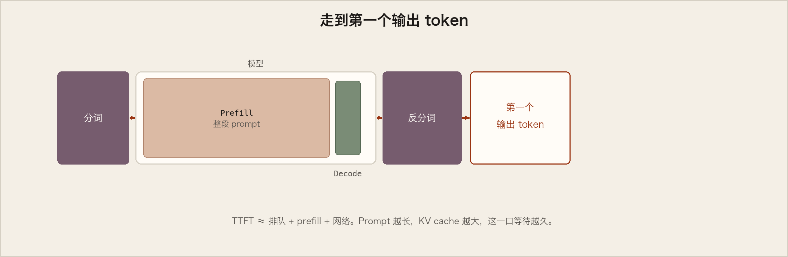
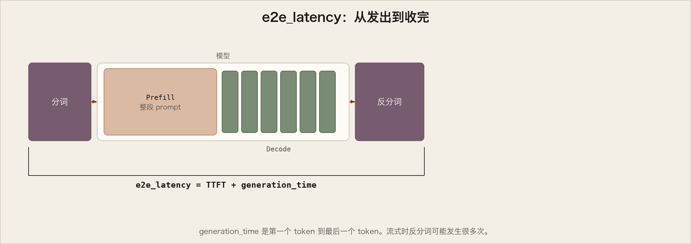
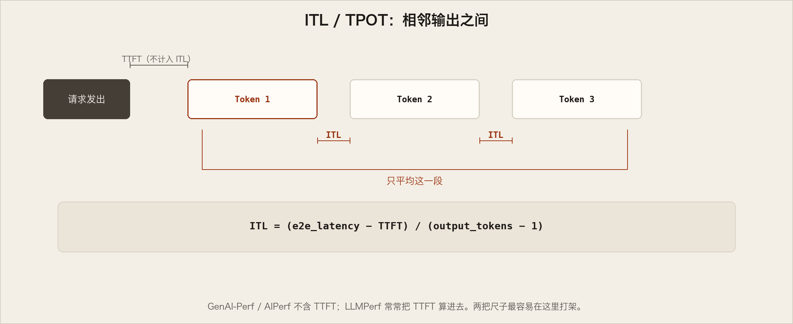
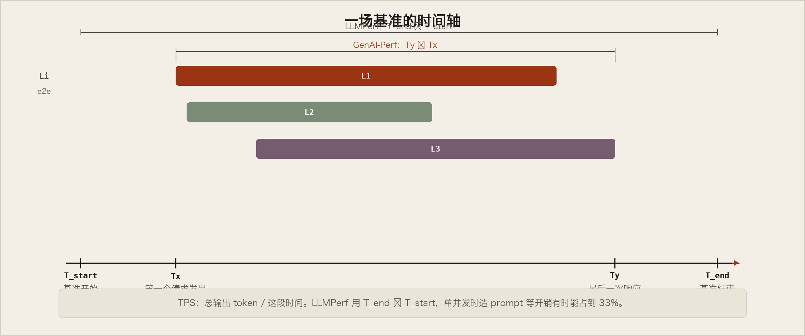

# 指标 — NVIDIA NIM LLM 压测指南

这一节给常用 LLM 推理指标下定义。工具实现不同，只有定义对齐以后，数字才能横比。采集方法见「用 AIPerf 做基准测试」。

官网页上有一张总览图（Figure 1）和 TTFT 示意图（Figure 2）：TTFT 包含第一个输出 token 的 tokenize / detokenize。下面用和「基本概念」同一套学习图，不是官方原图。


## Time to First Token

TTFT 量的是：从提交查询到收到第一个**非空** token。这就是用户要等多久才看见输出开始出现。

> NVIDIA AIPerf 会丢掉没有内容或空字符串的初始响应。第一包里没有 token 时，TTFT 没有意义——没有字的「第一包」不算第一个 token。



TTFT 一般包括：请求排队、prefill、网络延迟。更长的 prompt 增大 TTFT，因为 attention 要用完整输入建 KV cache，生成才能开始。生产里许多请求同时在跑，一个请求的 prefill 可以和另一个的 generation 重叠。你的等待里，可能藏着别人的生成。

> 传统 Web 压测工具（K6）也可以用 HTTP 时序事件给出某种 TTFT。名字一样，时钟可能不同。对表。

## End-to-End Request Latency

`e2e_latency`：从提交查询到收齐完整响应。包括排队、组 batch、网络。



> 流式模式下，detokenize 可能随着部分结果返回而发生多次。

单请求：

```
e2e_latency = TTFT + Generation_time
```

`Generation_time` 是收到第一个 token 到收到最后一个 token。AIPerf 会去掉最后的 `[done]` 或空响应，免得把结束标记也算进生成时间。

## Inter-token Latency

ITL 是连续 token 之间的平均时间，也叫 TPOT（time per output token）。



工具对「要不要把 TTFT 算进这个平均」意见不一。**AIPerf 不含 TTFT。**

```
ITL = (e2e_latency − TTFT) / (Total_output_tokens − 1)
```

第一个 token 被排除，所以 ITL 只刻画 decode。

输出变长，KV cache 变大，attention 成本随已生成长度近似线性增长。ITL 一直很稳，说明显存管理、带宽和 attention 计算还健康。ITL 开始抖动，显存或带宽可能已经吃紧。

## Tokens Per Second

系统 TPS：所有并发请求合计的输出 token 吞吐。负载增加时上升，直到 GPU 算力饱和；再往上可能下降。

一次有 n 个请求的基准时间线：



- `L_i`：请求 i 的端到端延迟
- `T_start`：基准开始
- `Tx`：第一个请求发出
- `Ty`：最后一个请求的最后响应
- `T_end`：基准结束

AIPerf：

```
TPS = Total_output_tokens / (Ty − Tx)
```

这是面向整批的定义，不是直播仪表。配置了 warmup 时，AIPerf 会把热身排除在外——warmup 不计入成绩。

**单用户 TPS** 是每个请求的 OSL / e2e_latency，输出足够长时趋近 `1/ITL`。并发升高：系统 TPS 通常上升，单用户 TPS 下降。整体更快，每一个请求更慢。请同时看这两条线，否则会把用户正在变慢的「高性能」当成目标。

## Requests Per Second

```
RPS = total_completed_requests / (Ty − Tx)
```

成功完成的请求数除以同一段 `Ty − Tx`。请求有大有小，RPS 单独很少能说明问题。
