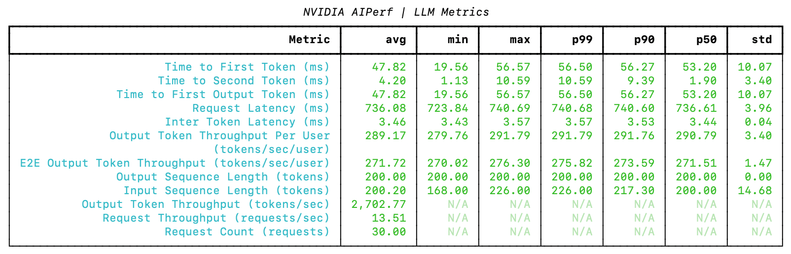
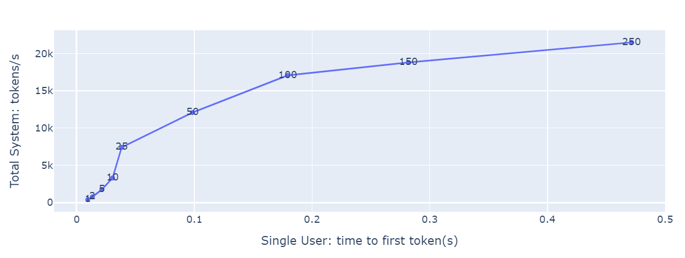

# 用 AIPerf 做基准测试

NVIDIA AIPerf 是客户端生成式基准工具，报告 TTFT、ITL、TPS、RPS。任何 OpenAI 兼容推理服务都能打，包括 NVIDIA NIM。下面用 Llama-3 走一遍——不是为了崇拜这只羊，而是因为官网上的性能数字，就是用类似仪式测出来的。

工具手册（安装、公式、调度、五种打法）在 `../tools/`：`aiperf.md`、`aiperf-metrics.md`、`aiperf-load-generator.md`、`aiperf-comprehensive.md`。指标定义见「指标」；参数见「参数与实践」。


本地图（原文版权仍归原站；学习对照用）：





## 用 NIM 起一个 OpenAI 兼容的 Llama-3 服务

NIM 是把 LLM 送上线较快的一条路。硬件和 NGC key 见 NIM LLM getting started。

容器启动时会下载资源并开始 serving。成功时日志像一扇门被推开：

```
(APIServer pid=74) INFO:     Started server process [74]
(APIServer pid=74) INFO:     Waiting for application startup.
(APIServer pid=74) INFO:     Application startup complete.
```

打 OpenAI 兼容 API：

```python
from openai import OpenAI
client = OpenAI(base_url="http://0.0.0.0:8000/v1", api_key="not-used")
prompt = "Once upon a time"
response = client.completions.create(
    model="meta/llama-3.1-8b-instruct",
    prompt=prompt,
    max_tokens=16,
    stream=False
)
print(response.choices[0].text)
```

「Once upon a time」是一个适合实验室的开头：短、干净、人人都认识。真实用户很少这么客气。

> NVIDIA 实测：额外 Docker 参数可能提升推理性能。`--security-opt seccomp=unconfined` 或 `--privileged`。NIM TensorRT-LLM v0.10.0 后端约 +5%；OSS vLLM v0.4.3 / NIM vLLM 1.0.0 约 +20%。在 DGX A100 和 H100 上验证过。这些参数会提高安全风险，用之前先过安全评审。快和安全很少同时把最好的座位让给你。

## 安装 AIPerf 并做 warmup

AIPerf 尽量和 NIM **跑在同一台机器**，除非你故意要把网络延迟请进入场。远程打服务，测到的常常是网线的性格，不是模型的性格。

```bash
export RELEASE="26.06"  # 建议最新 yy.mm
export WORKDIR=<YOUR_AI_PERF_WORKING_DIRECTORY>

docker run -it --net=host --gpus=all -v $WORKDIR:/workdir \
  nvcr.io/nvidia/tritonserver:${RELEASE}-py3-sdk
```

容器里：

```bash
pip install aiperf
pip install huggingface_hub
hf auth login   # Llama-3 tokenizer 是 gated 仓库
```

Warmup 负载——让 GPU 先出汗，再记成绩：

```bash
export INPUT_SEQUENCE_LENGTH=200
export INPUT_SEQUENCE_STD=10
export OUTPUT_SEQUENCE_LENGTH=200
export CONCURRENCY=10
export REQUEST_COUNT=$(($CONCURRENCY * 3))
export MODEL=meta/llama-3.1-8b-instruct

cd /workdir
aiperf profile \
   -m $MODEL \
   --endpoint-type chat \
   --streaming \
   -u localhost:8000 \
   --synthetic-input-tokens-mean $INPUT_SEQUENCE_LENGTH \
   --synthetic-input-tokens-stddev $INPUT_SEQUENCE_STD \
   --concurrency $CONCURRENCY \
   --request-count $REQUEST_COUNT \
   --output-tokens-mean $OUTPUT_SEQUENCE_LENGTH \
   --extra-inputs min_tokens:$OUTPUT_SEQUENCE_LENGTH \
   --extra-inputs ignore_eos:true \
   --tokenizer meta-llama/llama-3.1-8b-instruct \
   --profile-export-file ${INPUT_SEQUENCE_LENGTH}_${OUTPUT_SEQUENCE_LENGTH}.json
```

这里指定了 ISL、OSL、并发，并用 `ignore_eos` 让输出达到目标长度。尺子公平的代价，是模型不能提前把话说完。

## 扫描多种场景

先 warmup，再扫不同 ISL/OSL 与并发。翻译、分类、摘要：三种不同长度的等待。

```bash
declare -A useCases
useCases["Translation"]="200/200"
useCases["Text classification"]="200/5"
useCases["Text summary"]="1000/200"

runBenchmark() {
   local description="$1"
   local lengths="${useCases[$description]}"
   IFS='/' read -r inputLength outputLength <<< "$lengths"

   echo "Running AIPerf for $description with ISL=$inputLength OSL=$outputLength"
   for concurrency in 1 2 5 10 50 100 250; do
       local INPUT_SEQUENCE_LENGTH=$inputLength
       local OUTPUT_SEQUENCE_LENGTH=$outputLength
       local CONCURRENCY=$concurrency
       local REQUEST_COUNT=$(($CONCURRENCY * 3))
       local MODEL=meta/llama-3.1-8b-instruct

       aiperf profile \
           -m $MODEL \
           --endpoint-type chat \
           --streaming \
           -u localhost:8000 \
           --synthetic-input-tokens-mean $INPUT_SEQUENCE_LENGTH \
           --synthetic-input-tokens-stddev 0 \
           --concurrency $CONCURRENCY \
           --request-count $REQUEST_COUNT \
           --output-tokens-mean $OUTPUT_SEQUENCE_LENGTH \
           --extra-inputs min_tokens:$OUTPUT_SEQUENCE_LENGTH \
           --extra-inputs ignore_eos:true \
           --tokenizer meta-llama/llama-3.1-8b-instruct \
           --artifact-dir artifact/ISL${INPUT_SEQUENCE_LENGTH}_OSL${OUTPUT_SEQUENCE_LENGTH}/CON${CONCURRENCY}
   done
}

for description in "${!useCases[@]}"; do
   runBenchmark "$description"
done
```

`--request-count` 设为 3× 并发，样本才稳。高并发 + 大模型 + 大 ISL/OSL 会非常耗时。秒表也需要耐心。

## 分析结果

结果写在 `artifact/`，按 ISL/OSL 和并发分目录：

```
/workdir/artifact
 └── ISL200_OSL200
     ├── CON1
     |   ├── logs/aiperf.log
     |   ├── profile_export_aiperf.csv
     |   └── profile_export_aiperf.json
```

主结果在 `profile_export_aiperf.json`。

收集各并发的 TPS 和 TTFT，画 **延迟–吞吐曲线**：横轴 TTFT，纵轴系统吞吐，每个点标并发。这张图是整本指南要你带回家的那张地图。

## 怎么读这张图

- **有延迟预算**：在横轴取可接受的最大 TTFT，对应的纵轴和并发就是该预算下能拿到的最高吞吐。用户愿意等这么久，你最多能卖这么快。
- **有目标并发**：找到那个点，横纵轴就是该负载下的延迟和吞吐。今晚有这么多人进店，菜会慢成什么样。

图上也能看到：延迟陡增、吞吐几乎不再涨的并发（NVIDIA 示例里 `concurrency=100`）。那是饱和。再往上加人，只是让队列变长，不会让 GPU 长出第二颗心脏。横轴也可以换成 ITL、e2e_latency 或 TPS_per_user——同一座山，不同的登山口。
