# 系列第 4 篇：推理要花多少钱

英文对照：`en/nvidia/cost/blog-04-tco.md`

前三篇把等待、吞吐、引擎旋钮都量过了。本篇做一件不那么诗意、却决定项目活不活得下去的事：把曲线变成 **TCO**，再拆成每 1000 个 prompt、每 100 万 token 的价格。LLM 已经像一层「操作系统」，助手、客服、编程副驾驶、深度研究都站在上面。训练和推理变便宜（DeepSeek R1 那类故事），应用会更铺——杰文斯悖论：效率提高，消耗往往不减反增。企业迟早要回答：高峰来时，我需要几台机器，一年付多少钱。

新工作用 **AIPerf**；文中仍写 GenAI-Perf。NIM、vLLM、SGLang、Dynamo、Triton、TensorRT-LLM，凡是 OpenAI 兼容的，同一把客户端尺子都能打。


本地图（原文版权仍归原站；学习对照用）：

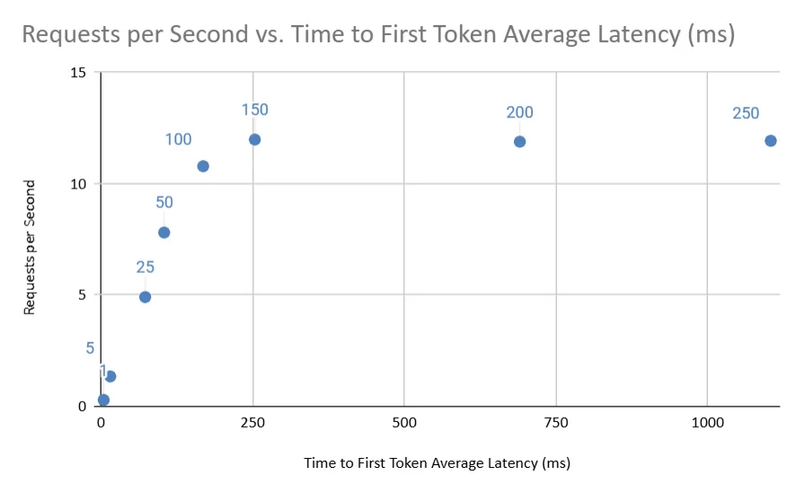

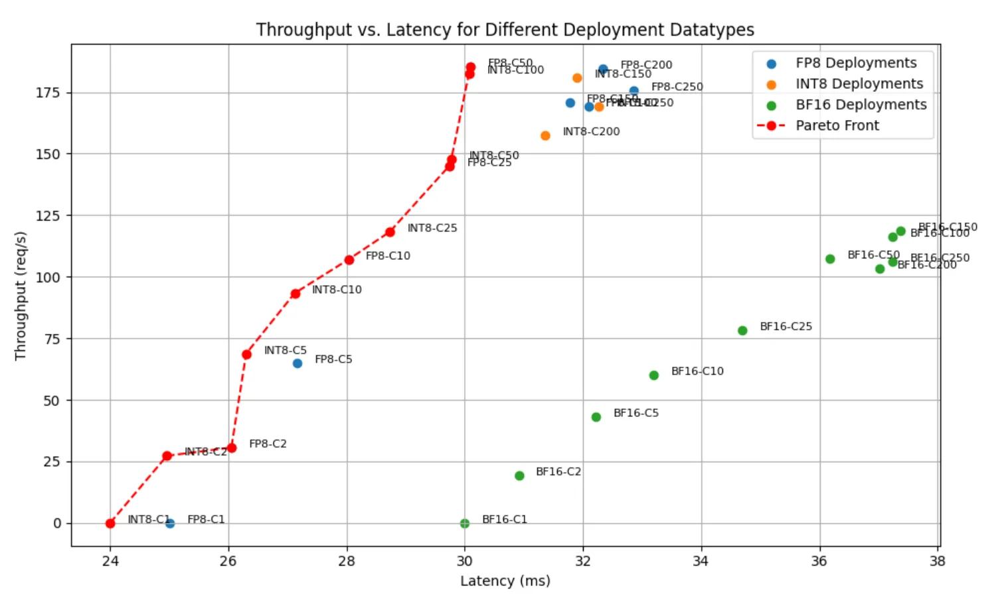

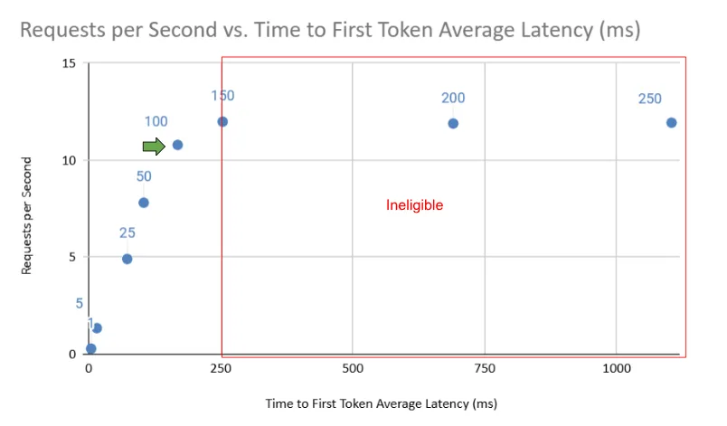

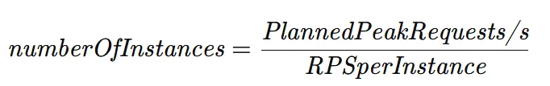

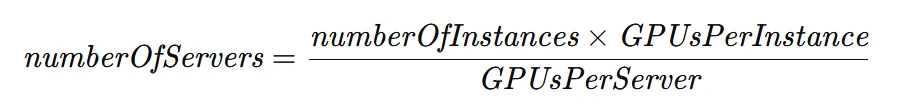

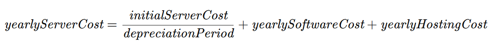

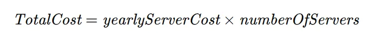

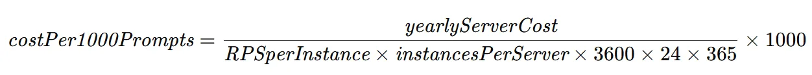

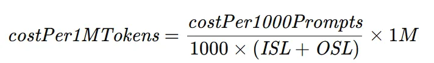

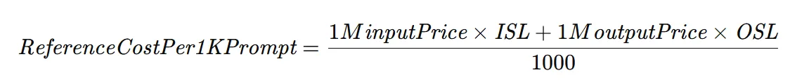

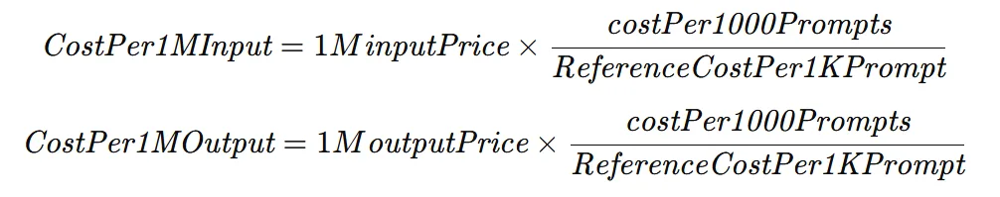

## 你到底在量什么

规模测算的前提，是每个部署单元（一台推理服务）的成绩单：给定负载下吞吐多少、延迟多少。再加上 QoS（例如最大延迟）和预期高峰（峰值请求/秒，或并发），才能估计硬件，才能谈 TCO。

TTFT、ITL、TPS、RPS 的定义见第 1 篇。NIM 的逐步打法见第 2 篇。

## 延迟–吞吐，以及 Pareto 前沿

每个点是一个 concurrency。横轴 TTFT（或 ITL、e2e），纵轴 RPS 或 TPS。

- **低并发**：人少，延迟低，吞吐也低。店里很安静，也很亏。
- **高并发**：batch 让 GPU 更忙，吞吐升，延迟也升。热闹，但每个客人等得更久。

比较 FP4 / FP8 / BF16 时，把「同样延迟下吞吐最高」的点连起来，就是 **Pareto 前沿**：没有任何一个指标能在不伤害另一个的情况下再变好。视觉上，那些最靠近图左上角的点——吞吐尽量高、延迟尽量低。若各配置用的 GPU 数不同，纵轴请改成 **每 GPU 的 req/s**，否则你是在拿一辆卡车和一辆自行车比载客。

## 高峰要多少容量

先写下两条约束：

1. **延迟类型和上限。** 交互式聊天，文中举例平均 TTFT ≤ **250 ms**——人还愿意觉得「它在听」。
2. **规划峰值请求/秒。** 不是同时在线用户数。用户不会人人都在同一秒提问。把「在线人数」当成峰值 QPS，你会买一座空城。

丢掉图上超过延迟上限的点（250 ms 线右侧）。剩下的里面选吞吐最高的：那是该预算下最省钱的配置。读出 **单实例可达 RPS**，并记下 **每实例 GPU 数**。

```
最少实例数 = 规划峰值 RPS / 单实例可达 RPS
服务器数   = 实例数 × 每实例 GPU / 每台服务器 GPU
```

## 钱怎么算

文中硬件数字**只演示公式，不是报价**：

| 项 | 示例 |
|---|---|
| 一台服务器购入 | $320,000 |
| 每台 GPU 数 | 8 |
| 折旧年限 | 4 年 |
| 年托管 | $3,000 |
| 年软件许可 | $4,500 |

```
年成本/台 = 购入价 / 折旧年数 + 年托管 + 年软件
总成本     = 服务器数 × 年成本/台
```

再拆成业界爱讲的口径（假设 100% 可用，再按实际上线率打折）：

```
每 1000 prompt 成本 = 年成本/台 /（一台一年能打完的请求数）× 1000 的换算
```

该场景有自己的 ISL/OSL，于是：

```
每 100 万混合 token 成本
  = 把「每 1000 prompt」换成 token 口径
    （用 ISL+OSL 当每个 prompt 的重量）
```

输入和输出通常分开卖：输出更贵，因为它走在 memory-bound 的那条夜里。文中参考价 **$1 / 1M input** vs **$3 / 1M output**。用这个比例把混合成本劈成输入价和输出价。

## 小结

测服务 → 画曲线 → 取满足延迟的 Pareto 点 → 用峰值 QPS 算出实例和服务器 → 折旧+托管+许可 → 再拆成 prompt 和 token。这是把「快」翻译成「买得起」。动手课：Sizing LLM Inference Systems。平台架构对 TCO 的影响不止 FLOPS，见 DGX Cloud benchmarking templates。
