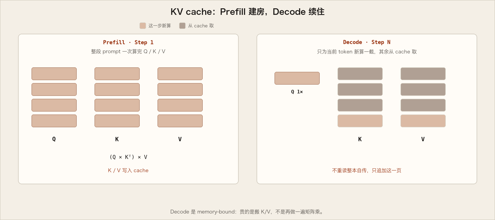
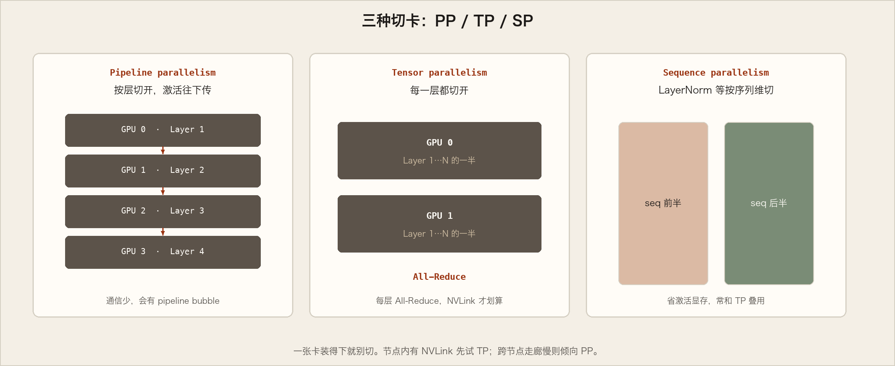
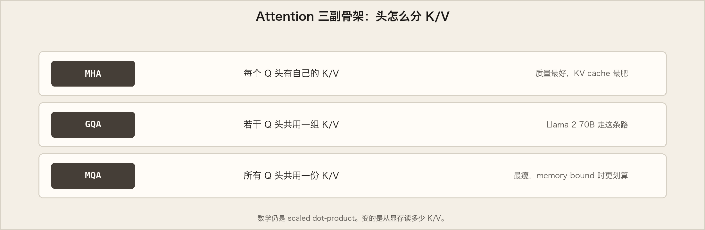
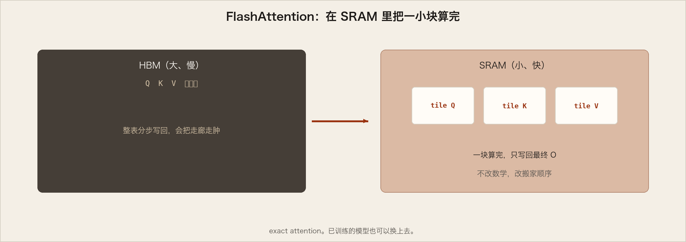
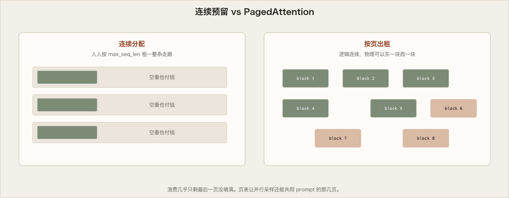
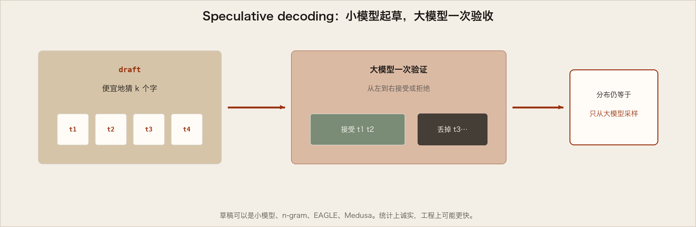

# Mastering LLM Techniques：推理优化

英文全文：[en/nvidia/performance-tuning/mastering-llm-techniques.md](../../../en/nvidia/performance-tuning/mastering-llm-techniques.md)

后面 NIM / TensorRT-LLM / vLLM 的调优文，都默认你读过这篇。它不是某一条命令的说明书，而是一张地图：推理为什么贵，记忆为什么胀，刀可以往哪几处磨。

堆 Transformer 层能换来更好的精度、少样本能力，甚至在不少语言任务上接近人的「突然会了」。训练一次已经很贵；推理是反复发生的成本。今天的热门模型可以到百亿、千亿参数，RAG 一类用法还会把整篇检索塞进输入，让模型每一口都咬得更重。读者需要一点 Transformer 和 attention 的常识。可用 TensorRT-LLM 和 Nemotron 3 这类开放模型在生产级代码里试这些权衡，而不是只在黑板上。


## 推理分两段

多数 decoder-only 模型（GPT-3 这类）按因果语言建模预训练，本质是下一个词的预言者。吃进一串 token，自回归地吐出后续 token，直到长度上限、停用词、或特殊的结束符。两段戏：

**Prefill。** 处理全部输入，算出 K/V 等中间状态，用于生成「第一个」新 token。每个新 token 依赖所有过去，但输入的全貌已知，所以这大致是矩阵–矩阵乘法，高度可并行，GPU 容易吃饱。

**Decode。** 一次一个 token，直到停下。每一步都要看见以往所有步的 K/V。更像矩阵–向量：算力吃不饱，延迟由数据（权重、K/V、激活）从显存搬到 GPU 的速度决定，而不是算术有多快。**Memory-bound。** 本文多数优化，都在照料这个夜晚。

Token 是模型看见的原子。大约四个英文字符一个 token。不同模型的 tokenizer 不同：两个模型都报「每秒同样多 token」，并不等于它们说了同样多的话。

## Batching

提高 GPU 利用率最朴素的办法：组 batch。多人共用同一份权重，权重的显存被摊薄。batch 只能大到某个上限，再大就 OOM——要理解上限，得看 KV cache。

传统静态 batch 并不理想：同一批里各请求生成长度不同，所有人必须等最长的那个写完。方差一大，短请求就在走廊里罚站。缓解办法是 **in-flight / continuous batching**（见后）。TensorRT-LLM 一类运行时已经带了调度，不必自己写 CUDA scheduler。

## KV cache

Decode 每步只产一个 token，却依赖所有过去的 K/V（含 prefill 的，以及到目前为止新算的）。每步重算全部过去，等于每说一个字就把自传重读一遍。于是把它们缓存在 GPU 里，每轮只把新算出的片段追加进去。有些实现每层一份 KV。



## 显存两座山

GPU 上 LLM 主要吃两样：**模型权重**和 **KV cache**。

- 权重：7B 模型 16-bit（FP16/BF16）大约 `7e9 × 2 ≈ 14 GB`。
- KV：为避免 decode 重算 attention。

常见结构里，每 token 的 KV（字节）约：

```
2 × num_layers × (num_heads × dim_head) × precision_bytes
```

前面的 2 是 K 和 V。`(num_heads × dim_head)` 常常等于 `hidden_size`。半精度、整段序列、整个 batch：

```
KV 总字节 ≈ batch × seq_len × 2 × num_layers × hidden_size × sizeof(FP16)
```

Llama 2 7B、16-bit、batch=1、seq=4096：约 `1×4096×2×32×4096×2` ≈ **2 GB**。只是一个人、四千 token 的记忆。batch 和长度线性放大，吞吐被卡住，长上下文（RAG）尤其痛。后面几乎所有优化，都是在跟这座会生长的房子谈判。

## 模型并行：把房子拆到多张卡

单卡装不下，就把权重和计算分到多 GPU。训练和推理都可能必须如此。**数据并行**把权重复制多份、把全局 batch 切成微批，主要是训练期优化，推理里较少当主角。



**Pipeline parallelism（流水线）。** 模型纵向切开，每张卡跑一截层。四路 PP 则每卡大约四分之一权重。输出传到下一张卡。顺序带来空闲：**pipeline bubble**，有人在算，有人在等。微批能缩小气泡，不能消灭它。

**Tensor parallelism（张量）。** 把单层横向切开。Attention 头、MLP 的矩阵都可以分。两路 TP 的 MLP 把权重矩阵劈成两半，同一批输入上独立算，再 reduction 合回来；attention 头天生可并行。每卡存的权重大致减半。

**Sequence parallelism（序列）。** TP 要求层能切成独立块。LayerNorm、Dropout 往往在 TP 组里复制，算得便宜，激活却占显存。它们沿序列维独立，于是可按序列维切开，省激活。可与 TP 叠用。

Megatron-LM、NeMo 这类框架里，这些并行都有现成实现。

## 优化 Attention

Scaled dot-product attention 把 Q 和 KV 映射成输出。



**Multi-head attention（MHA）。** 多套学到的 Q/K/V 投影并行做 attention，再拼起来线性混合。每个头看不同子空间。原论文里每个头维度缩小，使总算力与单头相近。

**Multi-query attention（MQA）。** 多头仍投影 Q，但 **K/V 共享**。计算量与 MHA 相当，从显存读的 K/V 少得多。Memory-bound 时更吃得满算力，KV cache 也更瘦，batch 能更大。可能掉点精度；模型最好在训练或约 5% 训练量的微调里见过 MQA。

**Grouped-query attention（GQA）。** MHA 与 MQA 之间：K/V 投到少于 Q 头的几组，组内像 MQA。原 MHA 模型可用远少于原训练的计算「uptrain」成 GQA，质量接近 MHA、效率接近 MQA。Llama 2 70B 用 GQA。

**FlashAttention。** 不改数学（exact attention，也可用于 MQA/GQA 变体），改计算顺序，迁就 GPU 的存储层次。按层依次算往往让中间结果反复进出显存。FlashAttention 用 tiling：一次把最终矩阵的一小块算完写回，而不是整表分步写中间值。已训练模型也可以换上去。



## PagedAttention：按页出租记忆

KV 常按「最大序列长度」静态超订。最大 2048 就人人预留 2048，哪怕只说了二十个字。连续分配，一生绑定该请求，碎片和浪费随之而来。

PagedAttention 像操作系统的分页：把每个请求的 KV 切成固定 token 数的块，**不必连续**。Attention 时用块表去取。新 token 来了再分配新块。块大小固定，消除「每人一块不规则大地」的碎片，batch 才能长大，吞吐才有地方站。



## 改模型本身：量化、稀疏、蒸馏

前面是搬家和装修。还可以把家具变小。GPU 对低精度、某种稀疏有专用加速。

**量化。** 把权重和激活从 32/16-bit 降到 8-bit 甚至更低。网络往往仍能工作。占空间更小，同带宽能搬更多参数，对带宽受限的 decode 是好事。权重量化相对直接（训练后固定）；激活里常有 outlier，动态范围更大。有的方法（LLM.int8()）对异常通道保持更高精度；有的把权重上好用的动态范围借给激活。只量化权重时，GPU 可能没有 INT8×FP16 的专用乘法，还得升精度再算，加速会留在桌上。

**稀疏。** 许多接近 0 的值可以直接变成 0。稀疏矩阵可压缩存储。GPU 对「每四个值里两个为 0」这类结构化稀疏有硬件加速，还可与量化叠用。LLM 上怎么稀疏最好，仍是活跃研究。

**蒸馏。** 让小学生（student）模仿大老师（teacher）的输出（最后一层 logits 或中间激活），有时还加上原来的标签损失。DistilBERT 把 BERT 压约 40%、语言理解留约 97%、速度快约 60%。也可以用老师合成的数据，甚至抽出思维链当中间监督（Distilling Step by Step!）。注意：许多 SOTA 模型的许可证禁止用其输出训练别的 LLM——老师不一定允许你办学。

## Serving：权重已经在手里，就多干一点

执行常常仍是权重带宽受限。权重好不容易搬来，就尽量并行用。两条路：

**In-flight batching（continuous batching）。** LLM 的活差异极大：聊天短答、长摘要、写代码，输出长度可以差几个数量级。静态 batch 会让短的等长的。把生成拆成许多次 iteration：谁先结束谁先离场，空位立刻给新人。真实流量里，GPU 才不会靠在墙上等最慢的那位写完小说。

**Speculative inference（推测解码 / assisted generation / blockwise parallel decoding）。** 自回归默认不能并行产同一序列的多个未来 token——第 n 个没出生，第 n+1 就不能合法存在。投机的办法：用更便宜的过程先起草连续 k 个 token，大模型在这些位置上并行验证。一致则收下；从第一处不一致切开，扔掉后面，再起草。草稿可以来自更小的模型、或多个未来步的头。统计上，接受规则可以让最终分布仍等于只从大模型采样。



## 带走的东西

数据中心、云、边缘 PC，优化的方向是同一张地图：prefill/decode 不同的物理、KV 会生长、并行拆权重、attention 变瘦、分页管记忆、量化/稀疏/蒸馏改模型、IFB 和推测让 serving 不浪费一次已经付过的搬运。TensorRT-LLM 把其中许多做成开源库（编译器、kernel、预处理、多卡通信）。Dynamo 可在多框架、多硬件上同时伺候多个模型。NIM 把这些打成容器：优化运行时、依赖、标准 API，由 NVIDIA 验证和维护。从 build.nvidia.com 可以开始摸。

读完这篇，再去看 TensorRT-LLM Tuning Guide 和 NIM 压测手册，旋钮才知道自己在对谁说话。
