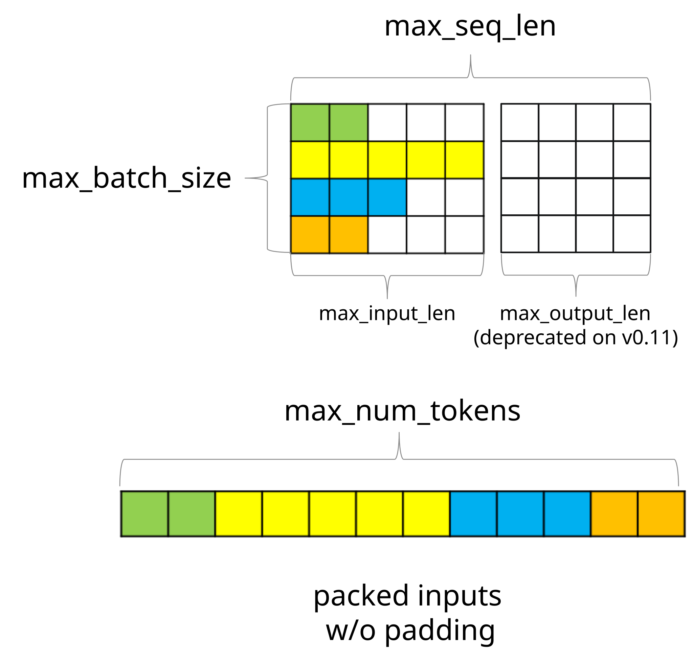
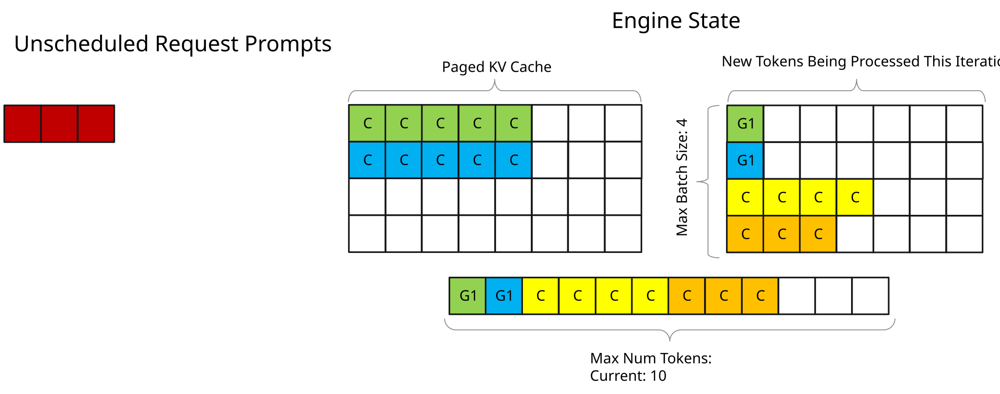
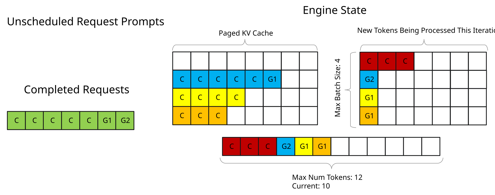

# Paged Attention、IFB 与请求调度

手册第 3 章用玩具数字把调度器演了一遍。这一页是同一套机制的功能说明：inflight batching 是什么、三个尺寸旋钮、chunked prefill、contiguous vs paged KV。

本地图（原文版权仍归原站；学习对照用）：

## In-flight batching（IFB）

也叫 continuous batching、iteration-level batching。context 阶段的序列和 generation 阶段的序列，可以在**同一次** iteration 里一起跑。GPU 更满，排队更短。

为了效率，输入必须 **packed（去 padding）**。Generation 往往每次只有一个 token，若为了对齐最长 prompt 去 pad，等于拿显存开玩笑。

当前实现还有一条顺序约束：packed tensor 里，**正在做 context 的序列必须排在 generation 前面**。例如 S0、S2 在 context、S1 在 generation，则 S0 和 S2 的 token 要出现在 S1 之前。官方说这条约束将来可能会松。

## 三个尺寸

| 旗标 | 含义 |
|---|---|
| `max_batch_size` | 引擎最多同时处理多少请求。编译时设够高，以免成为瓶颈；运行时还能再调，不必重建。 |
| `max_seq_len` | 单请求最长。v0.11 起（`--remove_input_padding` + `--context_fmha`）可代替 `max_input_len` / `max_output_len`。默认 `max_position_embeddings`。只有连一条这么长的请求都塞不下时才往下砍。 |
| `max_num_tokens` | 去 padding 之后，每一拍最多打包多少 token。v0.11 默认 **8192**。不去 padding 时它不生效。它决定 workspace，也是某一维 GEMM 的长度。 |

为什么不要按「最长 prompt」去设 `max_num_tokens`：真实请求往往更短；IFB 打开后，generation 请求每拍最多贡献 `beam_width` 个 token。用更接近真实负载的值，引擎才能把显存留给 KV，一次塞进更多请求。

GPU 喜欢更大的矩阵乘——把 `max_num_tokens` 适度抬高，利用率会升。过了饱和点，TTFT 和端到端延迟都会开始疼。目标：够高以吃满算力，不够高到打穿 SLO（TTFT / TPOT）。

怎么扫这两个上限，见 `trtllm-max-batch.md`。

## Chunked context（chunked prefill）

旧行为：一次吃完整段 prompt。打开之后，prompt 被切开，块可以和 generation token 打在同一拍，吞吐通常更好，也取消了「prompt 必须 ≤ `max_num_tokens`」。

前提：**FMHA paged KV**（手册里的 paged context attention）。除最后一块外，chunk 大小必须是 KV block 的整数倍。

平均 TTFT 通常下降。少数「本来一次就能做完」的短 prompt，可能略慢——它们不再那么幸运。

## KV：整块 vs 分页

每层一份 KV。

- **Contiguous：** 形状 `[max_batch_size * max_beam_width, 2, num_heads, max_seqlen, hidden_dim_per_head]`。短序列按最长位来租房子，浪费显存。即使后来生成会慢慢贴近上限，前面许多步都在为空座位付钱。
- **Paged：** cache manager 按块分配、回收。Python 示意是 `tensorrt_llm.runtime.KVCacheManager`；生产走 C++ Batch Manager。结构细节见 `trtllm-kvcache.md`。

调度示意图、以及「务必开 paged context attention」的理由，与第 3 章相同：chunking 让长 prompt 的第一块就能进场，`max_num_tokens` 不必再当屋顶。
