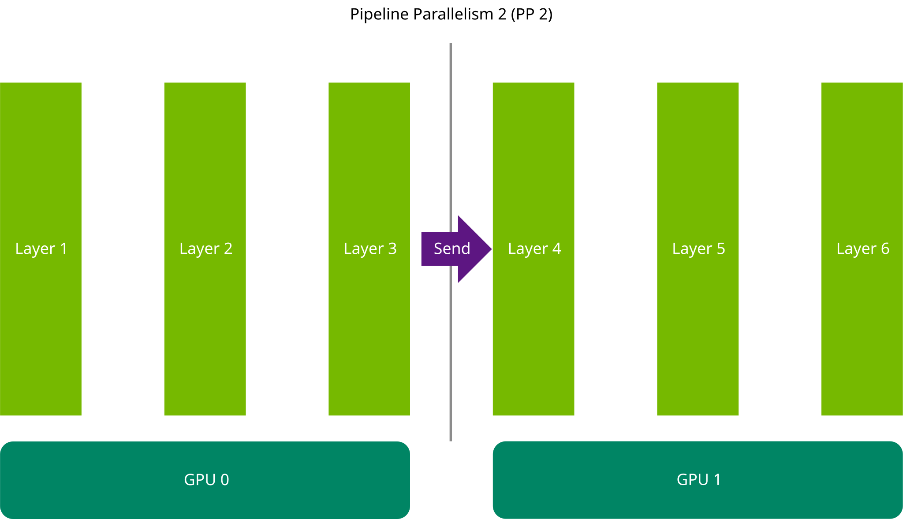
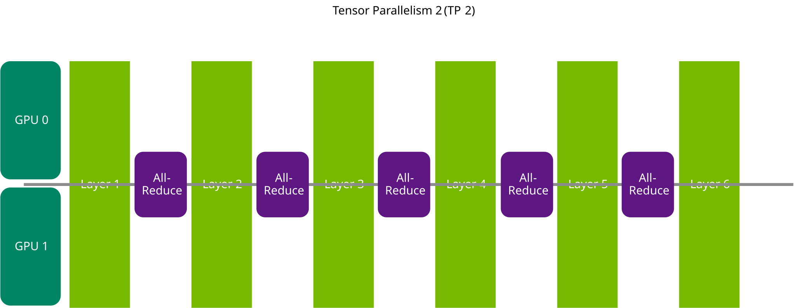

# 第 4 章：怎么切卡

大模型常常塞不进一张 GPU，必须切开。切法会改写成绩单。这一页帮你在 **tensor parallelism（TP）**、**pipeline parallelism（PP）**，或两者混用之间做选择。不熟这两个词，先回 `mastering-llm-techniques.md`。


本地图（原文版权仍归原站；学习对照用）：





## 通信才是约束

把权重拆到多张卡上，激活就要在卡之间跑。这段路上的税，决定哪条切法更便宜。

**Pipeline parallelism**：模型按连续的层切开，每张卡住一段。需要的通信很少——做完自己那一层楼，把输出递给下一张卡就行。

**Tensor parallelism**：每一层都切开，每张卡只住每一层的一块。听起来更公平，但每一层都需要上一层的**完整**输出。于是每张卡都得做更重的 **All-Reduce**，把结果广播给所有人，下一层才能开始。坏处是通信更贵；好处是每张卡上的矩阵乘更小，算得更快。

最终问一句：All-Reduce 的税，会不会把「更小的矩阵乘」赚回来的时间吃光？

- 卡与卡之间够快（NVLink 那种走廊），算力上的便宜往往盖过通信税 → **倾向 TP**。
- 走廊很慢（跨节点的网线）→ **倾向 PP**。

官方给的口诀：

1. **一张卡装得下：别切。** 最好的通信开销是没有通信开销。除非你有非常具体的理由。
2. **一个节点装得下：** 有 NVLink 就从 TP 开始。没有快互联，再 sanity check 一下 PP。先 TP，用秒表否决。
3. **必须跨节点：** 节点内互联通常远快于节点间。跨节点硬做 TP，会被慢链路拖死。好的起点是 **节点内 TP、节点间 PP**。例外：Blackwell 的 **NVL36 / NVL72** 有多节点 NVLink——只要还在那 36 或 72 张卡的围墙里，TP 不会被节点间链路卡死。

## 怎么设

`LLM` 吃 `tensor_parallel_size` 和 `pipeline_parallel_size`。两者相乘必须等于你切开的 GPU 总数（world size）。

例如两台机器、每台 16 卡：节点内 TP=8，节点间 PP=2：

```python
llm = LLM(
    model="/scratch/Llama-3.1-405B-Instruct",
    tensor_parallel_size=8,
    pipeline_parallel_size=2,
)
```

CLI 在 `convert_checkpoint.py` 上设。官方正文有一处笔误，把两个参数都写成了 `--tp_size`；命令示例是对的，PP 用 `--pp_size`：

```bash
python examples/models/core/llama/convert_checkpoint.py \
  --model_dir ./tmp/llama/405B/ \
  --output_dir ./tllm_checkpoint_16gpu_tp8_pp2 \
  --dtype float16 \
  --tp_size 8 \
  --pp_size 2
```

案例全书用的是 70B、TP=4、一张节点上的四张 H100。这一章不改那组数字——它讲的是：在拧 FP8 之前，先别把模型切到一条很慢的路上。
