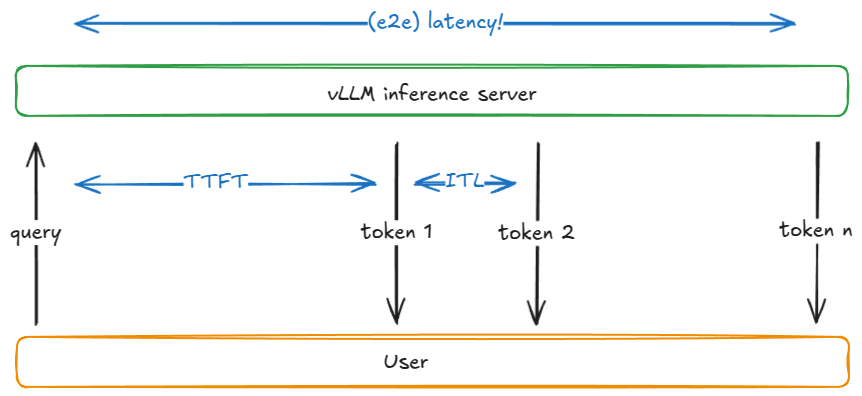

# 走进 vLLM：一套高吞吐推理系统的解剖

英文全文（约 50 KB）：`en/vllm/blog/architecture/anatomy.md`  
原文：https://vllm.ai/blog/2025-09-05-anatomy-of-vllm

官网上那句摘要说得轻描淡写：engine、scheduler、paged attention、continuous batching、chunked prefill、prefix cache、spec decode、P/D 分离、多卡、serving、怎么 benchmark。拆开以后，它其实是在讲一件很旧的事——怎样让许多人同时说话，而不让屋子塌掉。

下面按原文结构走。V0 已弃用，类名还会改，作者强调的是想法而不是签名。

本地图（原文版权仍归原站；学习对照用）：

## LLM Engine 与 Engine Core

Engine 自己已经能做高吞吐推理，但只在离线世界里。还不能把窗口开给互联网上那个正在等第一个字的人。

离线例子（改编自 `basic.py`）：构造 `LLM`，再 `generate`。环境变量：`VLLM_USE_V1=1`，并关掉 V1 多进程，好把整台机器看成一个同步、单 GPU、标准 Transformer 的玩具宇宙。混合模型（Jamba 一类）需要更复杂的 KV 分配器，这篇先不把那扇门打开。

构造函数里有四样东西：

- **vLLM config**：所有旋钮（模型、cache、并行）。
- **processor**：原始输入 → 校验、tokenize、处理 → `EngineCoreRequest`。
- **engine core client**：玩具例子里是 `InprocClient`（几乎等于 EngineCore 本人）；长大以后会变成能在规模上 serving 的 `DPLBAsyncMPClient`。
- **output processor**：`EngineCoreOutputs` → 用户看见的 `RequestOutput`。

Engine core 内部：

- **Model Executor**：驱动 forward。现在是单进程单卡的 `UniProcExecutor`；多卡是 `MultiProcExecutor`。
- **Structured Output Manager**：guided decoding 用。
- **Scheduler**：决定下一步谁上场。策略 FCFS 或 priority；有 `waiting` / `running` 队列；心里揣着 **KV cache manager**——paged attention 的心脏。

KV cache manager 维护 `free_block_queue`：一大池空闲块（量级可以到几十万，取决于显存和 block size）。Paged attention 用这些块当索引：token 住在哪一间房间。

标准 Transformer 一层（非 MLA）一块的大小大致是：

`2 (K/V) × block_size(默认 16) × num_kv_heads × head_size × dtype 字节数`

Worker 起来时做三件事：**init device**（认领 CUDA、检查 dtype、按 `gpu_memory_utilization` 看显存、建 model_runner 与 InputBatch）、**load model**（架构、权重、`eval()`、可选 `torch.compile`）、**initialize KV cache**（按层 spec——曾经全是 FullAttentionSpec，混合模型之后变复杂；dummy forward 估算能放多少块；分配并绑到 attention；除非 `--enforce-eager`，对 warmup batch 捕获 CUDA graph）。CUDA graph 把 GPU 工作烤成一张 DAG，之后 replay，少付 kernel launch 的税。

### generate

每个 prompt：发一张身份证（request id）和到达时间 → tokenize → 打成 `EngineCoreRequest` → 包成 `Request`，状态 `WAITING`，进入 scheduler 的 waiting 队列（FCFS 追加，priority 则堆进去）。

同步引擎吃进这批 prompt 就关门；异步引擎每一步之后都再看有没有新人——这就是 **continuous batching**：戏开演以后仍允许进场。Forward 把 batch 压成一条超长序列、自定义 kernel 自己会认人，所以连续组 batch 在同步引擎里其实已经埋着。

只要还有活，引擎就 `step()`：

1. **Schedule**：decode 和/或（切块的）prefill
2. **Forward**：模型 + 采样
3. **Postprocess**：把 token 接到 Request 上，detokenize，看停不停。停了就把 KV 块还回 `free_block_queue`

停下的理由：超了 `max_model_length` / 自己的 `max_tokens`；采到 EOS（除非 `ignore_eos`——benchmark 时我们常强迫它把话说到钟响）；命中 `stop_token_ids`；输出里出现 stop string（会截断；stop token 会留在输出里，stop string 不会）。

### Scheduler

两种活：

1. **Prefill**：对全部 prompt token 做一次 forward，通常 compute-bound。最后在末位采样一个 token。
2. **Decode**：只对最新那个 token forward，以前的 KV 已经住在 cache 里。通常 memory-bandwidth-bound：为了一个字，仍要搬来整栋权重。

V1 能在同一步里混着做。V0 一次只能选一种——像一条一次只能开一列车厢的轨道。

调度**优先 running 里的 decode**：算本步要几个新 token（不一定是 1，因为有 speculative 和 async scheduling）→ `allocate_slots` → 从 token 预算里扣掉。然后再从 waiting 里拿 prefill：看有多少 **computed blocks**（没开 prefix cache 就是 0）→ allocate → 挪到 running。

`allocate_slots`：按默认 16 token 一块向上取整；池子不够就提前离开——decode/prefill 可能触发 **recompute preemption**（V0 还有 swap，V1 默认重算），或干脆这步不排。够了就从 `free_block_queue` 链表头取块，记进 `req_to_blocks`。

### Forward

`execute_model` → Worker → model runner：更新状态、CPU→GPU 拷缓冲、算 position、建 `slot_mapping`、跑 paged attention。所有序列被拍扁接成一条「超级序列」，靠位置和 mask 保证各人只看见自己的过去——于是 continuous batching 不必右 padding。取出每条序列最后一位的 hidden state，按 greedy / temperature / top-p / top-k 采样。

两种走法：eager（普通 PyTorch）；captured（replay 启动时烤好的 CUDA graph）。

## 进阶：在核心上长出来的房间

已经有了：抢占、paged attention、continuous batching。还要讲：chunked prefill、prefix cache、guided decoding、speculative decoding、分离的 P/D。

### Chunked prefill

长 prompt 若一次 prefill 吃完整步预算，会独占一个 engine step，把别人的 TTFT 按在地板上。切成每块 n 个 token，长 prompt 走好几步，只在最后一块才采样新 token。实现上就是 cap 每步新 token；超过 `long_prefill_token_threshold` 就截成这么多。V1 里把它设成正整数即开（prompt 超过 token 预算时，即使你没设，也会被截成 chunked prefill）。这是礼貌：长客人也要给别人留座位。

### Prefix caching

同一段长前缀被许多问题共用——同一本手册、同一段系统提示。前缀长过一个 KV block（默认 16）才能按块缓存；对不齐 block 边界的尾巴必须重算。

第一次 `generate`：把 token 切成 16 的块，每块用「上一块的 hash + 本块 token + 可选元数据（多模态 hash、LoRA id、cache salt）」算 hash。salt 在第一块里，像一扇只给对上暗号的人开的门。`find_longest_cache_hit` 第一次当然扑空。`allocate_slots` 把新 hash 和块登记进 `cached_block_hash_to_block`，forward 把 KV 写进这些房间。

第二次带着同一前缀来：线性搜到 n 块命中，直接复用。原请求若还活着，引用计数 +1；若已结束，块曾还回池子、计数归零，但 hash 表里仍认得出它们，于是再从 `free_block_queue` 请回来。块真正作废，是它将要被从队列左边重新分配、却发现身上还挂着旧 hash 的时候——那时才擦掉，免得把别人的记忆错当成你的。

Prefix cache **只加速 prefill，不加速 decode**。默认开。关掉：`enable_prefix_caching=False`。若你读懂了这段，你也读懂了 paged attention：记忆按页出租，而不是按整幢楼。

### Guided decoding（FSM）

每一步用文法有限状态机去遮 logits，只允许文法许可的 token。从正则（Chomsky 3 型）到上下文无关文法（2 型，覆盖多数编程语言）。玩具：强制答案只能是 `Positive` / `Negative`。Prefill 后只允许 P 或 N；抽到 P 就走进 Positive 那条走廊，下一步只许 o。

引擎里有 `StructuredOutputManager` 和 `_grammar_bitmask`。请求先 `WAITING_FOR_FSM`，文法在后台编译（如 xgrammar）；编完才进 waiting。Forward 之后把 bitmask 扩到词表大小（32 位整数，约 32×），禁止位置打成 −∞。采样后再 `accept_tokens` 推进一步 FSM。词表=32 时 bitmask 就是一个整数的二进制开关。

### Speculative decoding

自回归里，每个新 token 都要大模型完整走一轮——batch=1 时，为了一个字搬来全部权重。小 draft 模型先廉价猜 k 个字；大模型一次验证这 k 个位置（外加白送的第 k+1 个分布）；从左到右接受或拒绝。期望上，序列的分布仍等于只从大模型采样。统计上诚实，工程上可能更快。

原文写 V1 当时不走「另训一个小 LLM 当 draft」，而用更快、更糙的提案：n-gram、EAGLE、Medusa。n-gram 在序列里找最近窗口的旧匹配，用匹配后面的 k 个 token 当草案。EAGLE 给大模型做手术，留下 embedding 和 LM head，用轻量 MLP 当 draft。Medusa 在 LM head 前加辅助线性头，并行猜后面 k 步。

vLLM 流程：构造时建 drafter 与 rejection_sampler（部分 Triton）；prefill 大模型之后 `propose_draft_token_ids(k)`；下一步给这些草案留 KV 槽；大模型在 context+draft 上跑一遍；`rejection_sampler` 从左到右决定哪些字留下。

### 分离的 Prefill / Decode

Prefill 吃算力，decode 吃带宽。把它们拆开，TTFT 和 ITL 才能被两只手分别按住。实践中 N 个 prefill 实例、M 个 decode 实例，按实时请求配比伸缩。Prefill 把 KV 写到专门的 KV 服务，decode 来读。长而爆发的 prefill，不再踩着对延迟敏感的 decode 的脚。

Connector 是交换 KV 的抽象，接口当时仍不稳。文中用 `SharedStorageConnector`（调试用，外部「服务」其实是本地文件系统）讲流程：scheduler 里查外部 cache、`build_connector_meta`（prefill 标记 store，decode 标记 fetch）；forward 前进 decode 的 `start_load_kv`，出来后 prefill 的 `wait_for_save`。生产里更快的是 LMCache / NIXL 一类，作者写文时仍觉得它在刀刃上。Decode 只在请求第一步拉外部 KV，之后本地走。

## 从 UniProc 到 MultiProc

单卡装不下权重：先同机 TP（例如 8）；还不够再跨节点 PP。机内带宽远高于机间，所以一般先 TP。PP 通信量更小，但延迟性格不同。这篇不展开 EP 与 sequence parallel。

`MultiProcExecutor`：共享内存上的 `rpc_broadcast_mq`；按 world_size fork worker；rank 0 当 driver；每人 busy loop 等队列。引擎看来只是又一次 `execute_model`——单卡直接调 worker，多卡经广播队列间接调每一个人。再往外是 DP>1、协调层、负载均衡、前面再站一个或多个 API server。

文中两台 8×H100、TP=4、DP=4 的例子：一个节点 `--headless`，另一个带 API；`--data-parallel-start-rank` 错开。网络要通到 master IP 和 RPC 端口。

## 延迟 vs 吞吐

此前拆的是分子。现在问整座城市：怎样量一套推理系统？

两个互相拉扯的量：

1. **Latency** — 从提交到字回来。交互式应用里，人在等。
2. **Throughput** — 每秒多少 token / 请求。离线造数据、清洗、批推理里，机器在等。

| 指标 | 含义 |
|---|---|
| TTFT | 提交 → 第一个输出 token |
| ITL | 相邻两个输出 token 之间 |
| TPOT | 一次请求里 ITL 的平均 |
| e2e | TTFT + 所有 ITL，或提交到最后一字 |
| Throughput | token/秒或请求/秒 |
| Goodput | **仍满足 SLO** 的那部分吞吐。破了 TTFT/TPOT/e2e 预算的 token，不算你赢了 |

简化模型（假设权重 I/O 主导、序列短）：decode 一步的 batch `B` 往 1 降，ITL 降，字不再跟人挤；`B` 往无穷升，ITL 升，但权重搬运被更多 token 摊薄，吞吐升到屋顶。Roofline：低于饱和 batch `B_sat`，步时被 HBM 带宽按住，算 1 个和 10 个 token 可能差不多久；超过以后变 compute-bound，步时近似随 B 涨。kernel 还会随形状换，达到的 `P_kernel` 会变，步时是 `FLOPs_step / P_kernel`。

### vLLM 怎么 bench

`vllm bench {serve,latency,throughput}`：

- **latency**：短输入（默认 32）、采 128 个输出、小 batch（默认 8），报整批 e2e。
- **throughput**：一次扔固定集合（默认 1000 条 ShareGPT），`QPS=Inf`，报 in/out/total token 和 RPS。
- **serve**：Poisson/Gamma 到达，像真实世界那样在时间窗里发请求；可加服务端最大并发（semaphore）。

CI 配置在 `.buildkite/nightly-benchmarks/tests`。还有 auto-tune：驱动 serve benchmark，找满足 SLO 的参数（例如「p99 e2e < 500 ms 的前提下最大吞吐」）。

## 收场

从 `UniprocExecutor` 出发，加上 spec decode 与 prefix cache，放大到 `MultiProcExecutor`（TP/PP>1），再异步、再分布式，最后问系统怎么量。作者略过的还有：TPU / Neuron；MLA、MoE、encoder-decoder、pooling、EPLB、m-RoPE、LoRA、ALiBi、sliding window、多模态、Mamba/Jamba……那些是同一座城里别的街区。

先读 NVIDIA 指标篇和 vLLM `optimization.md`，再把这篇英文当地图摊开。中文是解剖，不是替代那 800 行。
