# 走进 vLLM：一套高吞吐推理系统的解剖

英文对照：[en/vllm/blog/architecture/anatomy.md](../../../../en/vllm/blog/architecture/anatomy.md)  
原文：https://vllm.ai/blog/2025-09-05-anatomy-of-vllm（Aleksa Gordić 先发在自己的站点）

分析基于 commit `42172ad`（2025-08-09）。V0 已弃用，类名还会改；作者强调想法，不强调签名。结构草图仍是原文附图（字段名就是源码）；讲机制的换成学习图。

它其实在讲一件很旧的事——怎样让许多人同时说话，而不让屋子塌掉。五部：

1. LLM engine / Engine Core（调度、paged attention、continuous batching）
2. 进阶：chunked prefill、prefix cache、guided decoding、投机解码、分离的 P/D
3. 从单卡 `UniProcExecutor` 到多卡 `MultiProcExecutor`
4. 分布式 serving（API server、DP、负载均衡）
5. 怎么量：延迟 vs 吞吐、`vllm bench`、auto-tune

读者：想弄懂现代 LLM 引擎的人，以及想给 vLLM / SGLang 提 PR 的人。焦点是 **V1**。Engine Core 那一节会干一点；后面有例子和图。

## LLM Engine 与 Engine Core

Engine 自己已经能做高吞吐推理，但只在离线世界里。还不能把窗口开给互联网上那个正在等第一个字的人。

离线例子（改编自 `basic.py`）。环境变量：`VLLM_USE_V1=1`，并 `VLLM_ENABLE_V1_MULTIPROCESSING=0`，好把整台机器看成一个同步、单 GPU、标准 Transformer 的玩具宇宙（DP/TP/PP/EP = 1）。混合模型（Jamba 一类）需要更复杂的 KV 分配器，这篇先不把那扇门打开。

```python
from vllm import LLM, SamplingParams

prompts = [
    "Hello, my name is",
    "The president of the United States is",
]
sampling_params = SamplingParams(temperature=0.8, top_p=0.95)

def main():
    llm = LLM(model="TinyLlama/TinyLlama-1.1B-Chat-v1.0")
    outputs = llm.generate(prompts, sampling_params)

if __name__ == "__main__":
    main()
```

两件事：实例化引擎，再对这批 prompt 调用 `generate`。

### 构造函数

四样东西：

- **vLLM config**：所有旋钮（模型、cache、并行）。
- **processor**：原始输入 → 校验、tokenize、处理 → `EngineCoreRequest`。
- **engine core client**：玩具例子里是 `InprocClient`（几乎等于 EngineCore 本人）；长大以后会变成能在规模上 serving 的 `DPLBAsyncMPClient`。
- **output processor**：`EngineCoreOutputs` → 用户看见的 `RequestOutput`。

Engine core 内部：

- **Model Executor**：驱动 forward。现在是单进程单卡的 `UniProcExecutor`（一个 Worker、一块 GPU）；多卡是 `MultiProcExecutor`。
- **Structured Output Manager**：guided decoding 用。
- **Scheduler**：决定下一步谁上场。策略 FCFS 或 priority；有 `waiting` / `running` 队列；心里揣着 **KV cache manager**——paged attention 的心脏。

KV cache manager 维护 `free_block_queue`：一大池空闲块（量级可以到几十万，取决于显存和 block size）。Paged attention 用这些块当索引：token 住在哪一间房间。


标准 Transformer 一层（非 MLA）一块的大小大致是：

`2 (K/V) × block_size(默认 16) × num_kv_heads × head_size × dtype 字节数`（bf16 则 dtype 为 2）

Worker 起来时做三件事（`MultiProcExecutor` 里每个 GPU 进程各做一遍）：

**1. Init device**

- 认领 CUDA（如 `cuda:0`），检查 dtype（如 bf16）
- 按 `gpu_memory_utilization`（如 0.8 → 80%）看显存够不够
- 设分布式（DP / TP / PP / EP）
- 建 `model_runner`（sampler、KV、forward 缓冲：`input_ids`、`positions` …）
- 建 `InputBatch`（CPU 侧缓冲、KV 的 block table、采样元数据）

**2. Load model**

- 实例化架构、加载权重、`eval()`、可选 `torch.compile()`

**3. Initialize KV cache**

- 按层取 KV spec。历史上全是 `FullAttentionSpec`；混合模型（sliding window、Transformer/SSM 如 Jamba）之后变复杂，见 Jenga
- dummy / profiling forward，按显存快照算能放多少块
- 分配、reshape、绑到 attention；准备 metadata（如 FlashAttention backend）
- 除非 `--enforce-eager`，对每个 warmup batch 跑一遍并捕获 CUDA graph。CUDA graph 把 GPU 工作烤成一张 DAG，之后 replay，少付 kernel launch 的税

### generate

每个 prompt：

1. 发一张身份证（request id）和到达时间
2. preprocessor tokenize，得到 `prompt`、`prompt_token_ids`、`type`（text / tokens / embeds …）
3. 打成 `EngineCoreRequest`（priority、sampling params、其它元数据）
4. Engine core 包成 `Request`，状态 `WAITING`，进入 scheduler 的 waiting 队列（FCFS 追加，priority 则堆进去）

同步引擎吃进这批 prompt 就关门。异步引擎每一步之后都再看有没有新人——这就是 **continuous batching**：戏开演以后仍允许进场。Forward 把 batch 压成一条超长序列、自定义 kernel 自己会认人，所以连续组 batch 在同步引擎里其实已经埋着。

只要还有活，引擎就 `step()`：

1. **Schedule**：decode 和/或（切块的）prefill
2. **Forward**：模型 + 采样
3. **Postprocess**：把 token 接到 Request 上，detokenize，看停不停。停了就把 KV 块还回 `free_block_queue`，并提前返回输出

停下的理由：

- 超了 `max_model_length` / 自己的 `max_tokens`
- 采到 EOS（除非 `ignore_eos`——benchmark 时我们常强迫它把话说到钟响）
- 命中 `stop_token_ids`（会留在输出里）
- 输出里出现 stop string（截到第一次出现并中止；stop string 自己不会留在输出里）

流式会把中间 token 推出去；这篇先忽略。

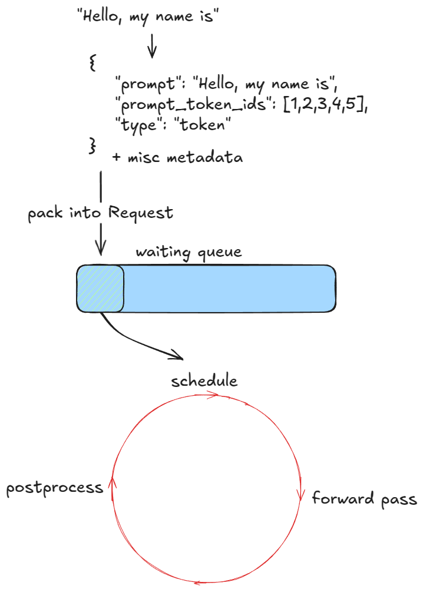

### Scheduler

两种活：

1. **Prefill**：对全部 prompt token 做一次 forward，通常 compute-bound（阈值随硬件和 prompt 长度变）。最后在末位采样一个 token。
2. **Decode**：只对最新那个 token forward，以前的 KV 已经住在 cache 里。通常 memory-bandwidth-bound：为了一个字，仍要搬来整栋权重和 KV。

V1 能在同一步里混着做。V0 一次只能选一种——像一条一次只能开一列车厢的轨道。

调度**优先 running 里的 decode**：算本步要几个新 token（不一定是 1，因为有 speculative 和 async scheduling）→ `allocate_slots` → 从 token 预算里扣掉。然后再从 waiting 里拿 prefill：看有多少 **computed blocks**（没开 prefix cache 就是 0）→ allocate → 从 waiting 挪到 running，状态 `RUNNING` → 扣预算。

`allocate_slots`：

1. 按默认 16 token 一块向上取整。17 个新 token → `ceil(17/16) = 2` 块
2. 池子不够就提前离开——decode/prefill 可能触发 **recompute preemption**（V0 还有 swap，V1 默认重算：`kv_cache_manager.free` 把块还回池子），或干脆这步不排
3. 够了就从 `free_block_queue` 双向链表头取 n 块，记进 `req_to_blocks`


### Forward

`execute_model` → Worker → model runner：

1. 更新状态：从 `input_batch` 剪掉已结束的请求；更新每条请求的 KV 块表
2. 准备输入：CPU→GPU 拷缓冲、算 position、建 `slot_mapping`、构造 attention metadata
3. Forward：自定义 paged attention。所有序列被拍扁接成一条「超级序列」，靠位置和 mask 保证各人只看见自己的过去——于是 continuous batching 不必右 padding
4. 取出每条序列最后一位的 hidden state，算 logits
5. 按 greedy / temperature / top-p / top-k 采样

两种走法：eager（普通 PyTorch）；captured（replay 启动时烤好的 CUDA graph）。


## 进阶：在核心上长出来的房间

已经有了：抢占、paged attention、continuous batching。还要讲：chunked prefill、prefix cache、guided decoding、投机解码、分离的 P/D。

### Chunked prefill

长 prompt 若一次 prefill 吃完整步预算，会独占一个 engine step，把别人的 TTFT 按在地板上。切成每块 n 个 token。例如每块 8 个，长 prompt `P` 写成 `x-y-z`（`z` 可能不满一块），完整 prefill 至少 3 个 engine step（中间还可能排不上），只在最后一块才采样新 token。

实现上就是 cap 每步新 token；超过 `long_prefill_token_threshold` 就截成这么多。底层索引前面已经讲过。V1 里把它设成正整数即开。prompt 超过 token 预算时，即使你没设，也会被截成 chunked prefill。这是礼貌：长客人也要给别人留座位。

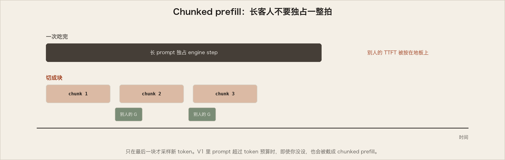


### Prefix caching

同一段长前缀被许多问题共用——同一本手册、同一段系统提示。前缀长过一个 KV block（默认 16）才能按块缓存；对不齐 block 边界的尾巴必须重算：`long_prefix_len % block_size` 个 token。

```python
from vllm import LLM, SamplingParams

long_prefix = "<a piece of text that is encoded into more than block_size tokens>"
prompts = [
    "Hello, my name is",
    "The president of the United States is",
]
sampling_params = SamplingParams(temperature=0.8, top_p=0.95)

def main():
    llm = LLM(model="TinyLlama/TinyLlama-1.1B-Chat-v1.0")
    outputs = llm.generate(long_prefix + prompts[0], sampling_params)
    outputs = llm.generate(long_prefix + prompts[1], sampling_params)

if __name__ == "__main__":
    main()
```

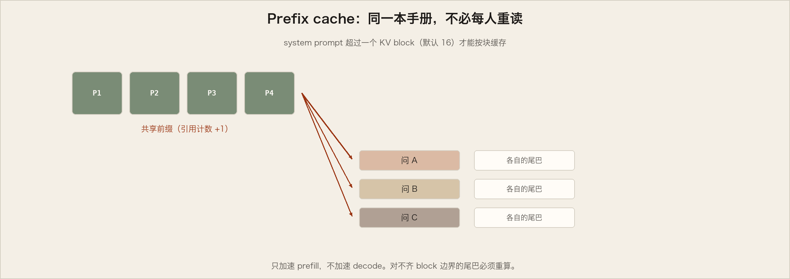

第一次 `generate`，调度里 `kv_cache_manager.get_computed_blocks` 会调 `hash_request_tokens`：

1. 把 `long_prefix + prompts[0]` 切成 16-token 的块
2. 每块完整才算 hash（内置 hash，或更慢、更少碰撞的 SHA-256）：上一块的 hash + 本块 token + 可选元数据（多模态 hash、LoRA id、**cache salt**——打进第一块，只有对上暗号的请求才能复用）
3. 得到一串 `BlockHash`（hash + token IDs），记进 `self.req_to_block_hashes[request_id]`

`find_longest_cache_hit` 第一次当然扑空。然后 `allocate_slots` → `coordinator.cache_blocks`，把新 hash 和分配到的块登记进 `cached_block_hash_to_block`。Forward 把 KV 写进这些房间。前缀在 `long_prefix` 之后立刻分叉，后面再分配的块与本例无关。


第二次带着同一前缀来：线性搜到 n 块命中，直接复用。


原请求若还活着，引用计数 +1。若已结束，块曾还回池子、计数归零，但 hash 表里仍认得出它们，于是再从 `free_block_queue` 请回来。

块真正作废，是它将要被从队列**左边**重新分配、却发现身上还挂着旧 hash、并且仍在 `cached_block_hash_to_block` 里的时候——那时才擦掉，免得把别人的记忆错当成你的。

Prefix cache **只加速 prefill，不加速 decode**。默认开。关掉：`enable_prefix_caching=False`。若你读懂了这段，你也读懂了 paged attention：记忆按页出租，而不是按整幢楼。

### Guided decoding（FSM）

每一步用文法有限状态机去遮 logits，只允许文法许可的 token。从正则（Chomsky 3 型）到上下文无关文法（2 型，覆盖多数编程语言）。

```python
from vllm import LLM, SamplingParams
from vllm.sampling_params import GuidedDecodingParams

prompts = [
    "This sucks",
    "The weather is beautiful",
]
guided_decoding_params = GuidedDecodingParams(choice=["Positive", "Negative"])
sampling_params = SamplingParams(guided_decoding=guided_decoding_params)

def main():
    llm = LLM(model="TinyLlama/TinyLlama-1.1B-Chat-v1.0")
    outputs = llm.generate(prompts, sampling_params)

if __name__ == "__main__":
    main()
```

玩具（假设按字符切）：prefill 后只允许 P 或 N；抽到 P 就走进 Positive 那条走廊，下一步只许 o。


引擎里：

1. 构造时建 `StructuredOutputManager`（拿得到 tokenizer），维护 `_grammar_bitmask`
2. 新请求状态先是 `WAITING_FOR_FSM`；`grammar_init` 选后端编译器（如 xgrammar，第三方代码）
3. 文法异步编译
4. 调度时：编完才改成 `WAITING`，并把 `request_id` 放进 `structured_output_request_ids`；没编完就进 `skipped_waiting_requests`，下一步再试
5. 调度循环之后，若有 FSM 请求，backend 准备/更新 `_grammar_bitmask`
6. Forward 出 logits 之后，xgr_torch_compile 把 bitmask 扩到词表大小（32 位整数，约 32×），禁止位置打成 −∞
7. 采样后再 `accept_tokens` 推进一步 FSM

词表=32 时 bitmask 就是一个整数的二进制开关：`"101…001"` 展开成长度 32 的数组，0 的位置 logits = −∞。更大词表用多个 32-bit word 再拼接。复杂度多半藏在 xgrammar 一类库里。

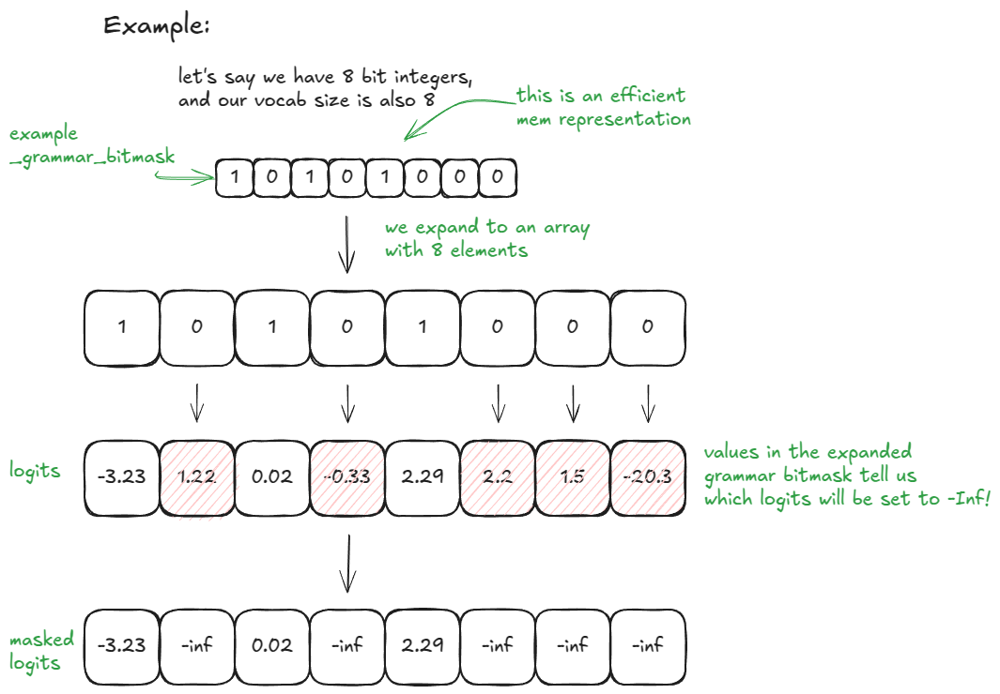

打开：传入 `guided_decoding` 配置。

### Speculative decoding

自回归里，每个新 token 都要大模型完整走一轮——batch=1 时，为了一个字搬来全部权重（一般是 batch `B`）。小 draft 先廉价猜 `k` 个字；我们最终不要从小模型采样，它只负责猜。

1. Draft：小模型在当前 context 上提出 `k` 个 token
2. Verify：大模型对 context + `k` 个草案跑一次，得到这 `k` 个位置的分布，外加白送的第 `k+1` 个
3. 从左到右接受/拒绝：
   - 大模型对该草案的概率 ≥ draft 的概率 → 接受
   - 否则以 `p_large(token)/p_draft(token)` 接受
   - 在第一处拒绝处停下，或收下全部 `k` 个
   - 若 `k` 个全收下，再从已经算好的第 `k+1` 个分布「白嫖」一个
   - 若有拒绝：在该位置用 `p_large - p_draft`（夹到 ≥0 再归一化）重采样最后一个

期望上，序列的分布仍等于只从大模型采样。统计上诚实，工程上可能更快。作者建议看 gpt-fast 的实现和原论文的证明。

原文写 V1 当时不走「另训一个小 LLM 当 draft」，而用更快、更糙的提案：n-gram、EAGLE、Medusa。

- **n-gram**：取最近 `prompt_lookup_max` 个 token，在序列里找旧匹配；命中就用匹配后面的 `k` 个当草案，否则把窗口收到 `prompt_lookup_min`。当时实现取的是**第一次**匹配后面的 `k` 个；作者觉得按新近度反向搜更自然
- **EAGLE**：给大模型做手术，留下 embedding 和 LM head，用轻量 MLP 当 draft
- **Medusa**：在 LM head 前加辅助线性头，并行猜后面 `k` 步

n-gram 在 vLLM 里：

```python
from vllm import LLM, SamplingParams

prompts = [
    "Hello, my name is",
    "The president of the United States is",
]
sampling_params = SamplingParams(temperature=0.8, top_p=0.95)
speculative_config = {
    "method": "ngram",
    "prompt_lookup_max": 5,
    "prompt_lookup_min": 3,
    "num_speculative_tokens": 3,
}

def main():
    llm = LLM(
        model="TinyLlama/TinyLlama-1.1B-Chat-v1.0",
        speculative_config=speculative_config,
    )
    outputs = llm.generate(prompts, sampling_params)

if __name__ == "__main__":
    main()
```

构造时：init device 建 `drafter`（如 `NgramProposer`）和 `rejection_sampler`（部分 Triton）；load model 时加载 draft 权重（n-gram 是空操作）。

新请求的 `generate`：

1. 大模型照常 prefill
2. 采样之后 `propose_draft_token_ids(k)`，写入 `request.spec_token_ids`
3. 下一步它已在 running 里：把 `len(spec_token_ids)` 加进「新 token」计数，让 `allocate_slots` 给草案留 KV
4. 把 `spec_token_ids` 拷进 `input_batch.token_ids_cpu`，形成 context+draft
5. `_calc_spec_decode_metadata` 之后，大模型在草案上跑一遍
6. 不用普通采样，用 `rejection_sampler` 从左到右决定 `output_token_ids`
7. 重复 2–7，直到停止条件

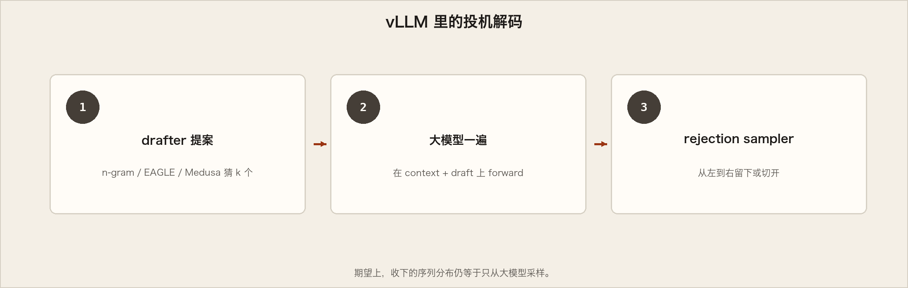

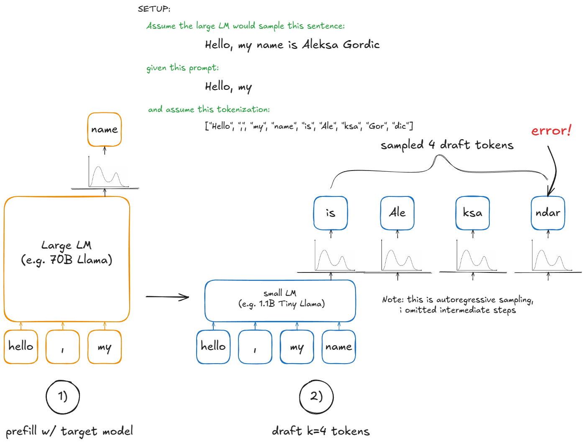

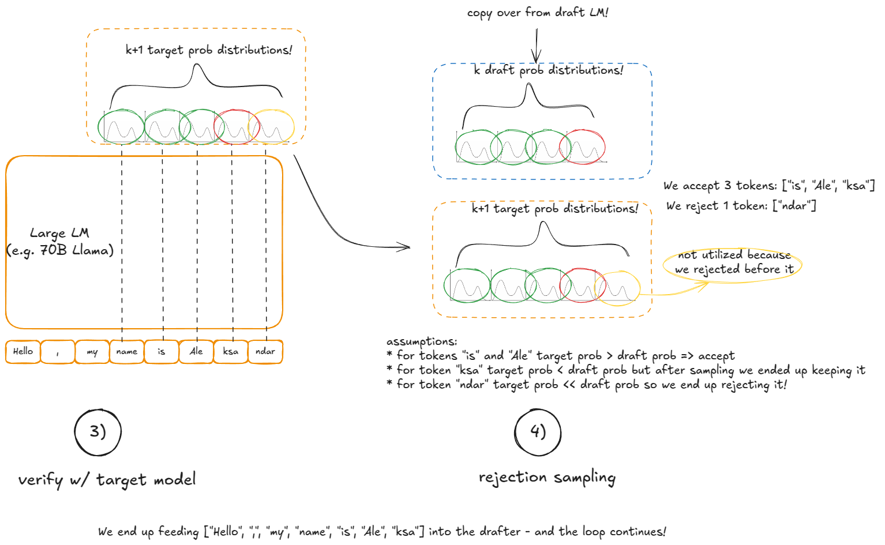

### 分离的 Prefill / Decode

Prefill 吃算力，decode 吃带宽。拆开以后，TTFT 和 ITL 才能被两只手分别按住（原文偶发写成 `TFTT`，就是 TTFT）。实践中 N 个 prefill 实例、M 个 decode 实例，按实时请求配比伸缩。Prefill 把 KV 写到专门的 KV 服务，decode 来读。长而爆发的 prefill，不再踩着对延迟敏感的 decode 的脚。

Connector 是交换 KV 的抽象，接口当时仍不稳，近期改动可能不兼容。文中用 `SharedStorageConnector` 讲机制（调试用；「外部服务」其实是本地文件系统）。生产里更快的是 LMCache / NIXL，作者写文时仍觉得它在刀刃上，所以讲解用文件系统版。

两张卡：GPU 0 prefill，GPU 1 decode。

```python
import os
import time
from multiprocessing import Event, Process

from vllm import LLM, SamplingParams
from vllm.config import KVTransferConfig

prompts = [
    "Hello, my name is",
    "The president of the United States is",
]

def run_prefill(prefill_done):
    os.environ["CUDA_VISIBLE_DEVICES"] = "0"
    sampling_params = SamplingParams(temperature=0, top_p=0.95, max_tokens=1)
    ktc = KVTransferConfig(
        kv_connector="SharedStorageConnector",
        kv_role="kv_both",
        kv_connector_extra_config={"shared_storage_path": "local_storage"},
    )
    llm = LLM(model="TinyLlama/TinyLlama-1.1B-Chat-v1.0", kv_transfer_config=ktc)
    llm.generate(prompts, sampling_params)
    prefill_done.set()
    try:
        while True:
            time.sleep(1)
    except KeyboardInterrupt:
        print("Script stopped by user.")

def run_decode(prefill_done):
    os.environ["CUDA_VISIBLE_DEVICES"] = "1"
    sampling_params = SamplingParams(temperature=0, top_p=0.95)
    ktc = KVTransferConfig(
        kv_connector="SharedStorageConnector",
        kv_role="kv_both",
        kv_connector_extra_config={"shared_storage_path": "local_storage"},
    )
    llm = LLM(model="TinyLlama/TinyLlama-1.1B-Chat-v1.0", kv_transfer_config=ktc)
    prefill_done.wait()
    outputs = llm.generate(prompts, sampling_params)

if __name__ == "__main__":
    prefill_done = Event()
    prefill_process = Process(target=run_prefill, args=(prefill_done,))
    decode_process = Process(target=run_decode, args=(prefill_done,))
    prefill_process.start()
    decode_process.start()
    decode_process.join()
    prefill_process.terminate()
```

vLLM 里的步骤：

1. **实例化**：Worker 的 init device（init worker distributed environment）里建 role=`worker` 的 connector；scheduler 构造函数里建 role=`scheduler` 的
2. **查 cache**：waiting 里的 prefill 过完本机 prefix cache 之后，调 `get_num_new_matched_tokens` 看外部 KV。Prefill 这里永远是 0；decode 可能命中。结果加进本地计数再 `allocate_slots`
3. **状态**：`update_state_after_alloc`（prefill 常是空操作）
4. **metadata**：调度末尾 `build_connector_meta`——prefill 全部 `is_store=True`（上传），decode `is_store=False`（拉取）
5. **上下文管理器**：forward 前 `start_load_kv`（decode 把外部 KV 灌进 paged 内存；prefill 空操作）；退出时 `wait_for_save`（prefill 等到上传完；decode 空操作）

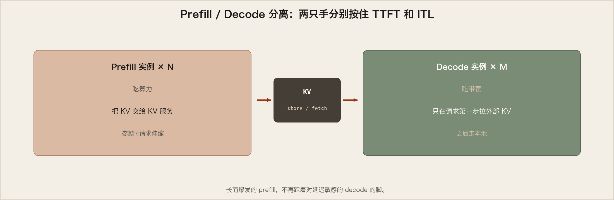


补充：KV 也可以按层传（每层 attention 前后）。Decode 只在请求第一步拉外部 KV，之后本地走。

## 从 UniProc 到 MultiProc

单卡装不下权重：先同机 TP（例如 `TP=8`）；还不够再跨节点 PP。机内带宽远高于机间，所以一般先 TP。PP 通信量更小，但延迟性格不同。这篇不展开 EP 与 sequence parallel。

需要多 GPU 进程和一层编排——就是 `MultiProcExecutor`。

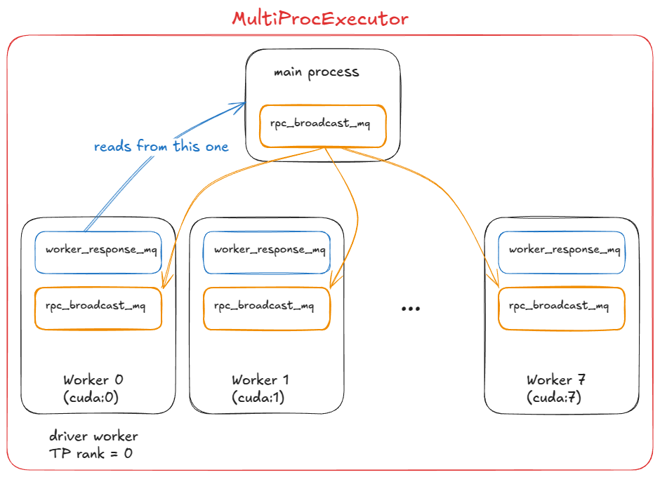

1. 初始化共享内存上的 `rpc_broadcast_mq`
2. 按 `world_size`（如 TP=8）`WorkerProc.make_worker_process` fork 守护进程
3. 每个 worker 先有一对 reader/writer pipe
4. 子进程跑 `WorkerProc.worker_main`，走同一套 init device / load model
5. rank 0 是 driver。每人两套队列：`rpc_broadcast_mq` 收活，`worker_response_mq` 回结果
6. 初始化时子进程经 pipe 把 `worker_response_mq` 句柄交给父进程；收齐才放行
7. worker busy loop：`rpc_broadcast_mq.dequeue` → 干活（带上 TP/PP 分片）→ `worker_response_mq.enqueue`
8. 运行时父进程非阻塞地把活广播进 `rpc_broadcast_mq`，再在指定 output rank 上 `dequeue` 收最终结果

引擎看来只是又一次 `execute_model`：单卡直接调 worker，多卡经广播队列间接调每一个人。再往外是 DP>1、协调层、负载均衡、前面再站一个或多个 API server。

## 分布式 serving

一个具体例子：两台 8×H100，四个 vLLM engine，模型要 `TP=4`。

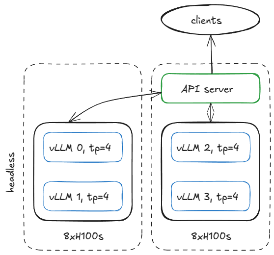

第一台 **headless**（不带 API）：

```
vllm serve <model-name>
  --tensor-parallel-size 4
  --data-parallel-size 4
  --data-parallel-size-local 2
  --data-parallel-start-rank 0
  --data-parallel-address <master-ip>
  --data-parallel-rpc-port 13345
  --headless
```

第二台去掉 `--headless`，把 `--data-parallel-start-rank` 改成 2。网络要通到 master IP 和 RPC 端口。

### Headless 节点

`CoreEngineProcManager` 按 `--data-parallel-size-local` 起 2 个进程，各跑 `EngineCoreProc.run_engine_core`，造出 `DPEngineCoreProc`，进入 busy loop。

`DPEngineCoreProc` 初始化父类 `EngineCoreProc`（`EngineCore` 的孩子）：

1. `input_queue` / `output_queue`
2. 用 ZMQ `DEALER` 和另一台的 frontend 握手，拿到协调地址
3. 初始化 DP group（如 NCCL）
4. 用 `MultiProcExecutor`（这里 TP=4）初始化 `EngineCore`
5. `ready_event`
6. 后台线程：`process_input_sockets`；再起 output 线程
7. 主线程等到**两台机器四个进程**的 input 线程都握完手，才 `ready_event.set()`
8. 向 frontend 发 ready，带上 metadata（如 paged KV 里有多少 `num_gpu_blocks`）
9. 三套线程进入稳态 busy loop

稳态：

- **Input 线程**：堵在 input socket 上；API 路由过来的请求解码后 `input_queue.put_nowait`
- **主线程**：`input_queue.get` → 喂给引擎；`MultiProcExecutor` 跑完把结果放进 `output_queue`
- **Output 线程**：`output_queue.get` → 送回 API server

另外：DP **wave** 计数（全员空闲就静下来，新活来了计数 +1）；API 还可以发 abort 和控制 RPC；**dummy step**：任一 replica 有活，所有 replica 都要走一步 forward——没请求的人做空步，以免在同步点把有活的人堵住。作者说明：这其实是 MoE 上 expert 层组成 EP/TP、attention 仍是 DP 时才必须的；现在 DP 一律这么做，是因为非 MoE 的内置 DP 用处有限——你完全可以起多份独立 vLLM，自己做负载均衡。


### API server 节点

实例化 `AsyncLLM`（asyncio 包着引擎），内部是 `DPLBAsyncMPClient`（data-parallel、load-balancing、异步、多进程）。

`MPClient.launch_core_engines`：建握手用的 ZMQ 地址、起 `DPCoordinator` 进程、再起一个 `CoreEngineProcManager`（和 headless 那侧一样）。

`AsyncMPClient`：`outputs_queue`（`asyncio.Queue`）；asyncio 任务 `process_outputs_socket` 跟四个 `DPEngineCoreProc` 的 output 线程说话，写入队列；`AsyncLLM` 的 `output_handler` 再读队列，送到 `create_completion`。

`DPAsyncMPClient` 还有 `run_engine_stats_update_task` 跟 DP coordinator 说话。Coordinator：定期把队列长度、waiting/running 发给 frontend；处理 frontend 的 `SCALE_ELASTIC_EP`（动态改引擎个数，当时只支持 Ray backend）；把 `START_DP_WAVE` 发给 backend，再把 wave 状态报回去。

Frontend（`AsyncLLM`）上的 asyncio 任务（并发，不是并行）：

- 每个客户端请求一条 `generate` 路径
- `process_outputs_socket` / `output_handler` 处理引擎回来的输出
- `run_engine_stats_update_task`：发 wave、拉 LB 状态、处理动态伸缩

主进程再挂 FastAPI：`OpenAIServingCompletion` / `OpenAIServingChat`，`/completion`、`/chat/completion`，Uvicorn 对外。

一次 `curl` 的一生：

```
curl -X POST http://localhost:8000/v1/completions -H "Content-Type: application/json" -d '{
  "model": "TinyLlama/TinyLlama-1.1B-Chat-v1.0",
  "prompt": "The capital of France is",
  "max_tokens": 50,
  "temperature": 0.7
}'
```

1. 打到 `OpenAIServingCompletion.create_completion`
2. 异步 tokenize，备好 request id、sampling params、时间戳
3. `AsyncLLM.generate` → `DPAsyncMPClient.add_request_async`
4. `get_core_engine_for_request` 按 coordinator 状态选人：`score = len(waiting) * 4 + len(running)`，挑分数最低的
5. `ADD` 送到那台引擎的 `input_socket`
6. 该引擎：input 线程解码放进 `input_queue`；主线程反复 `engine_core.step()`（就是前面的 scheduler + 可能是 `MultiProcExecutor`），中间结果进 `output_queue`，直到停止；output 线程从 socket 送回
7. `AsyncLLM` 的输出任务把 token 推回 FastAPI
8. FastAPI 附上 finish reason、logprobs、usage，Uvicorn 给你 `JSONResponse`

加更多 API server 时，负载均衡发生在 OS/socket 层，应用几乎无感。Ray 做 DP backend 时，可以暴露 `/scale_elastic_ep` 自动加减 replica。

## 延迟 vs 吞吐

此前拆的是分子。现在问整座城市：怎样量一套推理系统？

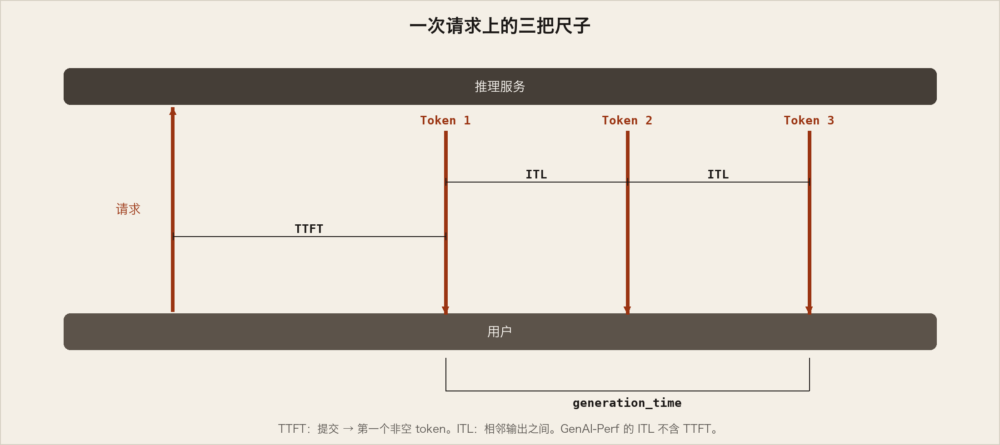

两个互相拉扯的量：

1. **Latency** — 从提交到字回来。交互式应用里，人在等。
2. **Throughput** — 每秒多少 token / 请求。离线造数据、清洗、批推理里，机器在等。

| 指标 | 含义 |
|---|---|
| TTFT | 提交 → 第一个输出 token |
| ITL | 相邻两个输出 token 之间 |
| TPOT | 一次请求里 ITL 的平均 |
| e2e | TTFT + 所有 ITL，或提交到最后一字 |
| Throughput | token/秒或请求/秒 |
| Goodput | **仍满足 SLO** 的那部分吞吐。破了 TTFT/TPOT/e2e 预算的 token，不算你赢了 |

简化模型（假设权重 I/O 主导、序列短）：decode 一步的 batch `B` 往 1 降，ITL 降，字不再跟人挤；`B` 往无穷升，ITL 升，但权重搬运被更多 token 摊薄，吞吐升到屋顶。Roofline：低于饱和 batch `B_sat`，步时被 HBM 带宽按住（一层一层把权重灌进片上），算 1 个和 10 个 token 可能差不多久；超过以后变 compute-bound，步时近似随 B 涨。

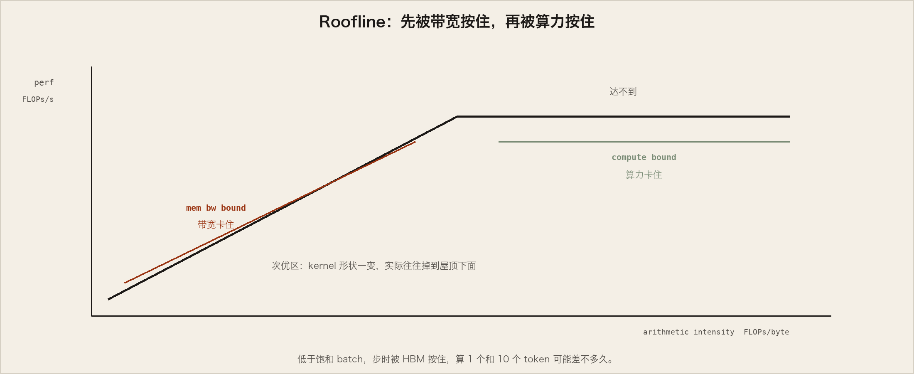


更严一点：kernel 会随 `B` 换形状，达到的 `P_kernel` 会变。步时 `t = FLOPs_step / P_kernel`。`P_kernel` 一旦顶到 `P_peak`，每步再多算就会直接变成延迟。

### vLLM 怎么 bench

`vllm bench {serve,latency,throughput}` 包着 `vllm/benchmarks/{server,latency,throughput}.py`。

- **latency**：短输入（默认 32）、采 128 个输出、小 batch（默认 8），若干 iteration，报整批 e2e
- **throughput**：一次扔固定集合（默认 1000 条 ShareGPT），`QPS=Inf`，报 in/out/total token 和 RPS
- **serve**：按 Poisson（更一般是 Gamma）抽到达间隔，在时间窗里发请求；可加服务端最大并发（semaphore，例如 64）

```
vllm bench latency
  --model <model-name>
  --input-tokens 32
  --output-tokens 128
  --batch-size 8
```

CI 配置在 `.buildkite/nightly-benchmarks/tests`。还有 auto-tune：驱动 serve benchmark，找满足 SLO 的参数（例如「p99 e2e < 500 ms 的前提下最大吞吐」）。

## 收场

从 `UniProcExecutor` 出发，加上 spec decode 与 prefix cache，放大到 `MultiProcExecutor`（TP/PP>1），再异步、再分布式，最后问系统怎么量。

作者略过、几乎可以当插件看的还有：TPU / AWS Neuron；MLA、MoE、encoder-decoder（Whisper）、pooling/embedding、EPLB、m-RoPE、LoRA、ALiBi、attention-free、sliding window、多模态、Mamba/Mamba-2/Jamba；TP/PP/SP；混合 KV（Jenga）、beam sampling；实验性 async scheduling。实践里会有耦合。

这一海拔分辨率不够。后面的博客会把子系统再拉近。

致谢：Hyperstack 提供 H100；Nick Hill、Kaichao You、Mark Saroufim、Kyle Krannen、Ashish Vaswani 读过预发稿。

参考文献：vLLM；Attention Is All You Need；PagedAttention 论文；DeepSeek-V2；Jenga；Orca；XGrammar；投机采样原论文；EAGLE；Medusa；LMCache。
