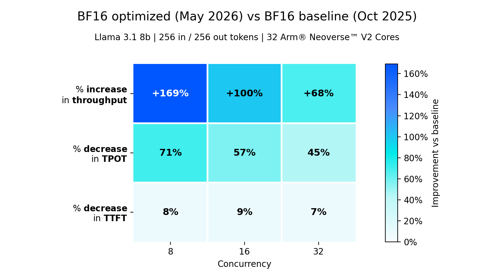
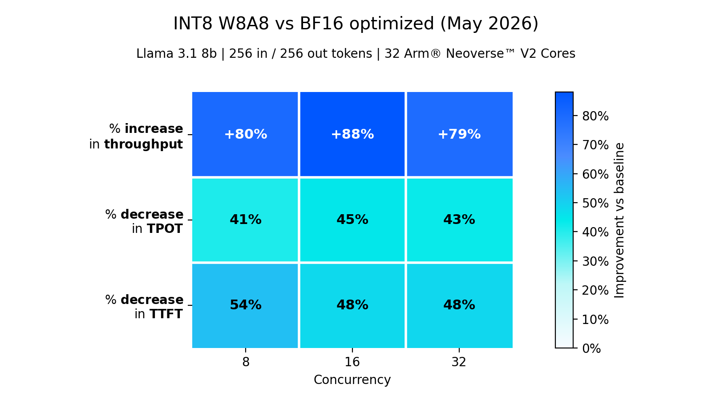
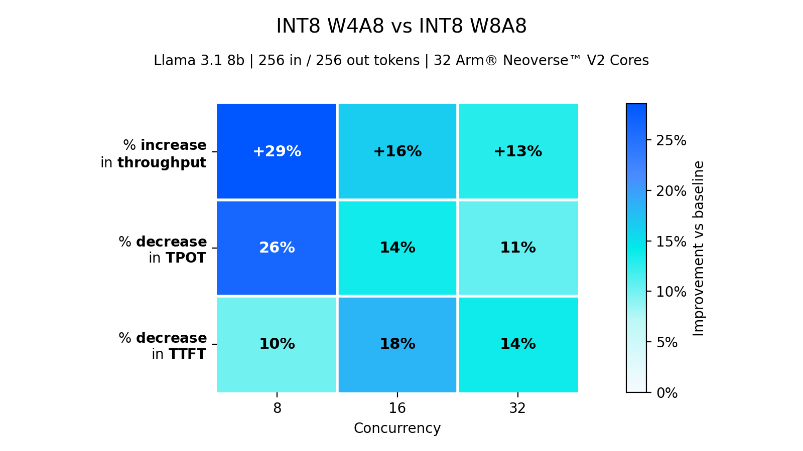
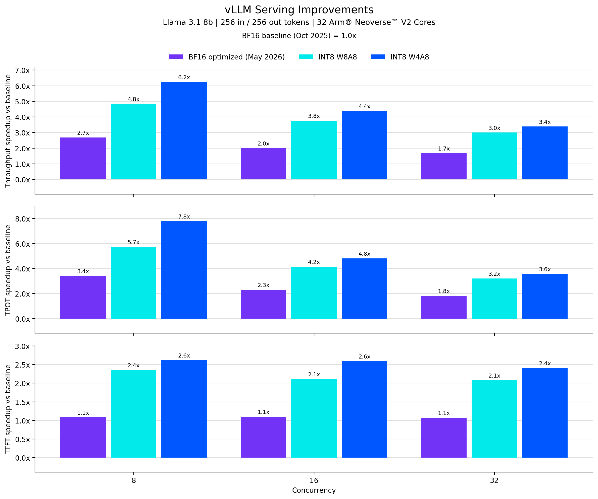

# Arm CPU 上的 vLLM：瓶颈不在 GEMM

英文对照：[en/vllm/blog/architecture/arm-cpus.md](../../../../en/vllm/blog/architecture/arm-cpus.md)  
原文：https://vllm.ai/blog/2026-07-29-optimizing-vllm-on-arm-cpus  
2026-07-29。署名 **Arm Team**。数字是 Neoverse 上相对 2025-10 BF16 基线的演示，不是 SLA。另一条「硬件进主干」的路见 [hardware-plugin](hardware-plugin.md)；PagedAttention 本身见 [paged-attention](paged-attention.md)；INT8 / W4A16 亲戚：[autoround-llmc](autoround-llmc.md)；CPU 对 Arc XPU：[intel-arc](intel-arc.md)。

适用：Arm Neoverse 服务器，要 wheel、chunked prefill / prefix cache、INT8 W8A8 / W4A8。不适合：把页上的 **2.7–6.2×** 当承诺——热力图把 allocator 贡献拿掉了。

## 概览

CPU serving 便宜、好铺。Neoverse 服务器多了，开源 serving 在 Arm 上就要能用、功能齐、还要快。几个月跟 vLLM、PyTorch、oneDNN、KleidiAI 一起往上游送。这篇先讲能用，再挖性能栈。

密集层大约 **80%** 时间已经在优化过的 BF16 GEMM 里，kernel 本身贴着硬件效率。剩下是 allocator、OpenMP、layout、attention、量化。

## 能用

- 预编译 [wheel](https://docs.vllm.ai/en/latest/getting_started/installation/cpu/#arm-aarch64_2:~:text=venv/bin/activate-,Pre%2Dbuilt%20wheels,%C2%B6,-When%20specifying%20the) 与 [Docker](https://docs.vllm.ai/en/latest/getting_started/installation/cpu/#arm-aarch64_4:~:text=%C2%B6-,Pre%2Dbuilt%20images,%C2%B6,-Intel/AMD%20x86)
- 崩溃、精度、线程、CPU 利用率的修复
- chunked prefill、prefix caching
- INT8 W8A8 与 INT8 W4A8
- GPT-OSS、Whisper、Qwen 3.5 / 3.6
- 跟 [PyTorch](https://github.com/pytorch/pytorch)、[UXL](https://github.com/uxlfoundation) 接得更紧

## 性能

2025-10 第一次 bench，远低于 GEMM kernel 该有的样子。单独的 BF16 GEMM 已经贴着硬件效率，只调 kernel 搬不动针。profile 指向 allocator、运行时同步、框架开销、attention、量化执行。

### 内存分配

Prefill / Decode 反复为调度、KV、中间量申请 / 释放。大块不复用 → 缺页。根因：PyTorch 用 glibc `malloc`。大分配跨步复用差；线程一多，alloc/free 互抢。早期workaround：预加载 caching allocator——多一步配置，成绩绑在运行时选项上。

改法：PyTorch 在 Arm 上默认 [mimalloc](https://github.com/microsoft/mimalloc)。caching allocator，扛多线程压力；非 Arm Linux 上本来就是 PyTorch 依赖；TorchBench 上成绩好。

Llama 3.1 8B 开箱：离线吞吐约 **2.3×**；低并发 serving 约 **7×**。

> 文中所有图都 **去掉** allocator 贡献——否则会把别的优化压没。

### 高核数同步

过了某个核数，再加核不涨、甚至倒退。一份 profile：paged attention 里约 **74%** 耗在 OpenMP 动态调度：

```text
97.94% gomp_thread_start
  90.08% paged_attention_v1_impl
    74.07% gomp_iter_dynamic_next
     7.00% reduceValueBlock::lambda(int)
```

`gomp_iter_dynamic_next` 是 libgomp 动态循环调度：atomic fetch-add 把 chunk 分给 worker。PyTorch wheel 里那份 libgomp 用 LL/SC 重试：

```c
for (;;) {
    long old = LDXR(p);
    long newv = old + delta;
    int fail = STLXR(p, newv);
    if (fail == 0) {
        DMB_ISH();
        return old;
    }
}
```

高核数：许多 worker 抢同一处原子 → 失败的 store 和重试流量。bench 机是 Neoverse V2，有 [Arm LSE](https://learn.arm.com/learning-paths/servers-and-cloud-computing/lse/example/)（`LDADDAL`）。PyTorch 的 OpenMP 没用。

改法：PyTorch 里编一份会用 LSE atomics 的 libgomp。Llama 3.1 8B：离线 **+9%**；低并发 TPOT **−15%**。

### 密集层 layout 税

高性能 GEMM 要 blocked 权重 layout。不预打包，每次调用都要从框架 layout 转成 kernel 格式。低并发更贵（摊不掉）。密集层走快的 oneDNN 路径（Compute Library for Arm）：warmup 把 BF16 权重打成 kernel 格式，推理时复用。

Llama 3.1 8B：离线 **+16%**；低并发 TPOT **−60%**。

### Paged attention

CPU paged attention 没为 Arm 调过。QK / PV 和 softmax exp 掉进参考实现。Prefill 走 PyTorch SDPA——Arm CPU 路径上 chunked prefill 和 prefix caching 开不了。

QK / PV 用 [BFMMLA](https://developer.arm.com/community/arm-community-blogs/b/ai-blog/posts/bfloat16-processing-for-neural-networks-on-armv8_2d00-a) 的定制 GEMM。softmax exp：向量化三次多项式。

kernel 最多约 **4×**；Llama 3.1 8B 离线 **+12%**。Prefill 也能走 paged，chunked prefill 和 prefix caching 才开得了。

### 三刀之后的 BF16

同步 + 预打包 + paged attention，相对 2025-10 BF16 基线：



**Figure。** 优化后的 BF16 serving 相对 2025-10 BF16 基线（学习对照）。

### INT8 W8A8

权重 INT8 而不是 BF16：带宽小，同样内存能塞更大模型。带 I8MM 的 Arm 上，W8A8 映射到 [`SMMLA`](https://developer.arm.com/documentation/dui0379/e/arm-and-thumb-instructions/smmla)——相对 BF16 理论 matmul 吞吐 **2×**。

W8A8 路径：[oneDNN](https://github.com/uxlfoundation/oneDNN) JIT，SVE128 / SVE256 上用 `SMMLA`。点名的 Hugging Face checkpoint：`RedHatAI/Meta-Llama-3.1-8B-quantized.w8a8`、`RedHatAI/whisper-large-v3-quantized.w8a8`。

相对优化后的 BF16（per-token 激活量化、channelwise 权重量化）：吞吐最多 **+88%**，TPOT **−45%**，TTFT **−54%**，看并发。



**Figure。** INT8 W8A8 相对优化后的 BF16（学习对照）。

Learning Path：[Arm 上的 INT8 W8A8](https://learn.arm.com/learning-paths/servers-and-cloud-computing/vllm-benchmark-quantisation/)。

### INT8 W4A8

权重 INT4，激活仍 8-bit——带宽再松一档，低并发更明显。加速走 [KleidiAI](https://github.com/ARM-software/kleidiai) 的 INT4 micro-kernel。

相对上面的 W8A8：吞吐最多 **+29%**，TPOT **−26%**，TTFT **−18%**。低并发（memory-bound）最大。



**Figure。** INT8 W4A8 相对 INT8 W8A8（学习对照）。

怎么量化：[llm-compressor INT8 W4A8](https://docs.vllm.ai/en/latest/features/quantization/llm_compressor/int8_w4a8/)。

## 收束

相对 2025-10 BF16：

- 优化 BF16：serving 吞吐最多 **2.7×**
- INT8 W8A8：吞吐最多 **4.8×**，TPOT **5.7×**
- INT8 W4A8：吞吐最多 **6.2×**，TPOT **7.8×**，TTFT **2.6×**

增益来自整条 CPU 栈：分配、OpenMP、密集层预打包、paged attention、量化——不是只调 GEMM。



**Figure。** 优化 BF16、INT8 W8A8、INT8 W4A8 相对 2025-10 BF16 的 serving 加速（学习对照）。

原文还说：功能更齐、开箱更好用、上游接得更紧、模型更多——更像能上生产的 Neoverse 栈。

## 致谢

vLLM 社区。**[Li Jiang](https://github.com/bigPYJ1151)**（Intel）维护 CPU backend。**[Sanket Kale](https://github.com/sanketkaleoss)**（Fujitsu）最初的 Arm CPU enablement。**[Shreyas](https://github.com/Shreyas-fuj)**（Fujitsu）给 oneDNN 的 SVE256 INT8 kernel。

Arm / PyTorch / Intel / oneDNN 为各自商标。原文版权 2026 Arm Limited（`open-source-office@arm.com`）。
