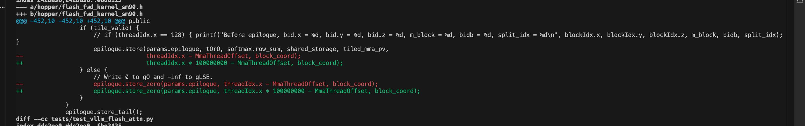

# 挂死的 kernel 对回源码行

英文对照：`en/vllm/blog/architecture/cuda-debugging-source.md`  
原文：https://vllm.ai/blog/2025-12-03-improved-cuda-debugging  
接 [core dump](cuda-debugging.md)。

Kernel hang 时 Ctrl-C 常常没用：SIGINT 被 Python 收成 `KeyboardInterrupt`，可进程卡在 CUDA API 等 GPU，异常排不上队。要能 Ctrl-C：`signal.signal(signal.SIGINT, signal.SIG_DFL)`——代价是没有 Python 栈。

用户触发 dump：

```
CUDA_ENABLE_USER_TRIGGERED_COREDUMP=1 \
CUDA_COREDUMP_PIPE="/tmp/cuda_coredump_pipe_%h.%p.%t" \
# …其余与 IMA dump 相同
```

卡死时对 pipe 写 1MB 零（`echo` 可能被缓冲挡住）：

```
dd if=/dev/zero bs=1M count=1 > /tmp/cuda_coredump_pipe_...
```

`cuda-gdb` 打开 dump 能看到 hang 在哪一行。pipe 路径可从 `/proc/<pid>/fd` 找。复杂 C++ kernel：`cuda-gdb` 默认只显示 inline 后最后一行；要完整 inline 栈。`lineinfo` 仍不够时，原文后半有手工对照 DWARF 的办法。

本地图（原文版权仍归原站；学习对照用）：


