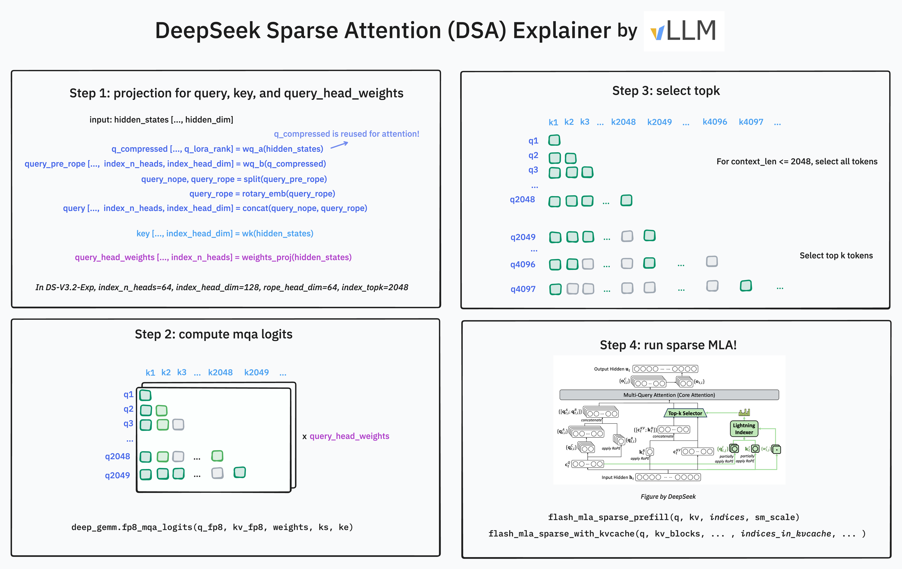
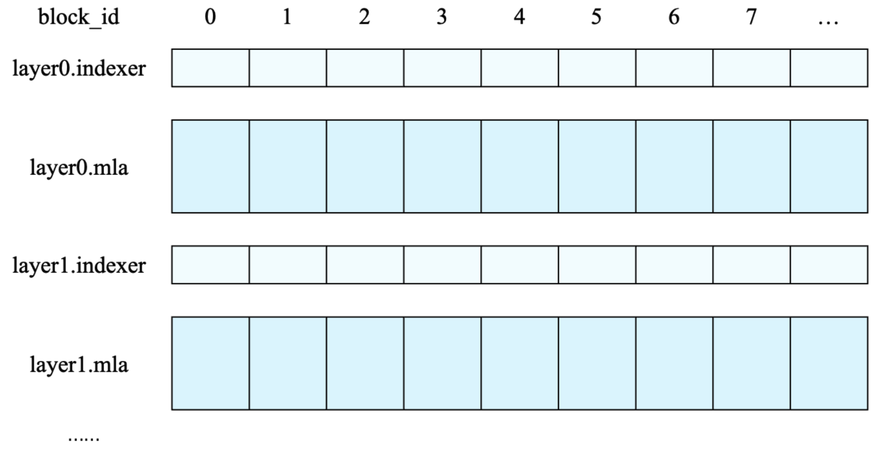

# DeepSeek-V3.2-Exp：细粒度稀疏注意力进了 continuous batch

英文对照：[en/vllm/blog/architecture/deepseek-v32.md](../../../../en/vllm/blog/architecture/deepseek-v32.md)  
原文：https://vllm.ai/blog/2025-09-29-deepseek-v3-2  
2025-09-29。署名 **vLLM Team**。Day-0。模型：[DeepSeek-V3.2-Exp](https://huggingface.co/deepseek-ai/DeepSeek-V3.2-Exp)。论文：[DSA PDF](https://github.com/deepseek-ai/DeepSeek-V3.2-Exp/blob/main/DeepSeek_V3_2.pdf)。后续 V4 压缩栈见 [deepseek-v4](deepseek-v4.md)；GB300 上 V3.2 vs R1 见 [gb300-deepseek](../performance/gb300-deepseek.md)；宽 EP 见 [gb200-wideep](../serving/gb200-wideep.md)；FP8 KV 见 [fp8-kvcache](../performance/fp8-kvcache.md)；树外硬件见 [hardware-plugin](hardware-plugin.md)。

适用：DSA 进 continuous batching——lightning indexer、indexer K 跟 MLA KV 分开、`ks` / `ke` 标因果窗口、FlashMLA 的 `block_size` 64。不适合：把 Day-0 当成 EP 已经收工（页上说 EP 有 bug）；也不要略过后来 GB300 文里 DSA 单层相对 MLA 约 **2.7×** kernel 时间。

## 概览

DeepSeek-V3.2-Exp 的 Day-0：给长上下文的 DeepSeek Sparse Attention（DSA）。vLLM 里难的是 **continuous batching** 和 **paged attention**——indexer 的 prefill / decode 要分开，cache layout 也不一样。

性能路径：DeepGEMM 里的 lightning indexer CUDA kernel；FlashMLA 里新的稀疏注意力。跟 NVIDIA 合作的 Blackwell：**B200** 和 **GB200**。



**Figure 1。** DSA：lightning indexer 挑 top-2048，再稀疏注意力（学习对照；版权仍归原站）。

## 当时怎么用

菜谱：[DeepSeek-V3.2-Exp](https://docs.vllm.ai/projects/recipes/en/latest/DeepSeek/DeepSeek-V3_2-Exp.html)。最初支持还在动：[PR #25869](https://github.com/vllm-project/vllm/pull/25869)。已知问题：[#25877](https://github.com/vllm-project/vllm/issues/25877)。

**16×H100 / 8×H200 / 8×B200**，tensor parallel（expert parallel 当时有个小 bug 在修）：

```
vllm serve deepseek-ai/DeepSeek-V3.2-Exp --tensor-parallel-size 8
```

规模：那一周要给 `llm-d` 的一键 Kubernetes——NIXL 做 P/D 拆分，再把请求路由到不同 data-parallel rank。文档「很快」。

用 **长输入或预期很长的输出** 测。对照 V3.1-Terminus（同一份数据 mix 上继续预训练）。跟官方精度还在核对；更早一版权重对上了预期的 GSM8K 和 GPQA-Diamond，跟 V3.1-Terminus 接近。

## vLLM 里的 Top-K 稀疏注意力

### Cache 和量化

Lightning indexer 有 **自己的** 索引用 K cache——每个 token 多一份 K，跟 MLA KV **分开** 分配。



**Figure。** MLA KV 对 indexer key 的 layout（学习对照）。

MLA 每 token 的 FP8 KV：**656 bytes**：

- 前 **512** 字节：量化 NoPE——512× `float8_e4m3`
- 接下来 **16** 字节：4× `float32` scale（每 128 个 `float8_e4m3` 一份）
- 最后 **128** 字节：RoPE——64× `bfloat16`，**不**量化

Indexer key 按 **block** 存。当时只支持 `block_size` **64**：这份 layout，加上 FlashMLA 也按这个切。前 `block_size * head_dim` 是值，后面是 scale：

```
x_fp8[ :, : block_size * head_dim] = x_scaled.view(num_blocks, block_size * head_dim).view(dtype=torch.uint8)
x_fp8[ :, block_size * head_dim :] = scales.view(num_blocks, block_size).view(dtype=torch.uint8)
```

一个 token 的 indexer cache **不连续**。

### 带 mask 的计算 / batching

每个新 query 先过 indexer → 要 attend 的 top **2048**。Query 形状 `(h, d)`；context `(n, d)`；logits `(n, h)`；乘 head 权重 → `(n,)`；吐 `(2048,)` 下标，不够填 `-1`。

DeepGEMM：

```
logits = deep_gemm.fp8_mqa_logits(q_fp8, kv_fp8, weights, ks, ke)
```

**同一条**请求的多个 query（prefill）：Q `(q, h, d)`，context 仍是 `(n, d)`，logits `(q, n, h)` → 乘 head 权重后 `(q, n)` → `(q, 2048)` 下标。因果：每个 query 只看它前面的 token。`ks` / `ke` 是 `(q,)` 整数：这里 `ks` 全 0，`ke = range(n - q, n)`。

**多条请求：** Q 拼成 `(q1+…+qb, h, d)`，context 拼成 `(n1+…+nb, d)`。logits `(q1+…+qb, n1+…+nb, h)` → `(q1+…+qb, 2048)` 下标。`ks` / `ke` 长度 `q1+…+qb`。

页上的 `ks`：`[0] * q1 + [q1] * q2 + …`（重复）。`ke`：`range(n1-q1, n1) + range(n2-q2, n2) + …`，再 **加上 `ks` 的偏移**。

logits 之后做 `topk`。高 batch × 长上下文会先 **物化整张 logits** 再 row-wise topk——性能坑。

### 融合、更多 kernel、Blackwell

当时先捡的低处：

- 融合 top-k（DeepSeek 的 TileLang kernel 当参考）
- MLA latent 和 indexer key **写入 page table 时**量化（scheme 新、还不一样）

开箱 Blackwell；往后发模型也想把它当一等公民。

## 还在做（发文时）

DSA 优化才刚摸到边：

- Hopper / Blackwell 以外的架构
- AMD 和 TPU；可扩展 backend——[vllm-ascend](https://github.com/vllm-project/vllm-ascend/releases/tag/v0.11.0rc0) 和 [vllm-mlu](https://github.com/Cambricon/vllm-mlu) 已经有 V3.2
- 大规模 wide EP 和拆分 serving
- 端到端 RL 环
- DeepSeek 的「短序列 prefill 的 masked MHA」
- 这版 **拿掉了** Hadamard（当时看对精度没影响）；还要再查

后来 GB300 文：DSA 单层相对 MLA 约 **2.7×** kernel 时间。

## 致谢

- **vLLM：** Chen Zhang、Yongye Zhu、Kaichao You、Simon Mo、Zhuohan Li
- **Red Hat：** Lucas Wilkinson、Matt Bonanni、Wentao Ye、Nicolo Lucchesi、Michael Goin、Robert Shaw、Tyler Michael Smith
- **Meta：** Lucia Fang、Xiaozhu Meng、Lu Fang
- **NVIDIA：** Ray Wang、Barry Kang、Daniel Campora、Julien Demouth、Siyuan Fu、Zeyu Wang、Pen Chun Li

谢谢 DeepSeek 开源模型、技术和 kernel，以及把信任放在 vLLM 上。
