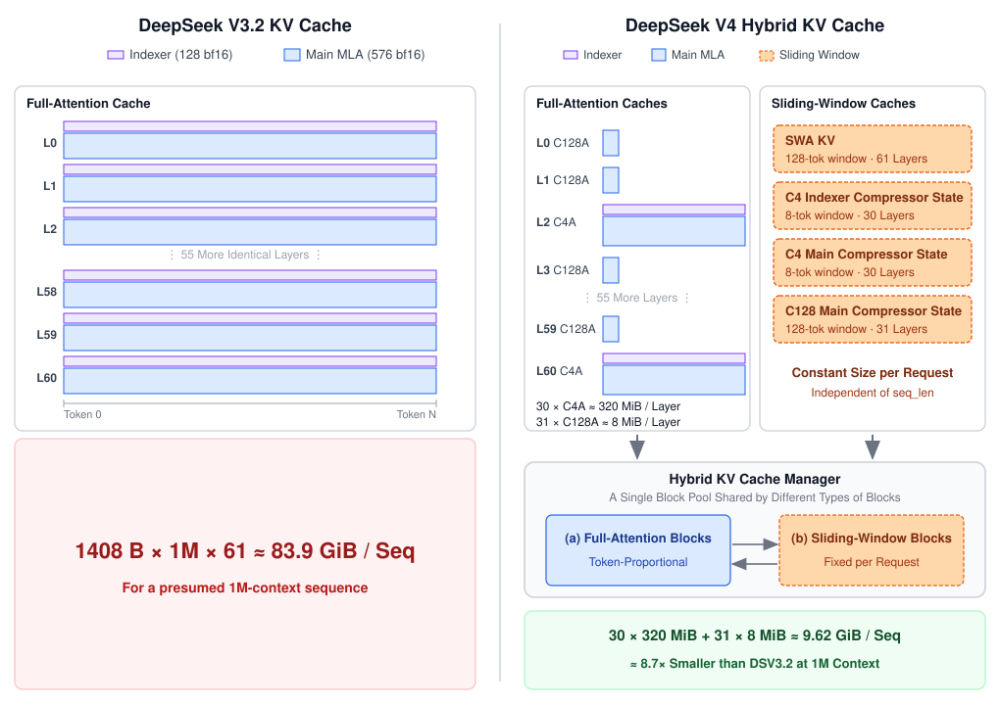
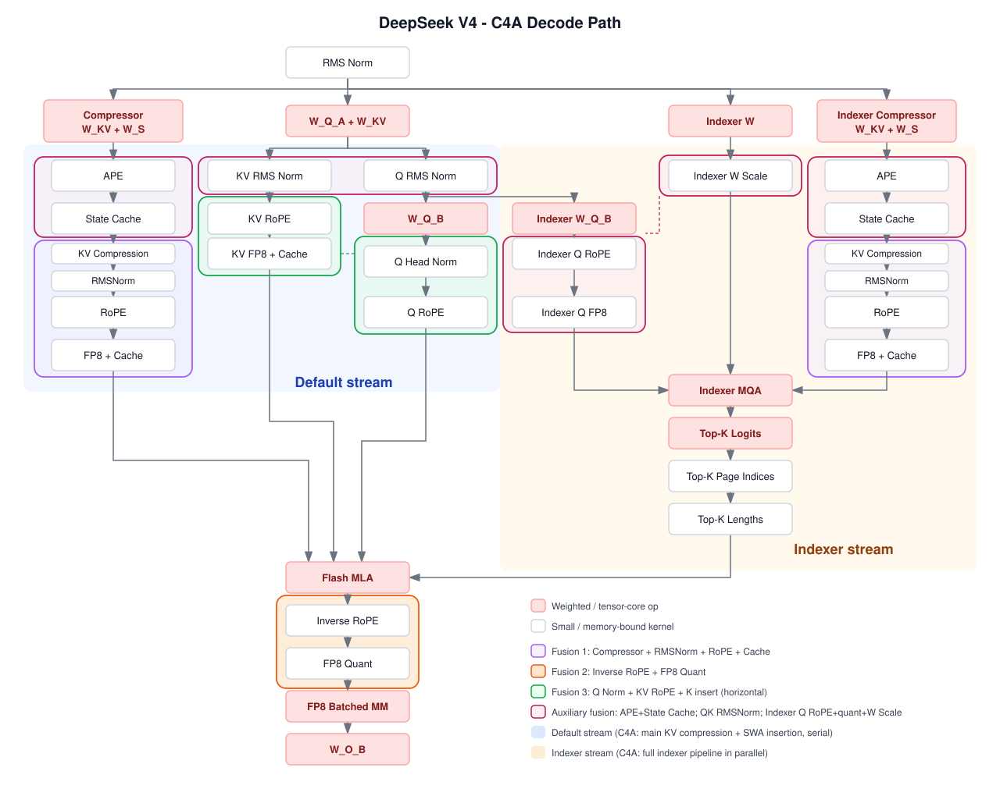

# DeepSeek V4 在 vLLM 里怎么侍候

英文对照：`en/vllm/blog/architecture/deepseek-v4.md`  
原文：https://vllm.ai/blog/2026-04-24-deepseek-v4  
V4-Pro 1.6T / V4-Flash 285B，1M 上下文。镜像 `vllm/vllm-openai:deepseekv4-cu130`。

V4 的 attention 同时压 KV、压计算：K/V 共享（再 inverse RoPE）、`c4a` / `c128a` 跨 token 压缩、DSA 只看 top 压缩位、128 token 滑窗保住局部。1M、bf16 估计约 9.62 GiB/序列，相对 V3.2 风格栈大约 8.7×；线上 indexer 用 fp4、attention cache 用 fp8，再砍大约一半。

本地图（原文版权仍归原站；学习对照用）：

## 分配器三招

异构压缩比会把 paged KV 撕碎。vLLM：

1. **逻辑 block 一律 256 个原生位置**。`c4a` 物理 64 条压缩项，`c128a` 物理 2 条。slot / 调度 / prefix-hit 都用这把尺。
2. **压缩机残差当滑窗 KV**。C4 窗口 8、C128 窗口 128。Prefix cache 和 disagg 不用另开残差通道。
3. **五种 cache 收成三个 page-size 桶**，避免跨池碎片。

Prefill 仍 bf16 KV；decode 部分 token-wise fp8。CUDA graph、MTP、P/D 跟 SWA 同一套抽象。

## 热路径

三融合：compressor+RMSNorm+RoPE+insert（约 1.4–3×）；inverse RoPE+fp8 quant（约 2–3×）；Q norm + KV RoPE + K insert 水平融合（约 10–20× vs 朴素）。Indexer / 主压缩 / SWA insert 分 CUDA stream。官方建议：`--kv-cache-dtype fp8`、`--block-size 256`、EP+DP、FP4 indexer。Manifold-Constrained Hyper-Connections 和 MoE 改动原文略过——相对 attention 好接。

和 [FP8 KV](../performance/fp8-kvcache.md)、[Wide-EP](../serving/large-scale.md) 一起读。
