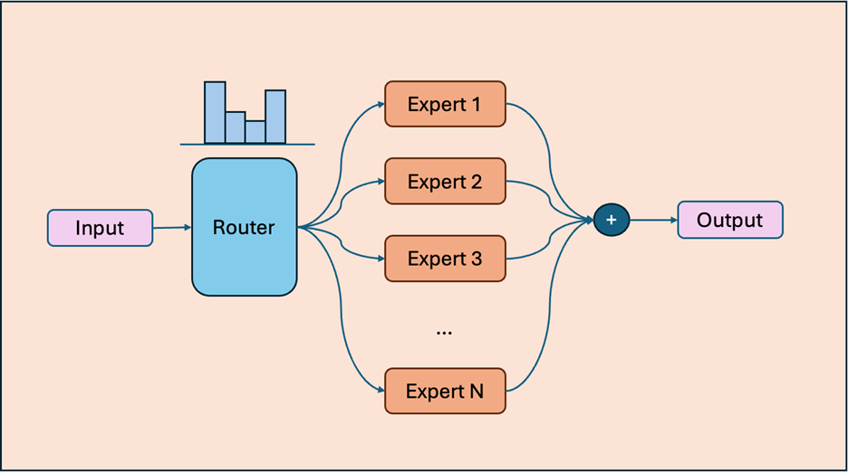
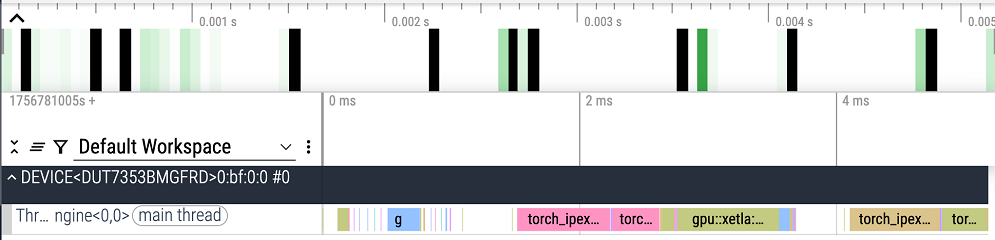
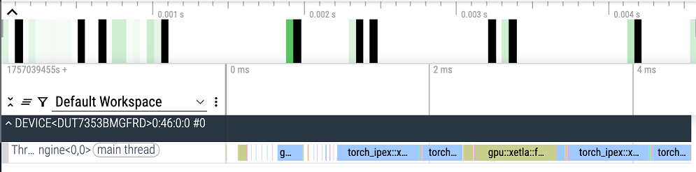
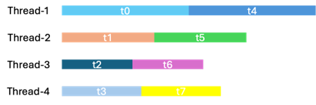
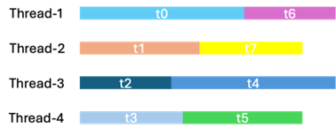
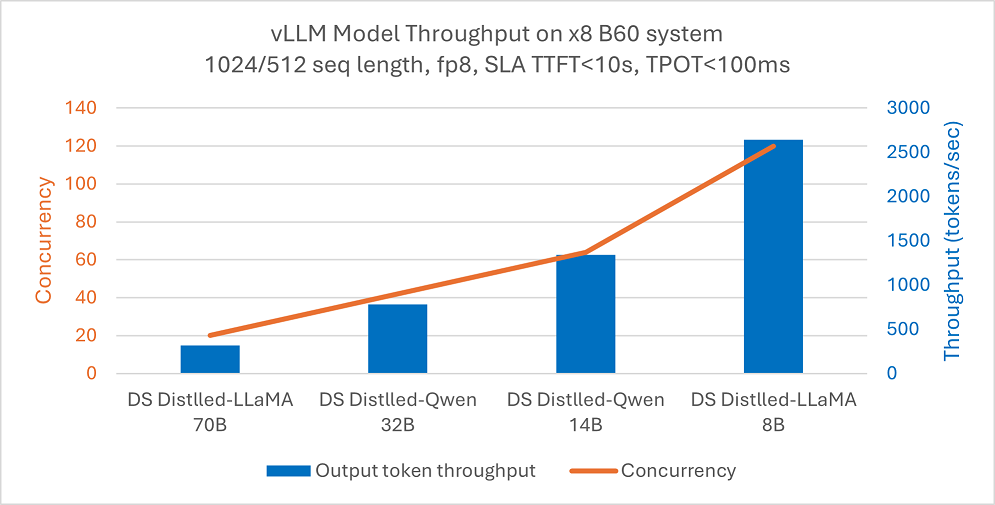
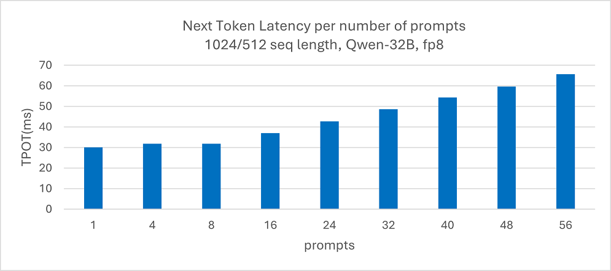
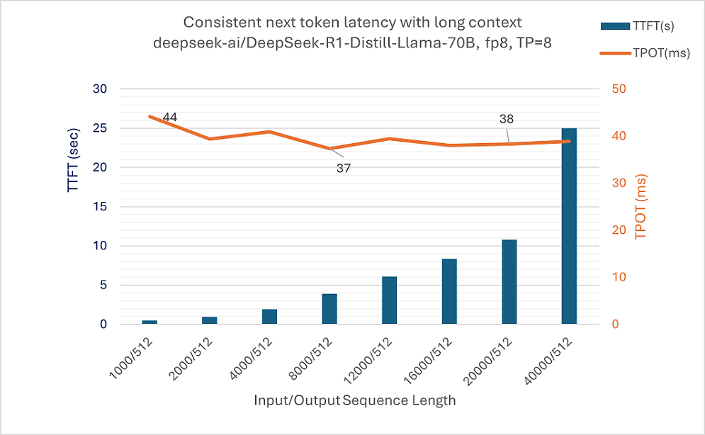

# Intel Arc Pro B：把 MoE 专家塞进一张消费级卡

英文对照：`en/vllm/blog/architecture/intel-arc.md`  
原文：https://vllm.ai/blog/2025-11-11-intel-arc-pro-b  
2025-11-11。XPU / SYCL。数字是当时 4–8 张 Arc Pro B60 上的演示。

专业卡、大显存、能叠多卡。vLLM 在 B 系列上列了一长串：DeepSeek 蒸馏、>50K 上下文、embedding / rerank / pooling、多模态、MoE、逐层在线量化、DP / TP / PP、`torch.compile` 的 FP16/BF16、n-gram / EAGLE / EAGLE3、async scheduling、P/D、LoRA、sleep mode、structured output、tool calling。Sleep 见 [sleep-mode](sleep-mode.md)；投机见 [spec-decode](../performance/spec-decode.md)；卡从主干请出去见 [hardware-plugin](hardware-plugin.md)。


本地图（原文版权仍归原站；学习对照用）：

















## MoE：不要一只一只 GEMM

朴素路径：gate 完再按专家 `for` 循环发 GEMM——launch 税、等路由、设备空转。他们做 **persistent zero-gap kernel**，号称 B60 上超过硬件容量 **80%**。

1. **单 kernel、persistent loop。** 不按路由结果反复 launch。B60 20 个 XeCore，每核两组 SYCL group。
2. **动态抢活。** 专家负载不均，固定 stride 会把间隙攒到约 15% MoE GEMM 时间。原子计数器抢下一块，谁闲谁接下。
3. **MXFP4 → BF16 预打包。** 4-bit 友好 layout 加载效率最多约 **+30%**。转换：`Bitcast-bf16 ((x << 12) >> 6 & 0x81c0) * 2^126`。

## 数字（演示）

8× B60：DeepSeek 蒸馏 8B–70B FP8 吞吐见图；Qwen-32B 下一 token 延迟在负载下压在 **100 ms** 内；Llama-70B 单 batch、1K–40K 输入，TTFT / TPOT 靠 flash attention 沿序列维并行。GPT-OSS MXFP4：20b TP1 1024/1024 conc=75，TTFT **7.614 s**、TPOT **53.96 ms**、output **1210.74 tok/s**；120b TP4 同形状 conc=100，**1495.12 tok/s**。MLPerf Inference v5.1 Llama 8B 有性价比条目。

```bash
docker pull intel/vllm:0.10.2-xpu
vllm serve openai/gpt-oss-120b --dtype=bfloat16 --enforce-eager \
  --gpu-memory-util=0.9 --no-enable-prefix-caching \
  --max-num-batched-tokens=8192 --max-model-len=16384 --block-size 64 -tp 4
```

当时宿主 Ubuntu 25.04、KMD 6.14.0。MoE / gpt-oss 从 0.10.2 镜像起。
