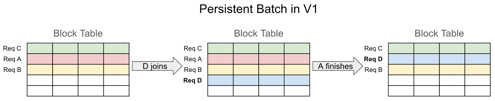
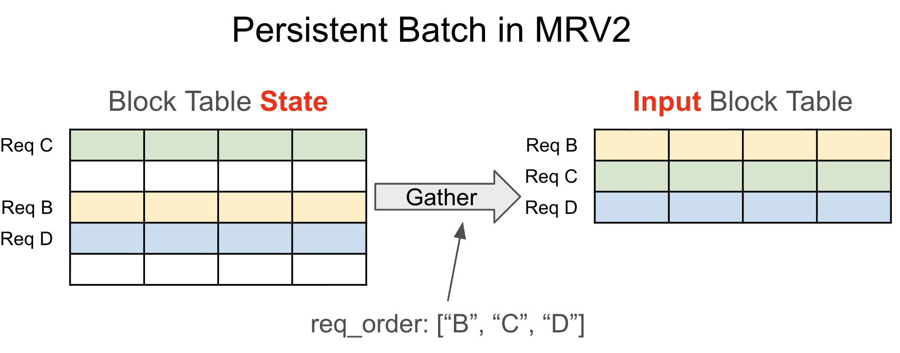
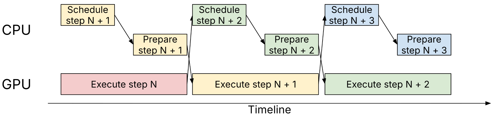
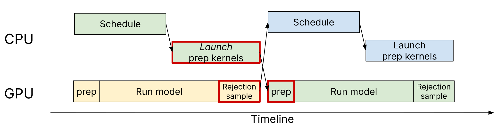
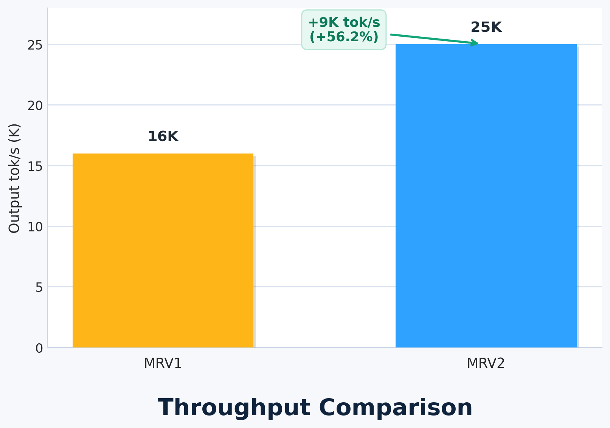
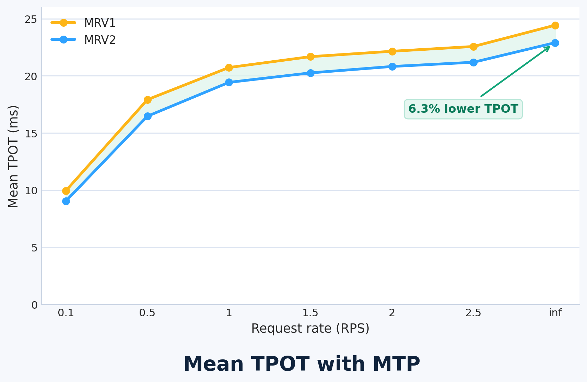

# Model Runner V2：给执行核换一块更干净的底板

英文对照：[en/vllm/blog/architecture/mrv2.md](../../../../en/vllm/blog/architecture/mrv2.md)  
原文：https://vllm.ai/blog/2026-03-24-mrv2  
2026-03-24。署名 **vLLM Team**。学习重写，不是官方译本。V1 是引擎骨架；MRV2 是 **model runner** 的重写，不是整台引擎。用户 API 不变。当时还不是默认：

```bash
export VLLM_USE_V2_MODEL_RUNNER=1
```

他们计划不久后默认打开。文中「还不支持」以 **v0.18.0** 为准，会过时。装最新构建，设环境变量，Python API 或 `vllm serve` 照旧。读完 V1 / [Anatomy](anatomy.md) 再读这一篇：骨架立住以后，下一步瓶颈又回到「每一步怎么把 batch 摆上 GPU」。

**原文 TL;DR：**

- 三条原则：**modular**（模型逻辑离开公共路径）、**GPU-native**（记账上 GPU）、**async-first**（CPU/GPU 重叠是设计约束）。
- Persistent batch：活着的请求占稳定一行，每步 **gather**；不再用 `CachedRequestState`。输入准备用 Triton 在 GPU 上长 `input_ids`、`positions`、`query_start_loc`、`seq_lens`。
- Async + 投机解码不再插 CPU–GPU 同步；输出走旁路 CUDA stream。Triton sampler：Gumbel-Max、top-k logprobs、prompt logprobs 切块、`idx_mapping`。
- `ModelState` 把模型相关逻辑抽走。旧 `gpu_model_runner.py` **>6,700** 行；MRV2 最大文件 **<1,300**。
- Qwen3-0.6B × 1×GB200：吞吐 **16K → 25K**（**+56.2%**）。`GLM-4.7-FP8` MTP=1、4×GB200：mean TPOT **−6.3%**。v0.18.0 缺口：线性注意力、Eagle/Eagle3/MTP 以外的投机、EPLB、DBO、logits processors、LoRA。

原文分节：Why Model Runner V2? → What's New in Model Runner V2?（1. A Better Persistent Batch Design and GPU-Native Input Preparation / 2. Async-First Design / 3. A Triton-Native Sampler / 4. Stronger Modularization）→ Performance → Limitations and Current Status → Getting Started → Acknowledgments。

和去年的 V1 一样，这是从用户与社区的教训里长出来的架构升级。他们把 persistent batch、async scheduling、输入准备、采样重新想过一遍，三条原则：

- **Be modular。** 把模型相关的逻辑从公共路径里隔离。
- **Be GPU-native。** 记账搬到 GPU 上。
- **Be async-first。** CPU/GPU 重叠是设计约束，不是补丁。

目标简单：更好的代码，更好的成绩。

## Why Model Runner V2?

V1 发布后，runner 上继续叠特性和优化。单独看每块都有用，合在一起开始缠——尤其当 **async scheduling** 和 **投机解码** 坐进执行模型的正中央。

反复出现的痛：

- **Tangled persistent batch state。** Persistent 状态和每步输入绑死。增删改序比该有的复杂。
- **Fragile async execution。** Async 是后装到 V1 runner 上的。许多特性要绕路才能跟它共存，逻辑不自然、也不合理地复杂。
- **CPU-bound bookkeeping。** 输入准备和采样是许多细碎的 CPU 手术。GPU 越快，这些小动作越显眼。
- **Difficult extensibility。** 新模型、新特性越来越难干净地接上。

MRV2 用更干净的状态归属和更明确的抽象来回答这些。

## What's New in Model Runner V2?

### 1. A Better Persistent Batch Design and GPU-Native Input Preparation

vLLM 为 batching、paged attention、采样参数做大量记账。历史上多是 CPU 上许多小手术。

V1 已经引入 persistent batch：相邻两拍通常很像，增量改缓存状态，比每步从零长出大张量便宜。但 V1 把 persistent 状态**直接**当模型和 sampler 的输入，布局约束别扭，记账也跟着绕。



**Figure 1。** V1 的 persistent batch。请求顺序和 block table 布局绑在一起，增删就要复杂重排。

**MRV2 把 persistent 请求状态和每步输入张量拆开。** 每个活着的请求在固定大小的状态表里占**稳定的一行**；每步按当前顺序 **gather** 出这一拍需要的张量。增量更新的好处还在，一大类状态管理的复杂度没了。也不再需要 `CachedRequestState` 那种备份——活着的请求不再依赖脆弱的整表重排。



**Figure 2。** MRV2 的 persistent batch。稳定的状态表独立于每步布局；gather 产出排好序的 input block table。

输入准备用 **Triton kernel** 搬到 **GPU**。请求状态大体留在设备上。`input_ids`、`positions`、`query_start_loc`、`seq_lens` 直接在 GPU 上长出来。三件具体的好处：

- **更少 CPU** — 少 Python、少 CPU 张量手术。
- **更简单的代码** — 不再被 CPU 侧张量操作的约束牵着走。
- **更好的 async + 投机解码** — GPU 上的准备可以直接吃设备上的 rejection-sampling 结果，**不必同步**（下一节）。

### 2. Async-First Design

Async scheduling 已是地基：调度器和 worker 在 GPU 跑第 **N** 步时准备 **N+1**，host 和 device 重叠。V1 已经支持，但是后装，不是一等设计约束。



**Figure 3。** V1 的异步调度——CPU 调度并准备下一步，GPU 执行当前步。

MRV2 把它当成核心假设，目标是：所有**支持的**模型 / 特性组合，CPU 与 GPU 之间 **零同步**。

V1 里难看的那对组合——async scheduling **加上**投机解码——在这里是顺出来的：准备用的 kernel 在设备上直接消费 rejection 结果。每步输出走**另一条 CUDA stream** 异步回 CPU，跟主计算流解开。结构化输出 + 投机解码也走同一条路。



**Figure 4。** MRV2 的 async + 投机解码。GPU 侧的 prep 直接吃 rejection 结果，不再插入 CPU–GPU 同步点。

### 3. A Triton-Native Sampler

采样重做，Triton kernel，显存和数值都更好控：

- **Gumbel-Max** kernel — 不必物化整份 softmax；kernel 内**无状态 RNG**。
- **更省的 top-k logprobs** — 先找 top-k logits，只给入选者算 logprobs。
- **更省显存的 prompt logprobs** — 更细的切块，包括**同一条 prompt 内部**再切。
- **投机解码** — kernel 里用 `idx_mapping` 间接寻址，不必为每个 logits 向量膨胀请求状态。

峰值显存下降，采样参数更好组合。

### 4. Stronger Modularization

架构太多，旧 runner 把复杂度都吞进去了。MRV2 抽出 **`ModelState`**：

```python
class ModelState(ABC):
    def add_request(self, ...):
    def remove_request(self, ...):
    def get_mm_embeddings(self, ...):
    def prepare_inputs(self, ...):
    def prepare_attn(self, ...):
    def prepare_dummy_inputs(self, ...):
    ...
```

`ModelState` 是模型相关逻辑的接口——多模态 embedding、额外模型输入、attention metadata、CUDA graph capture——主 runner 只管公共路径。用户和贡献者常抱怨的那句：vLLM 支持太多模型，共享代码像迷宫——只关心 DeepSeek、Qwen、Kimi 或某一家内模的人，不必再读完整座迷宫。

文件也拆了。旧 `gpu_model_runner.py` 超过 **6,700** 行；MRV2 最大文件压到 **1,300** 行以下。

## Performance

不只是打扫。很小的模型 × 很快的卡，好让 host 开销显得胖。

**Qwen3-0.6B on 1×GB200：** 把输入准备卸到 GPU，吞吐 **16K → 25K** output tok/s，大约 **+56.2%**。



**Figure 5。** MRV1 vs MRV2，Qwen3-0.6B，1×GB200。MRV2 **25K** output tok/s，MRV1 **16K**，**+56.2%**。

**投机解码：** `GLM-4.7-FP8`，**MTP=1**，**4×GB200**，mean TPOT 大约 **−6.3%**（跨请求速率）。来自「打开 spec decode 也不再插入 CPU–GPU 同步点」。



**Figure 6。** mean TPOT，`GLM-4.7-FP8`，MTP=1，4×GB200。MRV2 跨请求速率低 **6.3%**。

他们预期：当 serving 把 async scheduling、投机解码、多模态预处理、越来越异构的 model state 叠在一起时，这块底板会更值钱。

## Limitations and Current Status

当时仍是实验性的，还在做。设计干净了，早期数字好看，功能还不齐。**v0.18.0** 不支持：

- 线性注意力（Qwen3.5、Nemotron 3 Super）
- Eagle / Eagle3 / MTP **以外**的投机方法
- **EPLB** 和 **DBO**
- logits processors
- **LoRA**

完整清单在[设计文档第二页](https://docs.google.com/document/d/1gFqtDkcoqhy9j-X0ndshzbhapX1uNey1-wBENwGPI80/edit?usp=sharing)。

质量门槛：V1 特性搬进 MRV2 时要从第一性原理重想，不要把复杂度机械地抄过来。所以碰 MRV2 的改动可能会比往常慢——抄进来，就白拆了。

## Getting Started

1. 最新 vLLM 构建。
2. `export VLLM_USE_V2_MODEL_RUNNER=1`。
3. 现有 API——Python 或 `vllm serve`。没有面向用户的 API 变更。

## Acknowledgments

Woosuk Kwon、Nick Hill、Giancarlo Delfin、Santino Ramos（Inferact）；Wentao Ye、Zhanqiu Hu、Lucas Wilkinson（Red Hat）；Haoran Zhu（Alibaba）。
