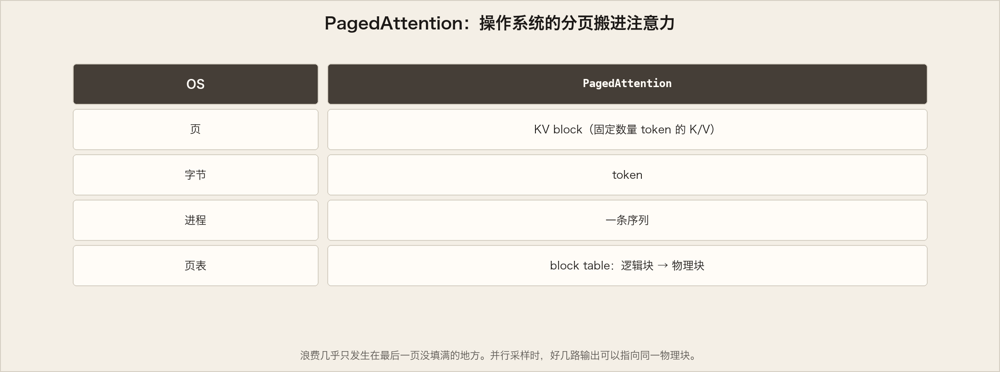

# vLLM 立项：用 PagedAttention 让 serving 便宜下来

英文对照：`en/vllm/blog/architecture/paged-attention.md`  
原文：https://vllm.ai/blog/2023-06-20-vllm  
作者：Woosuk Kwon、Zhuohan Li（UC Berkeley），2023-06-20。

LLM 答应改写所有行业。真正把模型端上桌，却常常慢得像在昂贵的硬件上散步。vLLM 把这件事说成一件开源库的事：快的推理，和能给人用的 serving。核心不是换模型结构，而是一种管 KV 的注意力算法——**PagedAttention**。立项时他们写：相对 HuggingFace Transformers，吞吐最高大约 **24×**；相对当时的 SOTA HuggingFace TGI，最高大约 **3.5×**。

两个月里，它已经在 Chatbot Arena 和 Vicuna Demo 上值班。LMSYS 那种算力并不宽裕的研究组，靠它才付得起「让几百万人排队说话」。

数字是 2023 年那一轮：ShareGPT 采样长度，LLaMA-7B on A10G、LLaMA-13B on A100-40GB。吞吐图是当时的实测，下面动画改成学习图。


## 吞吐：一个人要一个答案，和一个人要三个答案

每个请求只要 **一份** completion：vLLM 相对 HF **14×–24×**，相对 TGI **2.2×–2.5×**。

每个请求要 **三路并行** 输出：相对 HF **8.5×–15×**，相对 TGI **3.3×–3.5×**。并行采样更吃 KV；PagedAttention 正好会分享 prompt 的那几页。

## 瓶颈是记忆，不是算力

自回归每吐一个字，都要把已经算过的 K/V 留在 GPU 上。这份 KV cache：

- **大：** LLaMA-13B 一条序列可以到 **1.7GB**。
- **活：** 长度随人的话变，没法预先量体裁衣。

当时的系统因为碎片和超额预留，浪费 **60%–80%** 的显存。屋子看起来很大，真正能坐下的人很少。

## PagedAttention：把操作系统的分页搬进注意力

经典 OS：进程看见连续的虚拟地址，物理页可以东一块西一块。PagedAttention 把这个比喻写进注意力：



| OS | PagedAttention |
|---|---|
| 页 | KV **block**（固定数量 token 的 K/V） |
| 字节 | token |
| 进程 | 一条序列 |
| 页表 | **block table**：逻辑块 → 物理块 |

注意力 kernel 按表去取块，不必要求 KV 在物理上连续。物理块按需分配：新 token 长出来，再要一页。浪费几乎只发生在**最后一块没填满**的地方，实践中不到 **4%**。显存一紧，就能多塞几条序列，GPU 才真正忙起来——上面那些倍数，多半是从这里来的。

另一件礼物：**共享**。并行采样时，好几路输出共用同一段 prompt。block table 让不同序列指向同一物理块，再加引用计数和 **Copy-on-Write**。复杂采样（并行、beam search）的显存开销可以砍到大约 **55%**，吞吐再涨到大约 **2.2×**。beam search 从「实验室里玩得起」变成「服务里用得起」。

论文当时还在路上；技术细节指向 GitHub。后来的 Anatomy、V1、prefix cache，都还站在这张页表上。

## 沉默的英雄：Vicuna 和 Chatbot Arena

2023 年 4 月，LMSYS 放出 Vicuna，FastChat 最初用 HF Transformers 当后端。流量翻了几倍，HF 成了门厅里的堵车。FastChat-vLLM 接上之后，内部微基准相对最初的 HF 后端可以到 **30×** 吞吐；线上高峰大约 **5×** 的请求被接住。

4 月中到 5 月，Arena 上最热的 Vicuna、Koala、LLaMA，前端 FastChat、后端 vLLM。大学赞助的那几张卡，撑住了百万用户。GPU 用量砍掉大约 **50%**。日均约 **3 万** 请求，峰值 **6 万**。一半以上的 Arena 请求，走的是 vLLM。

## 怎么用（立项时的那两行）

```bash
pip install vllm
```

离线：

```python
from vllm import LLM
prompts = ["Hello, my name is", "The capital of France is"]
llm = LLM(model="lmsys/vicuna-7b-v1.3")
outputs = llm.generate(prompts)
```

在线（当时的入口；现在更常见的是 `vllm serve`）：

```bash
python -m vllm.entrypoints.openai.api_server --model lmsys/vicuna-7b-v1.3
```

`curl` 格式跟 OpenAI completions 一样。

下一篇必读是 [Anatomy](anatomy.md)：同一张页表，长成了一整座城。立项文只负责告诉你，城墙为什么要按页来砌。
