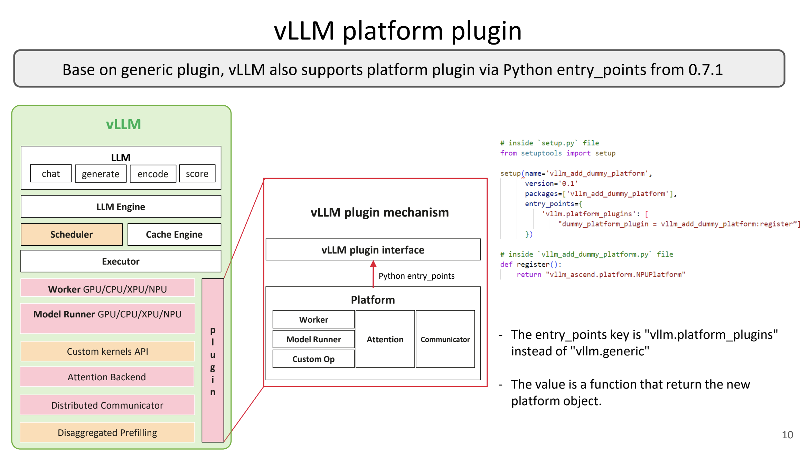

# 插件系统：改 vLLM 不必养一座 fork

英文对照：[en/vllm/blog/architecture/plugin-system.md](../../../../en/vllm/blog/architecture/plugin-system.md)  
原文：https://vllm.ai/blog/2025-11-20-vllm-plugin-system  
2025-11-20。先发在 Medium。和两周一次的发布节奏对着读：fork 会变成全职工作。

想改调度、KV、模型执行，三条旧路都不舒服。能上游就上游。不能：自己 fork——vLLM 一周几百个 PR，rebase 会把人拖死。再不然 monkey patch：看起来不用分叉，实际上常常整类替换，十行改动拖出一整个模块，升级一次碎一次。

插件是第四条路：vanilla vLLM + 自己的包，用 Python entry point 挂上去。专有的、实验性的、来不及走社区评审的，都可以停在插件里。硬件那条专门的门见下一篇 [hardware-plugin](hardware-plugin.md)；AFD 已经走 `vllm.general_plugins`。

适用：自定义 scheduler、KV 行为、硬件、执行路径。不适合：改引擎心脏、又想跟主线每一周对齐——那种还是该上游或接受 fork 的税。

原文把坑写得很具体：fork 要不断 rebase、在变动最剧烈的区域解冲突、内部还要维护一份私有制品；monkey patch 常常「只改十行却替换整个类」，升级一次碎一次。插件把改动收成可安装的包，主线该两周发就两周发。Sleep Mode 的管理接口、KVConnector、WeightTransferEngine 都是「留一扇门，别改源码」的亲戚。

本地图（原文版权仍归原站；学习对照用）：

