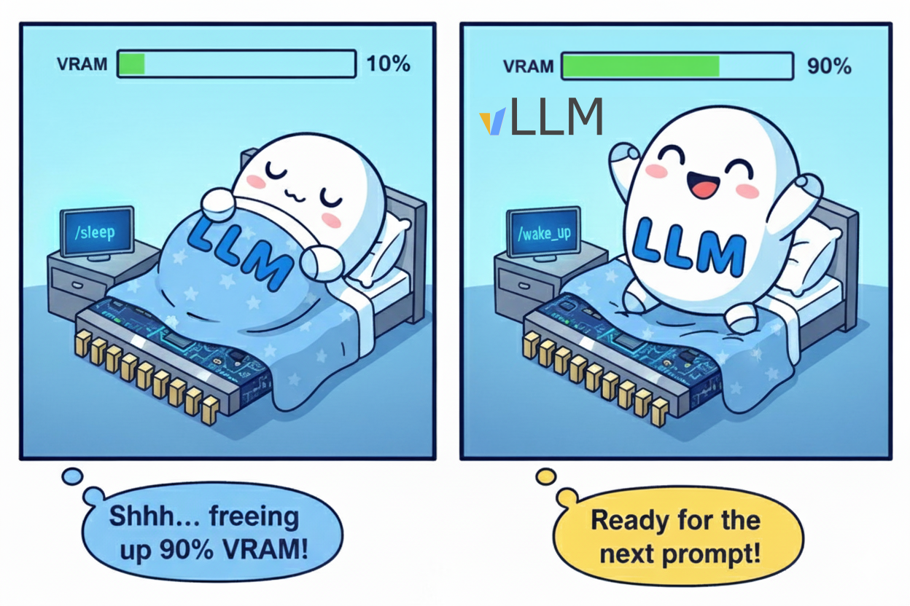

# Sleep Mode：换模型不必把房子拆了重建

英文对照：[en/vllm/blog/architecture/sleep-mode.md](../../../../en/vllm/blog/architecture/sleep-mode.md)  
原文：https://vllm.ai/blog/2025-10-26-sleep-mode  
2025-10-26。数字是 A100 / A4000、vLLM 0.11.0 上的演示。

两套都能装进一张卡、却装不进同一张卡：要么占双倍显存，要么每次切换 **30–100+ 秒** 冷加载。Sleep Mode 是第三条路——进程还活着，模型去冬眠。


本地图（原文版权仍归原站；学习对照用）：



## 两档

- **Level 1：** 权重卸到 CPU RAM，丢掉 KV。醒得最快。要够大的内存。
- **Level 2：** 权重也丢掉，CPU 上只留很小的 buffer（RoPE 一类）。几乎不占 RAM，醒的时候要从盘上再把权重搬回来。

两档都声称比完整 reload 快 **18–200×**，和 TP / PP / EP 一起用。即便权重加载已经很快，冷启动仍要付：CUDA allocator、CUDA graph 重捕获、DeepGEMM / FlashInfer / TorchInductor 的 JIT、第一轮 cache warmup。Sleep 把 2–4 留住。他们测到醒来后的第一次推理比冷启动快 **61–88%**——不是搬运变快了，是基础设施还在。

## 怎么用（当时）

`VLLM_SERVER_DEV_MODE=1`，`--enable-sleep-mode`。

```bash
curl -X POST 'localhost:8001/sleep?level=2'
curl -X POST 'localhost:8001/wake_up'
# Level 2 还必须：
curl -X POST 'localhost:8001/collective_rpc' \
  -H 'Content-Type: application/json' \
  -d '{"method":"reload_weights"}'
curl -X POST 'localhost:8001/reset_prefix_cache'
```

Level 1 不用 `reload_weights` / `reset_prefix_cache`。`/sleep` `/wake_up` `/collective_rpc` `/reset_prefix_cache` 是管理接口，只该出现在受信网络。

## 数字（演示）

A100，Qwen3-235B-A22B-FP8 TP4 与 Qwen3-Coder-30B TP1 来回切，Level 1，`FULL_AND_PIECEWISE`。切换本身大约 **18–20×** 快于冷加载。A4000 上 0.6B 与 Phi-3-vision：醒来 **0.1–0.8 s**，相对冷启动 **58–203×**；五次切换总时间大约 85 s vs 226 s。

同一套小模型、A100：无 Sleep 357 s；Level 1 **112.6 s**（wake 0.26 / 0.82 s）；Level 2 **124.6 s**（0.85 / 2.58 s）。频繁切换、内存够 → L1；内存紧、模型多 → L2。

[torch.compile](torch-compile.md) 把启动变贵；Sleep 承认这件事，选择**不要把进程杀死**。多 LoRA 挤在同一套权重上是另一条路（AIBrix 的高密度 LoRA）；Sleep 是「整模替换、进程留下」。
