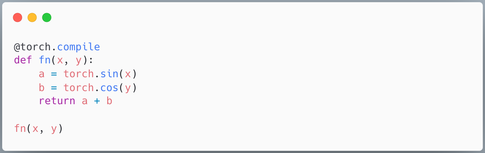
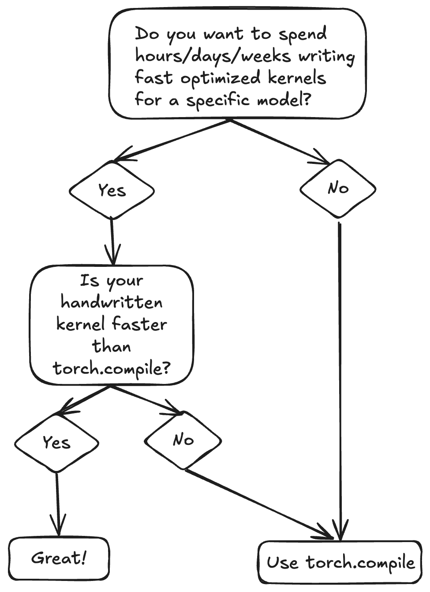
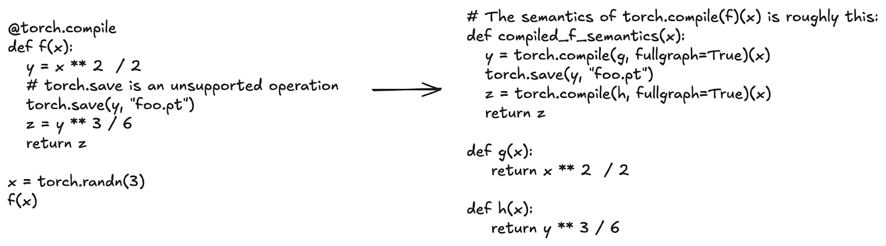
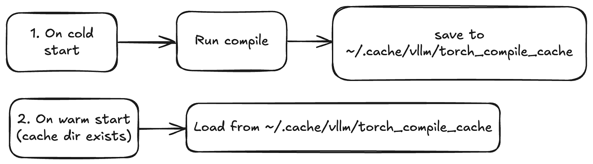
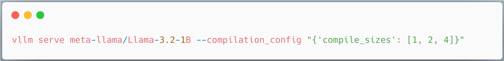
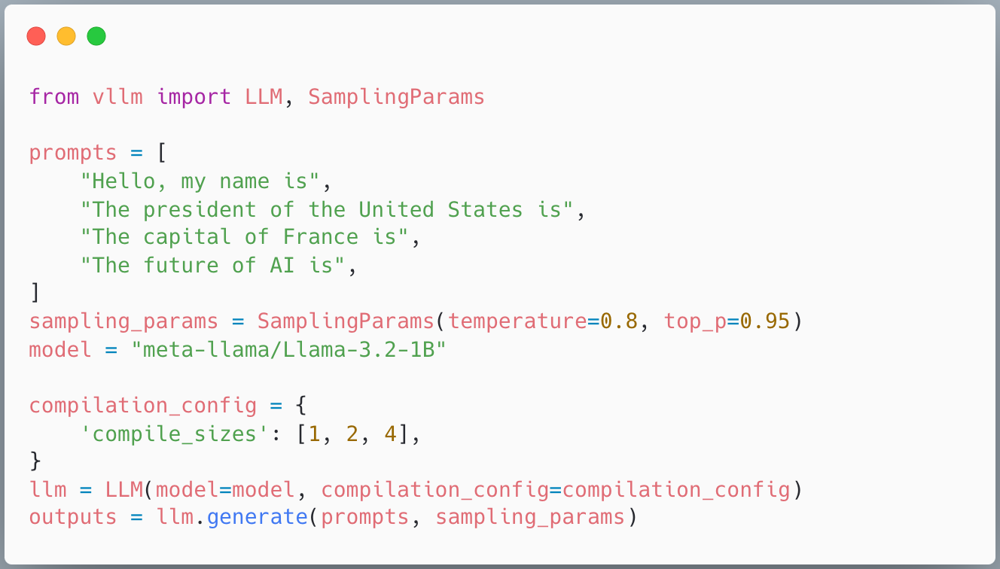
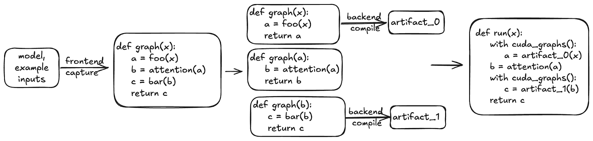
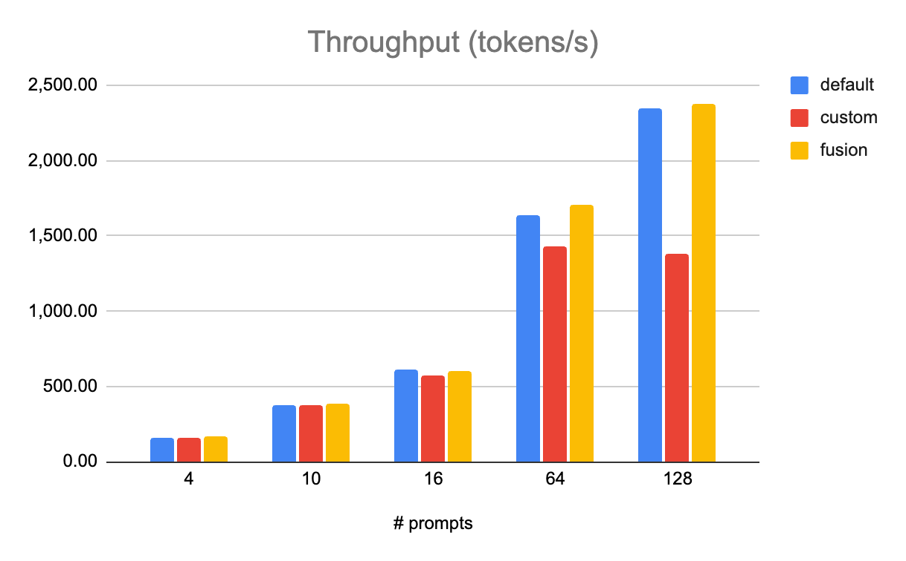
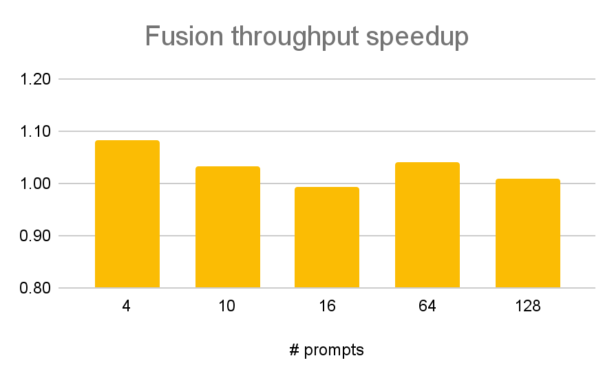

# torch.compile：把优化从模型作者手里拿走

英文对照：[en/vllm/blog/architecture/torch-compile.md](../../../../en/vllm/blog/architecture/torch-compile.md)  
原文：https://vllm.ai/blog/2025-08-20-torch-compile  
2025-08-20。从 Red Hat 主办、vLLM committer 与 Berkeley 团队一起开的双周 office hours 整理（深潜 + Q&A；录像在他们的 YouTube playlist）。`optimization.md` 里的 `-O0`～`-O3`、`--enforce-eager`，底下就是这篇。

手写 kernel 能摸到天花板，但每一种模型、每一家硬件都要付一次税。**torch.compile** 是 JIT：给函数或 `nn.Module` 套一层，前端把张量运算收成图，后端再吐出融合过的 kernel。对 vLLM 它不只是加速器。原则是：**模型定义保持干净，优化发生在编译时。** 几百个架构不必每个都去拆抽象。

本地图（原文版权仍归原站；学习对照用）：



















## 它是什么

用法就是装饰器：套在函数、`nn.Module` 或其他 callable 上。Figure 1：`fn` 里所有 pointwise 收成一个 fused kernel。捕获和编译都是 JIT；捕获条件变了（输入 shape 一类）就可能重编。

可以当 **kernel 生成器**（只编一个函数），也可以编整份模型或某个子模块。放在哪一层，看模型结构和能忍受多久的编译；当时的建议指向 PyTorch troubleshooting 文档。

## 为什么要用

给每个模型写自定义 CPU/CUDA op，慢，而且要懂性能和硬件。torch.compile 的承诺是：几乎不写 kernel，也能走到峰值附近的一条体面基线。他们引用 PyTorch 开源 [TorchBench](https://hud.pytorch.org/benchmark/compilers)：**80+** 个模型上 **1.8–2×** geomean。那是「先有一条不丢人的基线」，不是替你写完 FlashAttention。Figure 2。

## 两段管道

细节见 [PyTorch 2 论文](https://docs.pytorch.org/assets/pytorch2-2.pdf)。

### 前端：TorchDynamo（收图）

自定义字节码解释器，抽出只含 Tensor op 的直线 [`torch.fx`](https://docs.pytorch.org/docs/stable/fx.html) 图。看见它不会的东西（磁盘 I/O 一类）就 **graph break**：当前图结束，跑那条不支持的语句，再开一张新图。每张图交给后端。

Figure 3：`torch.save` 不会编。给 `f` 套 compile，等价于分别编 save 前和 save 后的计算，而不是教编译器写文件。

### 后端：TorchInductor（优化并吐 kernel）

图上来了：融合、降低到 C++ / Triton / 别的。文中列的能力：

- 融合 pointwise 和 reduction
- Autotune（block size 一类）
- Matmul 在 **cuBLAS / Triton / CUTLASS** 之间选，并做 prologue / epilogue fusion
- 用 CUDA Graphs 缓存并回放 launch

CUDA Graphs 要求静态地址、纯 CUDA。编译器会在不支持的 op 处切开，自己管静态输入缓冲。

## vLLM 怎么接

V1 在线 / 离线**默认开**。关掉：`-O0` 或 `--enforce-eager`。设计页：[vLLM torch.compile](https://docs.vllm.ai/en/latest/design/v1/torch_compile.html)。

### Compilation cache

冷启动把 FX 图和 Triton kernel 写进默认目录 `~/.cache/vllm/torch_compile_cache`；热启动再读。`VLLM_DISABLE_COMPILE_CACHE=1` 可关，删目录也行。

同一环境的机器之间可以复用这份 cache。Autoscaling：先烤一次，再分给新实例。Figure 4。

### 动态 batch 与特化

默认一张 **dynamic batch** 的图伺候所有 batch size。知道自己只会跑 1 / 2 / 4 时：

```text
compile_sizes: [1, 2, 4]
```

按这些**静态**尺寸编译，还可以多做一点 autotune。Figure 5。

### Piecewise CUDA Graphs

不是所有 op 都能进 CUDA graph（[cascade attention 就不行](https://docs.vllm.ai/en/latest/design/v1/torch_compile.html#full-cudagraph-capture)）。vLLM 把图画成 CUDA-graph-safe 与 unsafe 两段，分开执行——后来 `-O1` 的 PIECEWISE、`-O2` 的 `FULL_AND_PIECEWISE`，底下就是这件事。Figure 6。

## 自定义 pass：为什么不改模型文件

模型作者按层、按模块写，正确优先。峰值常常要**跨模块**融合。vLLM 在 `torch.fx` 上改图，不改那几百份模型定义。

Pass 做两件事：把 memory-bound 的自定义 op（activation、量化）熔掉；补 Inductor 没有的优化（多出来的 no-op）。

### 例子：SiLU + Quantize

量化 MLP 里，SiLU 后面紧跟量化 down-proj（先 quant，再量化 matmul）。两个 op 单独都是 memory-bound。`ActivationFusionPass` 用 Inductor 的 pattern matcher 收成一个 fused kernel，吞吐最多大约 **+8%**。

Figure 7：Llama 3.1 **405B** FP8，**8× AMD MI300**。`fusion` 对 `default`（torch 的 RMSNorm/SiLU + 自定义 FP8 quant kernel）和 `custom`（未融合的自定义 kernel）。Figure 8：若量化那 **8%** 开销全被融合吃掉，那就是理论上限；有的点真摸到了。

**Office hours 之后的当时注：** 他们加了一条用 **torch op** 实现的量化。Inductor 编过之后比自定义 CUDA/ROCm kernel 还快，还能自己把这些 torch op 和 SiLU 熔掉——于是 **SiLU+quant、RMSNorm+quant 在部分路径上过时了**。凡是涉及**自定义 op**（attention、通信、sub-byte quant）的融合，仍然要自己写 pass。SiLU+Quant 只是为了和幻灯片对齐；别的 fusion pass 长得很像。

### 例子：Sequence Parallelism + Async TP

TP 的 GEMM 和同步分开跑，GPU 会在网上闲着。要重叠，就用 fused **GEMM+collective**（GEMM+`reduce_scatter`、`all_gather`+GEMM）。把 `all_reduce` 拆成 `reduce_scatter` + `all_gather`，再把 `all_gather` **推到 layernorm 之后**，才能和下一层 GEMM 熔在一起。

写进模型定义，要碰 vLLM 支持的每一个架构。社区做成两条 compile pass，CLI 打开，所有模型一起受益。文中引用最多大约 **+10%**。全文由 [@cascade812](https://github.com/cascade812) 落地；Async TP 背景见 [PyTorch 博客](https://discuss.pytorch.org/t/distributed-w-torchtitan-introducing-async-tensor-parallelism-in-pytorch/209487)。

### 当时已经有的 pass

**融合：**

- RMSNorm + Quant (FP8)
- SiLU-Mul + Quant (FP8)
- Attention + Quant (FP8) — 最多约 **7%**
- AllReduce + RMSNorm — 最多约 **15%**
- AllReduce + RMSNorm + Quant (FP8) — 最多约 **8%**
- AllReduce + RMSNorm + Quant (FP4) — 最多约 **10%**
- Sequence Parallelism & Async TP — 最多约 **10%**

**其它：**

- **No-op Elimination**：消掉或简化多余 reshape
- **Fix Functionalization**：手动把 `auto_functionalized` 收回去，免得多余拷贝和显存

**当时「即将到来」（文中的 PR）：**

- Attention + Quant (FP4)：[#22703](https://github.com/vllm-project/vllm/pull/22703)
- SiLU-Mul + Quant (FP4)：[#22448](https://github.com/vllm-project/vllm/pull/22448)

Pass 可以从 `PostGradPassManager`、CLI `--compilation-config`、或离线 config 加——不必改 vLLM 源码。

## 当时还在修的（他们说的「接下来六个月」）

**稳定性。** 大量私有（下划线开头的）compile API，为的是 serving 时要快、**不要中途重编译**。公共 API 当时不够用。于是出现奇怪的 cache 问题，某些模型还得关掉 vLLM 自己的 compile cache。PyTorch 编译组在把推理需要的能力收进稳定面。不少已经进了 **torch 2.8**，当时正要随 [#20358](https://github.com/vllm-project/vllm/pull/20358) 进 vLLM。

**启动时间。** 冷、热都是 autoscaling 的痛。跟 [startup-ux](https://github.com/vllm-project/vllm/issues?q=is%3Aissue%20state%3Aopen%20label%3Astartup-ux) 和 Slack `#feat-startup-ux`。计划重做 `-O`（[#20283](https://github.com/vllm-project/vllm/issues/20283)）：`-O<n>`，`n` 在 **0–3**。`-O0` 几乎不优化、起得最快；`-O3` 起得最慢、跑得最好。

**自定义 pass 机制：**

- 编多张 **dynamic shape** 的 `torch.fx` 图——按 batch 大小特化前向，不必为每个静态尺寸各编一次。[RFC](https://github.com/vllm-project/vllm/issues/23113)。
- 匹配自定义 op 的 **torch 实现**。现在要融合就得先打开自定义 op（`rms_norm`、quant……），可没熔上的自定义 op（quant 一层能跑 **4 次**）比 torch 等价物慢。当时已有能匹配 torch 实现的原型。

**实验性后端：** MPK/Mirage——整网一个 megakernel，比 CUDA Graphs 更少 CPU 和 launch 开销。[RFC](https://github.com/vllm-project/vllm/issues/22201)。

**其它当时在做的：** 更好的 [FlexAttention](https://github.com/vllm-project/vllm/issues/19765)（不同 attention 变体不必各写一个 kernel，底下用 compile 吐 Triton 模板）；Flash Attention v2 与 FlashInfer 的 [Full CUDA Graphs](https://github.com/vllm-project/vllm/pull/20059)（比 piecewise 更少开销）。

读完 [V1](v1-alpha.md) 和 [MRV2](mrv2.md) 再读这一篇：V1 决定默认编译；MRV2 把 runner 的记账搬到 GPU 上；compile 则是「不要为了融合去改每一份模型」。Slack：`#sig-torch-compile`。
