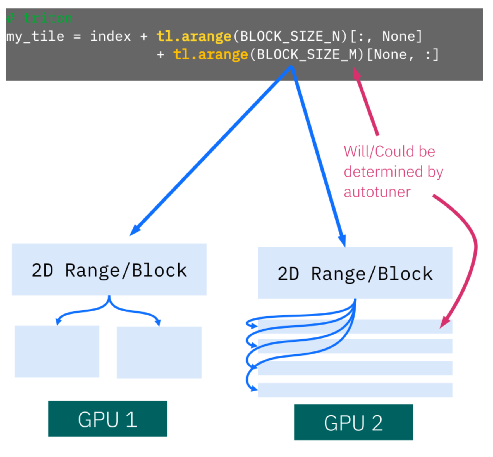
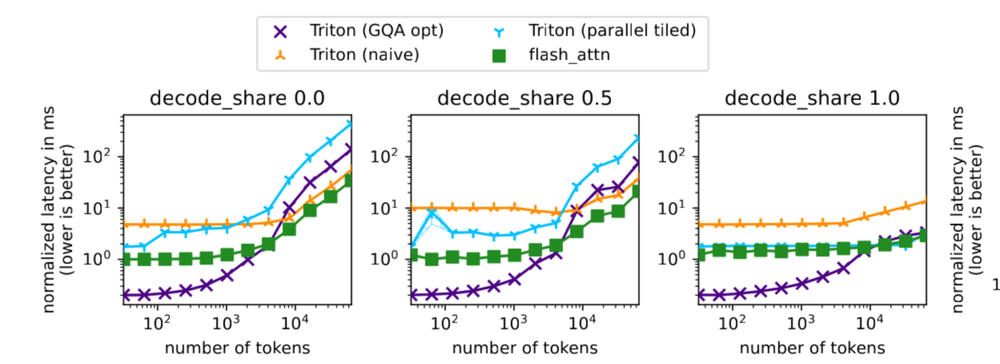
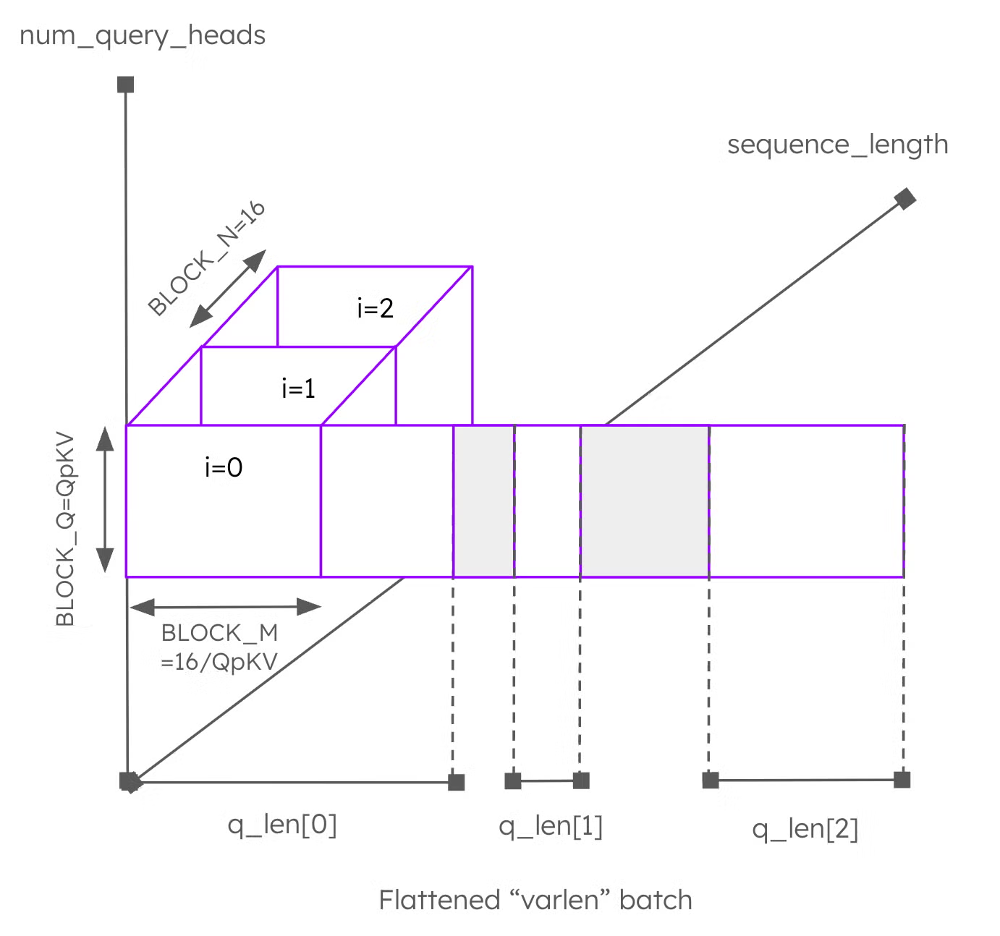
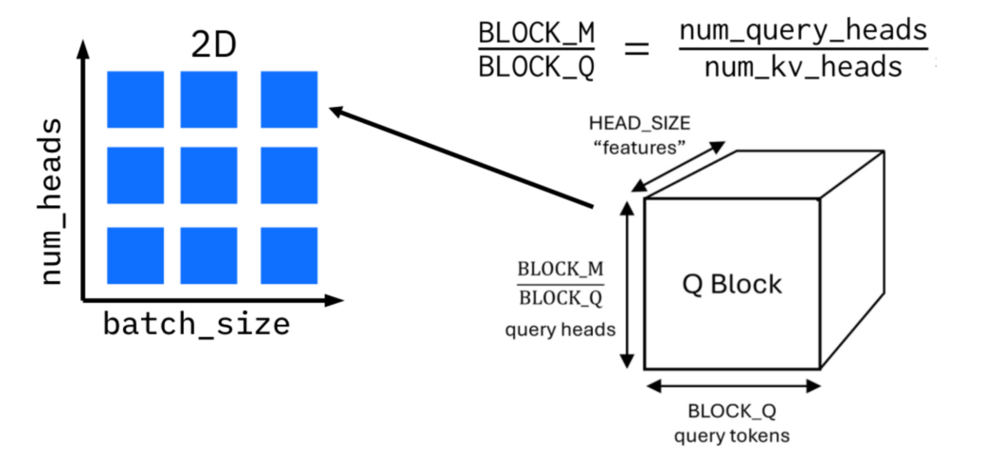
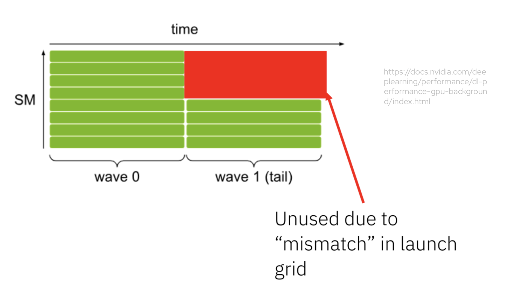
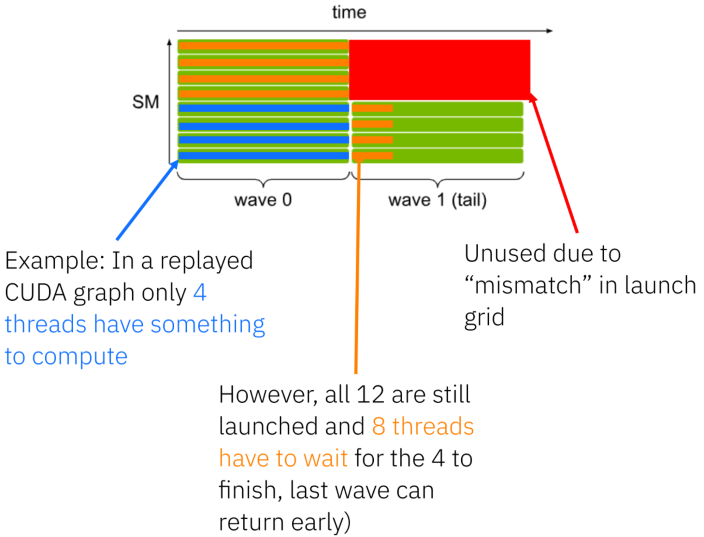
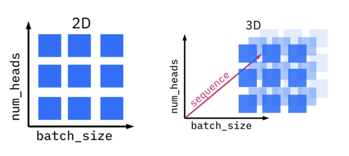
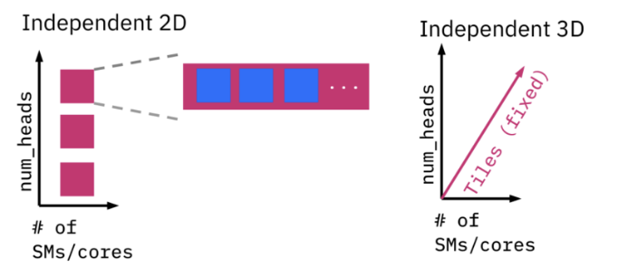
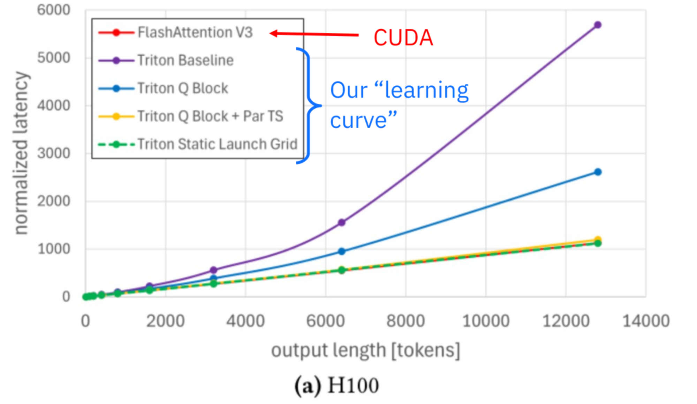
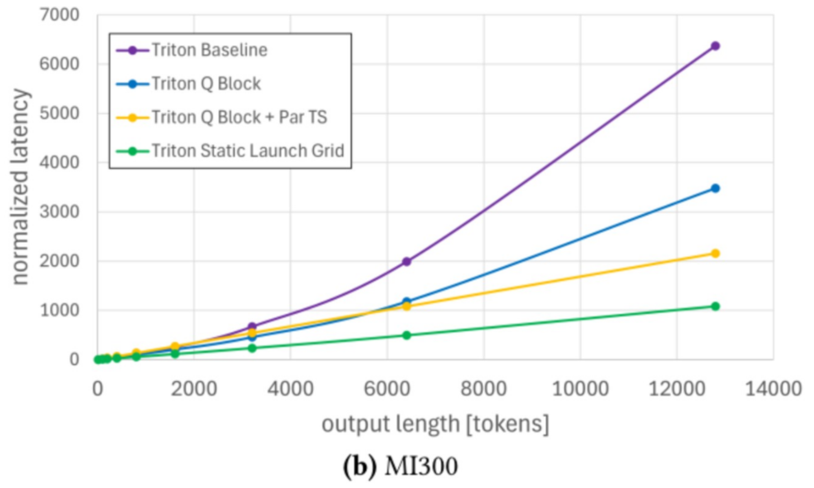

# Triton Attention：一份源码伺候三家卡

英文对照：[en/vllm/blog/architecture/triton-attn.md](../../../../en/vllm/blog/architecture/triton-attn.md)  
原文：https://vllm.ai/blog/2026-03-04-vllm-triton-backend-deep-dive  
2026-03-04。署名 **vLLM Team at IBM Research**。学习重写，不是官方译本。改编自 Red Hat 主持的 [vLLM Office Hours](https://www.youtube.com/watch?v=8QiM-i9ifFo&list=PLbMP1JcGBmSHxp4-lubU5WYmJ9YgAQcf3&index=1)，主讲 **Burkhard Ringlein**（IBM Research）。往期 / 报名：[playlist](https://www.youtube.com/playlist?list=PLbMP1JcGBmSHxp4-lubU5WYmJ9YgAQcf3)、[red.ht/office-hours](https://red.ht/office-hours)。这件事是 IBM Research、Red Hat、AMD 一起往上游推的。Attention backend 怎么选，见 [optimization](../../optimization/optimization.md)。ROCm 上后来的路由：[rocm-attention](rocm-attention.md)。

Kernel：[`vllm/v1/attention/ops/triton_unified_attention.py`](https://github.com/vllm-project/vllm/blob/main/vllm/v1/attention/ops/triton_unified_attention.py)（大约 **800** 行）。FlashAttention 3 大约 **7 万** 行。包装：[`triton_attn.py`](https://github.com/vllm-project/vllm/blob/main/vllm/v1/attention/backends/triton_attn.py)。论文：[*The Anatomy of a Triton Attention Kernel*](https://arxiv.org/abs/2511.11581)。Figure 1 里点名的 autotune 论文：[*GPU Performance Portability needs Autotuning*](https://arxiv.org/abs/2505.03780)。

**原文 TL;DR：**

- 一份 Triton 源码跑 NVIDIA / AMD / Intel；只依赖 **PyTorch + Triton**；永远随 vLLM 发货，是总能当上的 fallback。
- **Q block** 把 query head 和 query token 捆肥，喂饱 `tl.dot`。Decode 再靠 **parallel tiled softmax**（「3D kernel」）。
- CUDA graph 要固定 grid；他们改成 **persistent kernel**（文中当时：向 vLLM 的 PR 还 pending）。
- 2025 年末：Llama 3.1 8B、batch 1、输入 500。H100 长 Decode 达到 FA3 的 **100.7%**；MI300 相对更早实现约 **5.8×**。Helion 预览。

原文分节：Why Triton Helps vLLM → The Triton Attention Backend in vLLM → When the Triton Attention Backend Is Used → Writing a High-Performance Portable Paged Attention Kernel in Triton → Reminder: What the Paged Attention Kernel Does → Optimizing Tile Sizes for tl.dot Using Q Blocks → Adding Parallelization With Parallel Tiled Softmax → CUDA Graphs, Launch Grids, and GPU Execution Waves → From Variable Launch Grids to Persistent Kernels → Benchmarking Results → Preview: Paged Attention in Helion → Conclusion → Acknowledgments。

过去一年，IBM Research、Red Hat、AMD 把一份 Triton attention backend 做到 vLLM 上游：成绩要对标当时一流，还要跨厂商可移植。驱动是加速器越来越杂，高度特化的 kernel 养不起。

下文先讲 [Triton](https://github.com/triton-lang/triton) 为什么适合 [vLLM](https://github.com/vllm-project/vllm)，这份 backend 是什么、什么时候会用到，再进 paged attention kernel。沿路：tile、并行、CUDA graph、bench，最后一瞥 Helion。

## Why Triton Helps vLLM

vLLM 想在平台、模型、执行策略上都尽量快：多家加速器、好几代卡、许多结构，以及 batch、长度、attention 形态都不一样的负载。

一条路是为每种模型、每代 GPU 再手写一份高度特化的 kernel。有效，但养不起。Hopper、Blackwell、MI300、Intel，再加以后的卡，几百份 kernel 会把人拖死。

Triton 后端赌的是 **性能可移植**：kernel 自己去适应脚下的硬件。

[Triton](https://github.com/triton-lang/triton) 是用 Python 写 GPU kernel（matmul、attention……）的 DSL，再编译到多家平台。Tile 编程：低到能写跟硬件相关的优化，高到大体上不绑死某一家卡。

Figure 1：人写的是 **逻辑 tile**。编译器和 autotuner 再映射到设备上。Tile 形状、执行布局在不同 GPU 上可以完全不同；这些决定常常是自动的，并且靠 autotune（详见上面那篇 autotuning 论文）。

**Figure 1。** Triton 的 tiled 编程：逻辑 tile 由编译器和 autotuner 映射到硬件执行布局。

## The Triton Attention Backend in vLLM

Attention 通常是大模型里最吃性能的算子。vLLM 用 **attention backend** 把它隔开——同一套 API，跟线性层、RMSNorm 那些简单件分开。

这一层里：CUDA 上有 FlashAttention / FlashInfer，ROCm 有自己的，MLA 还有专用（完整名单：[`vllm/v1/attention/backends`](https://github.com/vllm-project/vllm/tree/main/vllm/v1/attention/backends)）。[Triton attention backend](https://github.com/vllm-project/vllm/blob/main/vllm/v1/attention/backends/triton_attn.py) **整份用 Triton 写**，**跟着 vLLM 走**。

引入它，是为了可移植，也是为了少绑依赖。同一份源码跑 NVIDIA、AMD、Intel。只依赖 **PyTorch + Triton**。永远随 vLLM 发货，所以是 **总能当上的 fallback**。最初是 IBM Research 和 Red Hat AI；现在社区一起养。

## When the Triton Attention Backend Is Used

- **AMD GPU（ROCm）上的默认。**
- **Intel XPU 的 float32：** FlashAttention 那边 **不支持 fp32**，vLLM 退到 Triton。
- 需要特定能力的模型：**ALiBi sqrt**（StepFun 音频）、**sink token** 和 **GPT-OSS**——尤其在 **pre-Hopper 的 NVIDIA**（A100）上。
- **小 head**、**encoder / decoder** attention、**多模态 prefix** attention。
- **batch invariance。**
- FlashAttention、FlashInfer 或其他依赖缺失、import 失败时的退路。

## Writing a High-Performance Portable Paged Attention Kernel in Triton

开发先在 vLLM **外面** 做，靠大量 microbenchmark。Kernel API 按 vLLM 的要求设计；性能调优先孤立做，再接到端到端。

[Microbenchmarks](https://github.com/foundation-model-stack/vllm-triton-backend) 覆盖 Prefill 偏重、Decode 偏重、混合负载，以及不同 batch 和上下文长度。

Figure 2：横轴总 token 数，纵轴延迟。Prefill-only、mixed、decode-only 分子图。不同 kernel 变体在不同区间各有胜场；**没有一份配置通吃**。

**Figure 2。** 多份 Triton paged attention 变体的 microbenchmark：Prefill、Decode、混合。

Microbenchmark 能看见端到端数字里被系统效应盖住的 kernel 行为。

## Reminder: What the Paged Attention Kernel Does

Paged attention 把 KV cache 分页。对 batch 里每个 query、每个 query token、每个 query head 和对应的 KV head，kernel 穿过分页 KV，算分、乘 V。

Figure 3：Query token 在 x，query head 在 y，分页 KV 的遍历是最内层循环。因果 mask、sliding window 图上省了。

**Figure 3。** Paged attention 概念图：query token、query head、分页 KV 遍历。

更底层的优化：作者自己的 [PyTorch 博客 *Enabling vLLM V1 on AMD GPUs with Triton*](https://pytorch.org/blog/enabling-vllm-v1-on-amd-gpus-with-triton/)。代码就是上面的 `triton_unified_attention.py`。

## Optimizing Tile Sizes for tl.dot Using Q Blocks

核心计算是矩阵乘，Triton 里是 `tl.dot`。要快，tile 得够大，硬件才吃得饱；只是把分页 KV 加载进来，**成绩不好**。

KV 侧 tile 被 **page size** 卡住，于是从 **query 侧** 下手。GQA：把 **共用同一个 KV head 的所有 query head** 捆在一起（复用 cache）。再把 **多个 query token** 收进一个 work item——**Q block**。

Figure 4：Launch grid 跨 batch 和 KV head。Q block 决定每个 kernel 实例吃多少 query token 和 head。Autotune 按平台选 block 大小。

**Figure 4。** Q block 把多个 query head 和 query token 收成一个 work item，喂饱 `tl.dot`，也多复用 cache。

## Adding Parallelization With Parallel Tiled Softmax

多个 query token 一起算，对 **Prefill** 有用。对 **Decode** 没用——Decode 只有 **一个** query token。于是再加并行：**parallel tiled softmax**，也就是文中的 **「3D kernel」**。

把 KV cache 的遍历拆到多个 kernel 实例。每个算部分结果，再归约出最终输出。Triton **没有全局 barrier**，归约只能再 **launch 第二次**——并行换来的是 launch 开销。**启发规则** 决定什么时候值得付第二次。

## CUDA Graphs, Launch Grids, and GPU Execution Waves

CUDA graph 靠录一份 **固定** 图再重放，来省 launch。Attention 的 grid 却常常跟 batch、长度走，两者合不来。

GPU 的 SM 数目是死的。线程多于 SM，执行就分 **波**。Figure 5：第二波往往吃不饱。

**Figure 5。** 启动线程多于 SM 时的执行波。原文例子：GPU **8 个 SM**，想跑 **12 个 thread**。

录进 CUDA graph 之后，这份浪费会 **原样重放**，哪怕实际负载已经变小。Figure 6：固定 launch grid 经 CUDA graph 重放时多出来的空转 → 延迟变差。

**Figure 6。** 固定 launch grid 经 CUDA graph 重放时多出来的空转。

## From Variable Launch Grids to Persistent Kernels

Figure 7：早期 paged attention 用 **随负载变的 launch grid**。灵活，可跟 CUDA graph 相处很差。

**Figure 7。** 早期 paged attention 的可变 launch grid。

他们改成 **persistent kernel**。**文中当时的状态：向 vLLM 的 PR 还 pending。** Launch 数目钉死在可用计算资源上。每个实例从 **GPU 内存读 metadata**，自己决定干多少。Grid 恒定，graph 才能复用。

**Figure 8。** Persistent kernel：grid 固定，活是动态领的。

## Benchmarking Results

2025 年末的端到端。Figure 9：Llama 3.1 **8B**，**batch size 1**，输入 **500** token。横轴是输出长度。NVIDIA **H100** 和 AMD **MI300**。按最左侧 baseline 归一。

- **H100：** 长 Decode 达到 FlashAttention 3 的 **100.7%**。
- **MI300：** 相对更早实现大约 **5.8×**。
- **同一份 Triton kernel 源码** 跑两家卡。
- 行数再记一次：Triton 里这份 paged attention 大约 **800** 行；FlashAttention 3 大约 **7 万** 行。

**Figure 9。** Triton paged attention 对 FlashAttention 3 的端到端延迟：NVIDIA H100 与 AMD MI300。按最左侧 baseline 归一。

## Preview: Paged Attention in Helion

[Helion](https://github.com/pytorch/helion)（PyTorch 团队）：可以看成更高一层的 Triton，或 tiled PyTorch。他们用 Helion 写过一份 **简化的** paged attention 作实验，早期结果好看。文章：[PyTorch 博客 *Portable Paged Attention in Helion*](https://pytorch.org/blog/portable-paged-attention-in-helion/)。代码：vLLM 上的 [draft PR #27293](https://github.com/vllm-project/vllm/pull/27293)。

## Conclusion

模型、推理技巧、硬件都在往前；**性能可移植** 越来越要紧。Triton attention backend 要证明的是：一份可移植 kernel，也能把 attention 做到当时的一流。

Kernel 设计 + 大量 microbenchmark + 系统层（persistent kernel、CUDA graph），让它赶上甚至超过高度特化的实现，同时还跨厂商。写这篇时，它已经是 **AMD 上的默认**，NVIDIA 和 Intel 也跑同一份源码。

博客只是重要优化的概览；细节和更多 bench 在 [*The Anatomy of a Triton Attention Kernel*](https://arxiv.org/abs/2511.11581)。Triton 不是「慢的便携」；在 FA3 缺席或移植成本太高的地方，它就是默认那条路。

## Acknowledgments

IBM Research 的 AI platform 团队，原文点名：**Burkhard Ringlein**、**Jan van Lunteren**、**Chih-Chieh Yang**、**Sara Kokkila Schumacher**、**Thomas Parnell**、**Mudhakar Srivatsa**、**Raghu Ganti**。
