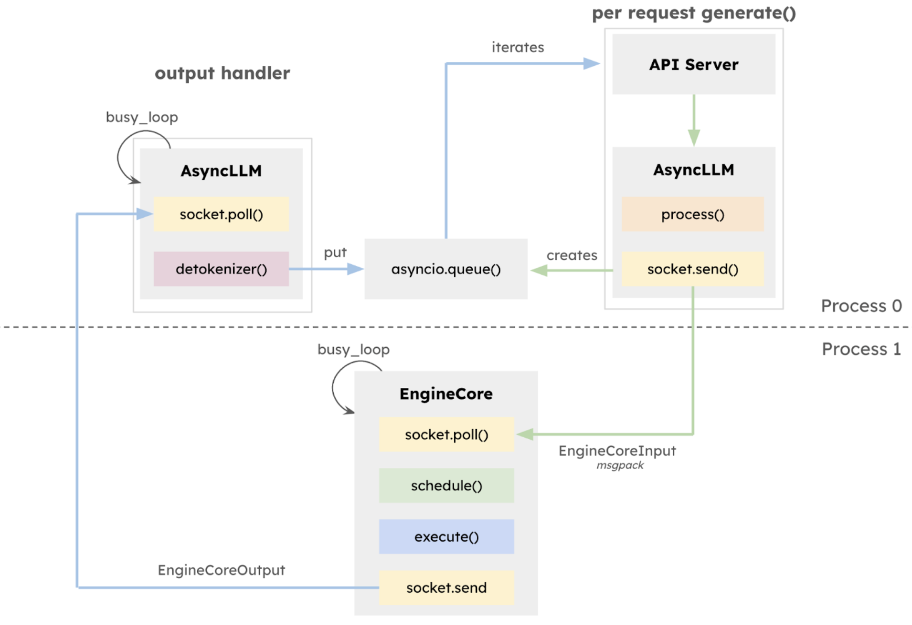
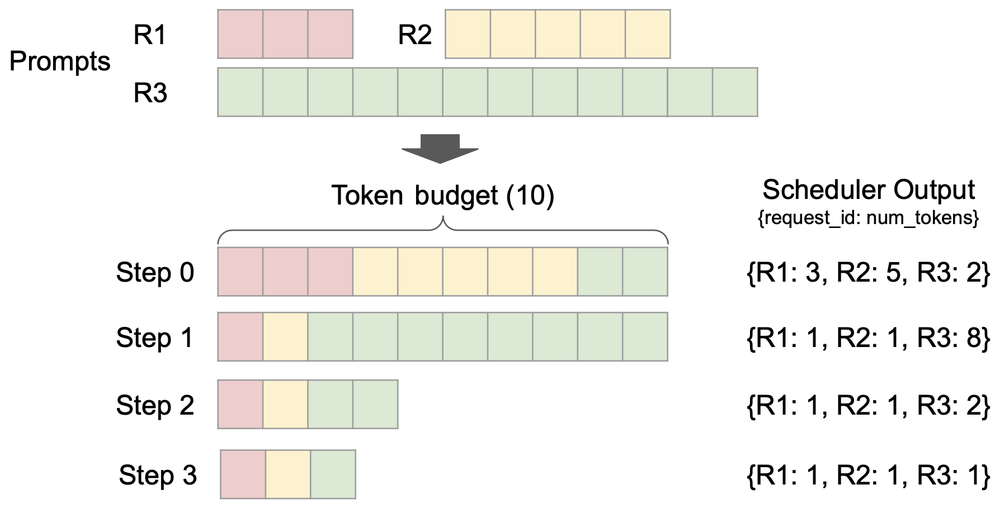
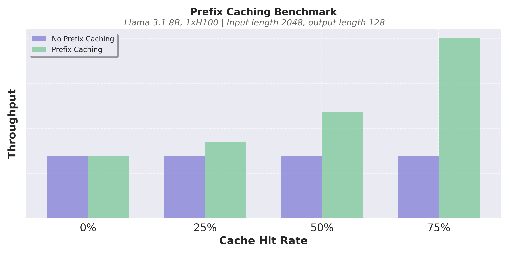
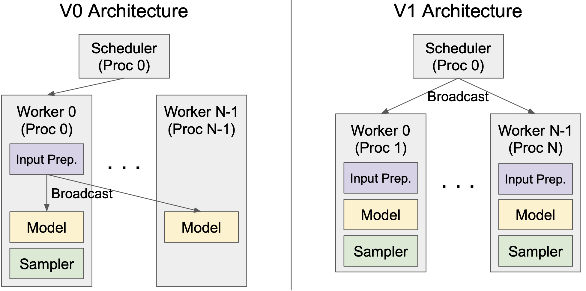
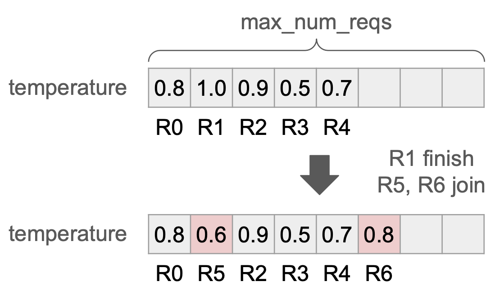
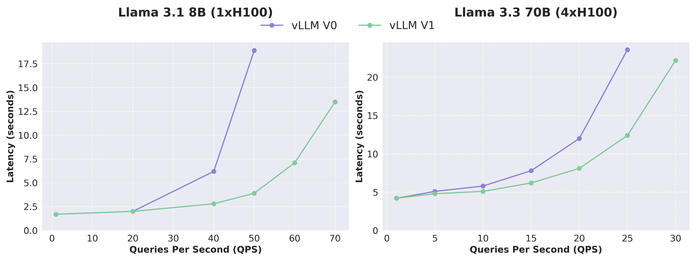
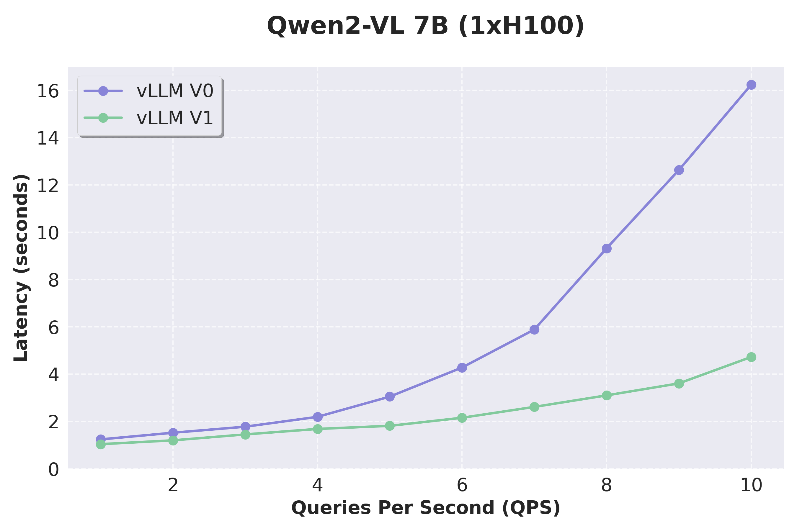

# vLLM V1：把核心拆开重装（alpha 公告）

英文对照：[en/vllm/blog/architecture/v1-alpha.md](../../../../en/vllm/blog/architecture/v1-alpha.md)  
原文：https://vllm.ai/blog/2025-01-27-v1-alpha-release  
2025-01-27。这是 **alpha 发布稿**。文中「还不支持 LoRA / spec decode / PP」是当时的缺口，不是今天的功能表。V1 后来成了默认引擎。结构细节以 [Anatomy](anatomy.md) 为准。

一句话开启（当时）：`export VLLM_USE_V1=1`。API 不变。

本地图（原文版权仍归原站；学习对照用）：

## 为什么要 V1

V0 横向很成功：模型、特性、硬件铺得很开。纵向却很难把优化叠在同一条栈上——功能各自生长，技术债堆在地基里。V1 的目标写得很短：

- 代码简单、模块化、好改。
- 近乎零的 CPU 开销。
- 把关键优化收进**同一套**架构，而不是互斥的插件。
- 零配置：好东西默认开。

范围：调度器、KV 管理器、worker、sampler、API server 重做。模型实现、GPU kernel、分布式控制面、一堆工具函数仍与 V0 共用。

致谢里点名 LightLLM、LMDeploy、SGLang、TGI、TRT-LLM——他们承认这座城不是从真空里长出来的。

## 八件新东西

**1. 执行环与 API server。** GPU 越快，CPU 越丢脸。Llama-8B on H100，一步 GPU 可以大约 **5 ms**，这时 tokenization、调度、detokenize、流式回包都会变成瓶颈。v0.6 已经把 API server 用 ZeroMQ 拆到另一进程。V1 再往里拆：独立的 `EngineCore` 只跑调度器和 model executor；tokenize / 多模态预处理 / detokenize / 流式，与核心环重叠。

**2. 简单调度器。** 不再把「prefill」和「decode」当成两种物种。prompt token 和生成 token 同一套账。每一步是一份字典：`{request_id: num_tokens}`。chunked prefill、prefix cache、投机解码都落在这张表上。固定 token 预算，动态决定分给谁多少。

**3. 近零开销的 prefix cache。** 仍是 hash + LRU。V0 开了 prefix cache，命中率低时 CPU 开销会让吞吐掉下去，所以默认关。V1 把驱逐做成近似常数时间，少造 Python 对象。命中率 0% 时吞吐掉不到 **1%**；命中率高时可以翻几倍。于是 **默认开**。

**4. 干净的 TP。** V0 为了少广播，把调度器和 Worker 0 塞进同一进程，架构不对称。V1 在 worker 侧缓存请求状态，每步只传 diff。调度器与 Worker 0 分进程，单卡多卡同一套 worker 逻辑。

**5. Persistent batch。** V0 每步重建输入张量和 metadata。V1 缓存它们，每步只打补丁；能用 Numpy 就不用纯 Python。

**6. torch.compile 与 piecewise CUDA graph。** 少写手搓 kernel，也能覆盖很多模型。piecewise CUDA graph 用来补「整图抓不住」的缝。当时说会另开博客细讲。

**7. 多模态当一等公民。** 预处理搬到非阻塞进程，并带预处理缓存（同一张图不必再解码一遍）。图像 hash 进入 prefix cache，多轮带图的对话可以复用 KV。**encoder cache** 暂存 vision embedding，于是文本 prefill 可以切块、不必每步重算视觉。

**8. FlashAttention 3。** V1 的 batch 里 prefill 和 decode 坐在一起，需要一颗既灵活又快的 attention。FA3 是当时拼图的最后一块。

## 当时的成绩单

相对 V0（未开 multi-step scheduling），吞吐最高大约 **1.7×**。kernel 几乎相同，差的是 CPU。ShareGPT 上 Llama 3.1 8B / 3.3 70B：高 QPS 时延迟更低。VisionArena 上 Qwen2-VL：加速更大，因为预处理搬走了、调度更灵活。

## alpha 的边界（历史）

当时：解码器 Transformer、Mixtral 一类 MoE、若干 VLM；量化方法可用。没有 encoder-decoder（如当时的 multimodal Llama 3.2）、没有 Mamba/Jamba、没有 embedding 模型。缺 logprobs、PP、structured decoding、spec decode、Prometheus、LoRA。硬件只要 Ampere+ NVIDIA。不设 `VLLM_USE_V1=1` 就继续走 V0。

读这一篇，是为了看见 V1 想修的病：CPU 抢 GPU 的时间、功能互斥、prefix cache 不敢默认开。Anatomy 是这座城后来的地图。
