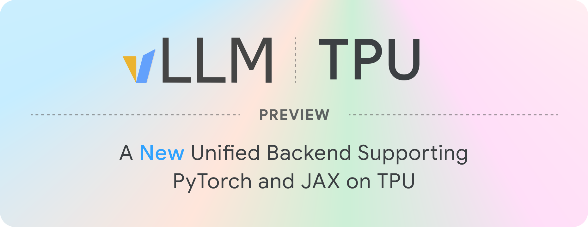
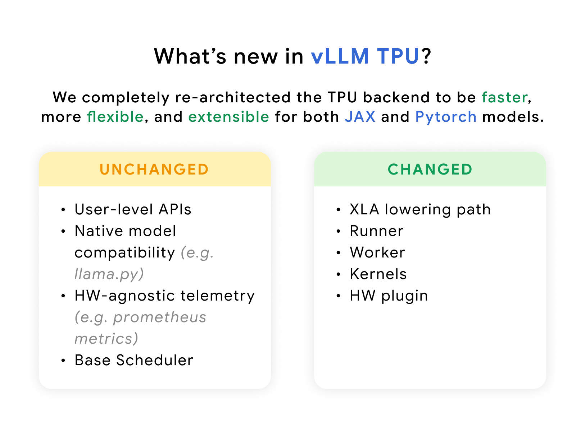
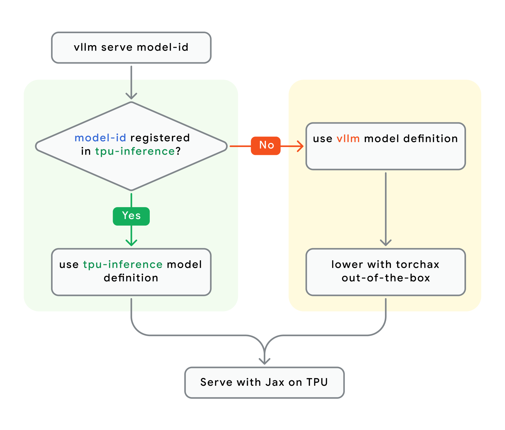
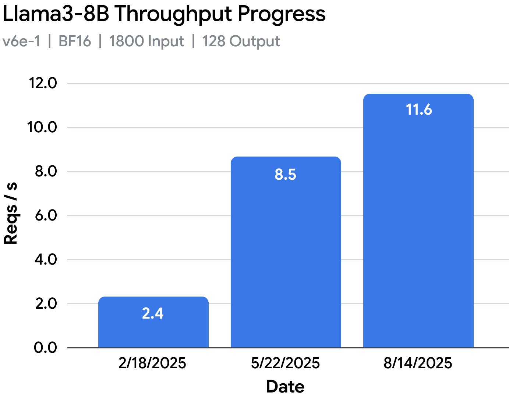
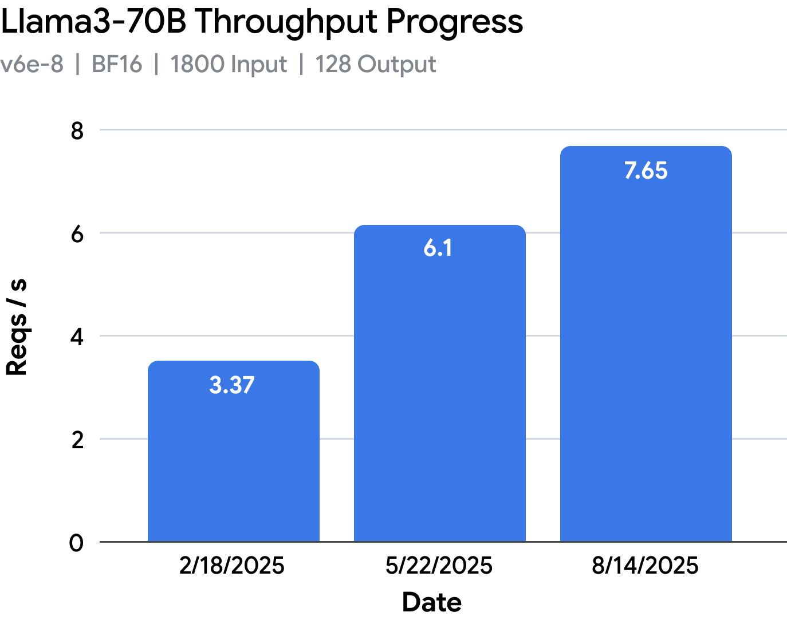

# vLLM TPU：PyTorch 和 JAX 走同一条 XLA 路

英文对照：[en/vllm/blog/architecture/vllm-tpu.md](../../../../en/vllm/blog/architecture/vllm-tpu.md)  
原文：https://vllm.ai/blog/2025-10-16-vllm-tpu  
2025-10-16。署名 **Google Team**。引擎：[tpu-inference](http://tpu.vllm.ai)。硬件那扇门：[hardware-plugin](hardware-plugin.md)；更宽的插件故事：[plugin-system](plugin-system.md)。TPU 是插件，不是 fork。页上的吞吐是当时演示，不是你芯片上的 SLA。

适用：要在 TPU 上跑 vLLM、分清 Torchax / JAX / XLA、读 RPA v3 和 SPMD。不适合：把「相对 2025-02 原型近 5×」抄进容量规划。

本地图（原文版权仍归原站；学习对照用）：



这一代 vLLM TPU 由 **tpu-inference** 供电：JAX 和 PyTorch 收进**同一条** lowering。比上一代快，模型面和功能面也更宽。原文给开发者的三件事：

1. 在开源里把 TPU **性能**往上推。
2. **灵活**：PyTorch 模型定义不必改就能在 TPU 上跑得像样，同时把 JAX 收成一等公民。
3. 保住 vLLM 的 **标准化**：同一套体验、遥测、接口。



## 第一代：赶 Cloud Next

2025 年 2 月，[vLLM V1](https://docs.vllm.ai/en/latest/usage/v1_guide.html) 刚成形。一小队 Googler 加核心贡献者给自己定了期限：赶 [Cloud Next 2025](https://cloud.withgoogle.com/next/25)，在少量模型上交出能看的 TPU backend。随后两个月，三块硬骨头：

- **V1 集成。** 要进新的 V1 路径，就得有新的 ragged paged attention（[RPA v2](https://github.com/pytorch/xla/blob/master/torch_xla/experimental/pallas_kernels/ragged_paged_attention_v2.py)），主要为了 chunked prefill 和 prefix caching。这些 KV 手法 TPU 并不陌生，难的是跟 vLLM 的 paged attention 做成「TPU 友好」。
- **MPMD。** 当时 vLLM 跨进程通信走 [MPMD](https://en.wikipedia.org/wiki/Flynn%27s_taxonomy#Multiple_programs,_multiple_data_streams_\(MPMD\))。TPU 的编译器模型却靠 [SPMD](https://en.wikipedia.org/wiki/Single_program,_multiple_data) 去重叠多设备、多主机通信。两套世界观。
- **PyTorch/XLA（PTXLA）。** [PTXLA](https://github.com/pytorch/xla) 能让 PyTorch 在 TPU 上原生跑，接进 vLLM 省事；一优化到栈底，坑就来了。

即便如此，Llama 3.1-8B 在 **v6e-1** 上吞吐大约 **3.6×**，70B 在 **v6e-8** 上大约 **2.1×**。vLLM TPU 也上了 [Cloud Next 的台](https://www.youtube.com/live/Md4Fs-Zc3tg?si=t3V52Kac5Y5VTNN0&t=1137)。后面那两张进度图把这条曲线画完。

## 这一代：tpu-inference

PTXLA 那一版已经是成绩。还要把开源 TPU 性能再往上推，并且让 PyTorch 和 JAX 模型都在 TPU 上走**最像样**的那条路。

### 统一 backend：全都 JAX→XLA

[tpu-inference](http://tpu.vllm.ai) 这一版：PyTorch 经 [Torchax](https://google.github.io/torchax/)，加上 [JAX](https://docs.jax.dev/en/latest/index.html)，收进**同一条** JAX→XLA lowering。

相对 PyTorch/XLA，原文把 JAX 写成更成熟的栈：[primitives](https://docs.jax.dev/en/latest/jax-primitives.html) 覆盖和性能更好，复杂并行尤其如此。于是 **所有** vLLM 模型现在都用 JAX lowering——模型定义仍是 PyTorch 也一样。高层框架先放下，时间留给 kernel 和编译器。对 XLA 来说，Torchax 和 JAX 在编译前用的是同一套高性能 primitive。开发笔记：[torchax_model_development.md](https://github.com/vllm-project/tpu-inference/blob/main/docs/developer_guides/torchax_model_development.md)。

当时的设计。原文也说：以后仍会评估 TPU 上的 **原生 PyTorch port**，哪条更快跟哪条。

> **原文要点 1：** 现在所有模型都走 JAX lowering。模型代码（例如 [llama.py](https://github.com/vllm-project/vllm/blob/main/vllm/model_executor/models/llama.py)）**一行不改**，吞吐大约再 **+20%**——只因为 JAX 的 primitive 生成了交给 XLA 的 HLO。

### 安装、serving、两份 registry

一条安装路径。Torchax 和 JAX 底下都是 JAX，PyTorch 写的模型和 JAX 写的模型不必两套依赖：

```bash
pip install vllm-tpu
```

Serving：

```bash
MODEL_ID="google/gemma3-27b-it" # model registered in tpu-inference or vllm
vllm serve $MODEL_ID
```

模型代码从两份 registry 拉：

1. **tpu-inference**（默认，[JAX 模型列表](https://github.com/vllm-project/tpu-inference/tree/main/tpu_inference/models/jax)）
2. **vLLM upstream**（[registry.py](https://github.com/vllm-project/vllm/blob/main/vllm/model_executor/models/registry.py)）



统一的意思：少复印一份社区已经写过的模型，把时间留给 TPU kernel 和 XLA。PyTorch（经 Torchax）和 JAX，kernel 与编译器是共享的。

> **原文要点 2：** 默认先跑 tpu-inference 里的 **TPU 优化**实现；没有，再 fallback 上游 PyTorch，经 Torchax 用 JAX lowering。对多数人这是实现细节。见 [how Torchax works](https://google.github.io/torchax/user_guide/how-it-works/)。

Torchax 能把 PyTorch 模型开箱跑在 TPU 上、编译仍走 JAX JIT——那为什么 tpu-inference 里还要重写几只？不是为了复印。

他们放了几只参考模型，降低 JAX 用户的坡（[tpu_inference/models/jax](https://github.com/vllm-project/tpu-inference/tree/main/tpu_inference/models/jax)）。观察：Torchax lowering 和「朴素重写成 JAX」的性能大致相当——说明 Torchax 把高层模型转过去已经很有效。

真正的收益、以及保留重写的理由：把 JAX **按 TPU 去优化**，直接吃架构的长处。vLLM 开发者写模型时的逻辑选择不一定对 TPU 友好。所以差别不在 JAX vs Torchax，在 GPU 和 TPU 要的策略不一样。

> **原文要点 3：** 任何模型，底下 **都是 JAX**。除非实现上的逻辑差异让 TPU 吃亏，原生改写成 JAX 多半赚不到。但若重写能把 TPU 吃干净，这扇门要留着。

### RPA v3

RPA v2 已经把吞吐抬起来。要更多模型、更多场景开箱能跑，还得更灵活。原文列了四条：

1. **更多模型。** v2 只吃 head dim **128**。v3 任意 model spec、量化 dtype、任意 TP，开箱面变宽。
2. **更好的性能。** v2 里 KV cache 更新和 attention 串行，流水线不干净。v3 把 KV scatter **融进** RPA，scatter 延迟在 kernel 执行里被**完全**藏住。
3. **部署更活。** v2 在 decode 偏重、或 prefill 长度很散时容易浪费。v3 编成 **三只子核**：只 prefill、只 decode、mixed batch。运行时把请求配到对的子核，省 DMA 和计算。这也给 disaggregated serving 留了门。
4. **不拿灵活换速度。** v3 在 Trillium（v6e）上相对 v2 吞吐大约 **+10%**。模型也可以上 **v5p**（还要再调）。

RPA v3 的技术深挖，原文说随后会写进文档。

> **原文要点 4：** RPA v3 既灵活又快，是开源里生产级 Pallas kernel 的参考。TPU 友好的 MoE、MLA kernel，他们希望按同样的路子落地。

### 默认 SPMD

这一版把 [SPMD](https://en.wikipedia.org/wiki/Single_program,_multiple_data) 设成 vLLM TPU 的默认编程模型。不再搬 GPU 那套多 worker。开发者对着「一台巨大的设备」写代码，XLA 自己切模型、切张量，再插入通信。

> **原文要点 5：** SPMD 让通信和计算重叠这类优化变得自然。这是往 TPU 原生、编译器优先的一次转向。

### 收在一起





从 2025 年 2 月的原型走到这篇，同一批 workload 接近 **2×–5×**，模型覆盖和可用性也一起长。

> **原文要点 6：** 相对 2025 年 2 月第一只 TPU 原型，当时已经接近 **5×**。地基换过，开源里才有下一截可推。

## 模型、功能、下一步

这一版被写成**地基**：vLLM TPU 会在开源里按期发版。每次发版，CI/CD 公布核过的 vLLM-native 模型表；另维持一份压测过的 tpu-inference 模型，主要给 JAX 用户当参考。功能发版前也会过测试。

**当时支持的模型族**

- Dense
- Multimodal（**仅** tpu-inference 里的模型）

> **原文注：** 更多能力落地之前，建议从压测名单起步：[model_support_matrix.csv](https://github.com/vllm-project/tpu-inference/blob/main/support_matrices/model_support_matrix.csv)。更大、更绕的模型（XL MoE、带视觉 encoder、MLA 等）组件还在往 tpu-inference 里落。要催某一项：[feature request](https://github.com/vllm-project/tpu-inference/issues/new/choose)。

**核过的 TPU 代际**

- Trillium（v6e）、v5e

**功能**

- Prefix caching
- Chunked Prefill
- Multimodal Inputs
- SPMD
- Structured Decoding
- Speculative decoding：Ngram
- Out-of-tree 模型
- 优化过的 Runtime Sampling（top k、top p、temperature、logit output）
- 量化（权重、激活、KV cache）

**TPU 友好 kernel**

- Ragged Paged Attention V3
- Collective Communication Matmul
- Quantized Matmul、Attention 和 KV Cache

**实验**

- v5p
- Multimodal（经 Torchax）
- Multi-lora
- Speculative decoding：tree-based Eagle 3
- 单机 P/D disaggregated serving

**下一步（原文清单）**

- Sparsecore offloading
- Speculative decoding：Eagle 3、MTP
- TPU 友好 kernel：XL MoE、MLA
- RL 集成：单机 / 多机；colocate / disagg；经 Pathways 的 single-controller；靠 prefix caching 的 multi-sampling；权重同步与 reshard；Data Parallel 的吞吐型 rollout；LoRA；tool call 与多轮 rollout。伙伴项目：[Tunix](https://github.com/google/tunix)、[MaxText](https://github.com/AI-Hypercomputer/maxtext)、[SkyRL](https://github.com/NovaSky-AI/SkyRL)
- Distributed：多机动态 P/D；Prefix Cache 卸到 CPU 和远端 store；Data Parallel Attention 的负载均衡。伙伴项目：[llm-d](https://github.com/llm-d/llm-d)
- [欢迎贡献](https://github.com/vllm-project/tpu-inference/blob/main/CONTRIBUTING.md)

## 试用

Google Cloud 上可试：[GKE](https://cloud.google.com/tpu?hl=en#cloud-tpu-in-gke)、[Compute Engine](https://cloud.google.com/tpu?hl=en)、[Vertex AI](https://cloud.google.com/vertex-ai/generative-ai/docs/open-models/vllm/use-vllm-tpu)。安装和开发：

- [Contribution Guide](https://github.com/vllm-project/tpu-inference/blob/main/CONTRIBUTING.md)
- [Quick Start](https://github.com/vllm-project/tpu-inference/blob/main/docs/getting_started/quickstart.md)
- [Trillium (v6e) Recipes](https://github.com/AI-Hypercomputer/tpu-recipes/tree/main/inference/trillium/vLLM)
- [Developer Guide: JAX](https://github.com/vllm-project/tpu-inference/blob/main/docs/developer_guides/jax_model_development.md)
- [Developer Guide: Torchax](https://github.com/vllm-project/tpu-inference/blob/main/docs/developer_guides/torchax_model_development.md)

教程：GKE [这里](https://cloud.google.com/kubernetes-engine/docs/tutorials/serve-vllm-tpu)，Vertex AI [这里](https://cloud.google.com/vertex-ai/generative-ai/docs/open-models/vllm/use-vllm-tpu)。

## 致谢（原文）

感谢 vLLM 社区。特别感谢 [Woosuk Kwon](https://github.com/WoosukKwon) 带头做 TPU 的 V0，并继续带这支变大的队伍。[Simon Mo](https://github.com/simon-mo)、[Robert Shaw](https://github.com/robertgshaw2-redhat)、[Michael Goin](https://github.com/mgoin)、[Yanping Huang](https://github.com/bignamehyp) 全程给过方向。V1 集成和冲 Cloud Next：[Nicolo Lucchesi](https://github.com/NickLucche)、[Alexander Matveev](https://github.com/alexm-redhat)、[Akshat Tripathi](https://github.com/Akshat-Tripathi)、[Saheli Bhattacharjee](https://github.com/sahelib25)。
