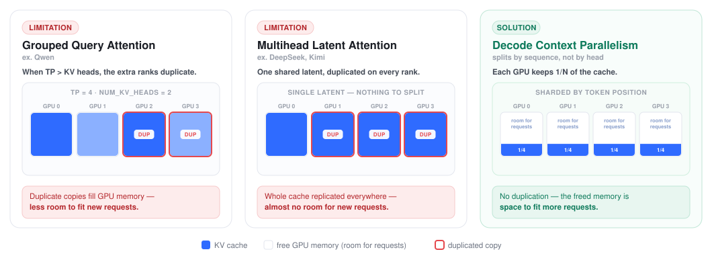
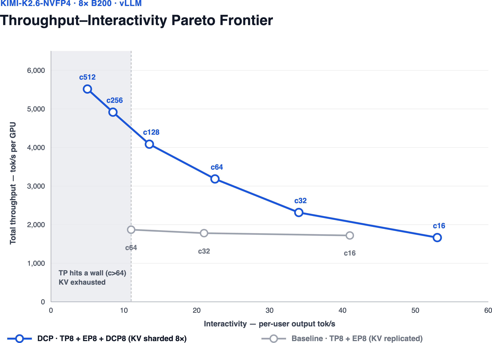
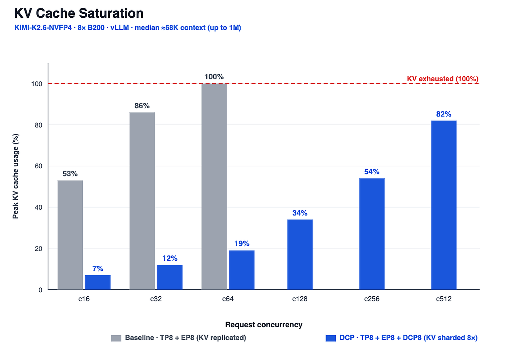
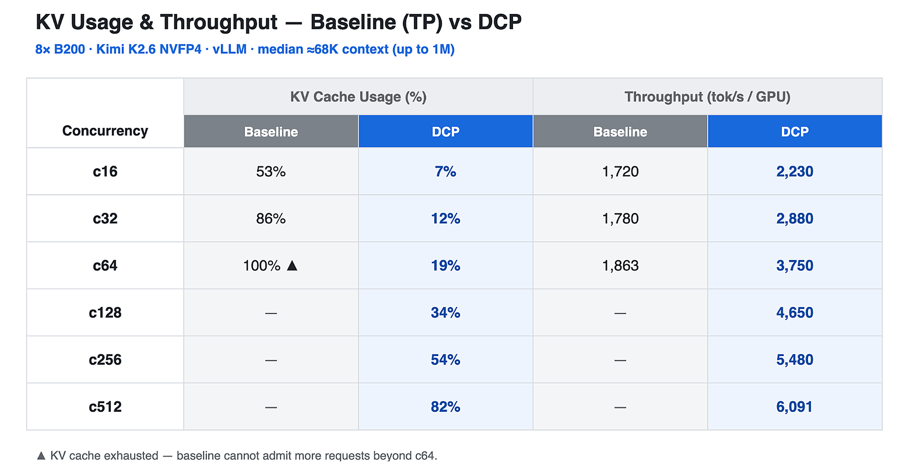
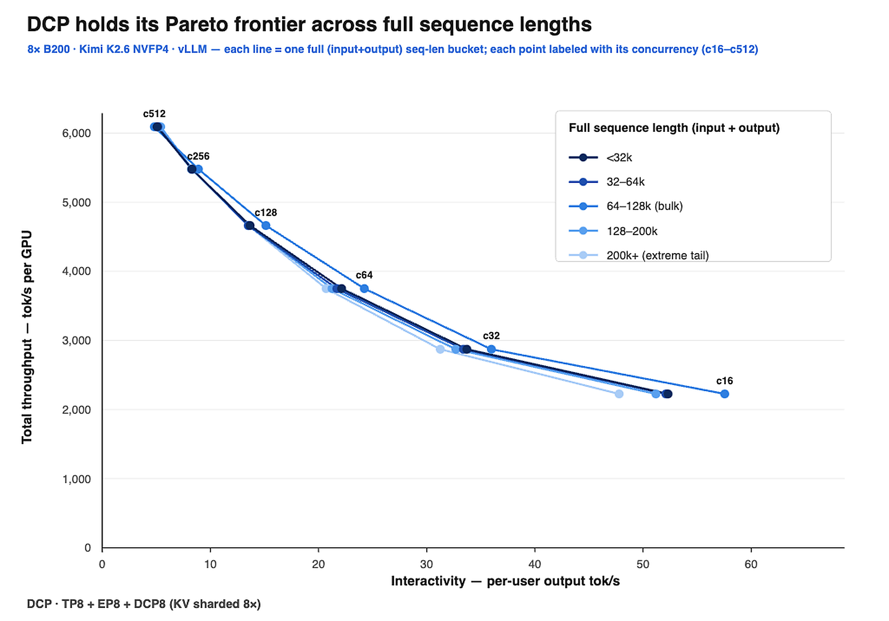
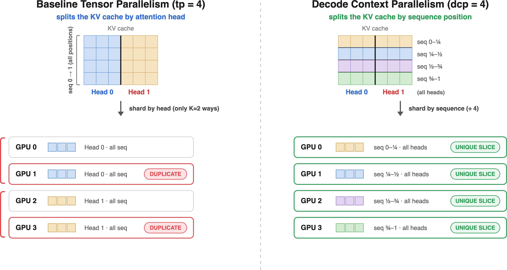

# Decode Context Parallelism：长上下文别再按头去切 KV

英文对照：[en/vllm/blog/performance/dcp.md](../../../../en/vllm/blog/performance/dcp.md)  
原文：https://vllm.ai/blog/2026-08-07-decode-context-parallelism  
2026-08-07。vLLM 支持 DCP 已近一年；agent 把上下文拉到 **64K–1M** 之后，这篇才把它写清楚。`vllm serve` 里的 `--decode-context-parallel-size`（帮助里也有 `-dcp`）。NVIDIA TensorRT-LLM 侧相近的方向叫 [Helix Parallelism](https://github.com/NVIDIA/TensorRT-LLM/blob/main/docs/source/blogs/tech_blog/blog22_Helix_Parallelism_Scaling_Multi_Million_Token_Decoding_with_KV_Cache_Sharding.md)。文档：[Decode Context Parallel](https://docs.vllm.ai/en/latest/serving/context_parallel_deployment/#decode-context-parallel)。

本地图（原文版权仍归原站；学习对照用）：













## 1. TP 的房子为什么会被复制填满

Agent 要读仓库、要带着长对话。KV 按这个长度长。基线 TP 按 **attention head** 切 KV，有一块硬地板：

- **GQA：** KV head 本来就少。TP 最多切到**每卡一个 KV head**；再加卡就开始**复制**。
- **MLA：** Key/Value 收成一份低秩 **latent**，所有 query head 共用——等于只有一个 KV head。普通 TP 没头可切，latent 在每个 TP rank 上**整份复制**。

复制把 HBM 吃掉，并发上不去，吞吐和每 token 成本一起坏。[分布式推理](../serving/distributed-inference.md) 那张「TP 给 KV 腾房间」的超线性图，在 MLA 上会反过来。DCP 按**序列维**切：每卡只存、只读自己那一段。要高带宽的卡间互联，才能在许多长 agent 同住时仍保持可交互。Figure 1。

## 2. 成绩（演示）

同一套 GPU、模型、负载；只改 Decode 时 KV 怎么切。原文 Figure 1–2 是对比图（本地 `02-figure-1.png`、`03-figure-2.png`）。

### 2.1 数据集

公开的长上下文 agent 轨迹，**Mooncake-trace**：[JSONL](https://github.com/ai-dynamo/dynamo/blob/main/recipes/kimi-k2.6/perf/traces/64k_400_90kv_agent_new_noschedule_short_15perc.jsonl)（[说明](https://github.com/ai-dynamo/dynamo/blob/main/recipes/kimi-k2.6/perf/README.md#dataset)）。每行：`input_length`、`output_length`、`hash_ids`。可用兼容 harness 重放（例如 `aiperf --custom-dataset-type mooncake_trace`）。`hash_ids` 编的是共享前缀块，适合测 prefix cache / KV 复用。

形状：长进短出。中位输入约 **67K**，输出约 **400**。分布是**双峰**，不是清一色的巨长：

- 大约 **53%** 在 **64K+**（尾部到约 **1M**）
- 大约 **47%** 低于 64K；大约 **18%** 低于 8K
- 大约 **8%** 超过 128K；大约 **3–4%** 超过 256K

### 2.2 收益

单机 **8×B200**，**Kimi K2.6 NVFP4**。并发从 **16 扫到 512**。原文写「见下表」；活页上的表是 JS 控件，Jina 抓取里没有格子。正文数字：

- 基线 TP：并发 **64** 时 KV **100%**，吞吐卡在大约 **1,863 tok/s/GPU**——再塞不进人。
- DCP：按序列切（每卡 1/N）。并发 **512** 仍只有约 **82%** KV，**6,091 tok/s/GPU**。

Figure 3。核心价值：恰恰在「复制 KV 的 TP 先 OOM」的长上下文上，DCP 还能把并发撑上去。

### 2.3 按序列长度

Figure 4：一条吞吐–交互 Pareto，请求分成五档：**&lt;32K**、**32–64K**、**64–128K**、**128–200K**、**200K+**。DCP 在 **200K+** 仍停在同一条高而稳的前沿上；短桶和长桶几乎重叠。复制 KV 的 TP 在这里已经没有房间。

## 3. 按头切的硬地板

每个 KV head 有自己的 K/V 张量；head 是 TP 能交给一张卡的最小单位。标准 TP **切不开一颗 head 内部的 KV**。K 个 KV head，可以给每张卡不同的子集，直到每卡一颗。超过 K，两张卡就会握着**同一颗 head 的副本**。

## 4. DCP 是什么

按**同一条序列的 token 位置**切。例子：一条 **200K**，四张卡分别管 0–50K / 50K–100K / 100K–150K / 150K–200K。卡越多，每卡 KV 越瘦，batch 才能再涨。Figure 5。

### 4.1 一拍怎么走

**AllGather Q → Compute → AllGather + ReduceScatter。**

- **AllGather Q。** 每卡只有 Q 的一片，attention 却要对任意 key 用完整 query。在 DCP 组里 all-gather。Decode 时 Q 只有**一个 token**，这一步便宜。MLA 可选：[PR #45964](https://github.com/vllm-project/vllm/pull/45964) 在**加载时**于 DCP 组内复制那份很小的 query 投影，Decode **连这步 AllGather 也省**（`VLLM_DCP_Q_REPLICATE=1`）。
- **Compute。** 用 gather 来的 Q 对**本地** KV 切片做 attention。vLLM：MLA 走 `k_up`，GQA 走 `tensor_broadcast`。
- **AllGather + ReduceScatter（`cp_lse_ag_out_rs`）。** 共享部分输出和 LSE；LSE 再加权合并（online softmax）；ReduceScatter 求和，每卡只拿回自己的 head-slice。

## 5. 怎么开

`decode_context_parallel_size` 和现有 TP 放在一起。

### 5.1 离线

```python
from vllm import LLM, SamplingParams

prompts = ["The future of AI is"]
sampling_params = SamplingParams(temperature=0.8, top_p=0.95)

llm = LLM(
    model="deepseek-ai/DeepSeek-V2-Lite",
    tensor_parallel_size=2,
    decode_context_parallel_size=2,
)
outputs = llm.generate(prompts, sampling_params)
```

### 5.2 在线

```bash
vllm serve deepseek-ai/DeepSeek-V2-Lite \
    --tensor-parallel-size 2 \
    --decode-context-parallel-size 2
```

### 5.3 MLA

**模型：** DeepSeek-V2 / V3 / R1、Kimi K2.6（MLA）。整份 latent 在 TP 下都是多余的，所以整份都可以按序列切。Attention 时每 rank 对自己的 latent 切片做 **up-project**（`k_up`）还原 K/V。有效 KV head 数是 1，序列可以切到满 TP：

- `tensor_parallel_size >= decode_context_parallel_size`
- `tensor_parallel_size % decode_context_parallel_size == 0`

```bash
vllm serve deepseek-ai/DeepSeek-R1 \
    --tensor-parallel-size 8 \
    --decode-context-parallel-size 8
```

### 5.4 GQA

**例子：** Qwen3-235B、Llama 家族、其它 GQA。TP 先按 `num_key_value_heads` 切；超过这个数才出现 `tp // num_key_value_heads` 份相同副本。DCP 去填那些副本，换成**不同的序列块**；共享的 KV head 再广播到 query head（GQA 的 `tensor_broadcast`）。序列切分的上限就是这份复制因子：

- `(tensor_parallel_size // num_key_value_heads) >= decode_context_parallel_size`
- `(tensor_parallel_size // num_key_value_heads) % decode_context_parallel_size == 0`

```bash
# Qwen3-235B num_key_value_heads = 4；tp=8 → 8//4 = 2 份副本 → DCP 最多 2
vllm serve Qwen/Qwen3-235B-A22B \
    --tensor-parallel-size 8 \
    --decode-context-parallel-size 2
```

## 6. 当时的下一步

更细的 TP/DCP；更好的 DCP **A2A** kernel（多机和单机）；**MTP / 投机解码** 不要把投机换来的延迟吃掉；把 **P/D** 分离上的 DCP 做硬；混合模型和 Dynamic Chunked Pipeline Parallelism；更多后端。社区在接 **GLM-5.2**、**Kimi K3**。更长的路线：**Prefill Context Parallelism（PCP）**。Kimi K3 的 DCP 成绩当时还在做。

收束的那句话：attention 时按序列切，随后让同一批 GPU 再摊 FFN 权重加载——系统该随上下文变长而扩，而不是被它压垮。

NVIDIA 侧审稿与 bench 名单、Moonshot 初版 [vLLM #23734](https://github.com/vllm-project/vllm/pull/23734)、[Lucas Wilkinson](https://github.com/LucasWilkinson) 的后续，见英文对照。测在 **NVIDIA B200**、Kimi K2.6 **NVFP4**；用支持 `--decode-context-parallel-size` 的 vLLM 复现。

长上下文的地图：TP 切头、DCP 切序列、Mooncake 把前缀放到池子里、P/D 把阅读和说话拆开。四件事不是互斥的。
