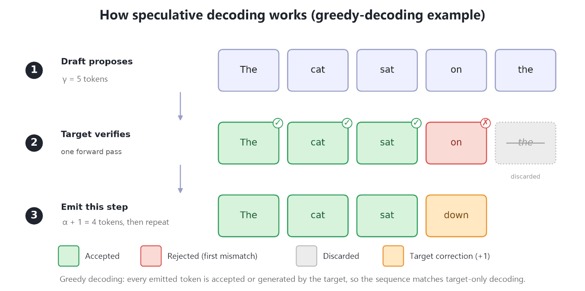
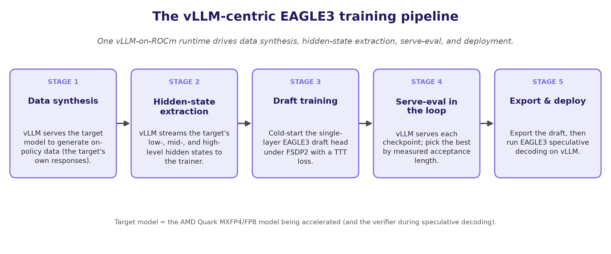
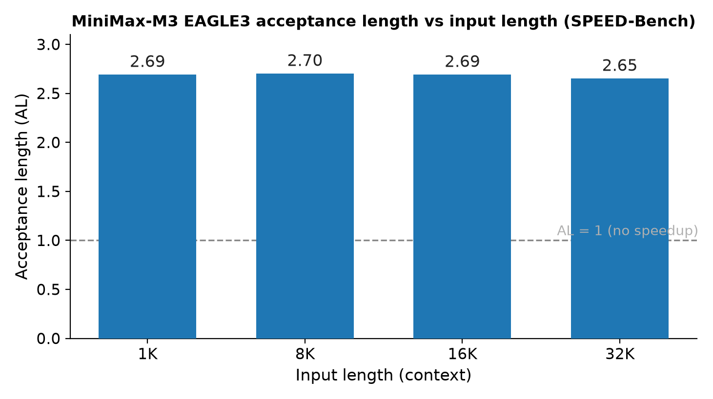
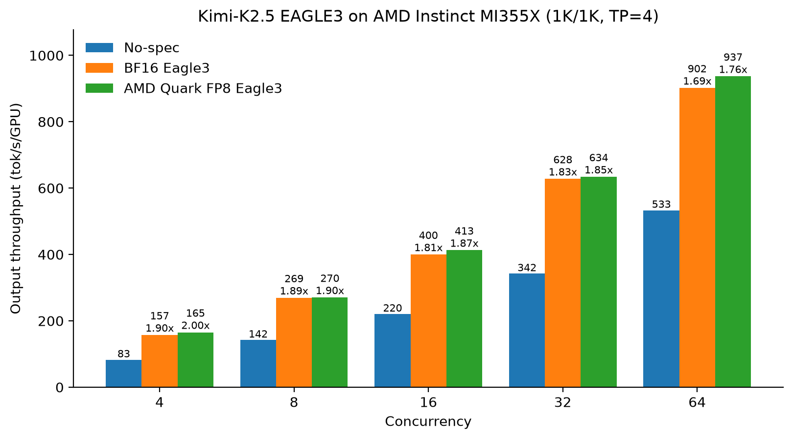
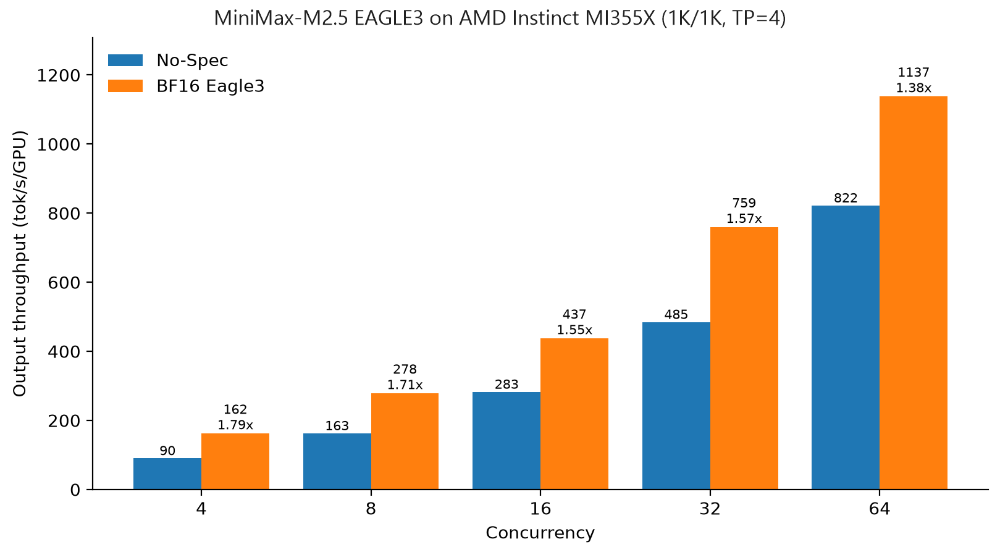

# EAGLE 3 on Instinct：Quark MXFP4，Kimi-K2.5 约 1.69–2.00×

英文对照：`en/vllm/blog/performance/eagle3-amd.md`  
原文：https://vllm.ai/blog/2026-07-13-eagle-3-amd-instinct  
CUDA 侧 EAGLE 见 [p-eagle](p-eagle.md) / [eagle31](eagle-3-1.md)；AMD spec-decode 见 [amd-spec-decode](spec-decode-amd.md)。

Quark MXFP4。Kimi-K2.5 约 **1.69–2.00×**；MiniMax-M2.5 约 **1.38–1.79×**；MiniMax-M3 acceptance length **2.80**。draft 精度和 verify 精度可以不是同一档——量化吃的是 draft 带宽。数字是他们那套 prompt / 接受率；换模型先复测 acceptance length。

本地图（原文版权仍归原站；学习对照用）：

