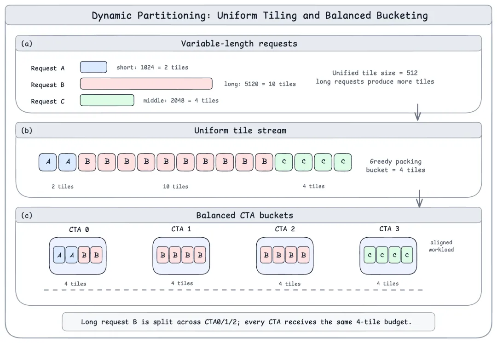
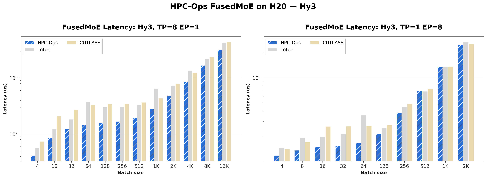
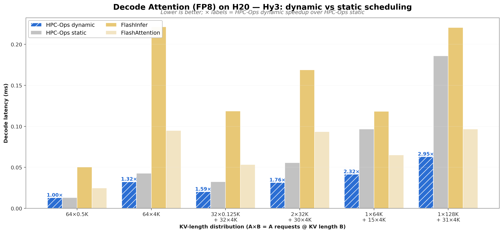

# HPC-Ops：H20 上混长 decode 的 attention，和小 expert GEMM 的 MoE

英文对照：`en/vllm/blog/performance/hpc-ops.md`  
原文：https://vllm.ai/blog/2026-07-06-vllm-hpc-ops  
Hopper，尤其 H20。Attention PR #46020，MoE PR #45924。图与表在原网页。

固定 split-KV：batch 里长短混在一起，总时间被最重的 CTA 钉死。HPC-Ops 每步把 KV 切成 64-token tile，按 CTA 均分；persistent grid 吃完任务图。混长 decode 相对静态 split-KV 最高约 **2.95×**，相对 FlashInfer/FA 平均约 **2.25×**。`HpcRopeNorm` 把 QK-Norm、RoPE、KV 写入（FP8 再加 query quant）熔进一层 prologue。

MoE decode：专家 GEMM 小、周围 gather/launch/HBM 往返更贵。路由、Gate-Up、activation+quant、Down、top-k 加权收成一条 fused FP8 路径；PDL 把阶段气泡抹掉。相对 Triton/CUTLASS：TP8/EP1 平均 **1.59×**，TP1/EP8 **1.21×**。8×H20 Hy3 两端一起：TTFT 约 **−24%**，TPOT 约 **−17%**。

```
--attention-backend HPC_ATTN
--moe-backend hpc
```

Attention 当时只认 Hy3 系；MoE 只认 FP8。不是通用默认，是 Hunyuan 产线 kernel 走 backend 接口进 main。

本地图（原文版权仍归原站；学习对照用）：






