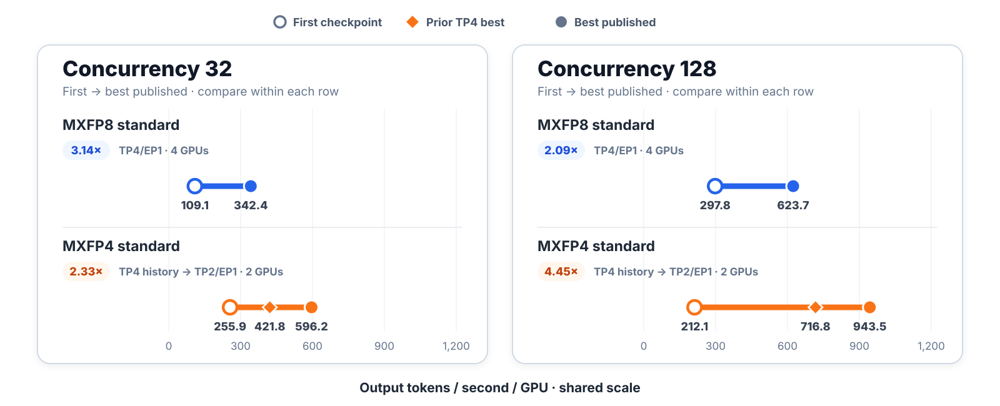
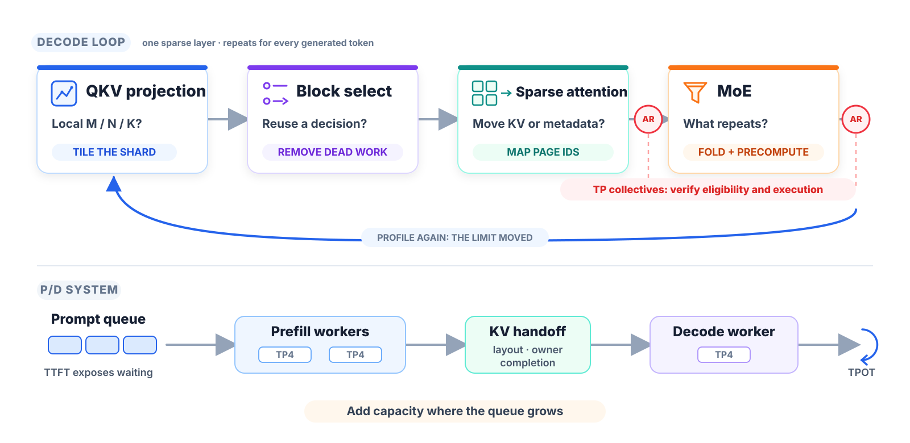
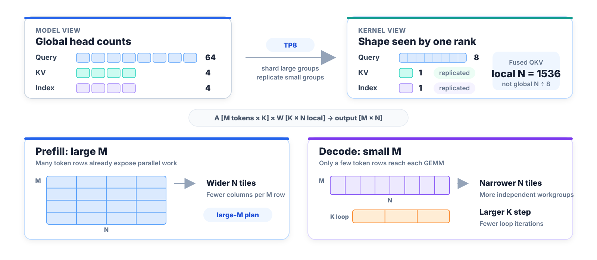
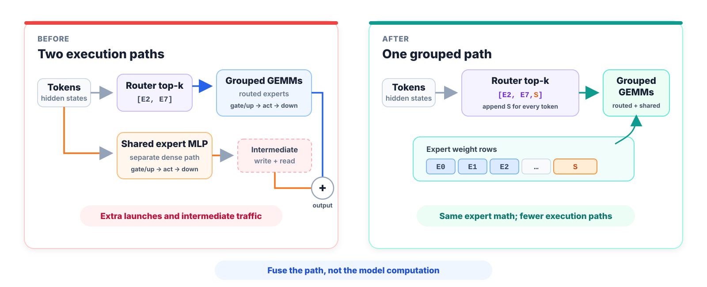
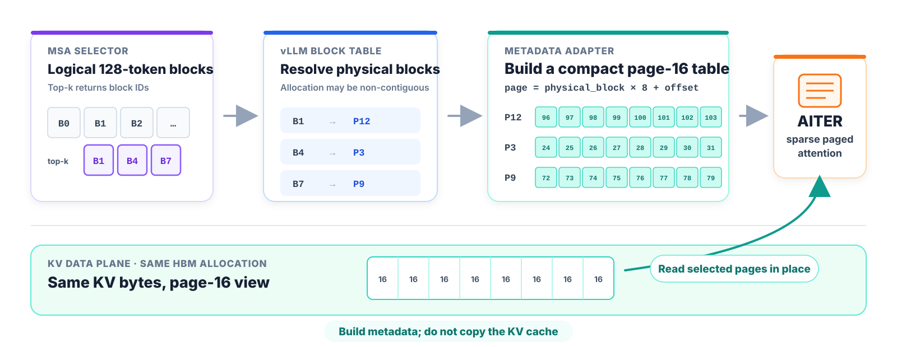
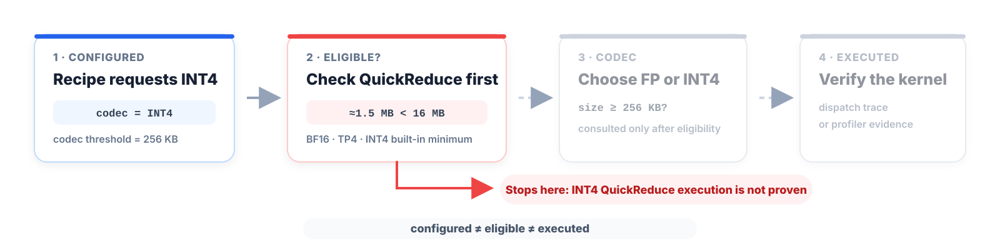
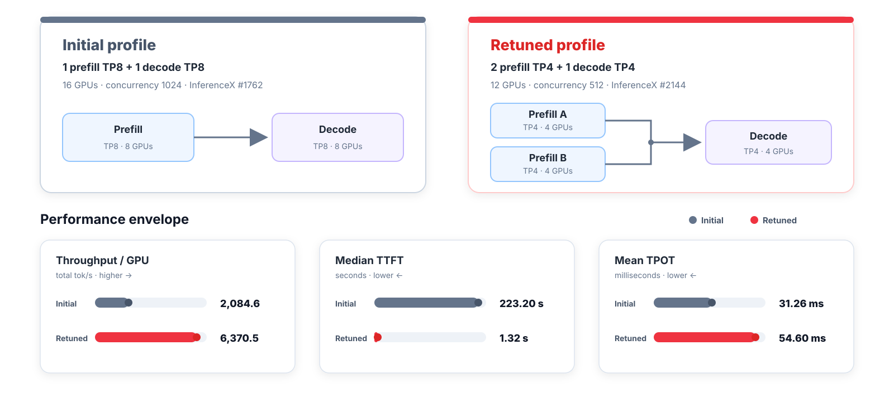

# 跟着瓶颈走：在 AMD Instinct MI355X 上把 MiniMax M3 调快

英文对照：[en/vllm/blog/performance/minimax-m3-mi355x.md](../../../../en/vllm/blog/performance/minimax-m3-mi355x.md)  
原文：https://vllm.ai/blog/2026-09-10-minimax-m3-mi355x  
2026-09-10。署名 **AMD and Embedded LLM Teams**。学习译文，不是官方译本。Day-0 那篇：[minimax-m3.md](../serving/minimax-m3.md)。公开数字：[SemiAnalysis InferenceX](https://inferencex.semianalysis.com/inference)。AgentX 邻居：[agentx.md](../serving/agentx.md)。投机 / MSA：[spec-decode-amd.md](spec-decode-amd.md)、[spec-decode.md](spec-decode.md)。P/D KV：[moriio.md](../serving/moriio.md)。站点 logo 不收。

Day-0 写的是第一条能跑的路：MiniMax Sparse Attention（MSA）、多模态输入、reasoning 和 tool 输出、MXFP8 权重，以及 MI355X 上的 EAGLE3。这篇写模型跑起来之后发生了什么。有用的结果不只是更高的吞吐数字，而是瓶颈一直在挪的时候，下一步该优化什么。

## 一分钟看结果

InferenceX 上 MiniMax-M3 在 MI355X 的公开数字：

- 并发 32，固定拓扑 MXFP8 标准 serving：**109.1 → 342.4** output tokens/s/GPU，day-0 的 **3.14×**。Median TTFT **1.46 → 0.67** s。Mean TPOT **69.1 → 22.1** ms。
- 并发 128，同一条 TP4/EP1 四卡路径：**297.8 → 623.7** output tokens/s/GPU，**2.09×**。Median TTFT **3.53 → 1.54** s。Mean TPOT **100.7 → 48.8** ms。
- MXFP4 先在同一份 TP4/EP1 四卡契约、并发 128 上从 **212.1 → 716.8** output tokens/s/GPU。后来的 TP2/EP1 到 **943.5** output tokens/s/GPU，比那份 TP4 检查点高 <strong>31.6%</strong>，是最初每 GPU 数字的 **4.45×**。
- EAGLE3 投机解码：TP4/EP1、并发 128 上 **682.4** output tokens/s/GPU。
- P/D 分离并重调 Prefill/Decode 拓扑：并发 512 上 **6,370.5** total tokens/s/GPU，median TTFT **1.32** s。



**图注（原文 Figure 1）。** 标准 Decode，8K 输入、1K 输出。只在同一行里比点。MXFP8 一直停在 TP4/EP1；MXFP4 最后一个点从 TP4 挪到 TP2，那是更高的部署密度，不是固定拓扑加速。

每个检查点都是累积的，可能捆了好几处改动。下面用隔离的 PR 测量解释单项优化。

## 一步 Decode，五个问题

先估主导成本，再测，把重复的工作收成批，把不变量提前算好，叶子 profile 变平之后再往栈上走。

MiniMax M3 有 60 层 decoder；57 层用稀疏 MoE 和稀疏 attention。1K token 的回复里，每层一点点成本会在一条请求里出现几万次。五个问题：

1. 到这个 rank 的局部形状是什么？
2. 每一层、每一个 token 重复的是什么工作？
3. 哪些字节在搬，能不能改搬元数据？
4. 打算走的快路径真的跑了吗，数学对不对？
5. Kernel 不再主导时，哪条队列在长？



**图注（原文 Figure 2）。** 上：一层稀疏 decoder 按执行顺序；AR 标 attention 和 MoE 之后的张量并行 collective。下：同一套推理用在 P/D——先核 KV 交接，再把容量加到请求在等的地方。

## 1. 到这个 rank 的形状是什么？

Kernel 跑在张量并行、head 复制、padding、token routing 之后的局部 M、N、K 上。TP8 时 MiniMax M3 的 64 个 query head 切成每 rank 八个，四个 KV head 和四个 index head 则复制成每 rank 一个。融合 QKV 投影因此看见局部 **N=1536**——不是全局 N 除以八。

Prefill 和 Decode 的 M 也不一样。Prefill 一次处理许多 token；Decode 常常只有几行。[vLLM #45725](https://github.com/vllm-project/vllm/pull/45725) 把 launcher 拆成大 M / 小 M 两档，TP8 8K/1K 输出吞吐提高 <strong>7.8%–9.4%</strong>。[vLLM #46117](https://github.com/vllm-project/vllm/pull/46117) 再按完整局部形状选 tile：更窄的 N tile 在 Decode 里露出更多独立工作；更大的 K 步减少循环次数。Prefill 在 M 已经提供足够并行时用更宽的 tile。



**图注（原文 Figure 3）。** TP 切分和 head 复制决定局部 N；serving 相位决定 M。Launcher 按这个 rank 真正跑到的形状选 tile。

同一份 PR 还重排了 grouped-MoE 程序，让相邻程序能从 GPU cache 复用 activation 行和 expert 权重 tile，不必再从 HBM 取。它的 TP4 端到端测试里，合在一起是 **1.08×–1.46×**。低并发收益最大——原来的 launch 并行工作最少。

局部形状也决定哪条 backend 合法。最终 MXFP8 菜谱里的 AITER 稀疏 attention 路径要求 **每个 TP rank 一个 KV head**。TP4 满足。TP2 走 vLLM 的 Triton 回退。改 TP 不只改 collective 大小，还可能改算子图。

也没有放之四海都最快的 backend。[InferenceX #2003](https://github.com/SemiAnalysisAI/InferenceX/pull/2003) 起初给整次扫描选了模拟的 linear backend。后来 [InferenceX #2187](https://github.com/SemiAnalysisAI/InferenceX/pull/2187) 表明原生 MXFP8 linear 在中低并发更快；模拟只在长输入、高并发赢。稀疏 paged attention 有类似交叉点。最终菜谱只在 **8K 输入、并发 64 及以上** 同时打开这两条。

第一条可复用的课：按真正跑到的形状分布来调和分发。「Prefill」「Decode」「TP4」只是标签。

## 2. 什么工作在重复？

最先容易漏掉的是 launch 开销。Day-0 菜谱是 eager。[InferenceX #1754](https://github.com/SemiAnalysisAI/InferenceX/pull/1754) 和 [#1755](https://github.com/SemiAnalysisAI/InferenceX/pull/1755) 给标准和 EAGLE3 serving 打开了 graph 执行。公开结果没有把这笔收益单独拆开。

更大的结构收益是 shared expert。原先每一层稀疏 MoE 都把它当一条单独的 dense MLP 跑：gate/up、激活、down、中间存储、再加回去。数学必须有。单独那条路径不必有。

[vLLM #46545](https://github.com/vllm-project/vllm/pull/46545) 把 shared expert 接到 routed expert 表上，每个 token 都选中它。Grouped GEMM 于是把 routed 和 shared 一起做。输出吞吐在并发 1 提高 <strong>30.2%</strong>，并发 128 提高 <strong>5.6%</strong>——这就是 launch 被摊掉的样子。



**图注（原文 Figure 4）。** 融合把 shared expert 收成每个 token 都会选中的一个槽。Routed 和 shared 然后走同一套 grouped GEMM。

AITER 路径在 [vLLM #46474](https://github.com/vllm-project/vllm/pull/46474) 做了同一件事。[vLLM #46184](https://github.com/vllm-project/vllm/pull/46184)，背后是 [AITER #3811](https://github.com/ROCm/aiter/pull/3811)，把 MXFP8 权重和 scale 的重排挪到模型加载。AITER 带着从 1 到 32768 token、以及 TP4 / TP8 产出的局部中间宽度上调过的 MoE 配置。布局转换做一次；serving 循环吃准备好的形式。

投机解码：原来的 MSA indexer 为每个投机 token 起一个 workgroup。[vLLM #45743](https://github.com/vllm-project/vllm/pull/45743) 改成每个请求一个 workgroup，把所有 draft 位置一起处理，复用 key 的加载。它还去掉了一个正的 score scale——只要 top-k 顺序，同一个正常数去乘每一个分数改不了顺序。Index kernel 最多快 <strong>48.9%</strong>；端到端 serving 在 PR 测试里大约快 <strong>3.3%</strong>（Amdahl）。

## 3. 哪些字节在搬？

稀疏 attention 减的是 attention 数学，加的是控制面：给块打分、选 top-k、把逻辑块映射到物理页、把元数据交给 attention kernel。

[vLLM #47269](https://github.com/vllm-project/vllm/pull/47269)：相邻稀疏层常常选出几乎同一批块。打开 index sharing 之后，一层算出 top-k，后面的层复用。Mean TPOT 在并发 1 大约掉 <strong>10%</strong>，高并发大约掉 <strong>4%</strong>。

跳过选择器只做了一半。融合投影仍在产 index Q/K、做归一化、套 RoPE、写 index cache。[vLLM #47287](https://github.com/vllm-project/vllm/pull/47287) 让复用决定对那个融合 kernel 可见，用不到的生产者分支在编译时消掉。

同一份 PR 还在布局不一致的情况下接上 AITER 稀疏 paged attention。MiniMax M3 选的是逻辑 **128-token** 块；AITER 吃 **16-token** 页。vLLM 不拷 KV，而是把每个选中的 block ID 变成八个 page ID，建一张紧凑页表。KV cache 留在原地。



**图注（原文 Figure 5）。** 每个选中的 128-token 块先落到物理块，再展开成八条 16-token 页表项。AITER 通过现有 KV 分配上的视图来读；重建的只有表。

TP4、并发 256，隔离 A/B 里输出吞吐 MXFP4 <strong>+6.93%</strong>、MXFP8 <strong>+5.56%</strong>。

**Benchmark 边界：** InferenceX 固定 8K/1K 的评审政策**排除**了跨层 index 复用，因为它减少架构工作。固定形状菜谱用了页适配器，**没用** top-k 复用。AgentX 在它的负载规则下打开复用。不要把固定契约曲线记到它没跑过的工作上。

量化：三张彼此独立的字节平面：

| 字节平面 | MiniMax M3 例子 | 必须证明什么 |
|---|---|---|
| 权重和激活 | MXFP8 或 MXFP4 GEMM/MoE | 打包、scale、激活数学、backend 布局 |
| 持久状态 | FP8 KV 和稀疏 index cache | 平台 dtype、页布局、读写几何 |
| 通信 | 量化 all-reduce 或 KV 传输 | 资格、选中的 codec、所有权、完成 |

「模型是 MXFP4」并没有告诉我们 KV dtype 或 collective 路径。

## 4. 快路径跑了吗——数学对不对？

这次审计改掉了文中的一处说法。他们起初以为大约 **1.5 MB** 的 Decode collective 走了 INT4 QuickReduce。现有证据证明不了。

[InferenceX #2104](https://github.com/SemiAnalysisAI/InferenceX/pull/2104) 配了 INT4 和 **256 KB 的 codec** 阈值，但没有配 QuickReduce 单独的资格阈值。BF16、TP4 时，[钉死的内置表](https://github.com/vllm-project/vllm/blob/69715823df89b11ee684b84066390cbb9092d5c1/vllm/distributed/device_communicators/quick_all_reduce.py#L49-L61) 对 INT4 要求 **16 MB**。1.5 MB 的 collective 因此到不了 codec 选择；256 KB 阈值只在 QuickReduce 已经有资格之后才会被问到。



**图注（原文 Figure 6）。** QuickReduce 先查资格，再选 FP 或 INT4。这里 collective 低于内置资格门，只配配置证明不了执行。

日志证明 INT4 **配过了**，不证明 QuickReduce kernel **跑过了**。把 #2104 当成累积镜像和菜谱检查点，不要把它的曲线记到 INT4 all-reduce 上。

```text
configured  !=  eligible  !=  executed
```

把收益记到某条 backend 之前，先用分发 trace 或 profiler。

正确性例子（坏掉的契约各不相同）：

- [vLLM #45794](https://github.com/vllm-project/vllm/pull/45794) 把打包的 MXFP4 Q/K/V 和 gate/up checkpoint tensor 映射进正确的融合参数切片，并把 MiniMax M3 的 SwiGLU-OAI 参数传进 MoE。
- [vLLM #45720](https://github.com/vllm-project/vllm/pull/45720) 修了 FNUZ ROCm 设备上的 FP8 KV 视图。MI300X 上未打补丁的 GSM8K strict match 是 **0.0099**；打过是 **0.9575**。这是正确性修复，**不是**声称的 MI355X 加速。
- [vLLM #47158](https://github.com/vllm-project/vllm/pull/47158) 修了传给 AITER 的 expert-parallel mask。有 bug 时余弦相似度 **0.527**；修好是 **1.0**，GSM8K 精度回来。

后两例解释不了 TP4/EP1 那条 hero 曲线。做性能时，「过了」应同时指：输出正确、打算走的路径执行了、同一份契约下端到端指标变好了。

## EAGLE3 多了一条 Decode 环

EAGLE3 加上 draft 模型、多 token 验收、接受行为，以及第二套 attention 元数据。它不是标准曲线上的一个旗标。

[vLLM #45546](https://github.com/vllm-project/vllm/pull/45546) 把 AMD 模型接到 EAGLE3 接口。[vLLM #45564](https://github.com/vllm-project/vllm/pull/45564) 修了一处细的 cache-key：target 和 draft 的 query-head 数不同，不能只因为 backend 和 KV 类型相同就共用一份 attention-group builder。通用 cache 规则：凡是会改变被缓存对象的不变量，钥匙里都要有。

请求级 index 批处理之后，[InferenceX #2107](https://github.com/SemiAnalysisAI/InferenceX/pull/2107) 发现 target 的 attention-backend 设置并没有配到 draft。在投机配置里钉死 `TRITON_ATTN`，避开了 draft 更慢的回退。

[vLLM #47984](https://github.com/vllm-project/vllm/pull/47984) 把 AITER 稀疏 paged attention 从单 token Decode 扩到多 token 验收。它把压平的每一行 query 映回请求和局部投机位置，复用现有页表 builder，并保住单 token 快路径。TP4 测试里输出吞吐 MXFP4 <strong>+8.32%</strong>、MXFP8 <strong>+7.90%</strong>，接受率没有实质变化。

合在一起：并发 128 上单独那条 **682.4** output tok/s/GPU 的 EAGLE3 结果。

## 5. 哪条队列在长？

Prefill/Decode 分离把瓶颈抬到一个进程之上。调 worker 个数之前，KV 边界必须先对。

最初的 MORI-IO 路径假定第一层的 KV 布局代表每一层。MiniMax M3 有分开的 K/V tensor、交错的 K/V tensor，还有一份只含 key 的 index cache。传输完成了，吞吐看起来也健康，GSM8K 却掉到大约 **0.0008**——token 沙拉。

三步修好：

- [vLLM #46039](https://github.com/vllm-project/vllm/pull/46039) 按层推导传输几何和字节偏移。
- [vLLM #46290](https://github.com/vllm-project/vllm/pull/46290) 统计每条请求实际排上的写，前向之后封住这个计数，写完成才释放缓冲。
- [vLLM #46332](https://github.com/vllm-project/vllm/pull/46332) 加上异构 TP 的 rank 映射和确认扇入。Prefill TP4、Decode TP8 时，两个 Decode rank 可以消费一个生产者 rank，两边都确认之后才能复用它的块。

这之后调 worker 分配才值得做。



**图注（原文 Figure 7）。** 两个 8K/1K 的 P/D 工作点。端点的 GPU 数和并发不同，这是系统演进，不是受控加速。

第一份公开画像：一个 TP8 Prefill worker 加一个 TP8 Decode worker。并发 1024 上 **2,084.6** total tok/s/GPU，但 median TTFT **223.20** s（[InferenceX #1762](https://github.com/SemiAnalysisAI/InferenceX/pull/1762)）。信号在 prompt 队列。

[InferenceX #2144](https://github.com/SemiAnalysisAI/InferenceX/pull/2144) 把每个 worker 都改成 TP4，和更快的单机菜谱对齐，再搜 Prefill/Decode 比。8K/1K：两个 TP4 Prefill worker 喂一个 TP4 Decode worker。并发 512 上 **6,370.5** total tok/s/GPU，median TTFT **1.32** s。

Mean TPOT 从 **31.26** 走到 **54.60** ms。这不是矛盾：加上的 Prefill 容量清掉了准入队列，而选中的 Decode 工作点把每条活跃序列产得更慢。P/D 至少有两个延迟目标。两个都要报。

一次高并发还把容器的文件描述符上限用尽。提高 `nofile` 修掉了 TCP 失败。画像一旦走到栈上，操作系统限制可以和 GEMM tile 一样真实。

## AgentX 指出下一个瓶颈

固定 8K/1K 适合受控比较。Agent 写代码不是固定形状：长的多轮痕迹、可复用前缀、不规则输出、KV 容量膝盖。

[InferenceX #2487](https://github.com/SemiAnalysisAI/InferenceX/pull/2487) 是 MI355X 上 MiniMax M3 的第一个 AgentX 点：MXFP4、EAGLE3-GQA、prefix caching、可选的 TP 分片 LMCache、跨层 index 复用。吞吐回放用一份钉死的合成接受长度，好让对比系统做同样的投机工作；评估用真正的 target 验收。

[成功的那次运行](https://github.com/SemiAnalysisAI/InferenceX/actions/runs/31558297538)：TP4、并发 28，**127.4** output tok/s/GPU，**509.5** 总输出 tok/s，**0.582** mean QPS，**645** ms p50 TTFT，**41.3** ms p50 TPOT。

服务指标：

- 理论 prefix-cache 命中率：<strong>96.7%</strong>
- 实际 GPU cache 命中率：<strong>92.1%</strong>
- GPU KV-cache 使用：<strong>88.5%</strong>
- GPU KV 容量：**6,264,960** token

到这里，再做一个 GEMM 不一定是下一个项目。**4.6** 个百分点的 cache 实现缺口，加上已经贴近容量的工作点，把注意力引向前缀对齐、准入和驱逐、调度、offload。这是一次运行上的观察，还不是优化声明。下一轮 agent 优化拿它当基线。

## 下一份模型的清单

一条新 serving 路径能跑、但还不够快时：

1. 切分之后记下局部形状直方图。包含复制的 head 和 routed-token 计数。
2. 估重复。把每层工作乘上层数、输出 token、活跃请求。
3. 把字节平面分开：计算张量、持久状态、通信。
4. 每条快路径记下资格条件，并核对其执行。
5. 每个性能门旁边放一个正确性门。
6. 每次赢了再 profile。叶子 kernel 变平之后，去看队列、所有权、cache 容量、操作系统限制。

MiniMax M3 变快，是因为团队一直在改问题所在的那一层——从 tile，到重复路径，到稀疏元数据，到分布式状态，最后到负载队列。

## 复现固定形状结果

最终 MXFP8 TP4 检查点镜像：

```text
vllm/vllm-openai-rocm:nightly-9e57de7197f234f9d9187715d96e07e007048c0f
```

```bash
export VLLM_ENGINE_READY_TIMEOUT_S=3600
export VLLM_USE_BREAKABLE_CUDAGRAPH=0
export VLLM_ROCM_USE_AITER=1
export VLLM_ROCM_USE_AITER_FUSION_SHARED_EXPERTS=1

vllm serve MiniMaxAI/MiniMax-M3-MXFP8 \
  --tensor-parallel-size 4 \
  --block-size 128 \
  --no-enable-prefix-caching \
  --language-model-only \
  --moe-backend aiter \
  --max-model-len 10240 \
  --max-num-batched-tokens 32768 \
  --kv-cache-dtype fp8 \
  --attention-backend TRITON_ATTN \
  --tool-call-parser minimax_m3 \
  --reasoning-parser minimax_m3 \
  --enable-auto-tool-choice
```

Figure 1 的高并发分发：用 [InferenceX #2187](https://github.com/SemiAnalysisAI/InferenceX/pull/2187) 里带闸门的菜谱。MXFP4 TP2：[#2446](https://github.com/SemiAnalysisAI/InferenceX/pull/2446)。P/D：[#2144](https://github.com/SemiAnalysisAI/InferenceX/pull/2144)。只抄上面这些旗标，复现不了另一份镜像、另一套拓扑、或另一种负载。

并发 128 的 bench：

```bash
vllm bench serve \
  --backend vllm \
  --model MiniMaxAI/MiniMax-M3-MXFP8 \
  --dataset-name random \
  --random-input-len 8192 \
  --random-output-len 1024 \
  --random-range-ratio 0.8 \
  --num-prompts 1280 \
  --max-concurrency 128 \
  --request-rate inf \
  --ignore-eos \
  --num-warmups 256 \
  --percentile-metrics ttft,tpot,itl,e2el \
  --save-result
```

## 致谢

感谢 MiniMax 放出 MiniMax M3。页上点名：Aakif Nawaz、Ajith Sirra、Bryan Shan、Bugen Zhao、Cameron Quilici、Chun Fang、Duyi Wang、Ethan Yang、Fangzhou Ai、Felix Marty、functionstackx、Hongxia Yang、Isotr0py、Jun Kang Chow、Pin Siang Tan、Qiang Li、Seung Rok Jung、Sun Peng、Tian Di、Tun Jian Tan、Uma Kannikanti、wangjiaxin99、Ye Hur Cheong、youkaichao、Yue Liu、Zheng Gong。以及更宽的 vLLM、AMD、Embedded LLM、Inferact 和 SemiAnalysis InferenceX 评审社区。
