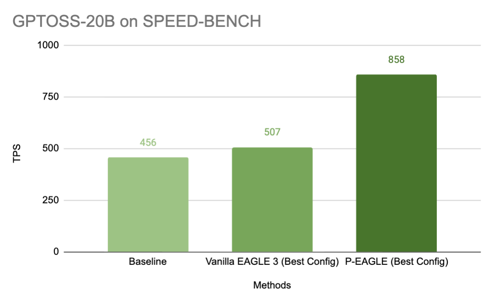
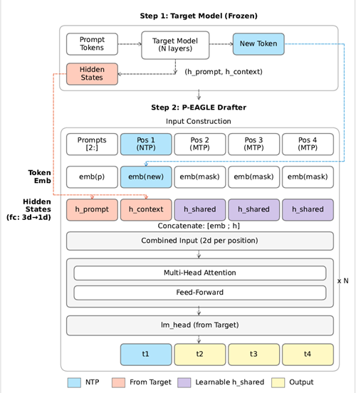
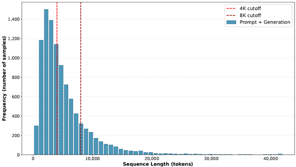
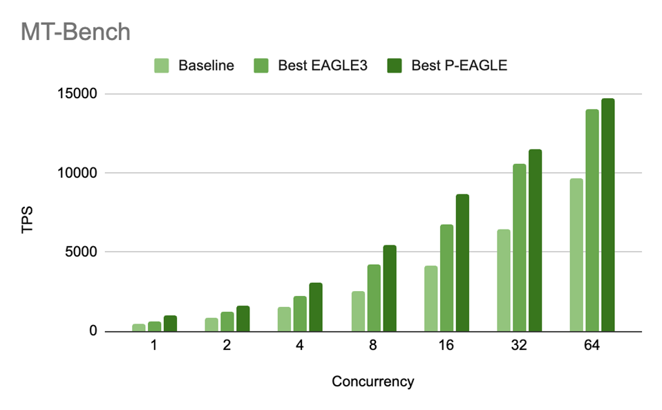
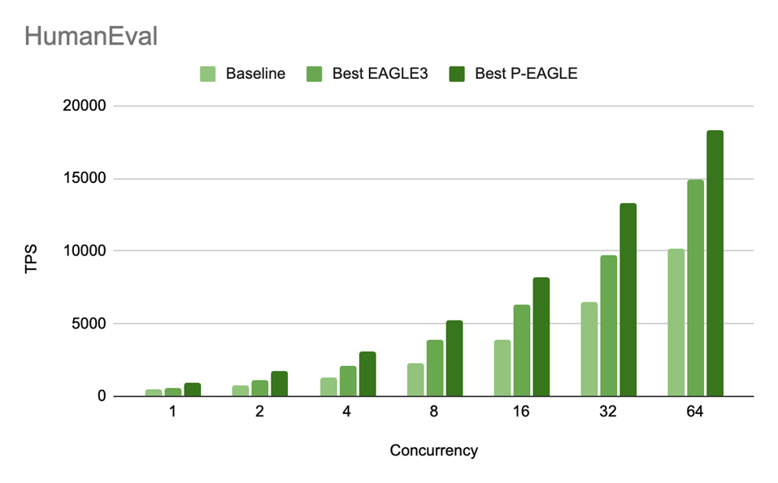
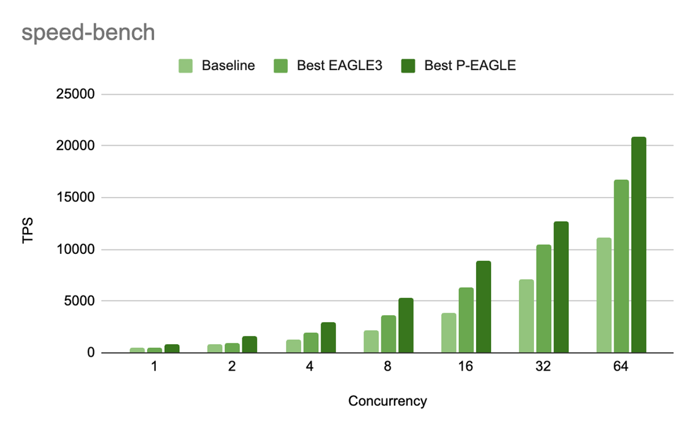

# P-EAGLE：一次前向猜 K 个字

英文对照：[en/vllm/blog/performance/p-eagle.md](../../../../en/vllm/blog/performance/p-eagle.md)  
原文：https://vllm.ai/blog/2026-03-13-p-eagle  
2026-03-13。署名 **Amazon and NVIDIA Team**。也发在 [AWS Blogs](https://aws.amazon.com/blogs/machine-learning/p-eagle-faster-llm-inference-with-parallel-speculative-decoding-in-vllm/)。学习笔记。进 vLLM 从 [v0.16.0](https://github.com/vllm-project/vllm/releases/tag/v0.16.0) 起（PR [#32887](https://github.com/vllm-project/vllm/pull/32887)）。开关：`"parallel_drafting": true`。下面数字除非另写模型，都是 **一块 NVIDIA B200**、GPT-OSS-20B。

[EAGLE](https://arxiv.org/pdf/2503.01840) 是投机解码的当时 SOTA，可自回归草稿自己有顶：猜得越多，draft 前向排得越长。**P-EAGLE** 一次前向吐出全部 K 个 draft token。原文标题数字：真实负载、B200 上相对 vanilla EAGLE-3 最高 **1.69×**。

和 [投机解码主线](spec-decode.md)（验收数学）、[并行草稿总览](parallel-drafting.md)（P-EAGLE / DFlash / DSpark 放在一起）一起读。训练仍要 verifier hidden，导出路径见 [extract-hidden-states](../architecture/extract-hidden-states.md)。

原文列出的材料：

- 论文：[arXiv 2602.01469](https://www.arxiv.org/pdf/2602.01469)
- HuggingFace：[GPT-OSS 120B](https://huggingface.co/amazon/gpt-oss-120b-p-eagle)、[GPT-OSS 20B](https://huggingface.co/amazon/GPT-OSS-20B-P-EAGLE)、[Qwen3-Coder-30B-A3B-Instruct](https://huggingface.co/amazon/Qwen3-Coder-30B-A3B-Instruct-P-EAGLE)
- vLLM：[Unified Parallel Drafting PR #32887](https://github.com/vllm-project/vllm/pull/32887)
- Speculators：[RFC](https://github.com/vllm-project/speculators/issues/292)、[PR](https://github.com/vllm-project/speculators/pull/343)



**Figure 1。** SPEED-BENCH 上 P-EAGLE 对照其他方法，并发 **1**，一块 B200。

## Quick start

`SpeculativeConfig` 上一个字段（原文里的 `# vllm/config/speculative.py` 是代码注释，不是小节标题）：

```python
# vllm/config/speculative.py
   parallel_drafting: bool = True
```

挂上能并行草稿的 drafter head：

```bash
vllm serve openai/gpt-oss-20b \
   --speculative-config '{"method": "eagle3", "model": "amazon/gpt-oss-20b-p-eagle", "num_speculative_tokens": 5, "parallel_drafting": true}'
```

HuggingFace 上已有 GPT-OSS 120B、GPT-OSS 20B、Qwen3-Coder 30B 的预训练头。下载（或自己训）一只并行头，再开 `"parallel_drafting": true`。

## EAGLE's Drafting Bottleneck

EAGLE 相对普通自回归解码大约 **2–3×**，vLLM、SGLang、TensorRT-LLM 里都能见到。草稿仍是 **自回归**：K 个 draft token 要 **K** 次 draft 前向。草稿越能写长，这段税就越按投机深度线性涨，K 不敢开太大。

## Our Approach: Parallel-EAGLE (P-EAGLE)

P-EAGLE 把 EAGLE 从自回归草稿改成并行生成。B200 上、GPT-OSS 20B、对照 vanilla EAGLE-3：MT-Bench、HumanEval、SpeedBench 上 **1.05×–1.69×**。已经进 vLLM。

K 个 draft token 来自 **一次** 前向。两步（Figure 2）。

**Step 1: Prefilling。** Target 走完 prompt、吐一个新 token，和平时推理一样。P-EAGLE 沿途抓住 hidden：每个 prompt 位置的 `h_prompt`，新 token 的 `h_context`。和自回归 EAGLE 这一步相同。

**Step 2: P-EAGLE Drafter。** 每个位置的输入是 token embedding 拼上一段 hidden。

- **Prompt 位置：** `emb(p)` 配对应的 `h_prompt`。移位约定和自回归 EAGLE 一样：位置 *i* 吃 *i−1* 的 token 和 hidden，用来预测 token *i*。
- **位置 1，Next-Token-Prediction (NTP)：** 新 token 的 `emb(new)` 配 `h_context`。和标准自回归 EAGLE 一样。
- **位置 2 到 K，Multi-Token-Prediction (MTP)：** 该有的 embedding 和 hidden 还不存在。用两个 **学出来的** 参数填：共享 mask embedding `emb(mask)`，共享 hidden `h_shared`。训练出来的中性占位。

这些位置一起过 **N** 层 transformer，再过 LM head，一次前向给出 `t1, t2, t3, t4`。



**Figure 2。** P-EAGLE 结构：Prefill 仍像 EAGLE，然后一次并行 drafter；MTP 槽用 mask / 共享 hidden 占位。

## Training P-EAGLE on Long Sequences

推理模型会写很长。Figure 3：GPT-OSS 120B 在 UltraChat 上（prompt + 生成），reasoning level **Medium**——中位数 **3,891** token，P90 **10,800**。Draft 模型训练时的上下文长度得跟上。



**Figure 3。** UltraChat 上 GPT-OSS 120B 的序列长度（prompt + 生成）。

并行草稿会把训练显存 **放大**。长度 N 的序列上 K 组并行 → **N × K** 个位置。**N = 8,192**、**K = 8**，一条样本就是 **65,536** 个位置。Attention 是每个位置看所有合法位置：**65K × 65K** 超过 **40 亿** 个元素，bf16 要 **8 GB**。

Position sampling（[An et al., 2025](https://arxiv.org/pdf/2504.18583)）随机跳位置能省显存，跳得太狠草稿质量会掉。Gradient accumulation 是按 **不同样本** 切开的；**一条** 序列自己就装不下时，没有可切的对象。

这篇给出的办法：序列内切块的 **sequence partition**。把 N × K 切成连续块，跨块边界保住 attention 依赖，同一条序列的块之间累加梯度。细节在 [论文](https://arxiv.org/pdf/2602.01469)。

## Implementation in vLLM

### Parallel drafting challenges

不少投机设置里，草稿和验收共用每条请求的 token 布局。EAGLE 大致如此：drafter 窗口已经和 verifier 要查的对齐——K 个草稿再加一个多采出来的 token。

并行草稿把这层一致性拆掉。一次 drafter 前向猜 K 个，就要在后面补 MASK 占位（例如 `[token, MASK, MASK, …]`）。这些槽 **只为草稿存在**，draft batch 形状不再等于 verification batch。验收侧的 metadata 不能复用。要重建：把 input token ID、hidden、position 扩出 mask 槽；按请求递增 position；再按新的 position 重算 slot mapping 和每条请求的起始下标。

### The Triton Kernel

重建不能太贵，所以用一只 **融合 Triton kernel**，在 GPU 上从 target batch 填出 drafter 输入。一次过：

- 把 target batch 里上一轮的 token ID 和 position 拷到新槽
- 插入 target 采出来的每条请求 **bonus token**
- 并行草稿多出来的槽填上特殊 MASK token ID
- 顺手写出轻量 metadata：rejected-token mask、并行槽的 masked-token mask、采样 draft token 用的 new-token 下标、hidden-state mapping

否则就是一串 GPU op（copy/scatter + insert + fill + mask + remap）。融进一只 kernel，少启动、少来回搬内存。

### Hidden State Management

EAGLE 系要把 hidden 交给 draft，这块单独填。Hidden 比 batch 其余部分大得多，所以工作拆开：Triton kernel 出一张 **mapping**；另开 copy kernel，把学到的 hidden 占位广播进 mask 槽。

```python
# Copy target hidden states to their new positions
self.hidden_states[out_hidden_state_mapping] = target_hidden_states

# Fill masked positions with the learned Parallel Drafting hidden state
mask = self.is_masked_token_mask[:total_num_output_tokens]
torch.where(
    mask.unsqueeze(1),
    self.parallel_drafting_hidden_state_tensor,
    self.hidden_states[:total_num_output_tokens],
    out=self.hidden_states[:total_num_output_tokens],
)
```

`parallel_drafting_hidden_state_tensor` 来自模型的 `mask_hidden` buffer：告诉模型这些位置该去预测未来 token 的学出来的表示。

KV cache 的 slot mapping：合法 token 走正常槽；被拒绝的映到 `PADDING_SLOT_ID`（**-1**），免得脏写 cache。CUDA graph：capture 范围要加 **K × max_num_seqs**，才能装下变大的 draft batch。

## vLLM Benchmarking on P-EAGLE

在 GPT-OSS-20B 上训 P-EAGLE。三套基准：[MT-Bench](https://arxiv.org/abs/2402.14762)（多轮指令）、[SPEED-Bench](https://huggingface.co/datasets/nvidia/SPEED-Bench) Code（偏长的代码生成）、[HumanEval](https://github.com/openai/human-eval)（函数级合成）。对照公开的 [vanilla EAGLE-3 checkpoint](https://huggingface.co/RedHatAI/gpt-oss-20b-speculator.eagle3)：低并发（**c=1**）吞吐高 **55–69%**，高并发（**c=64**）仍高 **5–25%**。图是 Figure 4–6。

Drafter：轻量 **4 层**，训到一次并行最多猜 **10** 个 token。扫描投机深度 **K ∈ {3, 5, 7}**、并发 **C ∈ {1, 2, 4, 8, 16, 32, 64}**。目的：给 P-EAGLE 和 vanilla EAGLE-3 各找合适的部署配置。两边都用 **linear drafting**。「best P-EAGLE」/「best EAGLE-3」= 该 serving 条件下 **TPS** 最高的那个 K。

原文里的稳定形态：P-EAGLE 在 **所有** 并发上都在 **K=7** 达到峰值 TPS。Vanilla EAGLE-3 峰值常在 **K=3**，偶尔随并发往更深挪一点。并行草稿的深度几乎是一次前向买断；自回归 drafter 每多猜一个就要再付一次前向。

硬件和 serving 配置：**一块 NVIDIA B200（Blackwell）**。

```bash
VLLM_USE_FLASHINFER_MOE_MXFP4_MXFP8=1 \
vllm serve openai/gpt-oss-20b \
    --speculative-config '{
      "method": "eagle3",
      "model": "amazon/GPT-OSS-20B-P-EAGLE",
      "num_speculative_tokens": 7,
      "parallel_drafting": true}' \
    --port 8000 \
    --max-num-seqs 1024 \
    --max-model-len 100000 \
    --max-num-batched-tokens 100000 \
    --max-cudagraph-capture-size 4096 \
    --no-enable-prefix-caching \
    --no-enable-chunked-prefill \
    --kv-cache-dtype fp8 \
    --async-scheduling \
    --stream-interval 20
```

**原文注。** 当时用 EAGLE drafter serve GPT-OSS-20B，还要打一行 vLLM 补丁（[PR #36684](https://github.com/vllm-project/vllm/pull/36684)）。启动前先打上。帖子写着预期会进随后的发版。



**Figure 4。** MT-Bench 吞吐（TPS），P-EAGLE vs EAGLE-3，GPT-OSS-20B。P/E：**1.55×**（c=1）、**1.29×**（c=2）、**1.35×**（c=4）、**1.28×**（c=8）、**1.27×**（c=16）、**1.09×**（c=32）、**1.05×**（c=64）。



**Figure 5。** HumanEval TPS。P/E：**1.55×**（c=1）、**1.53×**（c=2）、**1.45×**（c=4）、**1.35×**（c=8）、**1.31×**（c=16）、**1.37×**（c=32）、**1.23×**（c=64）。



**Figure 6。** SPEED-Bench TPS。P/E：**1.69×**（c=1）、**1.61×**（c=2）、**1.54×**（c=4）、**1.45×**（c=8）、**1.40×**（c=16）、**1.22×**（c=32）、**1.25×**（c=64）。

吞吐还跟 **acceptance length (AL)** 走：每一轮投机被 verifier 接受的 draft token 平均数。AL 高，草稿活成真正输出的比例就高，有效 OTPS/TPS 跟着涨。

**P-EAGLE（AL）：**

| Config | HumanEval | SPEED-Bench | MT-Bench |
| --- | ---: | ---: | ---: |
| K=3 | 3.02 | 2.87 | 2.87 |
| K=7 | 3.94 | 3.38 | 3.70 |

**EAGLE-3（AL）：**

| Config | HumanEval | SPEED-Bench | MT-Bench |
| --- | ---: | ---: | ---: |
| K=3 | 2.65 | 2.24 | 2.70 |
| K=7 | 3.03 | 2.59 | 3.27 |

同一 K，P-EAGLE 的 AL 更高。**K=7**：HumanEval **+30%**（3.94 vs 3.03），SPEED-Bench **+31%**（3.38 vs 2.59），MT-Bench **+13%**（3.70 vs 3.27）。更深的投机对 P-EAGLE 更划算：K=3 → K=7，HumanEval AL **+0.92**（3.02 → 3.94），EAGLE-3 只 **+0.38**（2.65 → 3.03）。一次过的并行草稿，K 加大不会再付一串前向。

原文 **没有** 在表里写出绝对 TPS——只有 AL、图注里的 P/E，以及 55–69% / 5–25% 那句总括。

## Reproducing the Results

Server 起来之后用 `vllm bench serve`：

```bash
# MT-Bench
export MODEL="openai/gpt-oss-20b"
export BASE_URL="http://localhost:8000"
vllm bench serve \
    --dataset-name hf \
    --dataset-path philschmid/mt-bench \
    --num-prompts 80 \
    --max-concurrency 1 \
    --model $MODEL \
    --base-url $BASE_URL \
    --temperature 0.0 \
    --hf-output-len 2048

# HumanEval：先下载 openai/openai_humaneval
vllm bench serve \
    --dataset-name custom \
    --dataset-path <dataset path> \
    --num-prompts 164 \
    --max-concurrency 1 \
    --model $MODEL \
    --base-url $BASE_URL \
    --temperature 0.0 \
    --custom-output-len 2048
```

这一节原文没有贴 SPEED-Bench 的 `vllm bench serve` 命令。

## Conclusion

P-EAGLE 拆掉草稿的顺序瓶颈：文中负载上相对 vanilla EAGLE-3 最高 **1.69×**。草稿个数不再等于前向次数，更大的 drafter 结构变得有意思——接受率甚至可以高于单层基线。vLLM 这条实现用融合 kernel 处理输入准备、attention metadata、KV slot mapping。它需要专门训过的模型；原文仍把它当成投机解码里值得加的一档。

并行训好的头会越来越多，作者预期这会变成生产默认。试法：HuggingFace 下一只预训练 P-EAGLE 头，支持的模型上打开 `"parallel_drafting": true`。

## Acknowledgement

**AWS：** Xin Huang、Florian Saupe、Jaime Campos Salas、Ashish Khetan、George Karypis。

**NVIDIA：** Benjamin Chislett、Max Xu、Zeyuan (Faradawn) Yang、Kaihang Jiang、Xin Li、Omri Almog。

也感谢 vLLM 维护者和社区的评审、指导和把这套功能接进去的基础设施。
