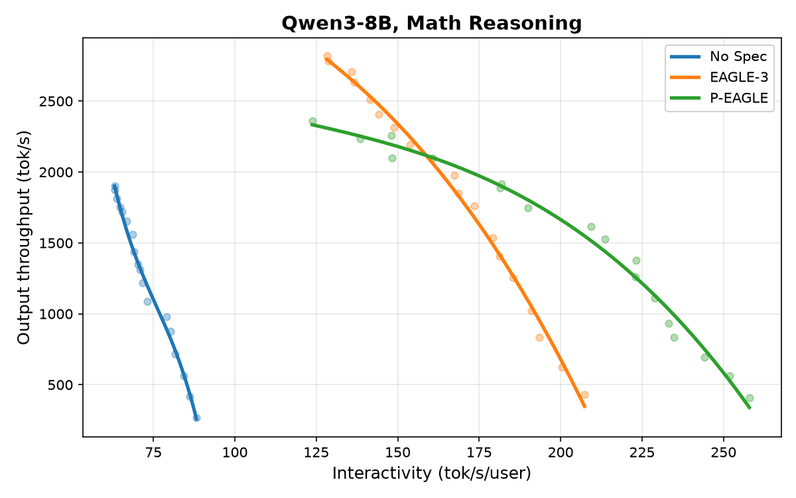
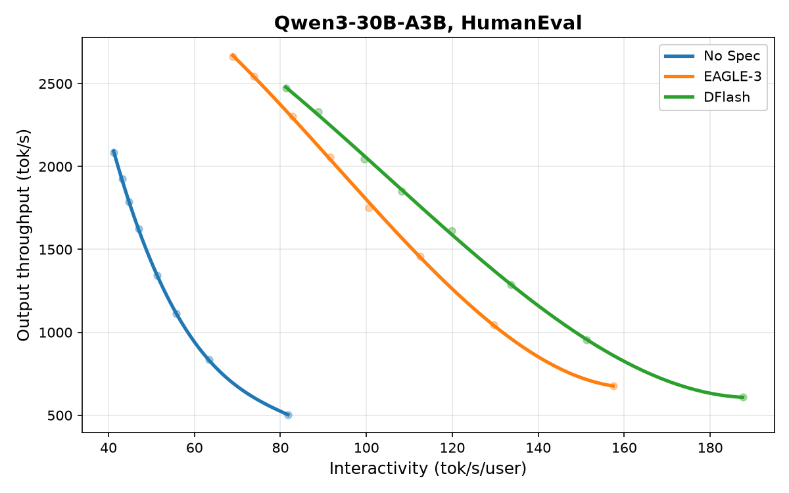
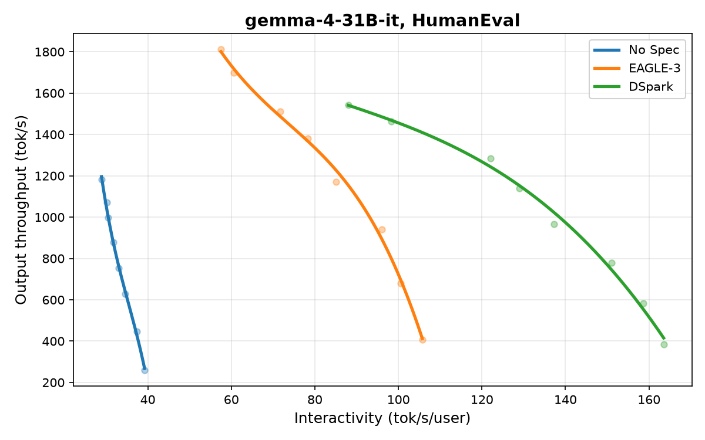
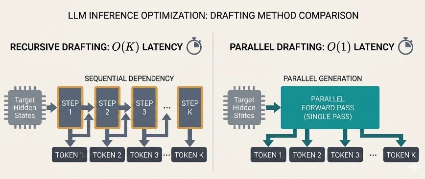
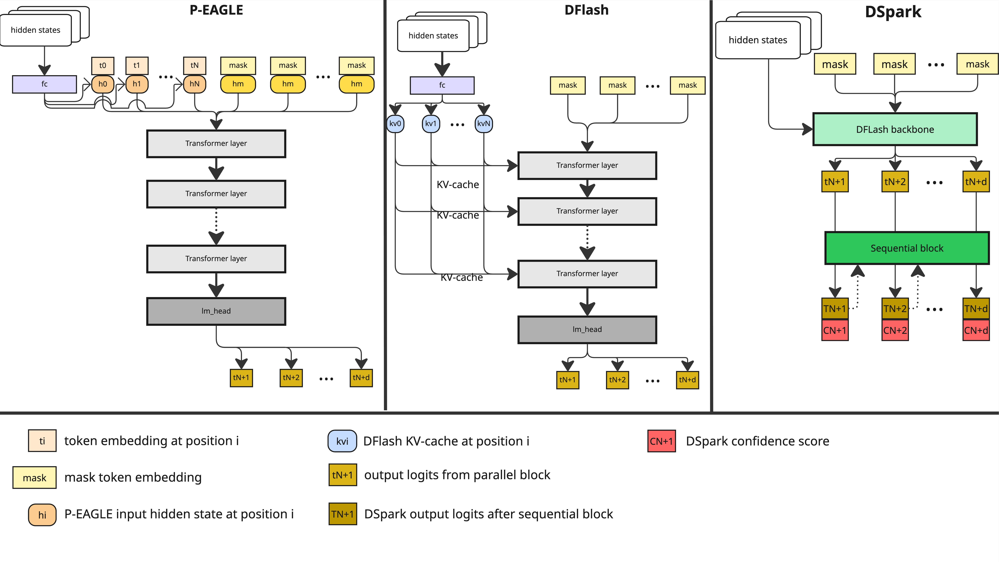

# 并行草稿：P-EAGLE / DFlash / DSpark

英文对照：[en/vllm/blog/performance/parallel-drafting.md](../../../../en/vllm/blog/performance/parallel-drafting.md)  
原文：https://vllm.ai/blog/2026-07-28-speculators-parallel-drafting  
**勘误 2026-07-29**：Figure 1 的环境有 bug，相对排名没变，绝对值请以勘误后为准。

[P-EAGLE](p-eagle.md) 把「K 次草稿前向」压成一次。同一条路上还有 DFlash、DSpark：草稿不再自回归排队，而是一次前向铺开 K 个候选。验收仍是 **rejection sampling**——无损，target 分布不变。


本地图（原文版权仍归原站；学习对照用）：











## 怎么开

DFlash 示例（具体 checkpoint 以原文 / Speculators 仓库为准）：

```bash
vllm serve <target> \
  --speculative-config '{"method":"dflash","model":"<dflash-head>","num_speculative_tokens":K}'
```

P-EAGLE 走 `method: eagle3` + `"parallel_drafting": true`。DSpark 自适应验收见 [dspark-adaptive](dspark-adaptive.md)。

并行草稿的峰值 K 往往比线性 EAGLE-3 更大：深度几乎免费，线性草稿每多猜一个字多一次前向。和 [投机解码主线](spec-decode.md) 一起读：这里改的是 **草稿怎么长出来**，不是验收数学。
