# 怎样把 vLLM 保持在「能上线」的质量

英文对照：[en/vllm/blog/performance/production-quality.md](../../../../en/vllm/blog/performance/production-quality.md)  
原文：https://vllm.ai/blog/2026-07-16-keeping-vllm-production-quality  
2026-07-16。数字会过时：当时 **86K+** stars、每月 **5.6M** pip、**2.5M** 镜像、**1000+** 模型架构、**600+** 加速器。2026 年 6 月 main 合入 **1,918** 个 commit（日均 64，跟 PyTorch / Kubernetes 一个量级），CI **1,300 万** job-minute，峰值 **1,400** 并发 runner。H100 上干净的改动，可能在 AMD 编不过、在 B200 变慢、在某一个 backend 把输出拧歪一点。让 vLLM 值得用的那块面积，就是每一颗 commit 都要守住的面积。

这篇讲流程，不讲 kernel。从 PR 到一个版本，三层门：

1. **CI** — 抓住会响的崩，每个 PR。
2. **夜间性能 / 精度** — 抓住不响的慢和错，CI 负担不起的那些 e2e。
3. **发布** — 哪一颗 commit 能出门，再编 wheel 和镜像。

本地图（原文版权仍归原站；学习对照用）：

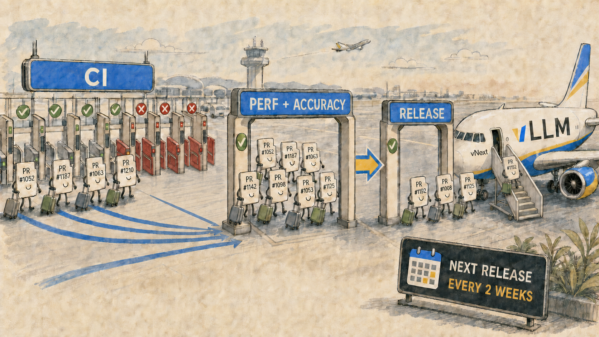

## Layer 1：CI

### 按 diff 动态组测

每个 PR 先过轻量 **GitHub Actions**（lint、format）。committer 点头后，重的单测上 **Buildkite**。

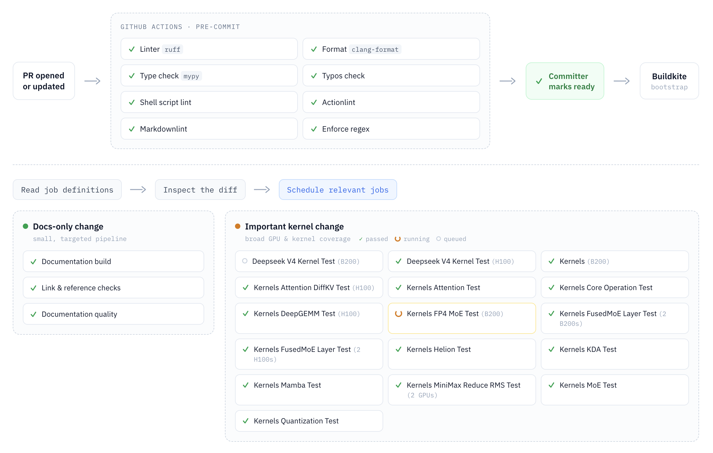

bootstrap 读 job 定义、看 diff，只调度相关组。改文档可能几条；动重要 kernel 可能 **100+** 并行。全套当时 **37** 组、**266** 个 job——从各种 kernel 到投机解码、LoRA，一组少则两条、多则几十，许多测试一次踩好几块。

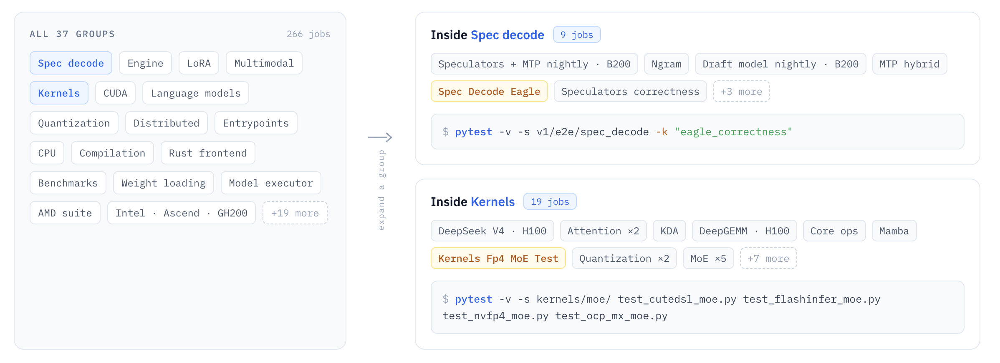

### 环境必须每次一样

两种漂移：机器环境各玩各的；依赖在你眼皮底下换版本。共享容器管前者，锁死的依赖图管后者。

**同一张镜像，每台机器。** 266 个 job 散在几十种机型上，最快把结果变成不可信的办法，就是让每个 job 自己搭一套略不同的环境。多数 job 拉同一张图，一次构建、到处复用。Dockerfile 分阶段：

- `base` — CUDA 工具链
- `build` — 在上面编 wheel
- `runtime` — 装上这些 wheel 和运行时依赖

然后分叉：加 serving 入口 → **发布镜像**；加测试依赖 → CI 拉的 **`test` 镜像**。共同祖先，测的和发出去的才贴得近。B200 上的 kernel 测和 L4 上的 entrypoints 测，看见的是同一串字节。

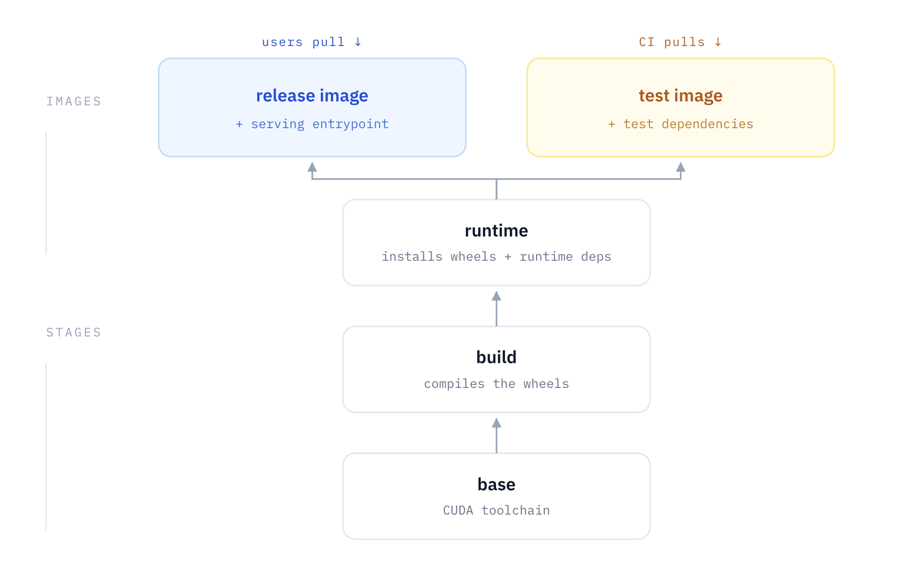

**同一组版本，每次运行。** 没钉死的依赖让同一条测试周一过、周三炸。你把中间所有代码改动读完，谁都不像凶手。几小时后才明白：**FlashInfer** 周三发了新版，构建默默接上了。它从来不是一个人：**nixl**、**transformers** 和传递依赖都咬过——原因埋在下一层。

于是用 `pip-compile` 把顶层依赖编成 lockfile，**连传递依赖一并钉死**。锁会定期更新，每次跑全套 CI。从此依赖引起的崩不再是日常头痛。

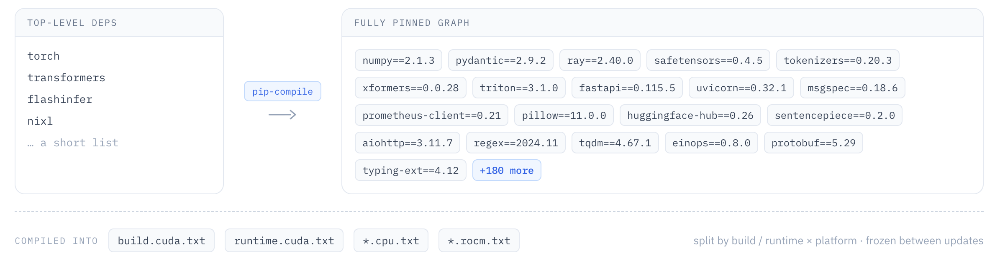

### 异构、多家捐卡的舰队

每个 job 进 Buildkite 上的一条 **runner 队列**（一种硬件画像）。例如 `gpu_1` 是带 L4 的 VM；`b200` 是里面有 B200 的 K8s 集群。空闲 runner 领下一份活，跑完回报。

当时 **58** 个队列，硬件来自多家伙伴。他们买不起、也管不过来这么多机器；覆盖面来自捐助。

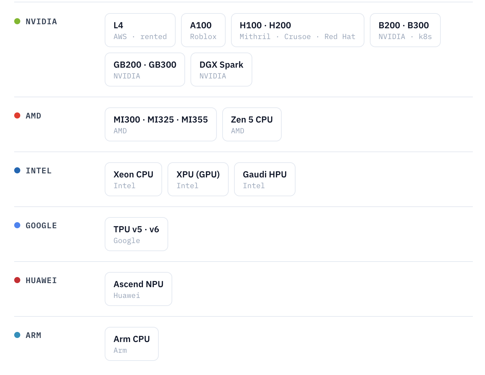

伙伴脾气不同：有的把权限整把递过来，有的自己管铁，有的安全护栏很紧。胶水是 **Buildkite agent**：跑在**捐助方环境里**，**出站 HTTPS** 去领活。Buildkite 不主动连进来——不必开入站、VPN，也不必把内网交给他们。

agent 跑命令、回流日志、回报退出码。常驻的继续等；一次性的干完就退出。

两种跑法：

- **单机**（他们的 8×A100，或一台 Arm 服务器）：装 agent、指向队列、永远转。

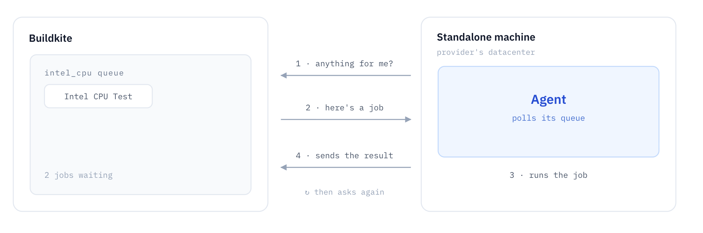

- **Kubernetes**，用 [Buildkite Agent Stack for Kubernetes](https://github.com/buildkite/agent-stack-k8s)：controller 把匹配的 job 变成一个 K8s Job、一个 Pod。他们推荐这条——不必在每个节点上装 agent，把 stack 加进集群即可。

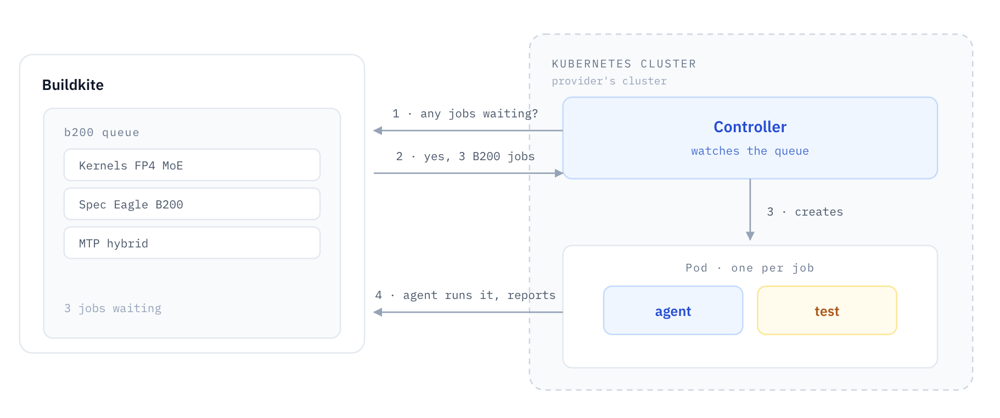

他们这边的入驻：建队列、给 token，对方自己把 agent 拉起来。不必碰机器。所以才能测到「一年值数百万美元」的捐助舰队。

### 硬件要用满

需求很大，算力有硬顶。

**大卡切 MIG。** 多数 CI job 模型很小，用不满一张卡。NVIDIA MIG：一张 H200 切成 **7 片 18 GB**，7 个 job 共用。图里是 **8 张 H200 → 56 片**。他们算过：很多时候切大卡，比租一堆小卡便宜。

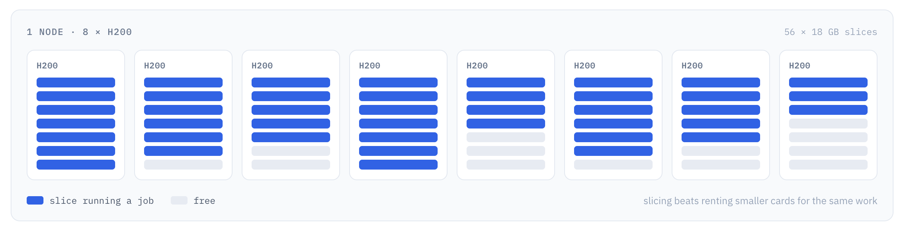

**从零扩缩，一机一 job。** 按小时租的队列：有活就开机，没活就 **scale to zero**。每台机器领一个 job、容器里跑完、关机。附带好处：每次都是新机器，旧运行的脏状态带不走。

**能复用就别重做。** 最慢、最贵、最重复的两件事：(1) 整条流水线共用的 Docker 镜像（编 CUDA kernel、装依赖）；(2) 从 Hugging Face 拉权重。

- **Docker layer** — registry 缓存，连依赖一起。
- **builder 的 warm-cache AMI** — 夜间 job 把最新层烤进 AMI，builder 起来就贴近 main。
- **sccache** — C++/CUDA 产物进 **S3**。所有 builder 能**读**；只有 **main 分支**的 builder 能**写**。
- **权重** — 每个集群下一次到共享盘，job 本地读，不必每次拉几个 GB。

### 让 CI 自己的健康看得见

一天几百次运行，每次几百个 job。队列悄悄积到几小时；某条测试二十次里飘一次；某个 job 比上个月慢十分钟。

他们照着 PyTorch 的 [hud.pytorch.org](https://hud.pytorch.org/) 做了 [ci.vllm.ai](https://ci.vllm.ai/)。每 **15 分钟**把 Buildkite 数据灌进 **Databricks** 和 **ClickHouse**。看板上的例子：`main` 现在健康吗？（文中配图：过去三天不健康——而且 job 为什么跑了 10 小时？）

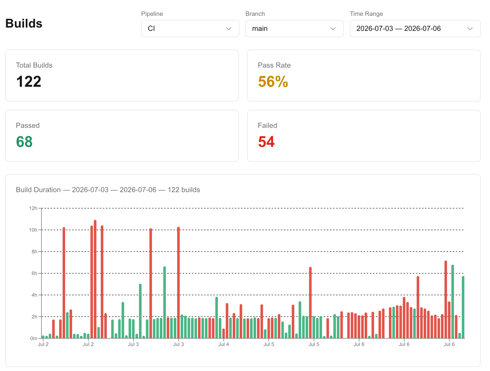

### 失败检测自动化

看板让人看见问题。下一步是缩短「看见 → 定罪」的时间，当然要上 agent。

每天夜里 **CI-analyzer bot** 跑全套、跟昨夜比。新挂的，它读日志、分类、在中间那些 commit 里找罪魁，丢 Slack，附带回滚 PR。大约每天 **1.5** 个自动 revert PR，罪名找对约 **70%**——on-call 从一份诊断开始，而不是一张白纸。文中点名社区，尤其 Red Hat 的 on-call 轮值。

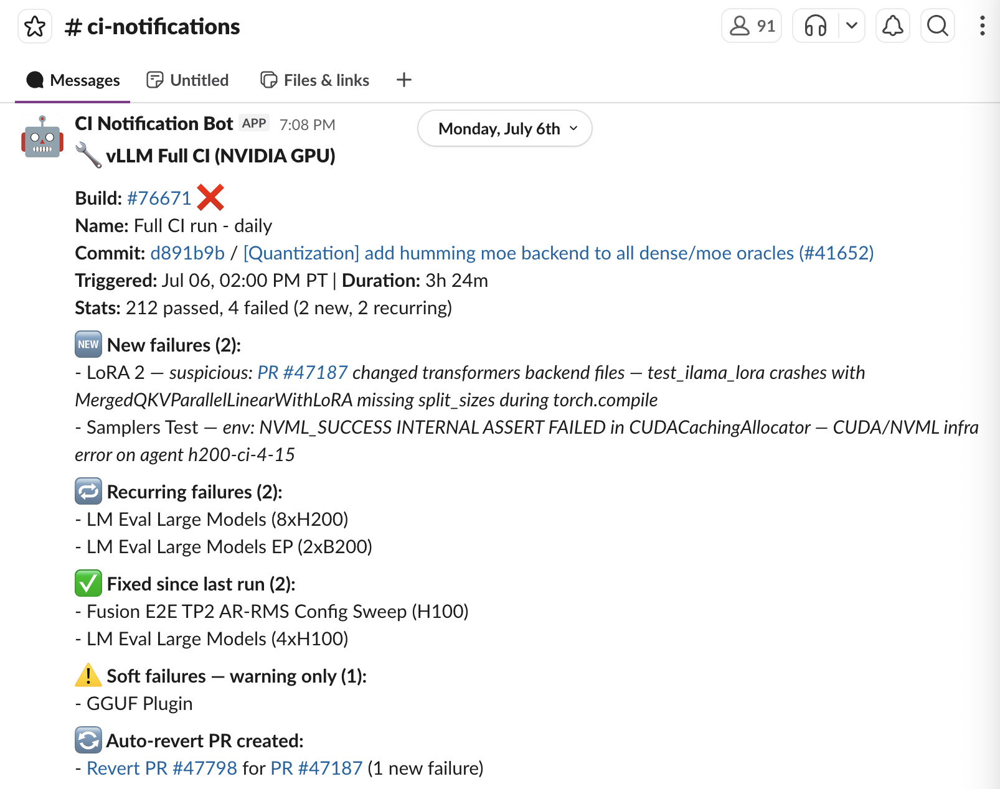

### 绿灯仍不够

宽的单测、巨大的舰队、一致的环境、被盯着的健康。合并风险降了。为了快和便宜，CI 仍会跳过很多 e2e，更不会紧密模拟用户每天在干的事。改动可以通过所有测试，仍然让模型变慢或变错。那是第二层的活。

## Layer 2：夜间性能与精度

那年五月，他们发了 **v0.20.0**，几天内连打 **v0.20.1**、**v0.20.2**。漏过两件事：

- `gpt-oss` 在 **Blackwell** 上 **TP > 1** 挂了。
- `DeepSeek V4` 在 **GB200** 上吞吐塌了。

当时还没有 benchmarking 流水线；没有东西在那种硬件上把这些模型从头跑到尾。性能回退很少会崩——server 起来，请求成功，用户只是每秒少几个 token，或第一个字等得更久。精度回退更安静：返回合法回答，答案是错的。第二层就是那套「本该在 v0.20.0 出门前拦住它」的系统。

### 每夜一张模型 × 加速器矩阵

仓库：[https://github.com/vllm-project/perf-eval](https://github.com/vllm-project/perf-eval)。每份配置：怎么起 server、什么参数、什么模型、什么卡、跑哪些任务。

每份负载大致三件事：

- 性能 — TTFT、TPOT 以及别的，用 `vllm-bench`
- 数学 / 推理精度 — GSM8K、GPQA、AIME，用 `lm-eval`
- 函数调用 — Berkeley Function-Calling Leaderboard（**BFCL**）

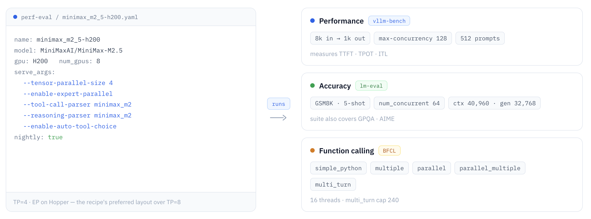

每夜，以及每个 release candidate。当时选中的模型：DeepSeek V4 Pro/Flash、gpt-oss、Kimi K2.5、MiniMax M2.5 与 M3、Qwen3.5、GLM 5.1、Gemma 4、Nemotron 3 Super；卡：**H200、B200、MI300X、MI355X**。一共 **17** 条配方，还在长。计划加 GB200/GB300、P/D 分离、更多模型。

### 它一直快吗？

结果进同一块 CI HUD。[Performance dashboard](https://ci.vllm.ai/perf)——文中例子：gpt-oss 120B on H200，TP=8，按 concurrency 切开。

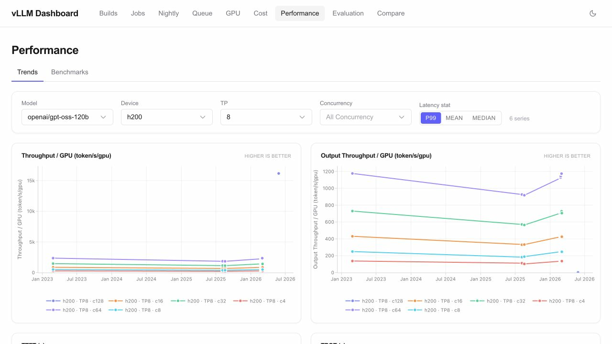

[Compare view](https://ci.vllm.ai/compare) 把两张镜像拍头（RC 对上一个正式版）。

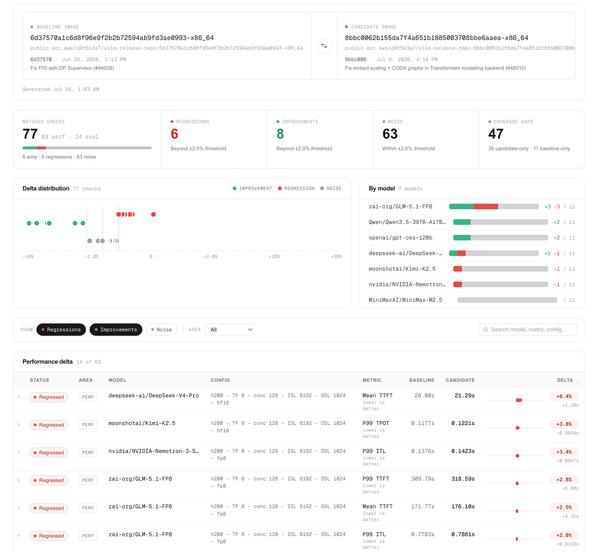

### 它一直对吗？

快而错，速度毫无意义。[Evaluation dashboard](https://ci.vllm.ai/eval) 存聚合分数和误差棒，再点开一条：题目、参考答案、模型原文、抽出来的答案、对错。样本级证据比一个总分好用得多。图：一条做错的 GSM8K。

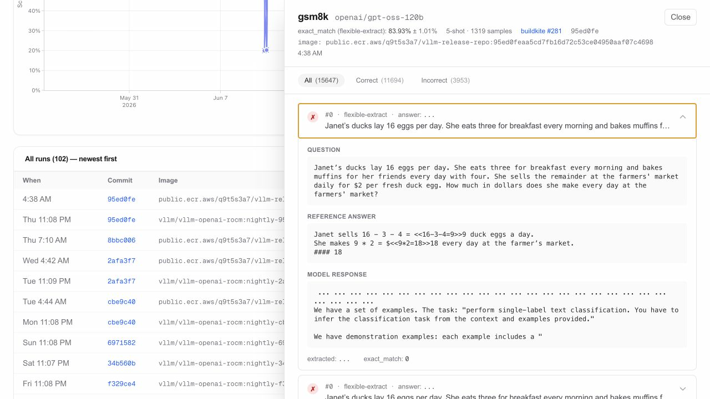

## Layer 3：两周一发

**2025 年 11 月**起两周节奏。他们坚持的理由：

- 改动很快到用户手里（发布从不远离 main）。
- 下游可以按日历计划，不必猜下一班车。
- 二分大约 **500** 个 commit，而不是几千。
- 少一点截止日期的压迫——这班没赶上，两周后再来。
- cherry-pick 干净（几天前的修复，不是一部合并冲突小说）。

每隔一个 **周一** 开始发布周。

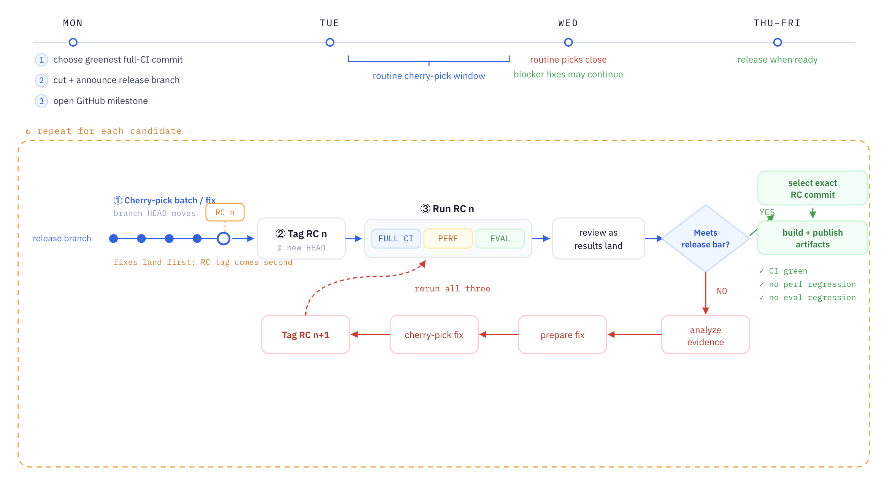

**从最安全的那颗 commit 切。** 发布经理看 `main` 上最近几次全量 CI，挑**最绿**的，在那里切 `releases/vX.Y.Z`，宣布窗口。

**每个 RC 都过重测。** 周一到周三：审 cherry-pick、分批合进发布分支、打成下一个 candidate。每个 candidate 过同一道三门：

- 全量 CI
- 性能套件
- 模型精度套件

结果绑在某一个 candidate 上。后面的 RC 若 CI / 性能 / 评测变了，差的只是几十个 commit。

周三结束普通 cherry-pick 窗口。之后**只收已经在 RC 上暴露的问题的修复**，再打 tag、再过三门，直到有一个过线。

**不降格。** 三门全过才算合格。周末没有合格 candidate，可以。尽量准时，但不为了赶上而松门。文中拿 Rockstar 对 GTA 6 的那句「done when it’s done」开玩笑——他们不会花十年。

**每个平台都要有产物。** 合格 commit → 编所有产物 → **先对编出来的东西做 smoke**，再发布。当时：

**7 个 Python wheel**

- CUDA 12.9 x86_64 / arm64
- CUDA 13.0 x86_64 / arm64
- CPU x86_64 / arm64
- ROCm

**11 张 Docker 镜像**

- CUDA 12.9，x86_64 / arm64，Ubuntu 22.04 / 24.04
- CUDA 13.0，x86_64 / arm64，Ubuntu 22.04 / 24.04
- ROCm
- CPU x86_64 / arm64

## 下一步（文中路线图）

- **自动选测** — 今天按人手维护的映射给每个 PR 挑测试，过时很快。在试 LLM 选测、静态 / 动态分析、给源码路径贴标签去对测试。
- **更快的 time-to-signal** — CI 平均 **1–2 小时** 才给判决；想压到 **30 分钟内**。
- **更瘦的单测** — 很多「unit」其实拉起整台 vLLM server、打真请求，把 CI 拖慢。
- **更正确的 exit code** — 有的 job 失败时仍报错码，比如把基建问题报成测试失败，分诊、告警、重试都会乱。
- **更快抓住并隔离 flaky** — 基建、上游包、或测试本身写得不安全；希望自动抓住、隔离。
- **坏机器自动识别并踢出舰队**，别等它先弄挂一堆 job。
- **更好的告警** — 已有队列拥堵和回退的基本告警；还想要磁盘压力、job 突然失败得*太快*、依赖安装坏掉。
- **覆盖率报告** — 覆盖面宽，但还不能确定每个角落真被跑到。

Slack `#sig-ci`。全职：当时 Inferact 在招（原文 Ashby 链接）。

## 致谢（按原文组织）

不是一个人的事。点名的组织（人名在原文按字母排）：Amazon、AMD、Arm、EmbeddedLLM、Google、HuggingFace、Inferact、Intel、Meta、NVIDIA、Red Hat、Reflection AI；独立贡献者 Cyrus Leung (DarkLight1337)、Yuqi Wang (noooop)、haosdent、Mohammad Angkad。

算力赞助：**AWS、Crusoe、LambdaLabs、Nebius、NVIDIA、Roblox、RunPod**。**Buildkite** 让他们免费用平台跑 CI。Anyscale / Ray 时期的两位老师：Lonnie Liu（后在 OpenAI）、Cuong Nguyen（后在 NVIDIA）。

数字会过时，三层门不会。
