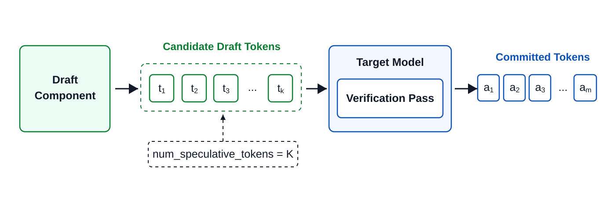
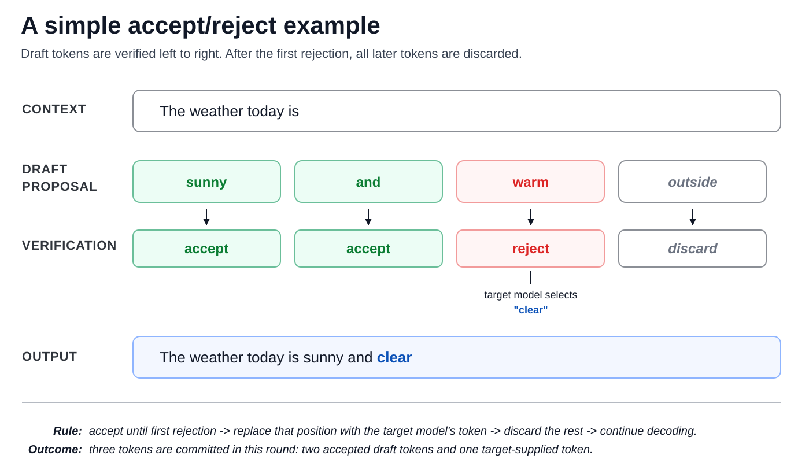
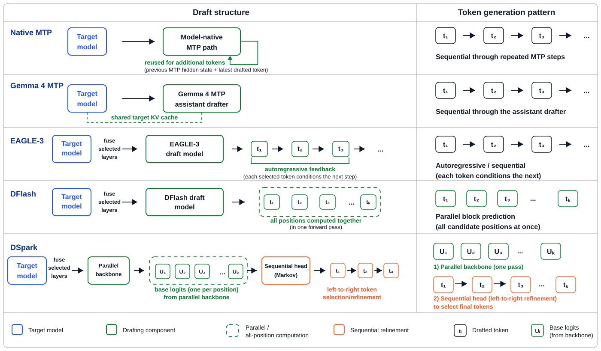

# AMD GPU 上的投机解码：五条草稿路

英文对照：`en/vllm/blog/performance/spec-decode-amd.md`  
原文：https://vllm.ai/blog/2026-08-23-speculative-decoding-amd-gpus  
MI300X / MI355X、ROCm。图和整表在原网页。数字是他们试验环境，不是你机器的承诺。

草稿提出、target 一次验收：无损。五条路：

| 方法 | 草稿怎么长 | 配置要点 |
|---|---|---|
| Native MTP | 模型自带辅助头，顺序猜 | `"method": "mtp"`，不必另给 draft 路径 |
| Gemma 4 MTP | 单独 checkpoint，仍吃 target 激活 | `"method": "mtp"` + `"model"` |
| EAGLE-3 | 三层 hidden 拼起来自回归 | `"method": "eagle3"` |
| DFlash | 一块位置一次前向 | `"method": "dflash"` |
| DSpark | DFlash 骨架 + 轻量因果修正 + 信心前缀 | `"method": "dspark"` |

`num_speculative_tokens` 和 checkpoint 里的物理层数不是一回事：N 大于头深度时会多跑几轮草稿。N 越大不一定更快——后面几位接受率掉下去，草稿税就白付。Gemma 一类演示里 N=3–5 常见 **2.5–2.8×** 输出 TPS；换模型、换草稿、换并发会掉到「几乎没赚」甚至亏。看 per-position 接受率再拧 N。

和 [投机解码主线](spec-decode.md)、[P-EAGLE](p-eagle.md)、[并行草稿](parallel-drafting.md)、[DSpark 自适应](dspark-adaptive.md) 一起读：这篇是 **ROCm 上怎么开、怎么量**，不是新的验收数学。

本地图（原文版权仍归原站；学习对照用）：

