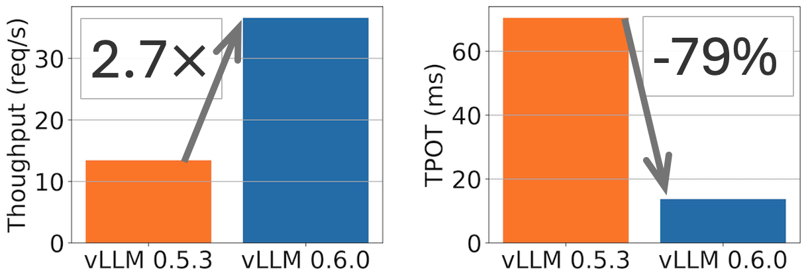
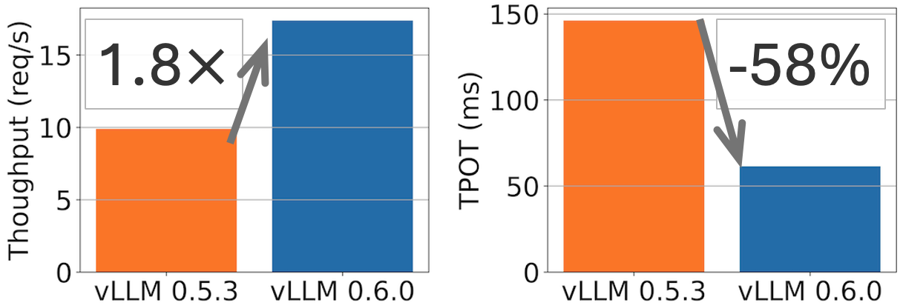
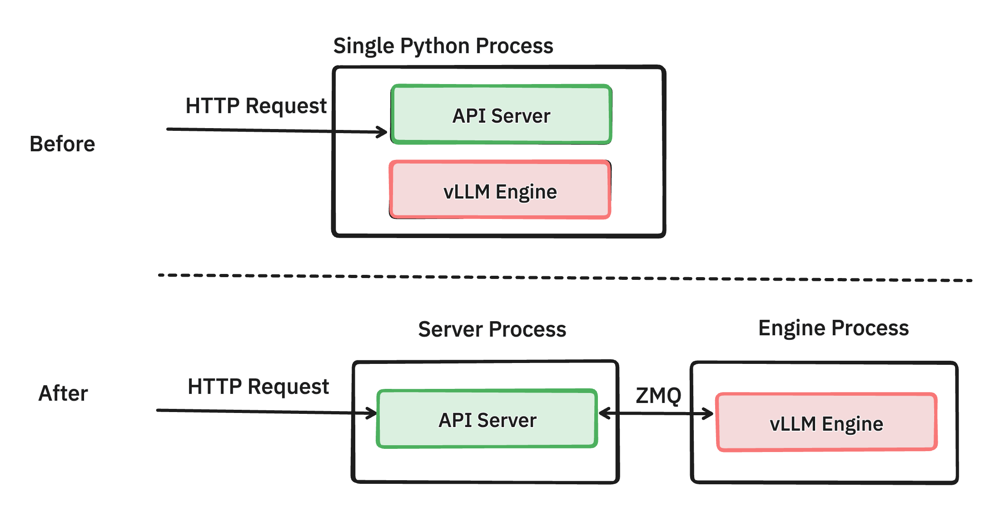
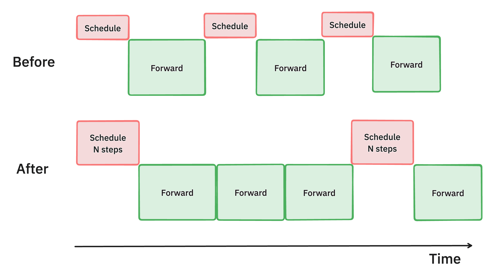
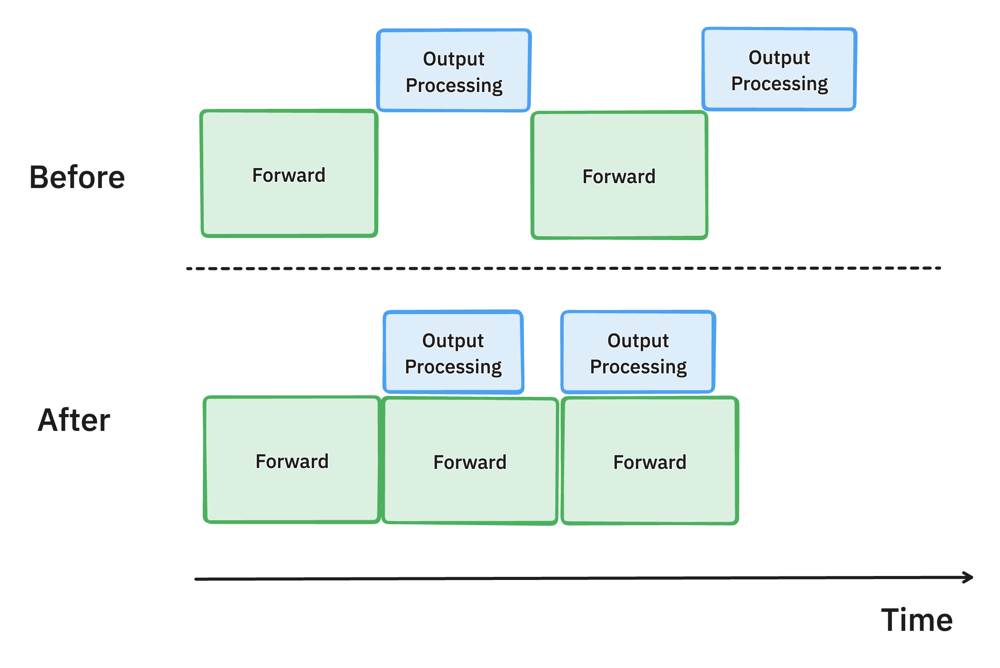
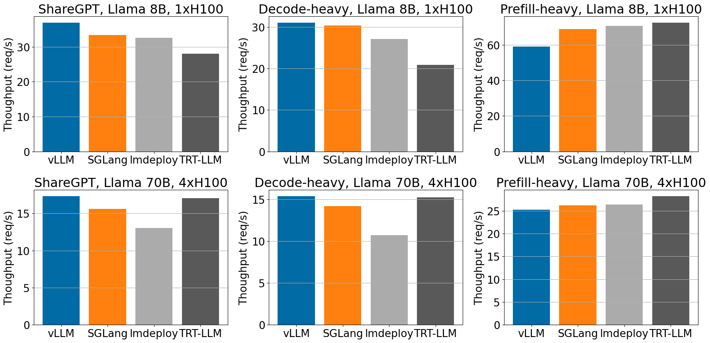
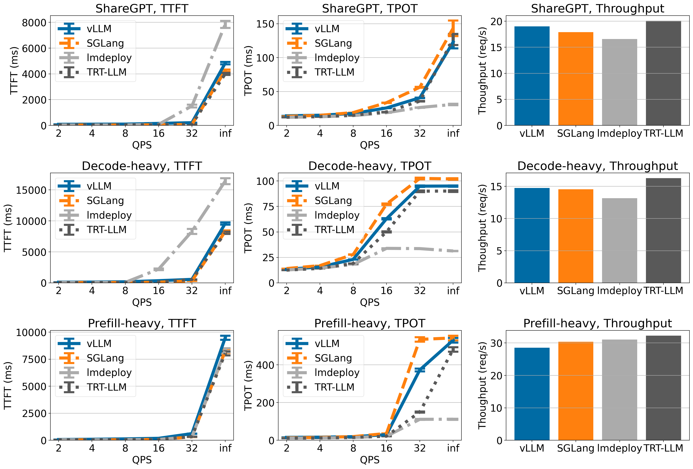
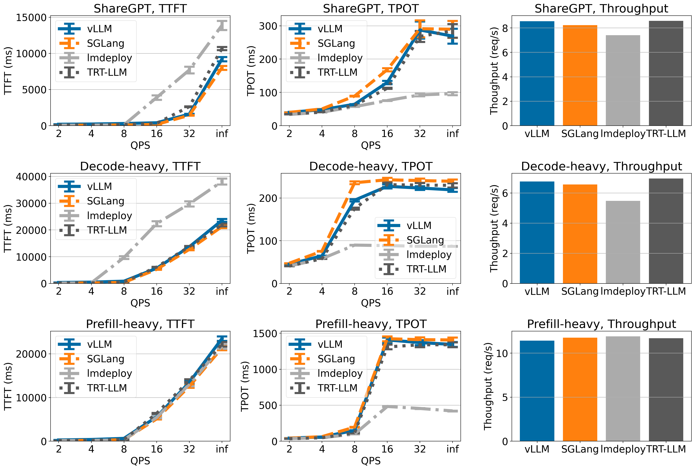
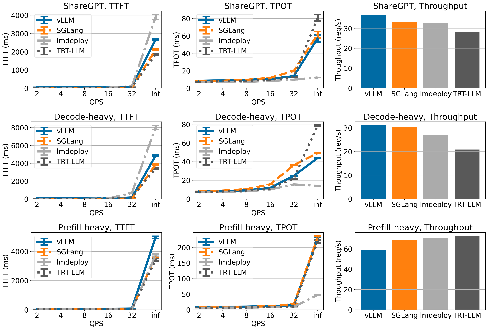
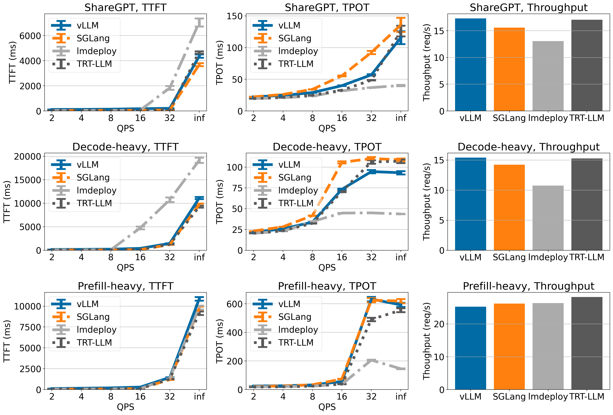

# vLLM v0.6.0：吞吐 2.7×，延迟砍到五分之一

英文对照：[en/vllm/blog/performance/v0.6-throughput.md](../../../../en/vllm/blog/performance/v0.6-throughput.md)  
原文：https://vllm.ai/blog/2024-09-05-perf-update  
2024-09-05。署名 **vLLM Team**。学习译文，不是官方译本。相对 **v0.5.3**。这是 V1 之前那一轮「把 CPU 从 GPU 路上挪开」的成绩单。一个月前他们把性能写成第一优先：[lfai-roadmap.md](../../architecture/lfai-roadmap.md)。后来的 multiprocessing / `EngineCore`：[v1-alpha.md](../../architecture/v1-alpha.md)。

**TL;DR（原文）。** Llama 8B：**2.7×** 吞吐，TPOT 大约 **5×** 更快。Llama 70B：**1.8×** 吞吐，TPOT 大约 **2×**。下文硬件是 **1×H100**（8B）与 **4×H100**（70B）。

本地图（原文版权仍归原站；学习对照用）：

**图注（原文）。** vLLM v0.5.3 对 v0.6.0：Llama 8B on 1×H100，70B on 4×H100；ShareGPT **500** 条。TPOT 在 **32 QPS** 上量。

一个月前，他们放出 [performance roadmap](https://vllm.ai/blog/2024-07-25-lfai-perf)，把性能写成第一优先。这一天发布 **v0.6.0**：相对 v0.5.3，吞吐 **1.8–2.7×**，自称赶上当时的 SOTA，同时还要保住功能和好用。

文章三步：先诊断旧瓶颈，再讲这一个月落地的解法，最后把 v0.6.0 和其他 inference engine 放在一张桌上。

## Performance Diagnosis

LLM 推理是 CPU 和 GPU 的双人舞。大矩阵在 GPU 上；CPU 负责收请求、调度、准备输入。CPU 跟不上，GPU 就闲着等——利用率掉下去，推理也就钝了。

立项那年，优化对象常常是「大模型 + 显存不宽裕的卡」（例如 Llama 13B on NVIDIA A100-40G）。H100 一类更快、更宽的卡来了，模型也更适合推理（GQA、量化），GPU 步时压下去以后，引擎里那些 CPU 活突然变成主角。

**Llama 3 8B、1×H100 的剖析：**

- HTTP API server：**33%** 的总时间。
- 调度：**29%**——收上一步 LLM 结果、排下一步要跑的请求、把这些请求准备成模型输入。
- 真正的 GPU 前向：**38%**。

两件事：

1. **CPU 开销高。** 为了好懂、好贡献，大部分逻辑留在 Python，调度和准备输入用 Python 原生的 List / Dict。那笔税会显形：调度慢，数据准备也慢。
2. **组件之间缺少异步。** scheduler 和 output processor 会同步地堵住 GPU。他们点名两个原因：当年假设「模型执行一定比 CPU 慢」；beam search 这类复杂调度更好写。GPU 于是经常在门口等。

一句话：挡住 GPU 的，是 **CPU 开销**。v0.6.0 用一个月来砍这笔税。

## Performance Enhancements

要让 GPU 忙起来，他们下了几刀。

### Separating API server and inference engine into different processes（[PR #6883](https://github.com/vllm-project/vllm/pull/6883)）

**图注（原文）。** 拆开前后的 serving 进程：HTTP serving 从 vLLM engine 里拆出去，中间 **ZMQ** socket。两坨 CPU 重活彼此隔离。

仔细剖析以后：管网络请求、按 OpenAI 协议把回包格式化，在**流式**、高负载下极吃 CPU。例子：Llama 3 8B 轻载大约 **13 ms** 一个 token，前端每秒要推大约 **76** 个对象；再乘上几百并发，更狠。从前 API server 与 inference engine 同进程，两边的协程抢同一把 **Python GIL**，CPU 就打架。

解法：把负责校验 / tokenize / JSON 的 API server，和负责调度 + 推理的 engine 拆成两个 Python 进程，中间 **ZMQ**（开销低）。两把 GIL，两坨 CPU 重活彼此隔离。

拆完仍有空间：engine 怎么处理请求、怎么和 HTTP 打交道，还可以再挖。当时还在做 [PR #8157](https://github.com/vllm-project/vllm/pull/8157)，想让 API 路径靠近**离线 batch** 的效率。

### Batch scheduling multiple steps ahead（[PR #7000](https://github.com/vllm-project/vllm/pull/7000)）

**图注（原文）。** multi-step scheduling：一次排多步，GPU 更忙，延迟下来、吞吐上去。

调度器和输入准备太慢，GPU 步与步之间会空转，吞吐就次。**multi-step scheduling**：调度和准备只做一次，模型连跑 `n` 步 GPU。这 `n` 步中间 GPU 不必等 CPU。CPU 的税摊到这 n 步上，空转少了，整体就快了。

Llama 70B on 4×H100 吞吐大约 **+28%**。

### Asynchronous output processing（[PR #7049](https://github.com/vllm-project/vllm/pull/7049)、[#7921](https://github.com/vllm-project/vllm/pull/7921)、[#8050](https://github.com/vllm-project/vllm/pull/8050)）

**图注（原文）。** 把处理输出数据结构的 CPU 活，叠到 GPU 计算上，少空转、吞吐上去。

旧环：每吐一个 token，就把模型输出从 GPU 拷回 CPU，检查 stop 条件（请求完没完），再跑下一步。detokenize 和字符串匹配随 batch 变胖。

新环：**asynchronous output processing**——把第 `n` 步的输出处理叠到第 `n+1` 步的 GPU 上。不立刻处理，先假定第 n 步没人结束。税是每个请求**多跑一步**。GPU 利用率补得回来。

Llama 70B / 4×H100 上 TPOT 大约 **+8.7%**（原文：improves the time-per-output-token … by 8.7%）。

### Miscellaneous optimization

他们把代码再扫一遍，继续砍 CPU：

- **对象缓存**（[#7162](https://github.com/vllm-project/vllm/pull/7162)）：请求来了又走，Python 不停分配释放。缓存对象，端到端吞吐 **+24%**。
- **Non-blocking H2D**（[#7172](https://github.com/vllm-project/vllm/pull/7172)）：CPU 往 GPU 送数据尽量非阻塞。CPU 可以连发许多 copy，GPU 自己搬。
- **简单采样快路径**（[#7117](https://github.com/vllm-project/vllm/pull/7117)）：vLLM 支持多种 attention backend 和采样算法。常见负载、简单采样，跳过完整迷宫。

这一个月，社区在这类优化上花了很多力气。他们说还会继续。

## Performance Benchmarks

相对上个月的 vLLM，数字好看很多。按他们自己的 bake-off，自称达到当时的 SOTA。

**Serving engines。** vLLM v0.6.0 对 TensorRT-LLM **r24.07**、SGLang **v0.3.0**、lmdeploy **v0.6.0a0**。别人用默认；vLLM 开 `--num-scheduler-steps 10`。当时还在把 multi-step 做成默认。

**Dataset。** 三套，各 **500** 条：

- **ShareGPT**：固定种子随机采样。均 **ISL 202 / OSL 179**。
- **Prefill-heavy**：sonnet 合成；约 **462** in / **16** out。
- **Decode-heavy**：sonnet 合成；约 **462** in / **256** out。

**Models。** Llama **3** 的 8B 与 70B。**没用**当时最新的 Llama 3.1：TensorRT-LLM r24.07 / TensorRT LLM backend v0.11 还不认（[NVIDIA/TensorRT-LLM#2105](https://github.com/NVIDIA/TensorRT-LLM/issues/2105)）。

**Hardware。** A100 与 H100——当时推理用得最多的两档高端卡。

**Metrics。**

- TTFT（ms）：均值与标准误。
- TPOT（ms）：均值与标准误。
- 吞吐（请求/秒），在 **QPS = inf**（请求一次性到齐）。

### Benchmarking results

ShareGPT 和 Decode-heavy 上，侍候 Llama-3 时，他们自称 **H100 上吞吐最高**。

**图注（原文）。** 不同负载下，Llama 8B / 70B on H100，相对其他框架的吞吐。

其余曲线，以及 TTFT / TPOT 的细账，见 [Appendix](#appendix)。复现：[vllm-project/vllm#8176](https://github.com/vllm-project/vllm/issues/8176)。

### Limitation of current optimizations

吞吐涨了，也有代价，尤其来自 multi-step scheduling：

- **ITL 一颠一颠（bumpy inter-token latency）。** 当时的实现把多步的 token **成批发回**。用户侧会忽然接到一串。他们说要改成中间 token 先流回引擎。
- **低请求率时 TTFT 变差。** 新请求要等当前这轮 multi-step 跑完。`--num-scheduler-steps` 越大，低请求率时 TTFT 越差。附录曲线看的是**高 QPS 的排队延迟**，这点不明显。

## Conclusion & Future Work

1.8–2.7× 被写成检查点，不是天花板：继续稳步抬性能，同时铺模型、硬件、功能。文中这几项特性，还要熬到能上生产。

更要紧的一句：他们还要简化核心，降低贡献门槛——好让后面的性能还能再挖。这句话就是随后的 V1。

## Get Involved

当时劝人升级（文档 [installation](https://docs.vllm.ai/en/latest/getting_started/installation.html)）。邮箱：`vllm-questions@lists.berkeley.edu`。社区：[roadmap.vllm.ai](https://roadmap.vllm.ai/)、GitHub [good first issues](https://github.com/vllm-project/vllm/issues?q=is:open+is:issue+label:%22good+first+issue%22)、X [`@vllm_project`](https://x.com/vllm_project)。

湾区活动（2024 年 9–10 月，历史）：[与 NVIDIA 的第六次 meetup（09/09）](https://lu.ma/87q3nvnh)、[PyTorch Conference（09/19）](https://pytorch2024.sched.com/event/1fHmx/vllm-easy-fast-and-cheap-llm-serving-for-everyone-woosuk-kwon-uc-berkeley-xiaoxuan-liu-ucb)、[CUDA MODE IRL（09/21）](https://events.accel.com/cudamode)、[Ray Summit 上第一条 vLLM track（10/01–02）](https://raysummit.anyscale.com/flow/anyscale/raysummit2024/landing/page/sessioncatalog?search.sessiontracks=1719251906298001uzJ2)。

不论在哪，双周 [office hours](https://neuralmagic.com/community-office-hours/)（Neural Magic）。这篇之后的下一场，就是这些优化的深挖。

## Acknowledgment

Berkeley 的 vLLM 团队起草。性能来自社区合力：

- API server 重构：[Robert Shaw](https://github.com/robertgshaw2-neuralmagic)（Neural Magic），[Nick Hill](https://github.com/njhill)、[Joe Runde](https://github.com/joerunde)（IBM）。
- multi-step：[Will Lin](https://github.com/SolitaryThinker)（UCSD），[Antoni Baum](https://github.com/Yard1)、[Cody Yu](https://github.com/comaniac)（Anyscale）。
- 异步输出：[Megha Agarwal](https://github.com/megha95)（Databricks），[Alexander Matveev](https://github.com/alexm-neuralmagic)（Neural Magic）。

外加社区里许多贡献者。

## Appendix

精确曲线看图。图注原意如下。

### Llama 3 8B on 1×A100

ShareGPT 与 Decode-heavy 上，TTFT、TPOT 与 TensorRT-LLM、SGLang 相当。LMDeploy：TPOT 更低，TTFT 普遍更高。吞吐：TensorRT-LLM 最高；vLLM 在 ShareGPT 与 Decode-heavy 上第二。

### Llama 3 70B on 4×A100

vLLM、SGLang、TensorRT-LLM 的 TTFT / TPOT 相近（LMDeploy 仍是更低 TPOT、更高 TTFT）。吞吐：ShareGPT 上 vLLM **最高**，另外两组与别人打平。

### Llama 3 8B on 1×H100

ShareGPT 与 Decode-heavy 吞吐当时称 SOTA；Prefill-heavy **落后**。

### Llama 3 70B on 4×H100

ShareGPT 与 Decode-heavy 吞吐最高（只比 TensorRT-LLM **略高**）；Prefill-heavy **落后**。

读这一篇，是为了记住一句很难听的话：**卡很快以后，慢的是 Python。** V1 把这句话写成了架构。
