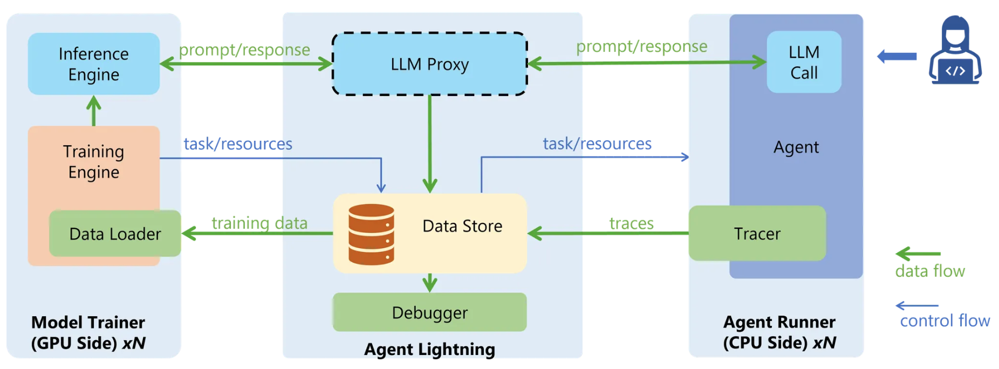
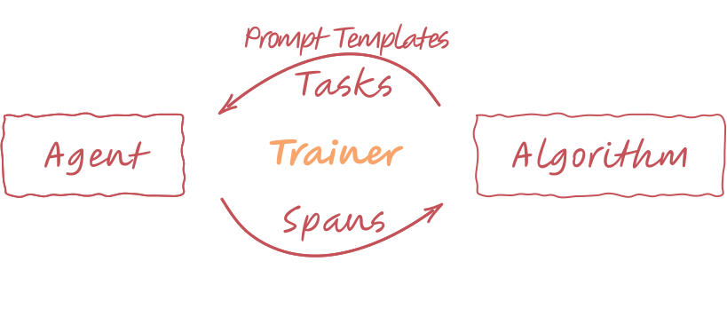

# `return_token_ids`：Agent RL 别再二次分词

英文对照：[en/vllm/blog/serving/agent-lightning.md](../../../../en/vllm/blog/serving/agent-lightning.md)  
原文：https://vllm.ai/blog/2025-10-22-agent-lightning  
2025-10-22。署名 **The Agent Lightning (AGL) Team**。vLLM **≥ 0.10.2**。进主干的 PR：[#22587](https://github.com/vllm-project/vllm/pull/22587)。文档：[OpenAI-compatible server (v0.10.2)](https://docs.vllm.ai/en/v0.10.2/serving/openai_compatible_server.html#api-reference)。项目：[microsoft/agent-lightning](https://github.com/microsoft/agent-lightning)，[文档](https://microsoft.github.io/agent-lightning/latest/)。训练侧仍要的 pause / 权重同步：[native-rl](native-rl.md)。

**TL;DR。** Agent 走 OpenAI 兼容端点叫模型，以前只回 **字符串**。**Agent RL** 里这就变成 **Retokenization Drift**：推理时 detokenize，训练时再 tokenize；字面一样，ID 可以不一样。让 vLLM 把 prompt 和 completion 的 **精确 token ID** 一并送回来：`/v1/chat/completions` 或 `/v1/completions` 上 `"return_token_ids": true` → 文本旁边多 `prompt_token_ids` 和 `token_ids`。Agent Lightning 把每次模型调用当独立 sample —— 不把轨迹缝成一条 —— 直接记下这些 ID。

## Why token IDs matter for Agent RL

LLM 的 RL 训的是 token 序列，trainer 要的是行为政策 **实际采样到的** ID。单轮曾经很简单：vLLM 底层的 `generate` 本来就回 token。

Agent 栈更爱 OpenAI 风格的 `chat.completions` / `completions`，而不是生的 `generate`：聊天模板和角色（system / user / assistant）、tool / function calling、结构化输出。这些 API 历史上只回 **字符串**。存下来的文本，训练时还要再分词。实践里不稳，也不准：**retokenization drift**。

症状：学习曲线抖，以及「你以为在优化的数据」和「模型真正采到的」对不上，还不好查。

本地图（原文版权仍归原站；学习对照用）：

红线和蓝线：同一套设定——存文本，训练时再分词。黄线：直接用推理引擎的 token。

三处常见分叉：

**不唯一的 「HAVING」。** 生成时一个词被采成两个 token（`H` + `AVING`），训练再分词却切成另一刀（`HAV` + `ING`）。字面一样，ID 不同；learner 对着错误序列在优化。

单词 “HAVING” 对应不同的 token。

**Tool-call 序列化。** 生成出来的 `<tool_call>{ "name": ... }</tool_call>` 会被 tool-call parser 收成 chat completion API 要的对象，再渲染回去、再分词。解析 / 再渲染会改空白和格式。有时 parser 还会 **自动修正 JSON 错误**，把模型真正的生成错误盖住，训练永远训不掉。

**Chat template 不一致。** 模板不是唯一的。同一只 LLaMA，[vLLM 例子](https://github.com/vllm-project/vllm/tree/1d165d6d859d3c50720f0c07209db2363c4fd33b/examples) 里可以有多份，[HuggingFace](https://huggingface.co/meta-llama) 上又是另一份。推理和训练用不同框架，整段 ID 都会漂。一个空格就够。

这三处造成 retokenization drift，再变成训练不稳：推理和训练不一致，更新是 **off-policy**。On-policy 对稳的 RL 是承重墙；这种 off-policy **甚至不在 token 这一层**，token 级 importance sampling 修不到。

另一条路：把模型吐出的 ID 存下来，单轮早就这么做。这要求 agent 和推理引擎在 token 层说话。多数 agent —— 尤其 LangChain 一类 —— 只认 OpenAI 兼容 API，自己不会 tokenize / detokenize。更长的讨论：[Token IDs and why they matter](https://microsoft.github.io/agent-lightning/stable/deep-dive/serving-llm/#token-ids-and-why-they-matter)。

## Solution and new feature

更好的办法：**OpenAI 兼容 API 直接回 token ID**。Agent Lightning 和 vLLM 把它做进了 [vLLM 主干](https://github.com/vllm-project/vllm/pull/22587)。从 **vLLM v0.10.2** 起，[`return_token_ids`](https://docs.vllm.ai/en/v0.10.2/serving/openai_compatible_server.html#api-reference) 是一等请求字段。设成 `true`，响应多两栏：

- `prompt_token_ids` —— 输入 ID（**经过** chat template 处理之后）
- `token_ids` —— completion 的 ID，走 `completion.choices`

响应其余部分仍 OpenAI 兼容，旧客户端不用改。

## Introduction to Agent Lightning (v0.2)

[Agent Lightning](https://github.com/microsoft/agent-lightning)（简称 AGL）v0.1 已经按「**任意** agent 都能 RL」来卖：

- 已有 agent **几乎零改代码** 就能接。
- 任意 agent 框架（LangChain、OpenAI Agent SDK、Microsoft Agent Framework，……），也可以 **没有框架**（普通 Python）。
- 不限制送进 LLM 的输入：摘要、多 agent 协作、其他编排都行。

第一次发布时，他们做了一台 [instrumented vLLM server](https://github.com/microsoft/agent-lightning/blob/v0.1/agentlightning/instrumentation/vllm.py)，**monkey-patch** vLLM 的 OpenAI server 来回 token ID。现在 AGL 会在每个请求上 **自动加上** `return_token_ids`。再靠内嵌的 [tracing](https://microsoft.github.io/agent-lightning/latest/tutorials/traces/)，训练侧要的数据（包括这些 ID）会自己收齐。

## The middleware for agent optimization

从 v0.2 起角色更清楚：一层可长命的中间件，加上一套标准化数据协议，专门给 agent 优化——尤其 agent RL。

Agent Lightning 概念图。

模块各司其职，靠协议说话：

- **Agent Runner** —— 跑 agent、完成派给它的任务。收任务、交给 agent、收集结果和中间数据、写回 store。和 LLM 侧分开，可以放在 **CPU** 上，横向铺开许多并发实例。
- **Algorithm (Model Trainer)** —— 托管推理和训练用的 LLM。管整条 RL 环：task sampling、rollout 管理、按经验更新模型。通常占 **GPU**；经共享协议和 Runner 异步说话。
- **[Data Store](https://microsoft.github.io/agent-lightning/latest/how-to/write-first-algorithm/#the-central-hub-the-lightningstore)** —— 中枢。标准化接口和统一 schema，异构组件才接得上。Algorithm 和 Runner **间接**通信。例如 Algorithm 用 [`rollouts`](https://microsoft.github.io/agent-lightning/latest/how-to/train-first-agent/#rollout) 异步派任务；Runner 用 [`spans`](https://microsoft.github.io/agent-lightning/latest/how-to/train-first-agent/#span) 把执行痕迹送回来。

训练环：任务出去，span 回来。

以 store 为中心，每次训练迭代都抽象成两步：把 agent 跑出来的数据（span）收进 store；再从 store 取出算法要的，送去训练。

这一刀换来算法上的自由。采集可以走 [各种 tracer](https://microsoft.github.io/agent-lightning/latest/tutorials/traces/)，也可以 [emit 自定义消息](https://microsoft.github.io/agent-lightning/latest/tutorials/write-agents/#emitting-rewards-messages-and-more)——不同奖励、任意中间变量。算法侧用 [query span](https://microsoft.github.io/agent-lightning/latest/deep-dive/birds-eye-view/?h=query#putting-it-all-together-a-reinforcement-learning-example-verl)，再经 [adapter](https://microsoft.github.io/agent-lightning/latest/deep-dive/birds-eye-view/#adapter) 变换。

同一框架也盖得住 [算法定制](https://microsoft.github.io/agent-lightning/latest/algorithm-zoo/verl/#customization)（credit assignment、用部分数据训辅助模型、训练时改数据），以及别种算法：[automatic prompt tuning (APO)](https://microsoft.github.io/agent-lightning/latest/algorithm-zoo/apo/)、[筛高奖励数据再用 Unsloth 拟合](https://microsoft.github.io/agent-lightning/latest/how-to/unsloth-sft/)。

第二条好处：模块切开，系统复杂度下来，各组件还能用 **不同** 的资源。Agent RL 栈里本来就有 agent 框架（LangChain、MCP）、推理引擎（vLLM）、训练框架（Megatron-LM）。耦在一起，异构就是税。解开之后：agent 侧可以要 CPU，推理和训练要 GPU；各自横向扩展。

页上更多材料：

- [完整文档](https://microsoft.github.io/agent-lightning/latest/)
- [Birds-eye view](https://microsoft.github.io/agent-lightning/latest/deep-dive/birds-eye-view/)
- [用 verl 训 SQL agent（多 agent 编排）](https://microsoft.github.io/agent-lightning/latest/how-to/train-sql-agent/)
- [用 APO 训选房 agent](https://microsoft.github.io/agent-lightning/latest/how-to/train-first-agent/)，提示编排走 [POML](https://github.com/microsoft/poml/)
- [用 Unsloth 训数学 agent（OpenAI Agents SDK + MCP）](https://microsoft.github.io/agent-lightning/latest/how-to/unsloth-sft/)

## Acknowledgements

感谢 vLLM 维护者：[Kaichao You](https://github.com/youkaichao)、[Nick Hill](https://github.com/njhill)、[Aaron Pham](https://github.com/aarnphm)、[Cyrus Leung](https://github.com/DarkLight1337)、[Robert Shaw](https://github.com/robertgshaw2-redhat)、[Simon Mo](https://github.com/simon-mo)。没有他们，这次集成做不成。Agent Lightning 是 Microsoft Research 的开源项目；感谢 MSR 支持这次探索。[Yuge Zhang](https://github.com/ultmaster) 是主要贡献者。
