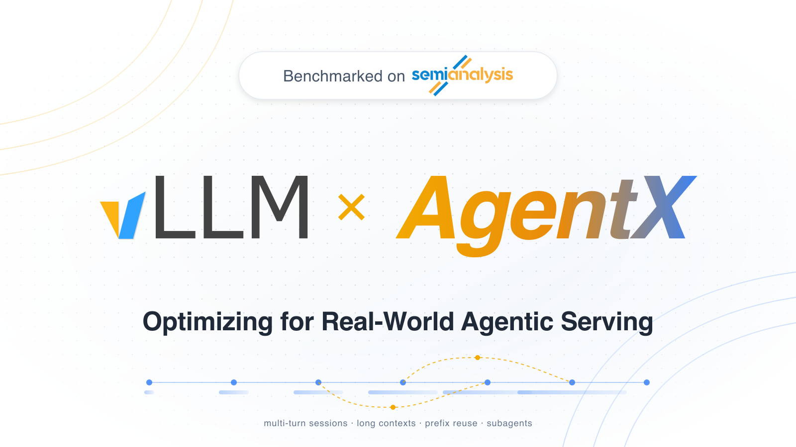
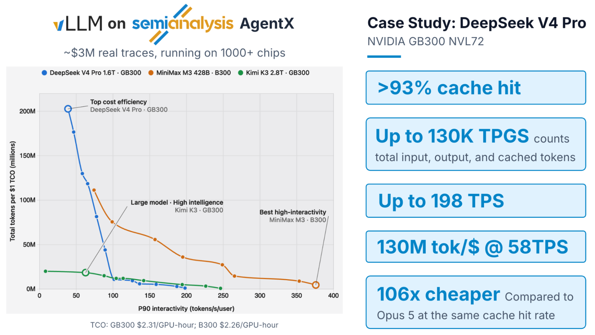
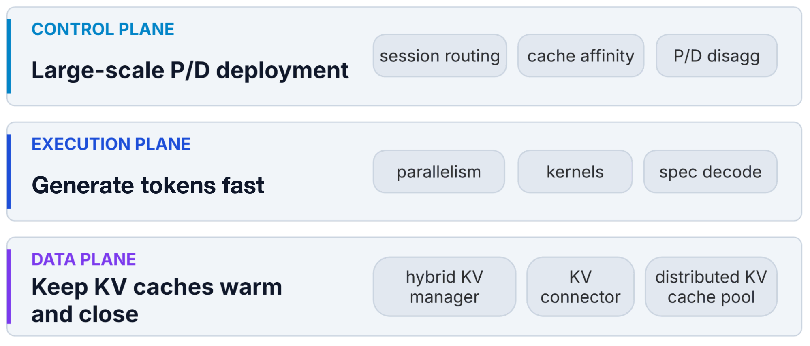
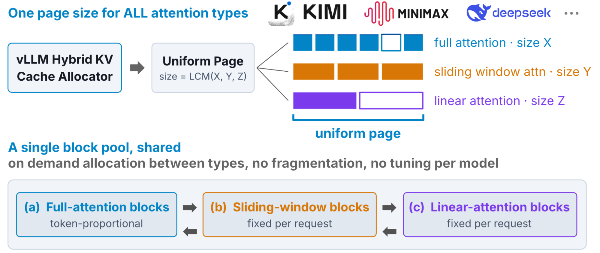
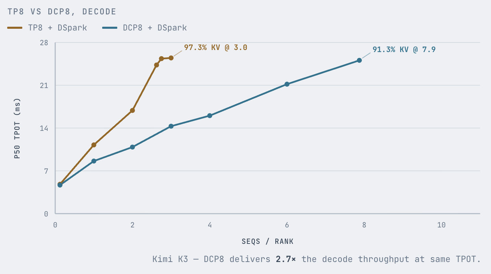
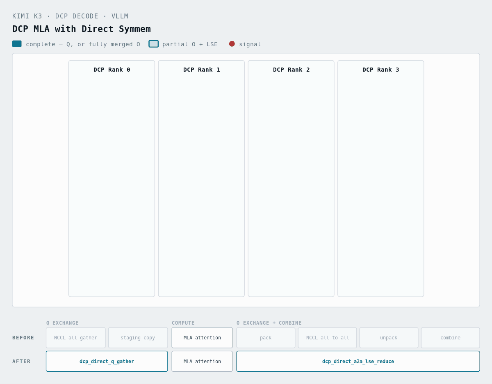
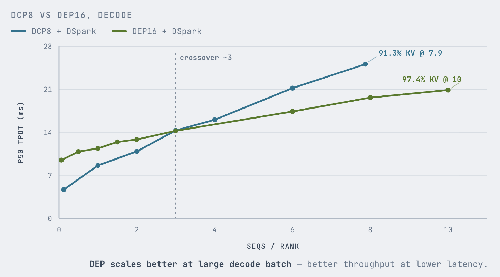
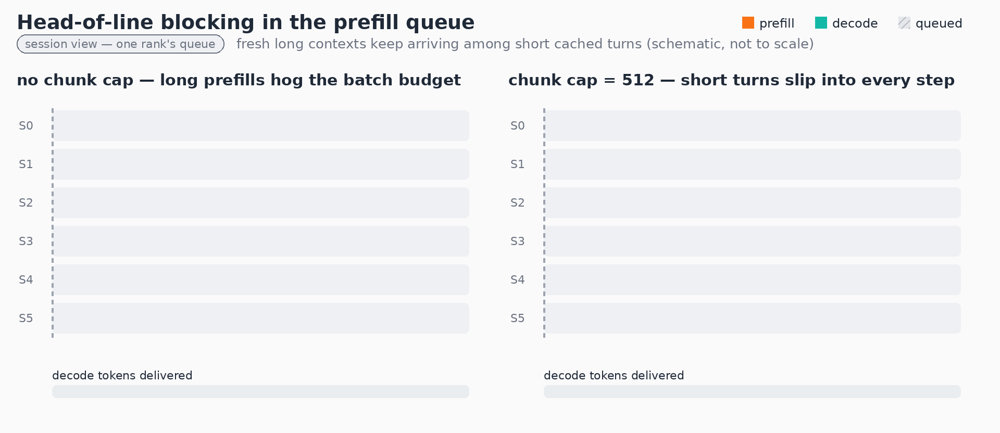
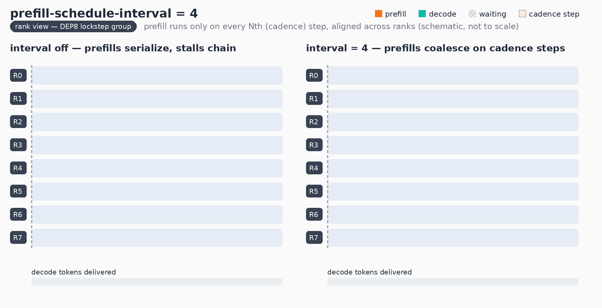
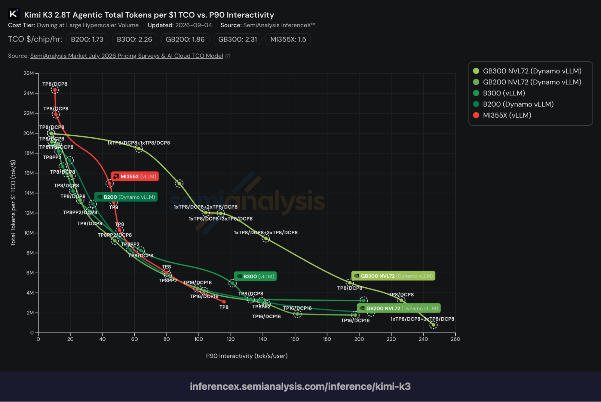

# vLLM × AgentX：按真实 Agent 负载来调 KV、并行和 P/D

英文对照：[en/vllm/blog/serving/agentx.md](../../../../en/vllm/blog/serving/agentx.md)  
原文：https://vllm.ai/blog/2026-09-08-vllm-agentx  
2026-09-08。署名 **vLLM Team and Inferact**。学习译文，不是官方译本。Benchmark：[SemiAnalysis AgentX](https://newsletter.semianalysis.com/p/agentx-inferencexv3-does-cuda-moat)。看板：[InferenceX](https://inferencex.semianalysis.com/inference)。Harness：[SemiAnalysisAI/agentx-harness](https://github.com/SemiAnalysisAI/agentx-harness)。2026 年 5 月邻居：[mooncake.md](mooncake.md)。DCP：[dcp.md](../performance/dcp.md)。Kimi K3：[kimi-k3.md](kimi-k3.md)。DeepSeek V4：[deepseek-v4.md](../architecture/deepseek-v4.md)。MiniMax M3：[minimax-m3.md](minimax-m3.md)，AMD 后续 [minimax-m3-mi355x.md](../performance/minimax-m3-mi355x.md)。页上的交互控件（会话滑块、packed KV 切换、可悬停 Pareto）不收；静态图留下。站点 JS 不抄。

**页上的 TL;DR。** Agent 流量已经是 vLLM 的主要负载之一：多轮会话、长上下文、大量前缀复用。工作叠在三层：KV cache、并行 / kernel / 调度、以及 P/D 配比。AgentX 上：DeepSeek V4 Pro 最高 **130K** total tokens per GPU-second；MiniMax M3 的 interactivity 最高 **376** tokens/s。DeepSeek V4 Pro、MiniMax M3、Kimi K3 相对 Opus 5 API 定价有 **14.6×–106×** 的 serving 成本优势（表在下面）。比的是 serving 成本，**不是**模型质量。

**图注（原文 Figure 1 的静态拷贝）。** SemiAnalysis AgentX 上的 vLLM。DeepSeek V4 Pro、MiniMax M3、Kimi K3 各自最好的 vLLM 配置，横轴 P90 interactivity，纵轴每 1 美元 TCO 的总 token；DeepSeek V4 Pro 在 GB300 NVL72 上当案例。数据：SemiAnalysis AgentX。可悬停的活图在原页。

## 再看一眼 Agent 负载长什么样

[5 月 Mooncake 那篇](https://vllm.ai/blog/2026-05-06-mooncake-store) 之后，Agent 流量占比还在长。到 2026 年 6 月，[OpenAI 报过](https://openai.com/signals/enterprise-data/) 企业客户里 Codex 贡献了 Codex 与 ChatGPT 合计输出 token 的 <strong>64%</strong>。

这从两根轴压 serving： **成本**（固定硬件预算里能同时跑多少 agent）和 **延迟**（每个 agent 走过 reasoning 和工具循环有多快）。优化的是整条延迟–成本前沿。

AgentX 用真实的 agent 写代码痕迹搭起来：

- **跑得久、多轮。** 每段会话中位 **43** 轮。
- **上下文长、输出短。** 输入中位 **142K** token，输出中位 **444** token。
- **前缀大量复用。** Prefix-cache 命中率高于 <strong>96%</strong>。
- **Subagent 很多。** <strong>44%</strong> 的会话至少有一个 subagent；在那些会话里，subagent rollout 中位 **四个**。

每一轮把最新的工具结果接到已经攒起来的上下文上，再整段送回模型，所以输入一直在长，每轮只多一小段新 Prefill，请求里几乎全是引擎已经见过的前缀。Subagent 从那段上下文分叉，或从头开始；结果再并回父会话。原页 Figure 2 是可滑动的会话浏览器——不收。

## Serving 上的三件难事

1. **Prefix cache 压力。** 多轮里每一轮都回放到目前为止的整段对话。要同时撑住许多会话，引擎必须在轮次之间卸 KV。规模一大，跨 GPU、P/D 实例、副本都更难。
2. **执行效率。** 上下文长、延迟紧：同样时间里要处理更多 token、每个 token 做更多事。并行、kernel、调度、投机解码都要跟上新的请求形状。
3. **找对 P/D 比。** 上下文长度和 cache 命中率在会话和 subagent 之间差得很开。路由还要在 cache 亲和和负载之间平衡。吞吐最优的 P/D 比也会随并发挪。

## vLLM 的做法：三层平面

**图注（原文 Figure 3）。** 全栈优化。数据面：分布式共享 KV。执行面：按模型选并行和 kernel。控制面：P/D 比和请求调度。

### 数据面：让 KV 热着，并且靠近计算

#### Hybrid KV cache 管理

Agent 的长上下文把 KV 容量压得很紧。混合模型把 sliding-window、线性 attention 和 full attention 叠在一起；缓存块的大小和寿命都不一样。

vLLM 的 hybrid KV cache 管理器用 **统一的内存页** 当分配单位，放进 **一块共享的块池**。

**图注（原文 Figure 4）。** 所有 attention 类型同一页大小；一块池子共享。按需再分配，而不是按 attention 类型静态切容量。Full-attention 的 KV 随序列变长；sliding-window 和 recurrent 状态寿命不同。最好的切法因此随并发、上下文长度、前缀复用模式而变。

这层抽象还在长。[DeepSeek V4](../architecture/deepseek-v4.md) 最初的布局把不同 cache 类型碎成三个尺寸桶，分配了 **92** 个分开的 tensor——padding 浪费内存，P/D 传输和 offload 也慢。

[Packed KV cache 布局](https://github.com/vllm-project/vllm/pull/44577) 把所有 cache 组和层收进 **每块一份连续的 backing 分配**。描述符和 P/D 传输开销下来；打开 FP4 indexer 时还可以用更小的分配单位，大约省 [KV cache 内存的 10%](https://github.com/vllm-project/vllm/pull/48993)。原页 Figure 5 是 MXFP4 / FP8 的交互切换——不收。

#### 分层 KV offload

[Mooncake Store](https://github.com/kvcache-ai/Mooncake) 当分布式 KV 池（[5 月那篇](https://vllm.ai/blog/2026-05-06-mooncake-store)）。

- **架构对齐。** 稀疏 / 压缩 / 线性 attention 仍是一等公民，异步调度、P/D、投机解码、并行都还在工作。
- **分层。** 盘和额外的纯 CPU 节点走 Mooncake 的 `standalone-store`：外部 Mooncake 客户端拥有 CPU 池和磁盘层，vLLM worker 只当请求方。每台机器起一个 standalone 客户端就能扩池。已经接到 [Dynamo](https://github.com/ai-dynamo/dynamo) 和 [llm-d](https://github.com/llm-d/llm-d)，请求可以在任意实例上命中 cache。
- **性能。** 混合模型必须按 attention 类型分别构造钥匙、做查找（CPU 开销）。他们用更好的数据结构、异步查找、把工作挪出调度器关键路径、以及并行收发来压：[PR#46188](https://github.com/vllm-project/vllm/pull/46188/changes)、[PR#45444](https://github.com/vllm-project/vllm/pull/45444/changes)、[PR#45659](https://github.com/vllm-project/vllm/pull/45659/changes)、[PR#47317](https://github.com/vllm-project/vllm/pull/47317/changes)。
- **按会话保留 prefix cache**（线性 / sliding-window 加上 full attention 的混合模型）。复用需要在复用边界保住线性状态或 sliding-window cache。每个 token 都留快照太贵，所以两套政策：
  1. [**按间隔保留**](https://github.com/vllm-project/vllm/pull/43447) 在每一轮自动保住 prompt 末尾的 cache / 线性状态。后续轮和分叉出去的 subagent 可以复用。
  2. 共享前缀常常在一轮**里面**结束，所以 [**Marconi 式选择性保留**](https://github.com/vllm-project/vllm/pull/47782) 在前缀第二次被看见时才留检查点。第一次 miss 会重算缺的状态，并在那个边界存一份。

两套合在一起，大规模 agent 负载上仍能保持高命中，又不必付过多存储。细节见 [kimi-k3.md](kimi-k3.md)。

### 执行面：把 token 产快

#### 按模型选并行

轴：TP、DP、EP、PP、CP。最优取决于架构、拓扑、负载、延迟 SLO。下面看 NVIDIA GB / B 系列（以及 AMD 对应物）上的两个代表。

**Kimi K3。** MLA 加 Kimi Delta Attention（KDA）。MLA 把 KV 压进一个 latent head，普通 TP 复制那份 latent cache 并不划算。

[DCP](../performance/dcp.md) 按序列维切 cache（每个 rank 只留 1/N 的 KV）：

- **更低的 Decode 延迟。** MLA attention 是 memory-bound，成本随上下文长。Agent 前缀变长时，attention 在每步 Decode 里占比更大；切开就能缩短这一步。
- **更高吞吐和 KV 容量。** 不复制 KV，就能让更多序列同时在飞，不必卡在 KV 准入上。

**图注（原文 Figure 6）。** Kimi K3 上 DCP8 的 Decode 延迟低于 TP8，并能扩到更高并发。

DCP 的代价是额外通信。KV 按序列切开，每一层 MLA Decode 都要在 attention 前 gather query，之后再做部分输出归约。

他们用 **对称内存缓冲** 绕开 NCCL，对端 GPU 可以直接从里面 load / store。Query 直接 multicast 进 attention kernel 消费的缓冲。每个 GPU 再把部分 attention 输出和 log-sum-exp（LSE）统计写进对端的接收槽；每个 rank 用 online softmax 在本地合并。GPU 到 GPU 的写和计算融进同一批 kernel，相对默认 DCP8，每层延迟大约少 <strong>13%</strong>。

**图注（原文 Figure 7）。** DCP4 下用对称内存的 MLA Decode 路径。每一步融进一个 kernel，取代 NCCL all-gather、暂存拷贝、all-to-all 和 unpack。

更大的 scale-up 域会改最优策略。NVL72 一类系统上，宽 EP 配数据并行（**DEP**）可以比 DCP 更会扩，并在同一 Decode 延迟 SLO 下拿到更高吞吐。多机 DCP 再大，切开 attention 的通信会盖过省下来的计算。DEP 把请求和它们的 KV 分到不同 DP rank，避开 DCP 的 attention collective，同时把 MoE expert 切开。

**图注（原文 Figure 8）。** Kimi K3 上，每 rank batch 超过 **3** 之后，宽 EP（DEP16）比 DCP8 更会扩。

**DeepSeek V4。** MLA 风格的 KV 在 TP 下同样会被复制。压缩稀疏 attention 还让按 head 切的 TP 在计算上不划算，三条原因：

- Compressor 路径在每个压缩位置只产出一份共享 KV 表示，不是按 head 独立的状态。TP 没法沿 KV-head 维切计算，每个 rank 都要重复 compressor 工作。
- Indexer 有 64 个 head，但每个 token 只有一份全局 top-k。当前 TP 路径于是在每个 rank 上复制完整 indexer（避开 top-k 前的 dense score 归约，但把工作做了两遍）。
- 稀疏 MLA 主要在扫描、gather top-k KV，不是 attention 算术。TP 把大量 memory-bound 工作在每个 rank 上重复，只切开更便宜的按 head 计算。

实践里 **PCP** 适合长 Prefill；**DEP** 在更宽的 serving 条件上更好。PCP 切的是 prompt 序列（query tensor），把 compressor 和 indexer 工作分到各 rank，并给稀疏 MLA 更宽、更有效的 head-local 形状。**32K** prompt 上 PCP8 相对 TP8 有 **2.65×** 的 Prefill 加速（TTFT）。它仍在各 rank 上复制 Decode 侧状态，所以更适合专用 Prefill worker。

DCP 对 V4 没有对 Kimi K3 那么有效（见下面的苦教训）。DEP 让 attention 完全本地；它是大多数 DeepSeek V4 配置的默认。

#### 两层调度混合的 Agent 流量

混着两类请求：大量只追加的请求（长前缀、短 Prefill），偶尔一条新鲜的、几万 token 的长 Prefill。两件调度问题：实例内部，一条长 Prefill 会堵住短的交互轮；跨 DEP rank，Prefill 放得不齐会造成负载不均。

##### 拆掉头阻塞

默认的 chunked-prefill 调度器按 FIFO。一条长 Prefill 可以一步步占满整个 token 预算；同一 rank 上的短轮要等它做完才能排上。

**图注（原文 Figure 9）。** Prefill 队列里的头阻塞，一个 rank 的会话视图。左：没有 chunk 上限，长 Prefill 占满预算。右：512-token 上限，短轮每一步都能进来，更早开始 Decode。

`--long-prefill-token-threshold` 限制一条请求每步最多排多少 token。**512** token 的阈值让长 Prefill 给短轮留位置。DeepSeek V4 Pro 在 B300 上：每 GPU-second 的总 token（TPGS）最多 <strong>+93%</strong>，P90 interactivity 大约 **2.3×**。代价是这条长请求自己的 TTFT 变高。对 TTFT 敏感的部署应该把阈值开大。

##### 对齐 DEP 的 Prefill 节奏

MoE 的 all-to-all 强迫各 rank 齐步走，一个 rank 在做 Prefill 就会拖住整组。Prefill 落在不同步上，这笔惩罚会付很多次。

`--prefill-schedule-interval` 只在每第 N 个引擎步准入 Prefill，计数器在各 DP rank 对齐。Prefill 收拢到同一批步上，剩下的步全部给 Decode。

**图注（原文 Figure 10）。** DEP8 组上的 Prefill 节奏。左：Prefill 落在不同步，反复拖住齐步的一组。右：间隔 4，Prefill 收拢到节奏步上，中间的步只做 Decode。

### 用对的 P/D 来扩

多加 GPU 或做分离，不会自动把前沿推出去。Prefill 和 Decode 必须 **速率匹配**。标准化的两阶段方法（可以交给 agent 工作流自动做）：

**第一阶段：饱和画像。** Prefill-only 和 Decode-only 分开测。扫并行策略（TP 对宽 EP）和规模（8、16 或 32 GPU），并发往上加直到吞吐饱和。产出：每个（并行, 规模）配置的最大 Prefill / Decode req/s。

**第二阶段：P/D 扫描。** 用第一阶段的饱和点推出 P/D 比，再在合在一起的分离部署上扫并发，收集工作区间上的指标。

### Kernel 和社区贡献

瓶颈移向长上下文 attention、投机解码和通信。这里点名的 kernel 全部开源；有些已经被其它开源引擎收走。

- MiniMax M3：[CuteDSL 长上下文 indexer](https://github.com/vllm-project/vllm/pull/48582) 在 GB300 上报的 indexer 延迟按形状大约好 <strong>3%–31%</strong>。上游的 MSA top-k：最坏情况 kernel 最多 **4×**，AgentX 端到端吞吐大约 <strong>7%</strong>。投机验收路径：中等 batch 的 Decode 在报告测试里大约 <strong>20%</strong>。
- Kimi K3：[GEMM 和 reduce-scatter 融合](https://github.com/vllm-project/vllm/pull/52079) 改善序列并行通信；[latent-tail MoE 融合](https://github.com/vllm-project/vllm/pull/53152) 把端到端延迟大约压 <strong>5%</strong>。
- DeepSeek V4：MXFP4 MoE 和 HCA 压缩（[#43584](https://github.com/vllm-project/vllm/pull/43584)、[#44230](https://github.com/vllm-project/vllm/pull/44230)）；[多 stream C4A](https://github.com/vllm-project/vllm/pull/42925)；[基于 cluster 的 top-k](https://github.com/vllm-project/vllm/pull/43008)。

## 性能：先为 Agent 设计，并且可以公开核对

在 AgentX 上独立验收：开源数据集来自 **300 万美元** 的真实 agent 写代码痕迹，上下文 **1M**，公开基础设施超过 **1000** 张卡、大约 **2 MW**。

**图注（原文 Figure 11）。** 不同 P90 interactivity 下每 1 美元的总 token，Kimi K3 跑在多种硬件上。来源：Kimi K3 的 SemiAnalysis AgentX 看板。活的：[AgentX Dashboard](https://inferencex.semianalysis.com/inference?i_seq=agentic-traces&i_xmode=interactivity&g_runid=33418433573&i_best=0&i_active=b200_vllm%2Cb300_vllm%2Cgb200_dynamo-vllm%2Cgb300_dynamo-vllm&i_hc=1&i_advlabel=0&i_label=0)。

保持 **P90 interactivity > 50 tok/s/user** 的最高吞吐 vLLM 配置：

| 模型 | GPU / 并发 | 每 GPU-second 总 token（TPGS），P90 > 50 tok/s | P90 interactivity |
|---|---:|---:|---:|
| [DeepSeek V4 Pro 1.6T](https://inferencex.semianalysis.com/inference/agentic/439873) | 12 GB300 / 256 | **83K TPGS** | 58.3 tok/s |
| [MiniMax M3 428B](https://inferencex.semianalysis.com/inference/agentic/439907) | 2 B300 / 24 | 70K TPGS | **74.2 tok/s** |
| [Kimi K3 2.8T](https://inferencex.semianalysis.com/inference/agentic/441066) | 16 GB300 / 48 | 11.8K TPGS | 62.7 tok/s |

TPGS 计入输入、输出**以及**缓存 token。拆开看走各模型的链接。

DeepSeek V4 Pro：12 芯 GB300 的 P/D，256 路并发会话，P90 58.3 tok/s/user，83K TPGS。MiniMax M3：2 张 B300，P90 74.2 tok/s/user，70K TPGS。Kimi K3（2.8T）对常规单机太大；16 张 GB300，P90 62.7 tok/s/user，11.8K TPGS。

Serving 成本和 Opus 5 比：

| 模型 | GPU TCO / 小时 | 等价 Opus 5 成本 / 小时 | 成本优势 |
|---|---:|---:|---:|
| [DeepSeek V4 Pro 1.6T](https://inferencex.semianalysis.com/inference/agentic/439873) | $27.72 | $2,926 | **106×** |
| [MiniMax M3 428B](https://inferencex.semianalysis.com/inference/agentic/439907) | $4.52 | $384 | **85×** |
| [Kimi K3 2.8T](https://inferencex.semianalysis.com/inference/agentic/441066) | $36.96 | $538 | **14.6×** |

Opus 5 算法：cached input × **$0.50/M** + uncached input × **$5/M** + output × **$25/M**。假定 **完美的理论** cache 命中率；不含 cache-write 费用和长上下文溢价——这对 Opus 偏保守、也偏有利。比的是 serving 成本，不是质量。

优势来自 Agent 流量的定义性质：理论 cache 命中率 <strong>>96%</strong>。vLLM 在和上表相同的设置里，把这份复用变成 serving 效率。

DeepSeek V4 Pro：大约 **28 美元** / 小时的 GB300 TCO，对上 Opus 5 大约 **2926 美元**——即便把 cache-read 价用在每一个理论上可复用的 token 上。

数字以发表时为准；看板是活的。上面每条结果都链到 InferenceX 上那次运行。

## 苦教训

#### 流水线并行不适合热的 Agent 轮

PP，包括 [chunked pipeline parallelism（CPP）](https://docs.vllm.ai/projects/ascend/en/latest/user_guide/feature_guide/dynamic_chunk_pipeline_parallel.html)，在长而新鲜的 prompt 上表现好。大 Prefill 能把流水线各级填满，吞吐几乎线性扩，通信也不贵。

大多数 Agent 轮已经把系统提示和前几轮缓住了，新请求可能只加几百或几千 token。新鲜计算填不满流水线，气泡吃掉潜在收益。

课不是 PP 无效。它对 **冷的、计算很重的 Prefill** 有效，但不该当 **热的、前缀很重**、又占 Agent 会话大头的那些轮的默认。

#### DCP 不能干净地搬到 DeepSeek V4

DCP 对纯 MLA（DeepSeek R1、Kimi K2.5、K2.7）和混合 MLA（Kimi K3）很好。V4 更复杂的 attention 栈——压缩稀疏 attention 加上高度压缩的 attention——包含 indexer、额外的 compressor，以及主 attention。上下文并行必须切开并协调这些子层。

他们在通信与计算重叠、以及对应 kernel 上投了很多。即便如此，DCP 只是 **追上** DEP，并没有超过它。并行必须跟着模型架构走。一种 latent-attention 模型上成立的策略，换一家不必成立。

#### 负载均衡不保证更好的性能

聚合 DEP 部署里，各 rank 的 KV 使用差得很开。自然反应是按队列深度、正在跑的 token、或当前 KV 占用去平衡请求。

他们在 AgentX 上的实验里，这些政策都 **不如** 简单的按会话粘住。原因是 cache 局部性：许多 Agent 会话轮间间隔很短，下一轮常常在前缀还住在上一张 GPU 时就到了。把会话挪到更空的 rank，系统就得去取 KV——即便前缀还保存在分布式池里。传输是异步的，也和计算重叠，但不是免费。预取的块会暂时占住目标 rank 的 GPU KV 容量，减少它能准入的序列数。系统可以看起来更均衡，同时整体处理 **更少** 的并发请求。

轮间间隔短时，**保住会话局部性比把瞬时负载切平更值钱**。路由必须看见每个 worker 上已经住着的状态，不能只看排队的工作量。

## 前面的路

下一步是让 Agent 结构在整条 serving 栈里显式出现。

控制面：把第一轮请求（往往需要长而新鲜的 Prefill 来填满 prefix cache）和第 2 轮及以后（高复用、相对短的追加 Prefill）分开路由。这样避开头阻塞，也可以在两边配不同的引擎和并行，例如 PCP 和 CPP。

执行面和数据面，他们在和社区一起做：

- **Agent 提示。** 框架或 harness 可以随请求带上会话结构、可能的分叉点和 cache 位置、工具调用延迟、会话生命周期。第一步是通过标准化 API 吃这些提示，再用来指导调度、cache 驱逐等。
- **可编程 KV cache。** 不同负载要不同的放置、保留、复制、驱逐。可编程接口让用户控制预取、驱逐、或软钉住 KV。
- **按会话管理 KV。** 轮间空隙可以把留着的 KV 状态挪到下一轮很可能服务的那个 worker。空闲时预取，好把传输延迟藏起来。

## 致谢

由 [Inferact](https://inferact.ai/) 牵头，vLLM 社区大量支持。感谢 SemiAnalysis 做出并运营公开的 AgentX，以及把方法和结果做成可复现。也感谢 NVIDIA 和 AMD 全程协作。
