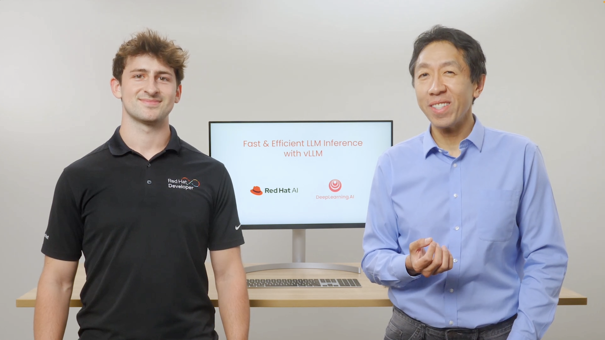
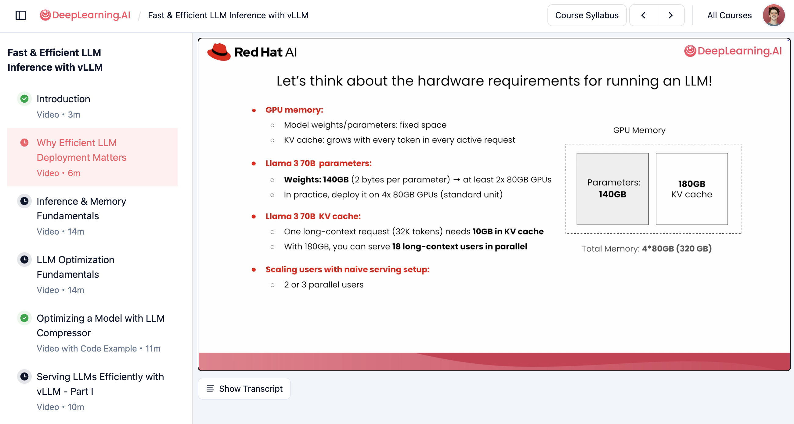
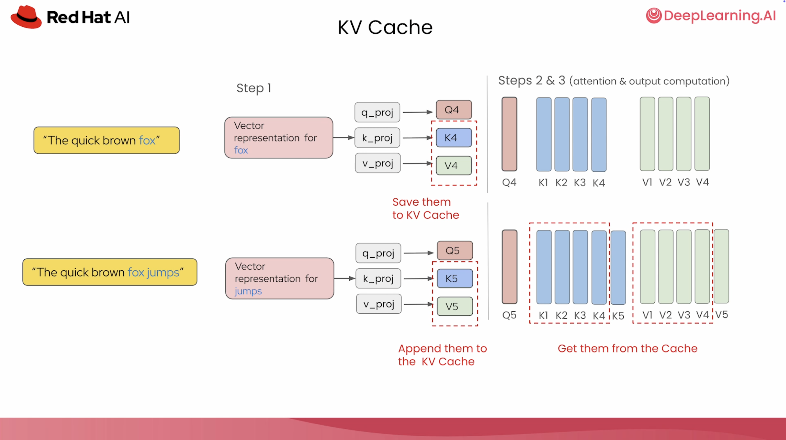
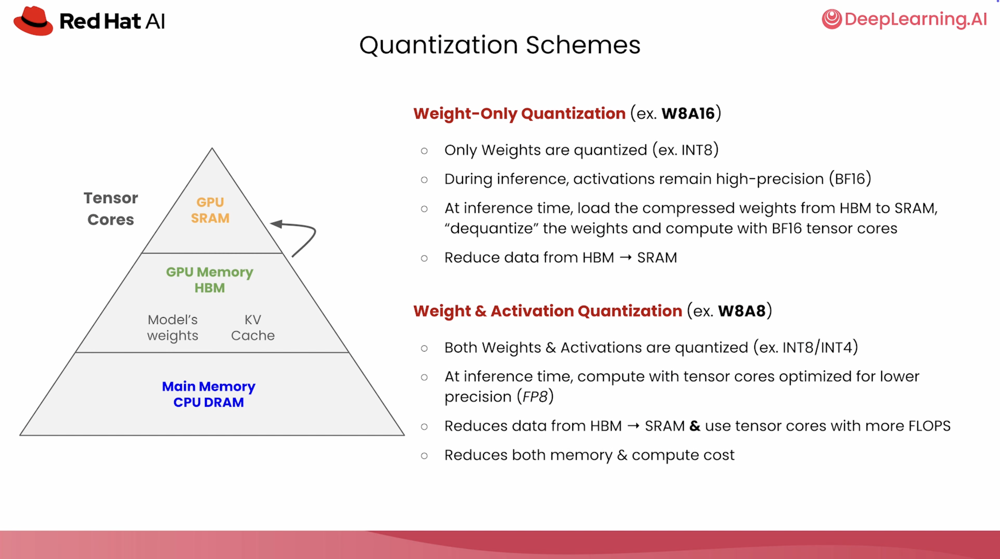
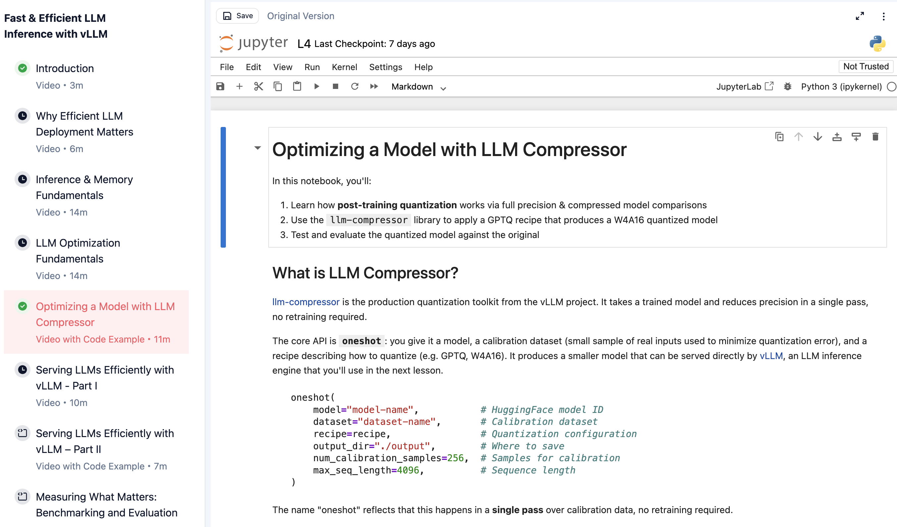
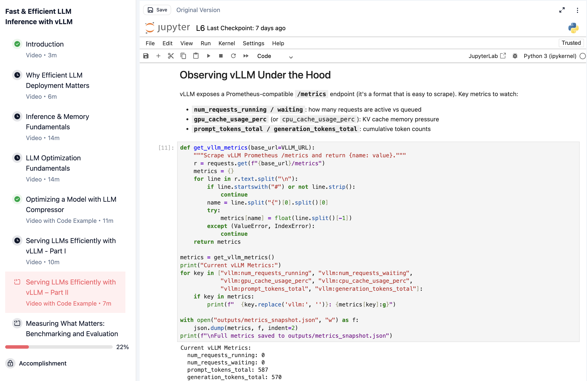
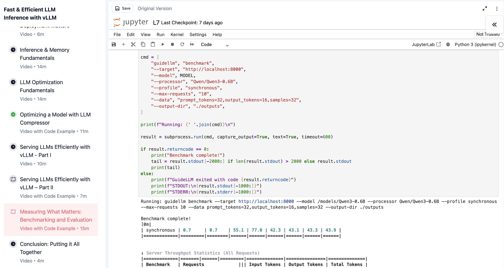

# DeepLearning.AI 课：压缩 → serve → GuideLLM 压测，不是新 kernel

英文对照：[en/vllm/blog/serving/deeplearning-ai-course.md](../../../../en/vllm/blog/serving/deeplearning-ai-course.md)  
原文：https://vllm.ai/blog/2026-06-03-deeplearning-ai-vllm-course  
约 1.5h，9 视频 + 3 lab。Cedric Clyburn（Red Hat）。课免费。

三截：LLM Compressor 量化 Qwen，看体积和 perplexity；vLLM OpenAI API + 指标看 continuous batch / prefix cache；GuideLLM 打流量，再用 lm-eval 核对精度。前置讲 KV 怎么涨、weight-only vs W&A 量化。学的是部署闭环，不是 vLLM 内部新机制。GuideLLM ≠ AIPerf，别混。

本地图（原文版权仍归原站；学习对照用）：

