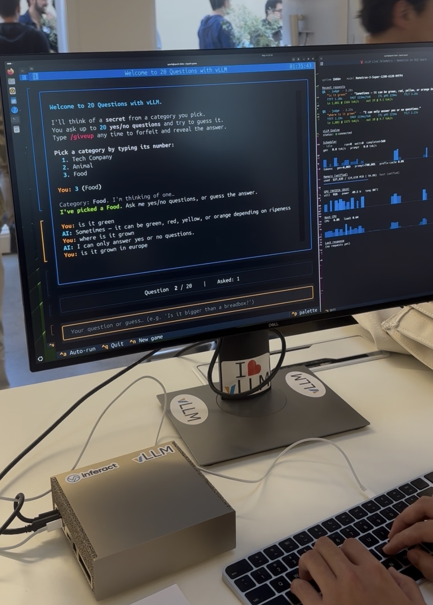
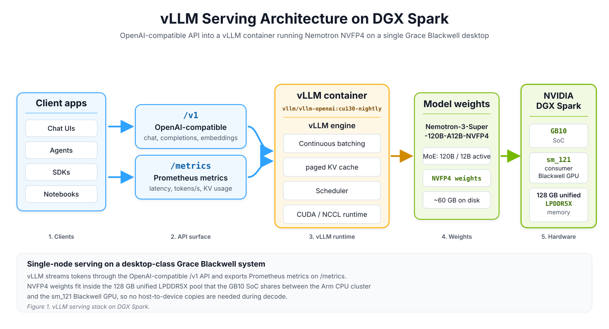
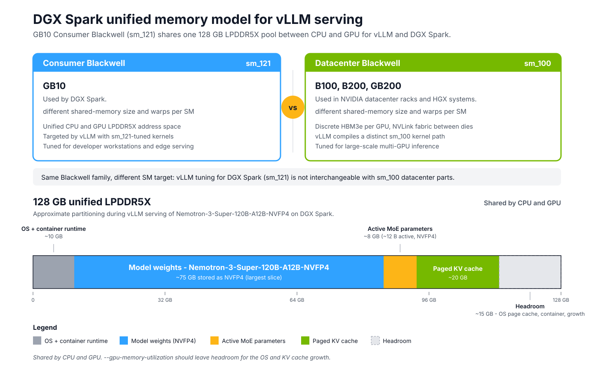
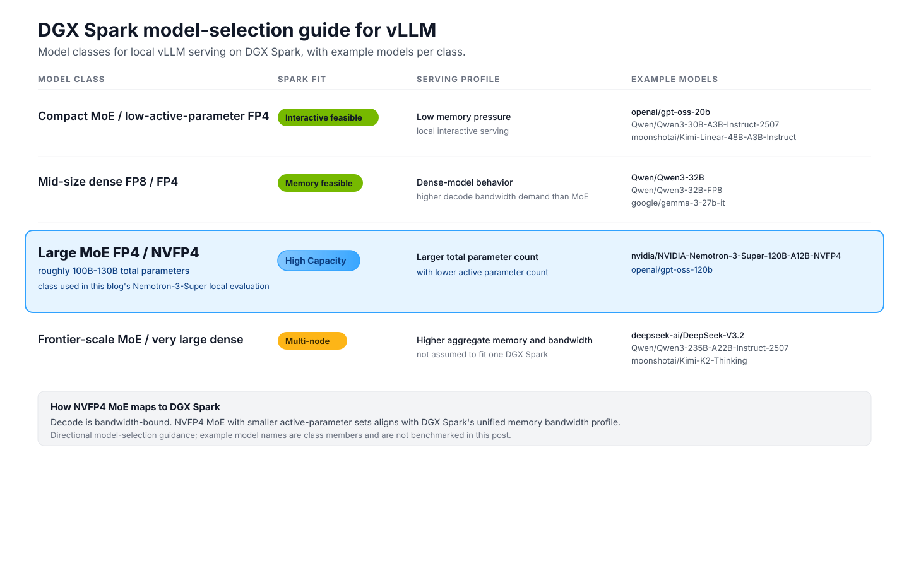
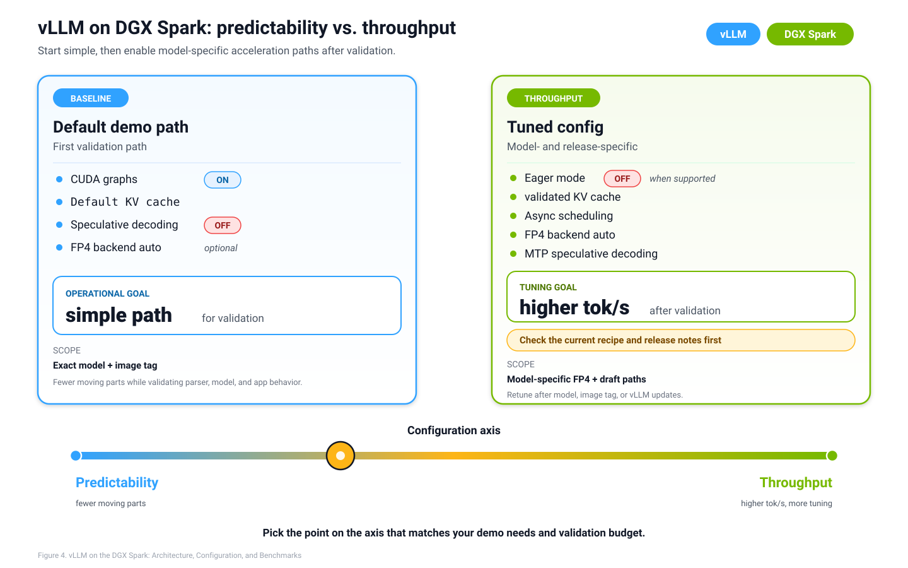
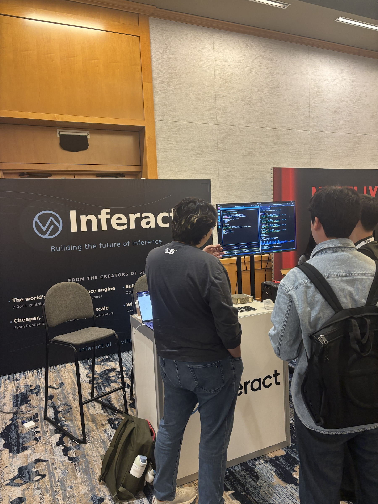
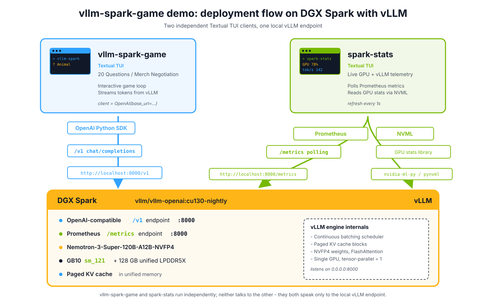
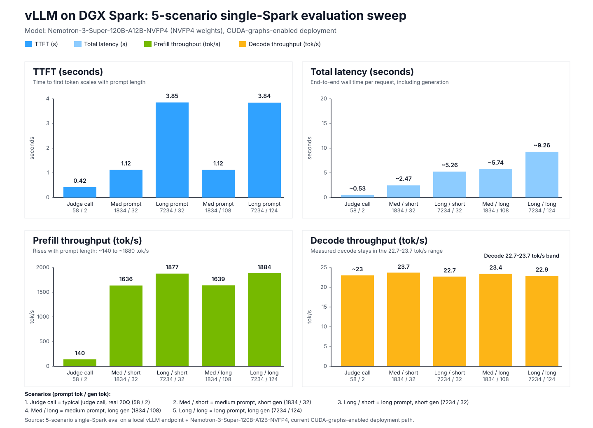

# DGX Spark：128GB 统一内存上的小并发 NVFP4，不是机房卡

英文对照：`en/vllm/blog/serving/dgx-spark.md`  
原文：https://vllm.ai/blog/2026-06-01-vllm-dgx-spark  
GB10，`sm_121`。Nemotron-3-Super-120B-A12B-NVFP4。数字是他们单机 demo，不是排行榜。

CPU/GPU/OS/容器/权重/KV 抢同一池。`--gpu-memory-utilization` 必须留余量。`--max-num-seqs 4`：再高，单 token 带宽税压过 continuous batch。适合 ~10–15B active 的 NVFP4 MoE，不适合高并发 dense。官方镜像走 `sm_121`；`cu130-nightly` 是轨道不是 pin。

他们测 decode 稳在 **22.7–23.7 tok/s**（五场景中位、warmup 后）。TTFT 随 prompt 近似线性；prefill 从短 prompt ~140 tok/s 到长 prompt ~1900。首请求 Inductor/FlashInfer JIT 约 **25s**，要自己 ping 热。safetensor 加载 10–15 分钟。`--kv-cache-dtype fp8` 在 Spark 上可能伤速度，别当默认。MTP / async 要按菜谱复测。不要把数据中心 TPS 期望直接贴到桌上盒子。

本地图（原文版权仍归原站；学习对照用）：

