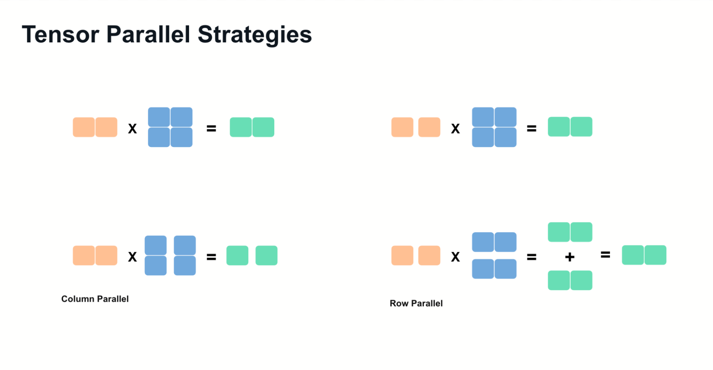
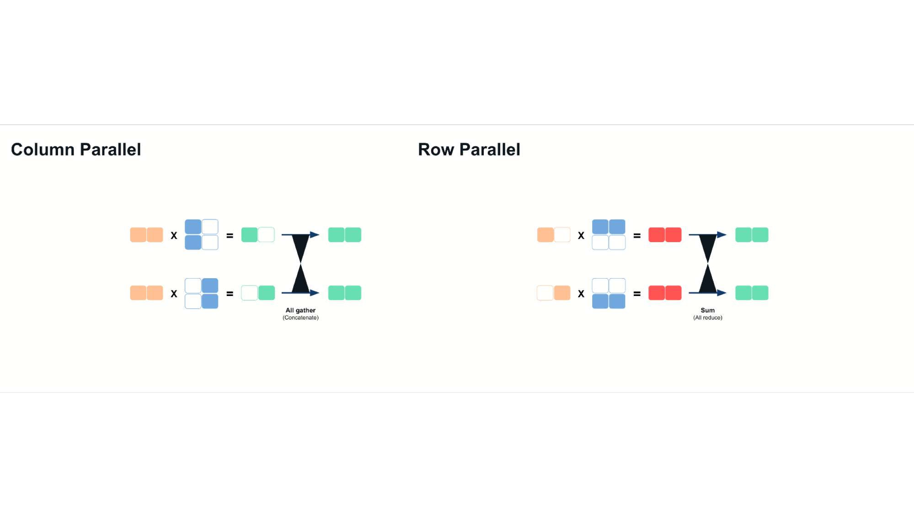
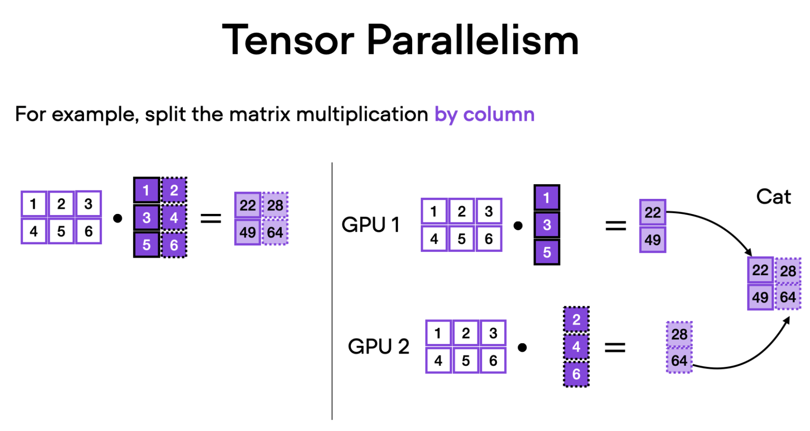
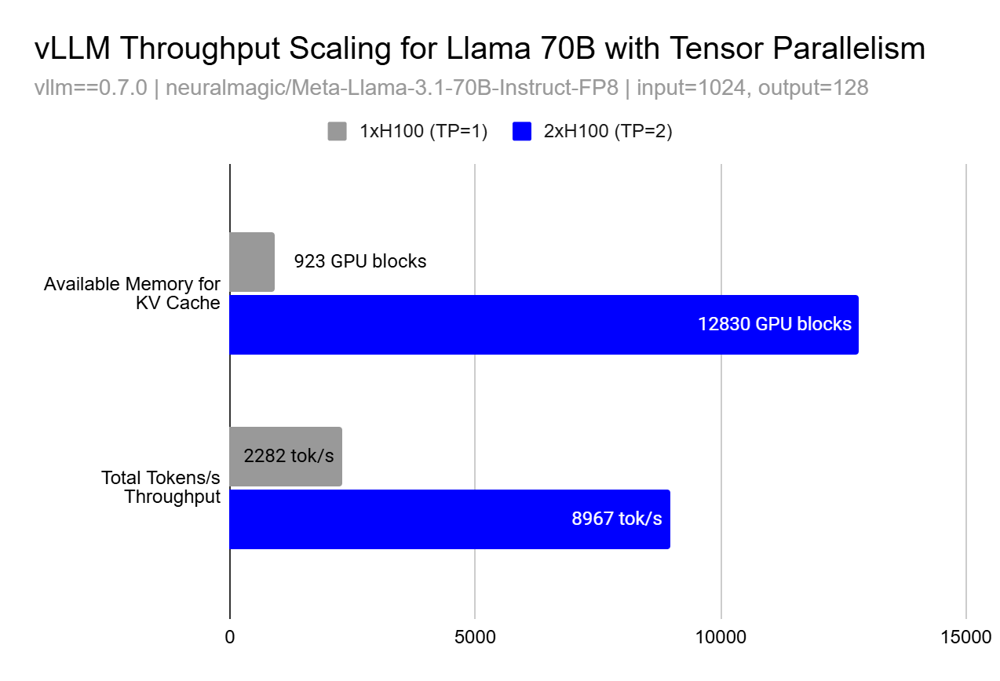

# 分布式推理：一张卡装不下以后

英文对照：[en/vllm/blog/serving/distributed-inference.md](../../../../en/vllm/blog/serving/distributed-inference.md)  
原文：https://vllm.ai/blog/2025-02-17-distributed-inference  
2025-02-17。和 TensorRT-LLM 手册第 4 章同一张地图：通信才是约束。OOM 面前两条路——降精度，或切开。量化单独不够，模型过千亿还是要切。

推理不是训练。形状在变，要低延迟，还要管 KV、投机解码、prefill 变成 decode 的那一拍。训练可以把通信藏进巨大的、形状固定的 step 里；推理每一步都可能换一批人进场。vLLM 给出的刀，当时主要是两把：**节点内 TP**，**跨节点 PP**，再加通信 kernel 和控制面，少让 CPU 挡 GPU。EP 在这篇里还只是「往后看」——[大规模 serving](large-scale.md) 才把它写成主菜。

本地图（原文版权仍归原站；学习对照用）：

## Tensor parallelism

沿 Megatron-LM（Shoeybi et al., 2019）的路，为推理改过。列并行切权重的列、算完拼接；行并行切行、算完相加。

Llama 的 MLP 是一张很好懂的说明书：up-projection **列并行** → SILU 在分片上做 → down-projection **行并行** + **all-reduce**。权重切开等于多卡一起啃显存带宽，decode 这种 memory-bound 的活，延迟可以降下来。走廊必须快：NVLink / InfiniBand。走廊慢，all-reduce 会把那点带宽红利吃光。

TP 还有一件训练里不那么显眼、推理里却致命的副作用：MLA 一类架构上，latent 投影容易在每个 shard 上复制。那时不该再加 TP，该换 EP + DP Attention——见 Wide-EP 那篇。

## Pipeline parallelism

一层楼装不下多卡节点时（DeepSeek R1、Llama 3.1 405B 那种），按**连续的层**切开，激活 send/recv 一次过一站。通信比 TP 的 All-Reduce 轻，但 **不天生降延迟**——流水线排不满，卡就闲着。vLLM 用 pipeline scheduling / micro-batch 让下一微批去填上一站的空档。

口诀（与 TRT-LLM 几乎同句）：节点间互联慢 → **节点内 TP、节点间 PP**；NVLink/IB 够快，TP 可以跨节点。两者一起用，是为了少付不该付的通信税，不是为了在幻灯片上写满所有字母。

## 超线性：KV 的房子

吞吐有时不是「2 张卡 = 2×」。切开以后每卡给 KV 的空位涨得比线性快，batch 才能长大。文中图：TP=1 → TP=2，KV block 大约 **13.9×**，token 吞吐大约 **3.9×**——不是 2×。这是 PagedAttention 立项时那句「KV 才是房子」在多卡上的回声：权重切开腾出来的，首先是房间。

`optimization.md` 里抢占那段说同一件事：频繁 preemption 时可以增大 `tensor_parallel_size`，让 KV 有地方住。收益和通信税要自己称。

## 推理还多出来的麻烦

原文还点了几处训练切卡不必操心、推理必须操心的地方：

- **KV cache** 本身要随并行策略搬家、对齐、有时还要跨节点传（后来的 P/D 分离、Mooncake、NIXL 都从这里长出来）。
- **投机解码** 让每步要采的 token 不再是 1，draft 与 target 的并行度、显存预算都更难排。
- **控制面**：谁决定这一步哪些 rank 参与、微批怎么切、失败怎么收。CPU 若跟不上，GPU 再快也是在等端菜的人。

延伸阅读：Megatron-LM、Orca（iteration-level scheduling）、DeepSpeed、FasterTransformer。当时点名往后看 MoE 的 expert parallelism 和更多量化。读完这一篇，应当能分清：TP 是为了带宽和 KV 房间，PP 是为了层放得下，EP 是为了稀疏专家别被 TP 误伤。集群盘子（production-stack / AIBrix）和认得 KV 的路由器，是在这张切卡地图上面再盖的楼。
