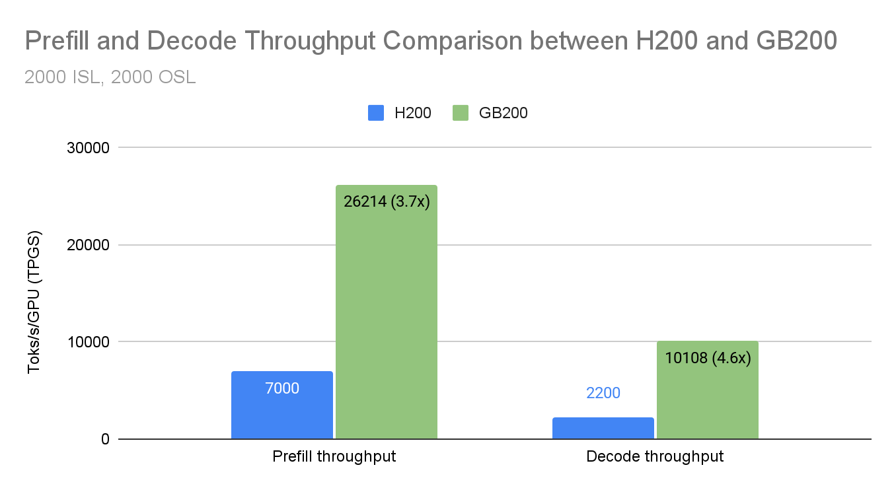
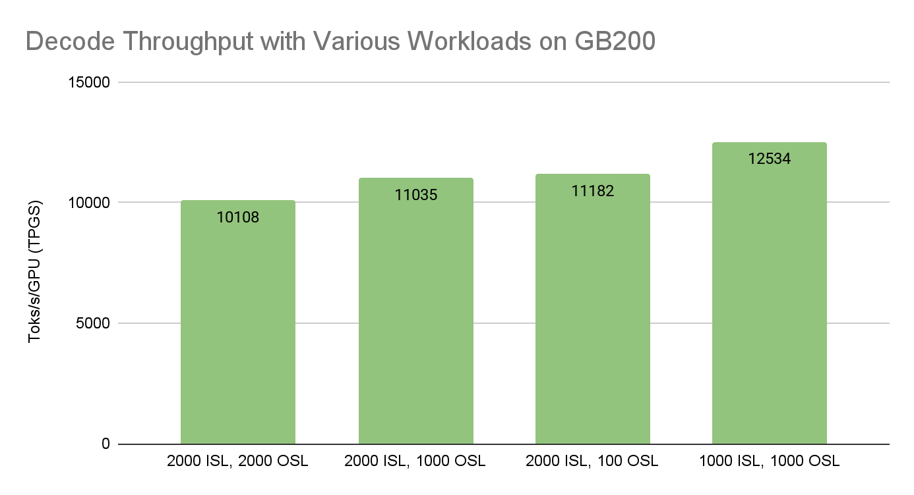
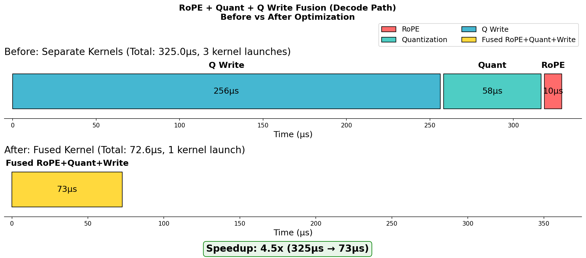
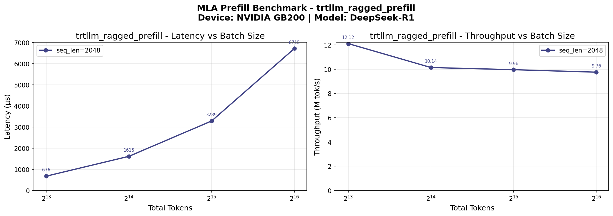
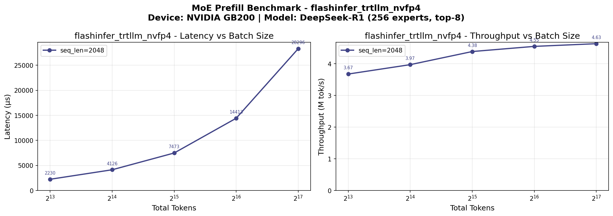
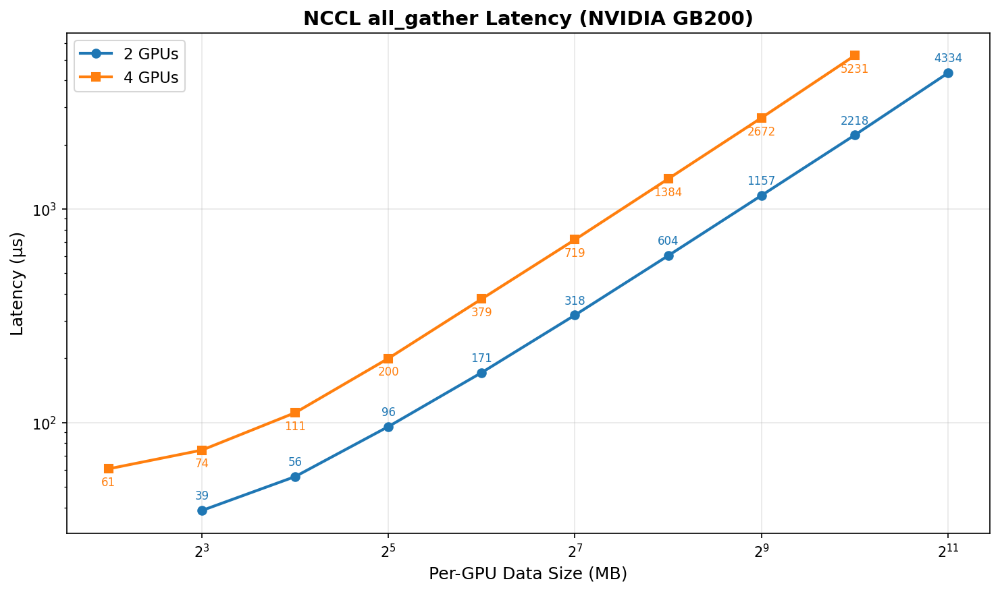
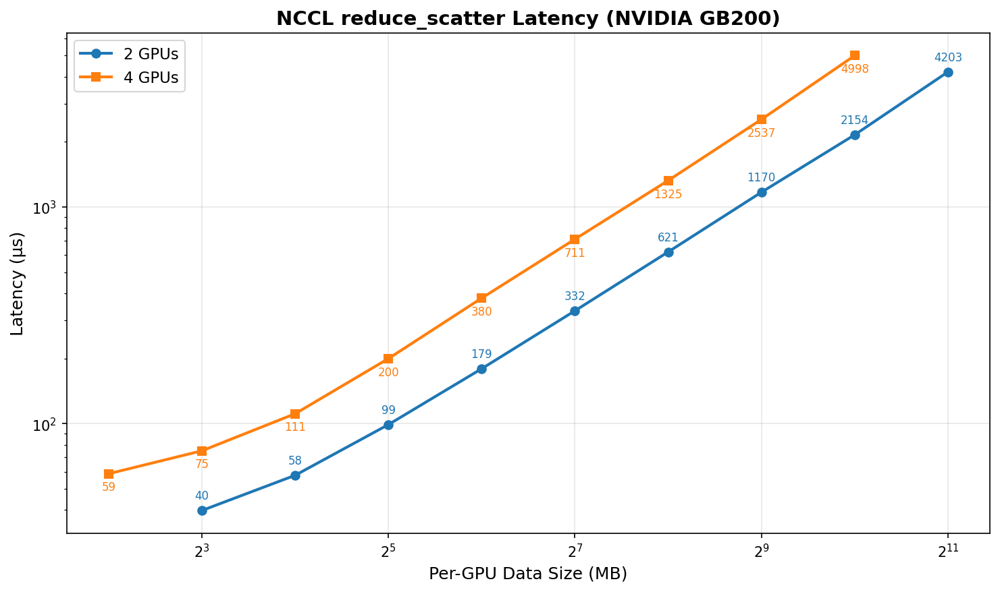
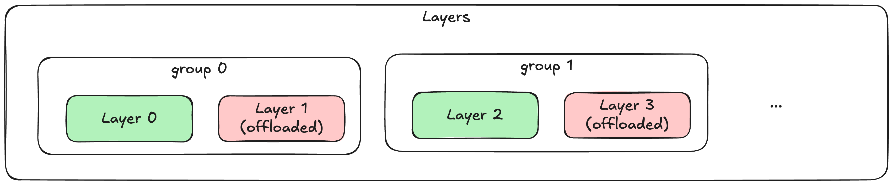
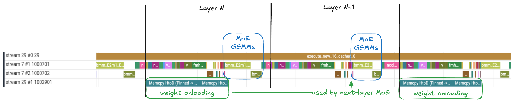

# DeepSeek-R1 上 GB200：Wide-EP 第二张成绩单

英文对照：[en/vllm/blog/serving/gb200-wideep.md](../../../../en/vllm/blog/serving/gb200-wideep.md)  
原文：https://vllm.ai/blog/2026-02-03-dsr1-gb200-part1  
2026-02-03。署名 **Meta and NVIDIA Team**。接 [Wide-EP](large-scale.md) 的 H200 线（约 **2.2k tok/s/H200**）。数字是当时演示，不是你机器的承诺。

和 [EPD](epd.md) 分清：这里是 **文本 Prefill/Decode 分拆 + 宽 EP**，不是视觉 encoder 分拆。

本地图（原文版权仍归原站；学习对照用），按下文章节穿插。

## 引言

H200 那张 Wide-EP 成绩单之后，同一班人接着拧 NVIDIA **GB200**。头条：**26.2K Prefill TPGS**（tokens per GPU second）、**10.1K Decode TPGS**，负载 **2K 输入 / 2K 输出**，DeepSeek 风格 MoE——R1 / V3 / V3.1。采集拓扑：**4 个 Prefill 实例 × 2 张 GB200**，加 **1 个 Decode 实例 × 8 张 GB200**，全都 DP + EP。

页上点名的新刀：

- 低精度（[NVFP4](https://developer.nvidia.com/blog/introducing-nvfp4-for-efficient-and-accurate-low-precision-inference/) GEMM、FP8 GEMM、NVFP4 MoE Dispatch）
- Kernel fusion（RoPE+Quant+Q write、RoPE+Quant、Concat K）
- 用 weight offloading 把 Prefill 缩下去
- 砍 chunking 税

H200 文里已经讲过、这里仍在配方里的：async scheduling；Prefill/Decode 分离 serving。

GB200 自己的算力，加上这些针对性优化，是他们相对 H200 的那一跳。

## 成绩

同一套 2K/2K。DeepSeek-V3/R1，GB200 对 H200。部署：

| Deployment setup | H200 | GB200 |
| :---- | :---- | :---- |
| Prefill | 16 GPUs | 8 GPUs (4 instances × 2 GPUs) |
| Decode | 32 GPUs | 8 GPUs (1 instance × 8 GPUs) |

页上把余量归给 GB200 的显存带宽（**8 TB/s** 对 **4.8 TB/s**）、FP4 带来的更高算力、以及 CPU–GPU 的 **NVLink-C2C**——然后再归给下面那些优化。头条图在页上；正文没有把图里的 H200 TPGS 再写一遍（H200 那条线仍是 [large-scale](large-scale.md) 里的约 2.2k tok/s/H200）。收束处把 GB200 这组成绩写成相对 H200 **3–5×**。

他们还在 GB200 上扫了 DeepSeek-V3/R1 的 **Decode** 吞吐：并行度不变，改「把显存吃满」的 Decode batch。复现入口：[vllm#33583](https://github.com/vllm-project/vllm/issues/33583)。图上的点，正文没有列表。

## 关键优化

### 低精度

GB200 上 FP4 / FP8 吞吐比 H200 高一截。vLLM 用在三处。

#### NVFP4 GEMM（MoE GEMM、O-proj）

DeepSeek-V3/R1 的 MoE 专家权重和 output projection 可以打成 FP4。vLLM 接 FlashInfer 的 **TRTLLM-Gen** GEMM，按 GB200 的 FP4 tensor core 排班。

Checkpoint 里是打包好的 4-bit 权重加 per-group scale。运行时 TRTLLM-Gen 在 tensor core 里现场反量化——接近原生 FP4 吞吐，质量他们说还站得住。

实现笔记：

- FP4 权重，scale 是 **FP8 或 FP16**，打包存放
- FlashInfer TRTLLM-Gen，对着 GB200 tensor core 调度
- 用在 **MoE expert GEMM** 和注意力 **O-proj**

#### MLA 上的 FP8 GEMM

MLA 的 query 上投影（latent → 完整 query）走 **FP8**，不走 FP4。原文的取舍：MoE 吃 FP4 的吞吐；注意力投影更怕量化，留 FP8。优化过的 FP8 GEMM 相对 FP16 明显加快，注意力质量他们说保住了。

#### NVFP4 MoE Dispatch

Dispatch——把 token 送到专家——也可以降精度。**NVFP4 dispatch** 在 all-to-all **之前** 把 activation 打成 FP4。通信量相对 FP16 dispatch 少 **4×**，EP 下卡间延迟跟着掉。量化那点税，被通信省下来的摊掉。

### Kernel Fusion

融掉 HBM 往返和 launch 税。

#### RoPE + Quant + Q Write（Decode）

Decode 的 query 路径：

1. RoPE
2. 给后续 GEMM 做量化
3. 写入 query buffer

三步一个 kernel，中间两趟往返没了。

Decode 上的 RoPE+Quant+Q Write 融合。

#### RoPE + Quant（Prefill）

Prefill 把 RoPE 和量化融在一起。token 批次更大，带宽账更明显。

#### Concat K

MLA 的 key：FlashInfer `concat_mla_k`。key 两截——`k_nope`（按 head、没有位置编码）和 `k_rope`（所有 head 共享）。必须拼回去。

朴素做法：拷 `k_nope`，再把 `k_rope` 广播到全部 **128** 个 head——带宽很疼。`concat_mla_k`：

- **按 warp 干活：** 每个 warp 盯一对 `(token, head_chunk)`，一次 **16** 个 head
- **向量化访问：** nope 走 8-byte vector load，rope 走 4-byte
- **软件流水 + L2 prefetch：** 算当前行时把下一行预取进来
- **rope 寄存器复用：** rope 共享，进寄存器一次，写给这个 chunk 里全部 16 个 head

### 把 Prefill 缩下去

#### 为什么缩卡说得通

吞吐型 serving 通常加卡：要么把模型塞进去，要么把显存（专家、上下文）切碎好涨 batch。已经 **compute-bound** 的 Prefill 可以反着来：卡少一点，通信少一点。

页上的微基准：MLA backend 吞吐在 batch 从 **16K 涨到 64K** token 时开始平台。过了 **64K**，MoE 吞吐也几乎不再涨。算力在 **2 GPU** 能装下的 batch 上就已经饱和。

MLA 和 MoE 吞吐在约 64K batch 处平台。

GPU 数从 **4 收到 2**，EP 的 NCCL collective（`all_gather`、`reduce_scatter`）减半。

EP 度减半，通信税跟着减半。

#### Weight Offloading v2

显存脚印缩小、吞吐还在：weight offloading **v2**，异步 prefetch。灵感来自 [SGLang Prefill offload](https://github.com/sgl-project/sglang/pull/8034)，再接到 vLLM 里的 `torch.compile` 和 CUDA graph。

**v1：** 卸到 CPU 的权重靠 UVA 去碰——慢 PCIe。GPU 实在装不下时的退路。

**v2：** 提前显式 copy（onload）到 GPU。下一层的权重在 **另一条 CUDA stream** 上 onload。onload 和 kernel 重叠好了，延迟可以完全藏住。

按组选层：

- `group_size`：每 N 层一组
- `num_in_group`：每组卸这么多层（每组最后 N 层）
- `prefetch_step`：提前预取几层

**DeepSeek-R1 Prefill** 他们卸 **每两份 MoE GEMM 权重里的一份**——房子省下来，吞吐他们说仍是满的。

trace：weight onload 和层计算重叠。

GB200 的 **NVLink-C2C** 把 CPU–GPU 连在一起，v2 在这里比 PCIe 机器咬得更死。

### 砍 chunking 税

大 batch 的 MoE 要切块才进得了显存。块太小，launch 和同步反复交税，GPU 会空一拍。vLLM 把 chunk size 露出来；**这篇的 GB200 选择不是 H200 默认**——互联和 kernel 形状都不一样。H200 笔记里的开关不要原样粘过来。

#### MoE DP Chunk

DP+EP 时，各 DP rank 按协调好的块 dispatch token。`VLLM_ENABLE_MOE_DP_CHUNK`（默认开）管这事。

块大，dispatch/combine 的税摊得开。大小：`VLLM_MOE_DP_CHUNK_SIZE`（默认 **256** token）。

**GB200 上：** Prefill 关掉 MoE DP chunking（`VLLM_ENABLE_MOE_DP_CHUNK=0`）；Decode 把 `VLLM_MOE_DP_CHUNK_SIZE` 设成 **batch size**。

#### MoE Activation Chunk

大 Prefill batch：activation 张量切块再送进 MoE。`VLLM_ENABLE_FUSED_MOE_ACTIVATION_CHUNKING`（默认开）。大小：`VLLM_FUSED_MOE_CHUNK_SIZE`（默认 **16K** token）。最优是「显存还能装多大就多大」。

**GB200 上：** 关掉 activation chunking（`VLLM_ENABLE_FUSED_MOE_ACTIVATION_CHUNKING=0`）——显存够装整批。

#### Output Processing Chunk

V1 异步 serving 路径把输出处理（logit、采样、回包）切块。`VLLM_V1_OUTPUT_PROC_CHUNK_SIZE`（默认 **128**）。块大吞吐好；流式负载上块太大，消息间隔的方差会涨。

**GB200** 上吞吐优先的 Decode：chunk size **2048**。

## 下一步

当时还在 GB200 上做：

1. **负载更匀、EP 再拉宽**——更大 EP 度、更动态的流量，rebalance 算法再好一点。
2. **MoE dispatch 延迟**——all-to-all 再便宜：kernel 和通信调度。
3. **通信藏进计算**——通信绑住的路径上更狠地重叠。
4. **GB300 上的 WideEP / 大规模 serving**——更多 HBM 和算力，更高 TPGS，主机脚印更小。

活页：[roadmap.vllm.ai](http://roadmap.vllm.ai)。

## 收束

- DeepSeek 风格 MoE：**26.2K Prefill TPGS**、**10.1K Decode TPGS**——页上写成相对 H200 **3–5×**。
- 低精度（NVFP4 GEMM、FP8 GEMM、NVFP4 dispatch）吃 GB200 的 tensor core。
- Kernel fusion 砍带宽和 launch。
- Prefill 缩卡 + weight offloading v2：EP 通信降下去，算力仍饱和。
- Chunking 用环境变量拧——**这一代平台**上的大 batch 税这样砍。

## 团队

- Meta: Ming Yang, Xiaozhu Meng, Pengchao Wang, Lucia (Lu) Fang, Bangsheng Tang, Yan Cui, Hongyi Jia, Jinghui Zhang, Zebing Lin, Jason Park, Yejin Lee, Jaewon Lee, Bradley Davis, Jingyi Yang, Adi Gangidi, Ayush Goel, Charlotte (Ye) Qi, Stephen Chen, Raj Ganapathy, Akshay Hegde, Lu Fang
- NVIDIA: Duncan Moss, Cyrus Chang, Andrew Briand, Siyuan Fu, Hanjie Qiu, Jason Li, Pavani Majety, Xin Li, Chirayu Garg, Abhinav Singh, Minseok Lee

## 参考文献

- [vLLM Large Scale Serving: DeepSeek @ 2.2k tok/s/H200 with Wide-EP](https://blog.vllm.ai/2025/12/17/large-scale-serving.html) — 学习笔记：[large-scale](large-scale.md)
- [FlashInfer: Kernel Library for LLM Serving](https://github.com/flashinfer-ai/flashinfer)
- [NVIDIA GB200 NVL72 Architecture](https://www.nvidia.com/en-us/data-center/gb200-nvl72/)
