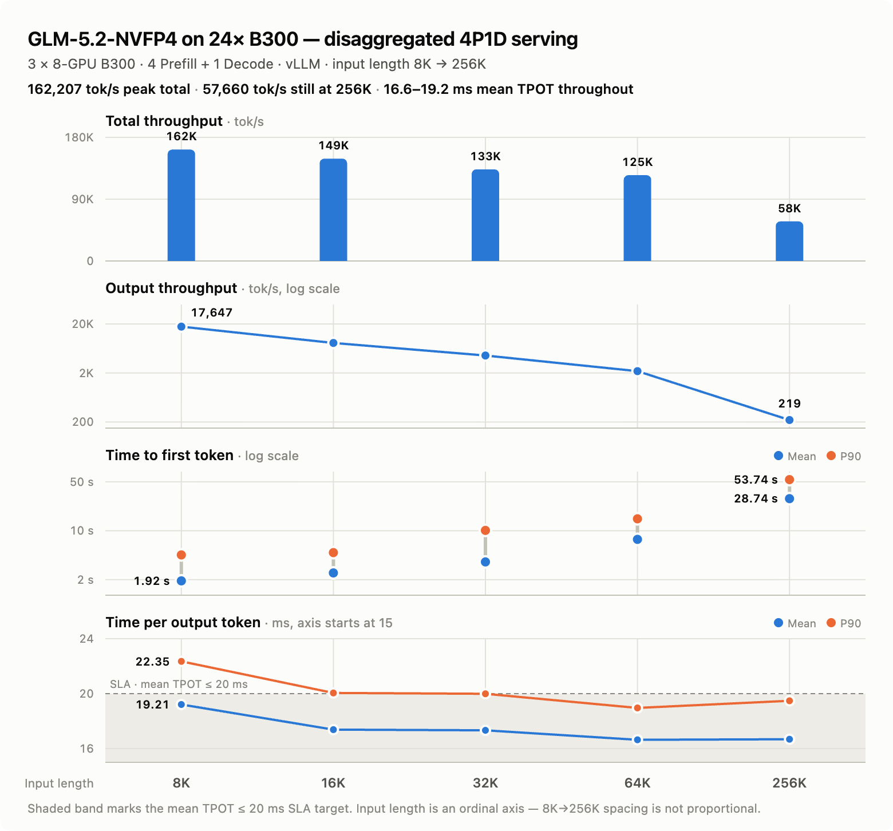
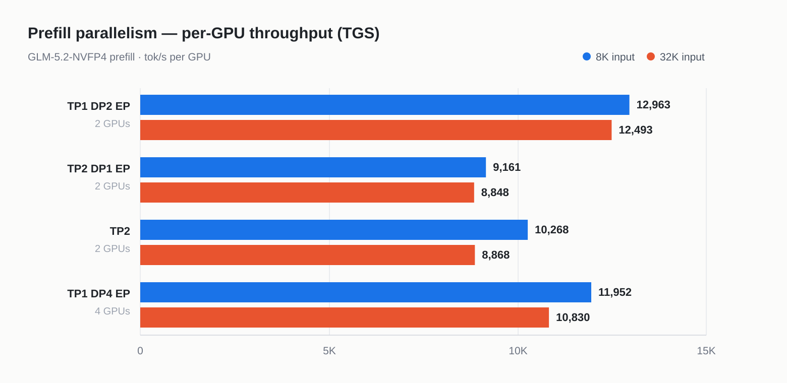
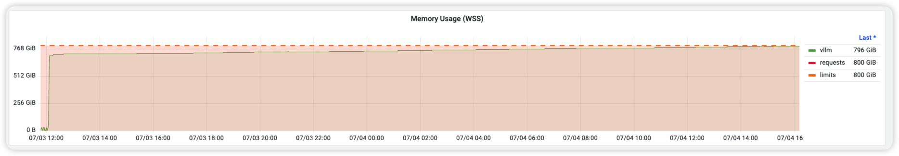

# GLM-5.2 24×B300：SLA 不是峰值吞吐，TPOT 40ms→17ms

英文对照：[en/vllm/blog/serving/glm52-b300.md](../../../../en/vllm/blog/serving/glm52-b300.md)  
原文：https://vllm.ai/blog/2026-07-23-glm-5.2-nvfp4-b300-pd  
2026-07-23。署名 **DaoCloud Team**。GLM-5.2-NVFP4（744B / 40B active），DSA 稀疏 attention，原生 MTP。硬件：**3 × 8 B300**（24 GPU），**4 Prefill + 1 Decode**。KV 搬运：**NIXL**。更早的 GLM parser：[glm45.md](glm45.md)。P/D 与 cache：[large-scale.md](large-scale.md)、[hybrid-ssm.md](hybrid-ssm.md)、[moriio.md](moriio.md)。Runner：[mrv2.md](../architecture/mrv2.md)。投机算术：[spec-decode.md](../performance/spec-decode.md)。页上是他们的 SLA 长跑，不是你的 SLA。v0.26.0 已收齐他们踩过的坑。

**Hero（封面；未收录）。** 原文 `/assets/figures/2026-07-23-glm-5.2-nvfp4-b300-pd/01-hero.png`。

本地图（原文版权仍归原站；学习对照用）：







## TL;DR

24 张 B300 上拆成 **4P1D**。生产 SLA：**mean TTFT ≤ 2.5 s**，**mean TPOT ≤ 20 ms**。同一硬件起点：16K 输入 mean TPOT 将近 **40 ms**——大约两倍 SLA。全程 **40 ms → 17 ms**。最后发出去的并行，**不是** 原始吞吐最高的那套。文末有可复现的 `vllm serve`。

**Figure。** GLM-5.2-NVFP4，24×B300，4P1D：总吞吐、输出吞吐、TTFT、TPOT，输入 8K–256K。

## 1. 为什么拧的是 SLA，不是峰值吞吐

Colocated 里，Prefill 块会插进 Decode batch。每条新进来的长 prompt，都会把已经在 Decode 的请求的 **ITL** 拉长。TPOT 尾巴于是变成「进来的 prompt 有多长」的函数——serving 系统管不了这件事。分离把 Prefill 从 Decode 关键路径上拿掉，TPOT 只跟 Decode batch 组成有关。紧的 TPOT SLA 这才签得下去。所以这篇把 **P/D 当起点**，不当成诸多优化里的一项。

生产不只看峰值吞吐。真正的问题是：不踩延迟红线，系统能扛多少流量：

- 典型上下文：**16K–256K**
- **Mean TTFT ≤ 2.5 s** — 用户动作到第一个看得见的 token
- **Mean TPOT ≤ 20 ms** — 大约 50 tokens/s 的流式；再慢，阅读体验就钝
- 这两条硬约束底下，再挤吞吐

Batch size **不定死**。负载是 request rate；并发是这个 rate 在 SLA 下自然长出来的数。Prefill 代价随上下文涨，输入越长并发越往下沉：8K 大约 **700**，16K **300**，256K **25**，上面还有 `--max-concurrency 1024`。

吞吐涨 30%、mean TPOT 却越过 SLA 的配置，对他们没用。第 4 节是个代表。

GLM-5.2 是 744B MoE、40B 激活，DSA 稀疏 attention，原生 MTP。vLLM 三样都已经会。活是把它们和 P/D 拧在一起，再围着 SLA 调参数、拓扑、调度。

## 2. 起点：P/D 下把 Decode 拧快

Prefill 已经达标，TTFT 还有余量。瓶颈在 Decode：16K 进 / 1K 出，mean TPOT 靠近 **40 ms**，P99 抖得厉害。

### 2.1 根因：P/D 交接处的混合 batch

KV 经 KVConnector 交到 Decode 之后，第一步 Decode 只要算 **1** 个 token。那台上已经在跑 MTP 的请求，每步却是 **1 + N**。形状不同 → 混合 batch → 掉出 uniform-decode 的 full CUDA Graph，落到 piecewise / eager。

DP 会放大。CUDA Graph 模式和 padding 要跨 rank 对齐：**任一** rank 接到新转过来的请求，**所有** rank 跟着走慢路径。稳态 P/D 里新请求不停来，慢路径几乎常开。

### 2.2 优化：Decode 侧 dummy speculative padding

请求刚到的第一 Decode 步，用 dummy speculative token 把形状垫到 **1 + N**，跟在跑的 Decode 对齐。均匀 Decode，full CUDA Graph 不掉。

不必从 Prefill 搬生成 token 或 draft token。[PR #45237](https://github.com/vllm-project/vllm/pull/45237) 合进社区。

### 2.3 收益

Mean TPOT **约 40 ms → 约 22 ms**——整趟最大的一刀。

给 P/D + 投机解码的更宽教训：最大的损失未必住在某一颗 kernel。它可以坐在子系统 **交界** 上：请求状态、调度形状、CUDA Graph 模式里一点点不一致，被 DP 规模和持续流量放大。

## 3. Decode 再拧

22 ms 贴着 SLA，没有安全边际。

### 3.1 Model Runner V2：TPOT 再低 11%

v0.25.0 起 MRV2 是稠密模型默认。GLM-5.2 是 MoE——**默认不开**。显式：`VLLM_USE_V2_MODEL_RUNNER=1`。

他们的 Decode 配置上，MRV2 相对 MRV1 砍 TPOT 约 **11%**。路径更短之外：

1. [PR #47285](https://github.com/vllm-project/vllm/pull/47285) — GLM-5.2 DSA indexer 的 Prefill-metadata kernel 进启动 warmup，第一条生产请求不再触发 Triton JIT。Bench 容易看不见（warmup 吃掉了）；生产里每次滚动发布都会冒冷启动尖刺。
2. [PR #46448](https://github.com/vllm-project/vllm/pull/46448) — 多卡 MTP 的 local argmax。`use_local_argmax_reduction`：draft 生成不再 AllGather 整词表 logits；TP 通信量大约 **2 × TP size**，不再跟词表成正比。MRV2 下 MTP、EAGLE、DFlash 和其他 speculator 都受益。
3. [PR #45953](https://github.com/vllm-project/vllm/pull/45953) — 动态投机长度也能走 full CUDA Graph；draft 长度一变，少 miss graph、少掉 eager。

### 3.2 All-to-All backend：再低 4%

Decode 跑 **DEP8**；专家 dispatch/combine 就在关键路径上。FlashInfer NVLink A2A `flashinfer_nvlink_two_sided` 再砍 TPOT 约 **4%**。

更新的 `flashinfer_nvlink_one_sided` 预期更好。这篇留 two-sided，因为那是他们 **测过** 的。

### 3.3 CUDA Graph 模式

Decode：`--compilation-config '{"cudagraph_mode":"FULL_DECODE_ONLY"}'`，配合 `--max-num-batched-tokens 1024`。Decode 不需要 Prefill 形状的 graph。`FULL_DECODE_ONLY` 盖住 Decode 路径，启动编译也短一截。

### 3.4 MTP 投机解码

Decode `num_speculative_tokens=3`；Prefill `1`。（GLM-5.2 上 MTP 要和 IndexerCache 一起才划算，见第 5 节。）Prefill 该尽快交出 KV——更深的投机在那边买得少。Decode 坐在延迟路径上，acceptance 够高时，更深的投机才能摊薄每 token 代价。

## 4. Prefill 并行：为什么不选吞吐最高的配置

8K 和 32K 上比了几套 Prefill。GPU 数不同，有意义的尺子是 **TGS**（每 GPU 吞吐）。

**Figure。** 四种并行策略的每 GPU Prefill 吞吐，8K 和 32K。

绝对 token 上 **TP1 DP4 EP** 最快——8K 时 **47,806 tok/s**——只因为 GPU 多一倍；按每卡它排第二。两条：

1. **TP2 + EP 不如纯 TP2。** 两张卡的规模，all-to-all 开销盖过 EP 的好处。EP 要有足够专家摊在足够设备上，通信才摊得平。
2. **TP1 DP2 EP 的 TGS 最好；他们发出去的是 TP1 DP4 EP。**

生产和追 benchmark 在这里分手。每卡效率最好的那套，每实例只有两张卡——KV 撑不住 GLM-5.2 的 **1M** 上下文。他们不愿为大约 **8%** 的 TGS 放弃这个能力，于是 **TP1 DP4 EP**：少约 8% 每卡效率，换每实例四卡的 KV 容量。

## 5. MTP + IndexerCache：把 acceptance 稳住

这次部署一次打开三件还比较新的能力：P/D、MTP、MRV2。走得少的组合路径，长尾问题冒出来。多数修复几天内从报告到发布；**v0.26.0** 已经都有。

### 5.1 IndexerCache：让 MTP 在 DSA 上划得来

IndexerCache（[PR #44420](https://github.com/vllm-project/vllm/pull/44420)）**不是** 普通 KV cache——它复用 DSA indexer 吐出的 Top-K 稀疏下标。朴素做法：每个 MTP draft 步都重跑 indexer；稀疏检索代价随上下文涨，可以把投机的好处吃掉。`index_share_for_mtp_iteration`：第一步算 Top-K，后面的 draft 步复用。GLM-5.2 上 MTP 要划得来，这是前提。

三处后续，把高并发下的 acceptance 稳住：

- [PR #45895](https://github.com/vllm-project/vllm/pull/45895) — 跳过 Top-K 层时的 indexer 初始化；GLM-5.2 MTP 归一化循环。GLM-5.2-FP8 TP=8：mean accepted length 约 **3 → 约 4**，平均 acceptance 约 **60%**，IFBench 仍 **74.62**。
- [PR #47238](https://github.com/vllm-project/vllm/pull/47238) — batched 请求的共享 index buffer 布局：第一步之后，只留每个请求 **最后一个** query token 对应的 Top-K。index 共享从单请求走到高并发 batch，关键就是这一步。
- [PR #47448](https://github.com/vllm-project/vllm/pull/47448) — MTP 循环复用 post-final-norm hidden。

IndexerCache 不只是省算。它是高并发下 MTP acceptance 还能站住的机制。

### 5.2 组合配置上另外两处

**MRV2 调度分类。** 某种 bench 模式下 TPOT 方差过大：[Issue #47239](https://github.com/vllm-project/vllm/issues/47239)。投机解码步被当成 Prefill，走了慢路径。[PR #47381](https://github.com/vllm-project/vllm/pull/47381)。

**P/D 里异步 KV 加载的 lookahead。** [PR #46694](https://github.com/vllm-project/vllm/pull/46694) — Decoder 等远端 KV 传完再分配投机 token 槽；处理最后一块 **残 KV**。这是 P/D × 投机解码交界上的事。

两处都在 v0.25.0+。

### 5.3 准确率

最终配置（NVFP4 + MTP + P/D）跑公开 bench：

| 项目 | 分数 |
| --- | ---: |
| AIME 2025 | 86.67 |
| GPQA | 92.89 |
| LongBench V2 | 64.01 |
| MMLU-Pro | 86.3 |
| SWE-bench Verified (Agentic) | 85.2 |

和社区报的 GLM-5.2 对齐。对他们最要紧的是 LongBench V2：它在长上下文里真正练 DSA 和 IndexerCache 共享。**64.01** 说明 index 共享站得住，投机没有拿质量换速度。

## 6. 上游

跟踪 issue：[Issue #46654](https://github.com/vllm-project/vllm/issues/46654)。

**P/D 的第二层。** [PR #42285](https://github.com/vllm-project/vllm/pull/42285) — 统一的 CPU KV-cache 布局当中间层。`TieringManager` 协调主 cache 和 P/D connector。合进 v0.25.0。

**长上下文 Prefill 的 PCP virtual batching。** [PR #46570](https://github.com/vllm-project/vllm/pull/46570) — 请求切成 virtual batch 行，跨 context-parallel rank 并行；只聚合 MLA latent cache 和 DSA indexer cache。初步 4 GPU GLM-5.2-NVFP4 / 32K Prefill：TP=2 + PCP=2，prompt 吞吐约 **20.1K → 27.3K tok/s**。2026-07-19 合进 `main`，下一版发。第 4 节正是因为 KV 容量才没选 TGS 最优——PCP 可能改这笔账。

## 7. 可观测：上线之后怎么验 SLA

Bench 过了不等于生产就绪。P/D 的观测更难：延迟拆在两个池子里。TTFT 多半看 Prefill；TPOT 看 Decode；中间还有 KV 传输。用户只看见一件事——服务变慢了。

Prometheus + Grafana。盯：

- **分池的 TTFT / TPOT 分位数**，不要只看端到端。先判断问题在 Prefill 还是 Decode。
- **MTP acceptance 和 mean accepted length。** Acceptance 掉了不会报错，TPOT 只是慢慢钝。任何 Decode 异常，先开这块仪表。把 MTP acceptance 当 **一等告警**。
- **KV-cache 利用率 vs GPU 利用率**，两边池子都看。P/D 的核心好处是两类资源独立伸缩；两条曲线的相对高低就是扩缩信号。
- **KV 传输延迟和队列深度** — 跨节点网络有没有变成瓶颈。

### 7.1 只有长稳测才看得见的问题

短 bench 验性能，不验长期稳定。连续跑好多天：host RSS 在几十小时里 **线性涨**，没有平台。

**Figure。** Grafana Memory Usage (WSS)：vLLM 容器内存大约 **721 GiB → 800 GiB**，几十小时。

Bench 为什么看不见：

- 涨得慢，以小时计。`vllm bench serve` 几秒几分钟抓不到。
- 是主机内存，不是 GPU。GPU 侧指标全正常。
- `EngineCore` 启动时 `gc.freeze()`——泄漏对象进不了 `gc.get_objects()` / `tracemalloc`，看起来像 allocator 碎片。

报告在 [PR #47723](https://github.com/vllm-project/vllm/pull/47723)；维护者并进 [PR #44490](https://github.com/vllm-project/vllm/pull/44490)。

根因：生产者 / 消费者的门闩不一致。[PR #35219](https://github.com/vllm-project/vllm/pull/35219) 为清 Mamba SSM cache 引进 `SingleTypeKVCacheManager.new_block_ids`。记账按 KV-cache spec 类型（`FullAttentionSpec`、`MLAAttentionSpec` 等），**清理却只在模型有 Mamba 层时发生**。没有 Mamba 的模型——多数标准 attention，以及带 MLA 的 GLM-5.2——每次分配都记、从不排空。请求量一大，列表无界涨。修法：每个调度步 **无条件** `take_new_block_ids()`；只有真正需要清的时候才用这份结果。Mamba 行为不变。

## 8. 完整部署配方

### 8.1 环境

| 项 | 配置 |
| --- | --- |
| 硬件 | 3 × 8 B300（24 GPU） |
| 模型 | GLM-5.2-NVFP4 |
| 拓扑 | 4 Prefill（TP1 DP4 EP，每实例 4 GPU = 16）+ 1 Decode（TP1 DP8 EP = 8） |
| KV 传输 | NIXL |

### 8.2 Prefill 节点

```bash
export VLLM_USE_V2_MODEL_RUNNER=1

vllm serve /mnt/model/glm/GLM-5.2-NVFP4 \
    --trust-remote-code \
    --kv-transfer-config '{"kv_connector":"NixlConnector","kv_role":"kv_producer"}' \
    --chat-template-content-format=string \
    -ep \
    -tp 1 \
    -dp 4 \
    --tool-call-parser glm47 \
    --enable-auto-tool-choice \
    --reasoning-parser glm45 \
    --gpu-memory-utilization 0.92 \
    --enable-prompt-tokens-details \
    --speculative-config='{"method":"mtp","num_speculative_tokens":1}' \
    --shutdown-timeout 300 \
    --fingerprint-mode=none
```

### 8.3 Decode 节点

```bash
export VLLM_USE_V2_MODEL_RUNNER=1

vllm serve /mnt/model/glm/GLM-5.2-NVFP4 \
    --trust-remote-code \
    --chat-template-content-format=string \
    --kv-transfer-config '{"kv_connector":"NixlConnector","kv_role":"kv_consumer"}' \
    --compilation-config '{"cudagraph_mode":"FULL_DECODE_ONLY"}' \
    --max-num-batched-tokens 1024 \
    -ep \
    -tp 1 \
    -dp 8 \
    --tool-call-parser glm47 \
    --enable-auto-tool-choice \
    --reasoning-parser glm45 \
    --gpu-memory-utilization 0.90 \
    --enable-prompt-tokens-details \
    --all2all-backend=flashinfer_nvlink_two_sided \
    --speculative-config='{"method":"mtp","num_speculative_tokens":3}' \
    --shutdown-timeout 300 \
    --fingerprint-mode=none
```

### 8.4 Benchmark 方法

`vllm bench serve` 随机集。**没有** 前缀缓存命中——TTFT 是最坏情况、纯计算。固定 `--request-rate` = 目标 TPS / (input_len + output_len) × 一个调节因子。

```bash
vllm bench serve \
  --backend openai-chat \
  --model /mnt/model/glm/GLM-5.2-NVFP4 \
  --endpoint /v1/chat/completions \
  --dataset-name random \
  --random-input-len 16384 \
  --random-output-len 1000 \
  --request-rate <target TPS / (input + output) × tuning factor> \
  --percentile-metrics ttft,tpot,itl,e2el \
  --metric-percentiles 50,90 \
  --save-result
```

## 9. 下一步

前瞻，不是这篇测出来的结论。

**第一，把每次 target forward 变便宜。** GEMM、Attention、Indexer 之外：PDL、persistent kernel、局部 megakernel，以及 MoE Dispatch、Expert GEMM、Combine 上的算力 / 通信协同。跨节点：WideEP、分层 all2all、跨节点通信和计算重叠。把一步完整 Decode 的端到端关键路径缩短。

**第二，投机解码上的模型–运行时共优化。** 模型侧：更强的 drafter（DSpark）、更宽的数据。运行时：动态投机、按请求的 proposal 长度、紧凑核验。Draft 决定能预测多远；serving 运行时决定预测划算到哪一步。

第 6 节的 PCP virtual-batch 已经在 `main`。下一步：它会不会拆掉第 4 节 KV 容量 vs 每卡效率那笔账。

## 关于我们

[DaoCloud](https://www.daocloud.io/) 做企业 LLM 训练和推理的全栈平台：异构加速器调度、推理编排、可观测。调参过程中的观察交给了 vLLM 社区，改进合进上游。文中配置可直接配 **v0.26.0** 用。

感谢 Nicolò Lucchesi（[@NickLucche](https://github.com/NickLucche)，[Mistral AI](https://github.com/mistralai)）提议写这篇、细审、把它从草稿推到现在。也感谢 [Issue #46654](https://github.com/vllm-project/vllm/issues/46654) 下的 vLLM 社区——多数修复一周内从报告到发布。
