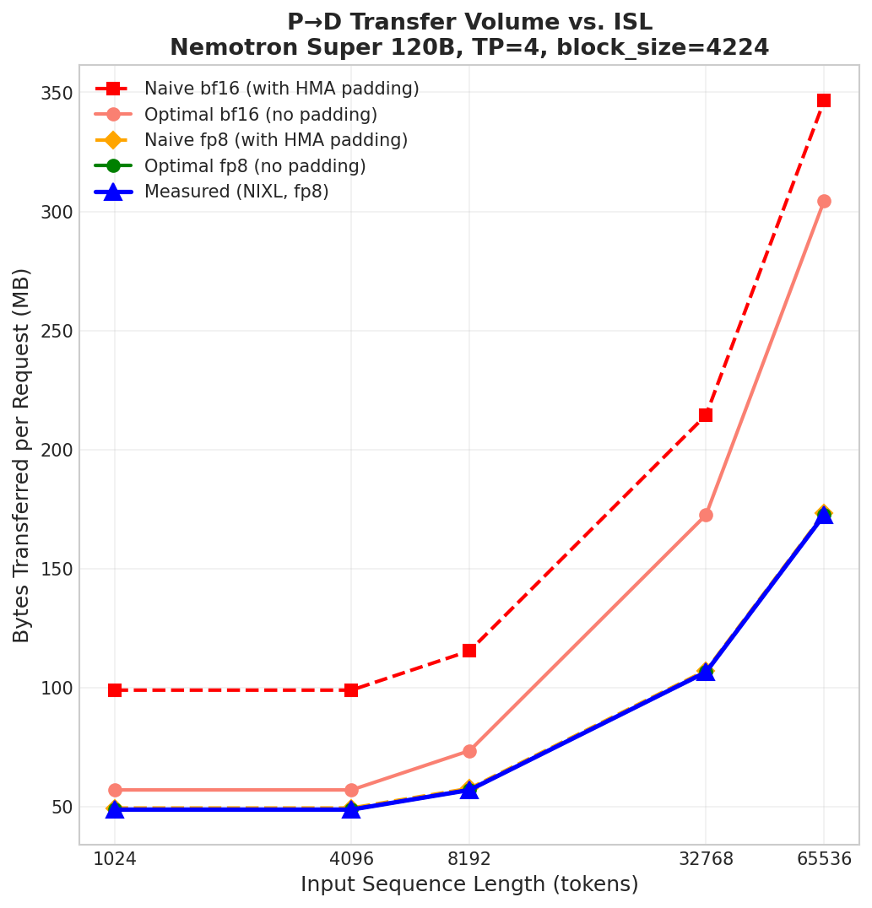
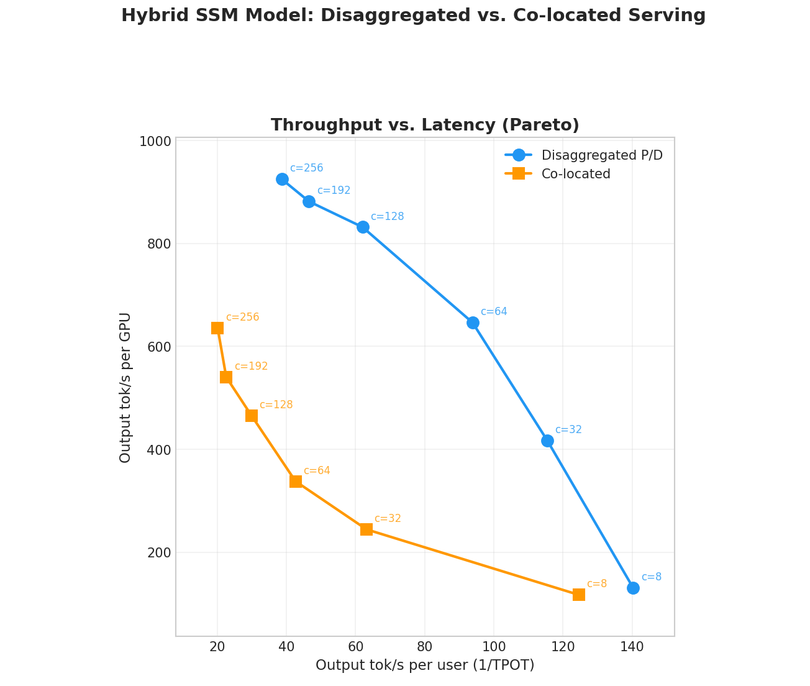

# Hybrid SSM 的 P/D 分离：两种记忆，同一根 RDMA 管子

英文对照：[en/vllm/blog/serving/hybrid-ssm.md](../../../../en/vllm/blog/serving/hybrid-ssm.md)  
原文：https://vllm.ai/blog/2026-04-21-hybrid-ssm-disagg  
2026-04-21。`vllm>=0.20.0`。Nemotron-H 这类模型：Mamba 式 SSM 层和满注意力（FA）层插花。标准 Transformer 的 NIXL P/D 按统一 KV 块来；SSM 不是那种块。这篇是加法：没有 SSM 层时旧路径不动。

三件关键想法：

- **双描述符**：同一片物理内存，两套 NIXL 视图
- **物理块 vs 逻辑块**：FlashInfer 一类 kernel 块，对不上 HMA / 用户的逻辑块
- **Conv 的三个描述符**：异构 TP 也能零拷贝，发送端不必重排

底座是 [HMA 对 NIXL 的接口](https://github.com/vllm-project/vllm/pull/35758)。PR：[#36687](https://github.com/vllm-project/vllm/pull/36687) 双描述符与同构 TP；[#37416](https://github.com/vllm-project/vllm/pull/37416) DS conv 布局；[#37635](https://github.com/vllm-project/vllm/pull/37635) 异构 3-desc；[#37310](https://github.com/vllm-project/vllm/pull/37310) Mamba P/D 的 N-1 Prefill。

本地图（原文版权仍归原站；学习对照用）：





## 背景：稠密 Transformer 的 NIXL P/D

四段：

1. **登记** KV 张量，好走 RDMA
2. 按块做描述符 `(address, length, device_id)`——搬运单位是块，不是整片 region
3. 每一对 P–D **握手一次**（agent handle、块数、长度）
4. **搬运**：调度器告诉 D 拉哪些块；D 把 `block_id → descriptor_id`，RDMA READ，轮询

均匀模型：`M` 个 region × `N` 块。Region `r` 的块 `b` → 描述符 `r * N + b`。混合模型打破这份统一名单：FA 和 SSM 要的描述符大小、块数都不一样。

## FA 和 SSM 根本不是同一种记忆

稠密 KV：`[num_blocks, 2, block_size, num_kv_heads, head_dim]`（或某种 layout 变体）。块大小、页大小、块数，层与层一样。

Mamba 存的是整段历史的**塌缩**：conv + 时间维 SSM，没有 token 轴：

```text
Conv:  (conv_dim, state_len)                 例如 (3072, 3)      bf16
SSM:   (num_heads, head_dim, state_size)     例如 (32, 64, 128)  fp32
```

一块就是一份完整快照。对 SSM，`block_size` 等于 **1**。搬运单位仍然是块。

### HMA 的共享张量

Hybrid Memory Allocator 按类型分组（FA 一堆、SSM 一堆……），再让各组**同一位置的层共用一块物理张量**。同一页：FA 看成 K/V，Mamba 看成 conv+SSM+padding。FA 页大约 `block_size * num_kv_heads * head_dim * 2`；SSM 页是 `conv_state_bytes + ssm_state_bytes`。HMA 把 FA 的 `block_size` **抬到不小于 Mamba**，再给 Mamba 行垫 padding，让两边页的字节数对齐。

一份统一的 `(address, length)` 描述符无法同时索引两种视图。异构 TP（D 的 TP ≠ P 的 TP）还要把 K/V（以及 Conv/SSM）登记成**分开的**描述符，才能按 head 切。

FA 的块 `b`：`base + b * page_size`，长度 `fa_block_len`。同一块的 Mamba：同一基址，长度却是 `conv_size` 或 `ssm_size`。

## 双描述符

同一片物理内存登记两套名单，拼在一个 NIXL transfer handle 里。前面是 FA：`M` 个 region × `N_phys` 块，K/V 分开。后面是 Mamba：`M` × `N_log`。同构 TP：Conv+SSM（两份子 region）。异构：x、B、C、SSM（见下）。

```text
if is_fa_group:
    desc_id = region_id * N_phys + block_id
else:  # mamba
    desc_id = mamba_region_id * N_log + block_id + num_descs
```

`num_descs = M * N_phys` 是 FA 段的长度。`N_phys = N_log = N` 时两段块数相同；下一节是它们不同的时候。

## 物理块 vs 逻辑块

FlashInfer 一类要固定**物理**块（例如 **16 token**），和用户 / HMA 的**逻辑**块可能不同。

```text
physical_blocks = logical_blocks * ratio
ratio = logical_block_size / kernel_block_size
```

这个比例**只作用在 FA 上**。SSM 没有 token 可拆，始终用 `logical_blocks`。FA 段：`M * N_phys`，`N_phys = N_logical * ratio`。Mamba 段：`M * N_logical`。记在 `_physical_blocks_per_logical`，**按引擎**算（P 和 D 的 TP 不同时，两边比例可以不同）。`_get_block_descs_ids` 按组选 stride。

## Conv 的三个描述符

同构 TP：每个 D rank 从对应的 P rank 整块读 conv+SSM。

异构例子 `P_TP=1, D_TP=4`：四个 D 各自要自己那一瓣。SSM 时间状态按 **heads**（第一轴）切，好切。Conv 是 `[x | B | C]`，宽度分别是 `intermediate_size / TP`、`groups_ss / TP`、`groups_ss / TP`。**SD 布局** `(state_len, dim)` 把这些子投影**交错**排。RDMA 零拷贝捞不到连续字节。

要求 **DS** `(dim, state_len)`：`VLLM_SSM_CONV_STATE_LAYOUT=DS`。

```text
|--- x ---|--- B ---|--- C ---|--- SSM ---|
```

每个 D rank 对 x/B/C 做三次连续读（NIXL READ 仍是**一次**）。`remote_conv_offsets` 按 TP 比算出 D 的切片在 P 页里的位置 → 每层 Mamba **4** 份描述符 region（x、B、C、SSM），同构时是 **2** 份（Conv、SSM）。名单更长，RDMA 仍是连续读。

不额外做 staging，不重排。他们不肯走「整份 conv 都寄过去，D 再切」：

- 不必在每个 D 上分配一块和 **P 的整份 conv** 一样大的临时缓冲。Nemotron-H 例子：每块 `3 * 3072 * 2` 字节 bf16，再乘上千块、所有 Mamba 层——那是从 KV 房间里抠走的。
- 字节直接落进最终 KV 布局，没有事后 permute kernel。
- 每个 D 只搬自己的 **1/TP**（`D_TP=4` 就是每 rank 少 4 倍）。
- 跳过 HMA padding：Mamba 描述符按 `conv_bytes + ssm_bytes` 计，不是垫过的页。

同构混跑里，他们还没量到 DS 布局对 kernel 有可察觉的退步；以后可能会让 DS 成为默认。

Figure 1：Nemotron Super **120B**，TP=4，FA `block_size=4224`（HMA）。Naive = 把垫过的 Mamba 整页都传；Optimal = 只传真正的 conv+SSM。NIXL 报的实测字节贴着 Optimal。**fp8：** FA 页每元素 1 字节对 2 字节，这种配置下 padding 可以忽略。**bf16：** 每条请求大约少搬 **50 MB** 不该搬的。Mamba 状态是**每条请求一份固定快照**，所以对 ISL 作图时，传输量跟着 **FA** 块数走。

## Nemotron-H 走一遍

`nvidia/NVIDIA-Nemotron-3-Nano-30B-A3B-FP8`，P/D 分离，**TP=2**。

- 一共 **52** 层，Mamba / FA 交替。HMA → **5** 组（**4** 组 Mamba，**1** 组 FA）→ pooling 后 **6** 块共享 KV 张量
- FA：`[num_blocks, 2, block_size=400, 4, 128]`（HMA 抬过的 block_size）
- SSM：`[num_blocks, 3, 3072]` conv + `[num_blocks, 48, 64, 128]` ssm
- 6 个 region 照旧登记；FA 描述符覆盖 6 × `N_phys`（K/V 分开）；后面接 Mamba 6 × `N_logical`，4 个子 region 给 3-desc
- 调度器按组交出 `[[fa_block_ids], [mamba_block_ids_g0], …]`；D 端 FA 用 `region * N + block_id`，Mamba 加 `num_descs`、用 `N_logical` stride；一次 `make_prepped_xfer` READ；完成后 D 通知 P 放块。没有中间缓冲。

## 成绩

**8× H200**，NVLink。模型：`nvidia/NVIDIA-Nemotron-3-Super-120B-A12B-FP8`（120B LatentMoE，Mamba2 + FA）。混跑：TP=8，8 卡。分离：1P TP=4 + 1D TP=4，总卡数相同。并发 **8–256**。ShareGPT。很高的 warmup，好让 KV「搅乱」（避免刚启动时块碰巧连续带来的虚高）；扫完整份数据时，metrics 里的描述符数量应保持常数。Prefix-caching **关**。Figure 2：高 batch 时分离 Pareto 压过混跑——Decode 不再被 Prefill 打断，batch 能更大，高并发下每 GPU 的 output tok/s 明显更高。和稠密模型的 P/D 是同一句。

## 怎么开

```bash
VLLM_SSM_CONV_STATE_LAYOUT=DS vllm serve nvidia/NVIDIA-Nemotron-3-Nano-30B-A3B-FP8 \
    --tensor-parallel-size 2 \
    --gpu-memory-utilization 0.85 \
    --trust-remote-code \
    --max-model-len 8192 \
    --block-size 128 \
    --no-disable-hybrid-kv-cache-manager \
    --kv-transfer-config '{"kv_connector":"NixlConnector","kv_role":"kv_both"}'
```

`VLLM_SSM_CONV_STATE_LAYOUT=DS` **异构 TP 必须**；同构不是必须。

## 当时的边界

- **Mamba1：** 三描述符 conv **只支持 Mamba2**。Mamba1 时间形状 `(intermediate_size // tp, state_size)` 还原不出 conv 分解需要的 `intermediate_size`。**GDN**（Qwen3.5+）写在分离 [roadmap](https://github.com/vllm-project/vllm/issues/33702) 上
- **投机解码** 和 SSM 传输：当时还没广泛验证
- **HMA 下 P/D 块大小不同：** `block_size_ratio > 1` **当时还不支持**

致谢：Thomas Parnell（IBM Research）、Roi Koren（NVIDIA）。

Router 那篇的 P/D 假定记忆长得一样。混合模型把「一块」拆成两种方言——管子还是 NIXL，词典要两本。
