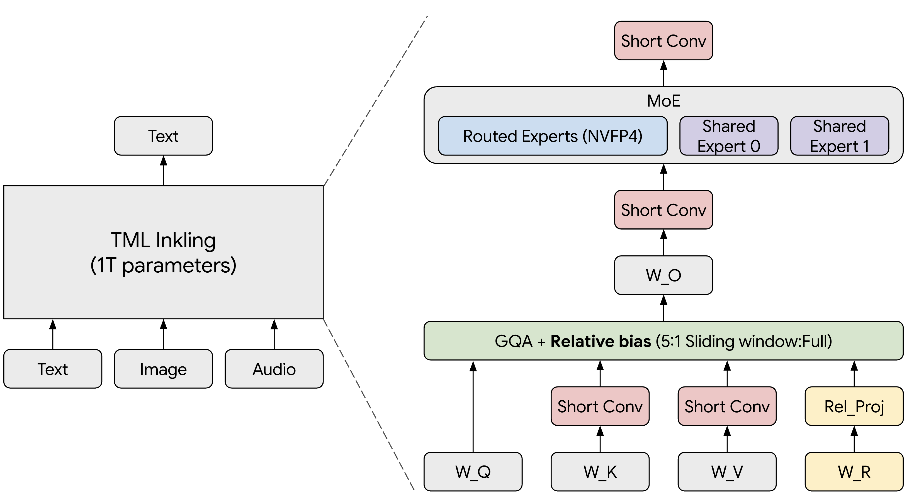
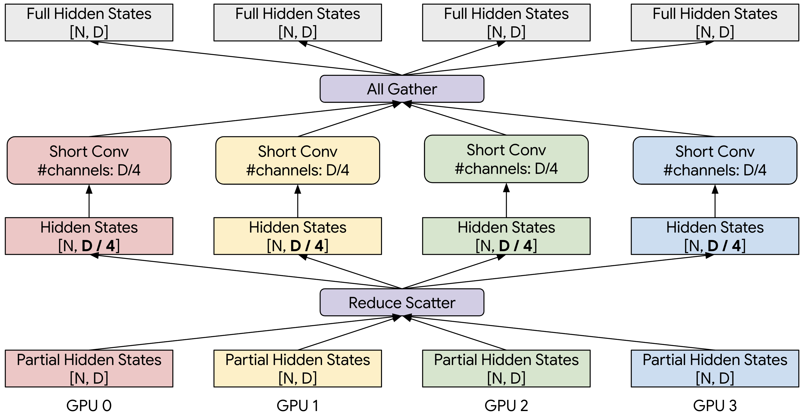

# TML Inkling：1T 多模，相对位置，短卷积当 KV

英文对照：`en/vllm/blog/serving/inkling.md`  
原文：https://vllm.ai/blog/2026-07-15-inkling  
2026-07-15。数字是 4×GB200 上的演示。

Thinking Machines 的 1T 多模：text/image/audio → text，原生 1M（Tinker 暴露 64K/256K）。66 层：11 full + 55 sliding-window GQA。位置不是 RoPE，是 **relative attention**（learned bias 加到 pre-softmax）。每层四个 window-4 **sconv**（K/V/attn-out/MoE-out）。MoE：256 routed top-6 + 2 shared **expert sink**（吃 routing 质量、不进 top-6）。NVFP4 只量化 routed expert；MTP 8 头全 BF16。当时 **AMD 未支持**（缺 relative-attn kernel）。**不是新引擎**——sconv 被当成虚拟 SWA 层的 KV。

本地图（原文版权仍归原站；学习对照用）：

## 旗

`VLLM_USE_V2_MODEL_RUNNER=1`、`FLASH_ATTENTION_CUTE_DSL_CACHE_ENABLED=1`。`--tokenizer-mode inkling`、`--reasoning-parser inkling`、`--tool-call-parser inkling`、`--tensor-parallel-size 8`、`--speculative-config '{"method":"mtp","num_speculative_tokens":8}'`。sconv 按 channel reduce-scatter/all-gather，避免每卡存全量 cache。Lamport 风格 fused collective：bs=1 **40 µs → 8 µs**。FA4 sheared-bias。MTP 拒绝后要重算 draft KV。

## 数字（演示）

4×GB200，SPEED-Bench 8K in / 1K out：MTP8 **380 tok/s/user**（mean accept 4.5），无 MTP **140**。MMAU / MMMU-Pro / BFCL 与参考差在 1 pp 内；NIAH 到 221K 对齐，800K+ 方差大。
