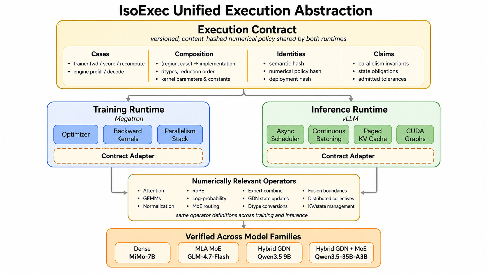
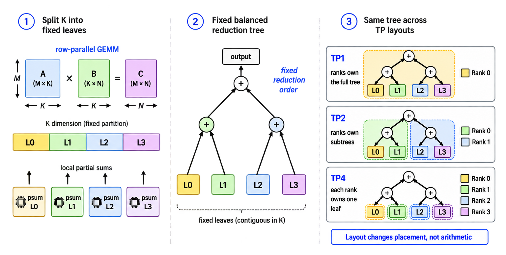
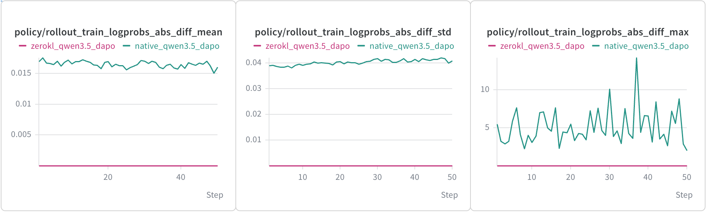
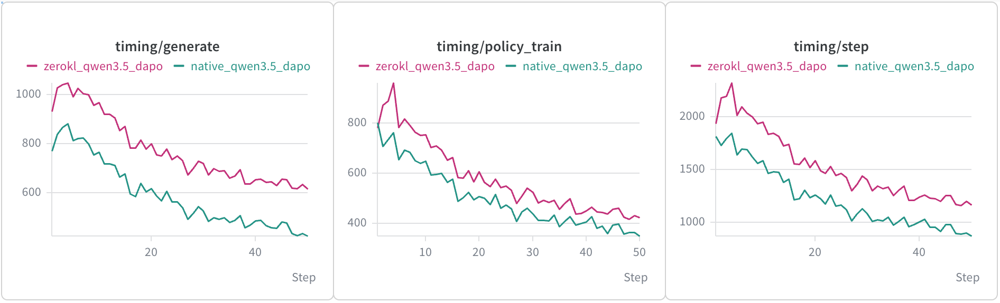
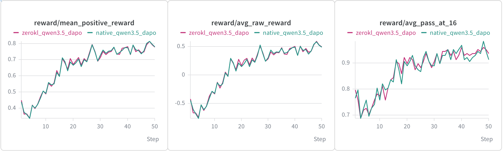

# IsoExec：同一份执行合同盖住训练和推理

英文对照：`en/vllm/blog/serving/isoexec.md`  
原文：https://vllm.ai/blog/2026-08-21-isoexec  
SkyRL × vLLM × Megatron。8×H100，Qwen3.5-35B-A3B 同步 DAPO：合同覆盖区域的平均 rollout–train logprob 差压到 **1e-6 以下**，相对当时 SkyRL 基线约 **25%** 墙钟。仓库：https://github.com/zanderjiang/SkyRL-IsoExec

On-policy 假定两次前向是同一政策。浮点不可结合：kernel、batch 形状、TP/EP/SP 切法一变，token 概率就变。VeXact / Fireworks 的故事：mismatch 能让 GRPO 不稳、clip 掉近半 token。

IsoExec 两件套：

1. **Execution contract**：每个 (region, case) 钉死实现、累加 dtype、split-K 叶子数。`semantic` / `numerical_policy` SHA-256 两边要对上；部署缓冲可以不同。
2. **统一模型**：batch-invariant GEMM/attention/norm + 确定 MoE combine。`pik` 沿 K 维固定二叉树，NCCL 搬部分和。EP 按 routing 序 combine，不按 rank 序。

线性 attention 更烦：训练/prefill 用 chunkwise，decode 用 recurrent，同一层平均绝对差可到 ~、最大 0.25。全程 recurrent 会把 prefill 拉成 4×+。**CPR**：chunk 边界先算 recurrent 状态，块内并行扫；decode 每 chunk 再对齐一次 rounding。相对 native mixed：训练约 1.43×，prefill 约 1.67×，decode 约 1.38×，且 bitwise。

50 step 里奖励没有明显变好——短跑看不出稳定红利。下一步：Blackwell、CP 不变性、sparse attn、Block-FP8 MoE。更早的「两份模型对齐 kernel」见 [bitwise RL](bitwise-rl.md)。

本地图（原文版权仍归原站；学习对照用）：

