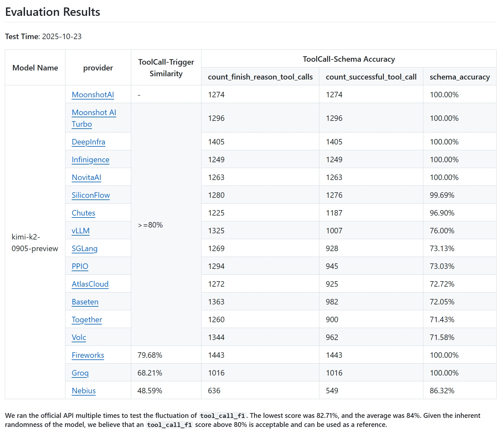

# Kimi K2 tool-calling：坏的是 chat template 握手，不是 MoE kernel

英文对照：`en/vllm/blog/serving/kimi-k2-accuracy.md`  
原文：https://vllm.ai/blog/2025-10-28-kimi-k2-accuracy  
v0.11.0，K2-Vendor-Verifier。模板需晚于 Kimi-K2-0905 `94a4053` / Kimi-K2 `0102674`。

官方 API schema error **0**；vLLM 初始成功 tool call 218/1200+（<20%）。三刀：① `add_generation_prompt` 藏在 tokenizer `**kwargs`，vLLM 安全起见不传（PR #25794），prompt 缺 `<|im_assistant|>…<|im_middle|>`，模型当续写。② 空 `content: ''` 被抬成 list-of-dicts，Jinja 把字面量塞进 prompt。③ tool-call id 必须 `functions.func_name:idx`；历史里 `search:2` 让 parser `split('.')[1]` 炸。修好后成功解析 218→~1000，F1 **83.57%**，schema 仍 **76%**——模型会 hallucinate 历史里出现、当前请求没给的工具。Moonshot 有 Enforcer 做约束解码，当时 vLLM 没有。调试要落到 `/completions` 和 token id，别只盯 `/chat/completions`。

本地图（原文版权仍归原站；学习对照用）：

