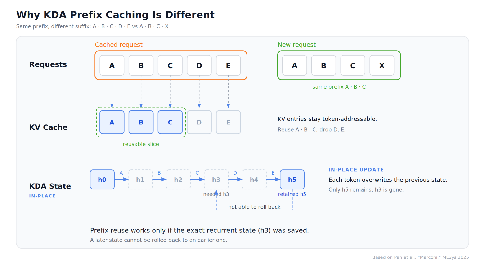
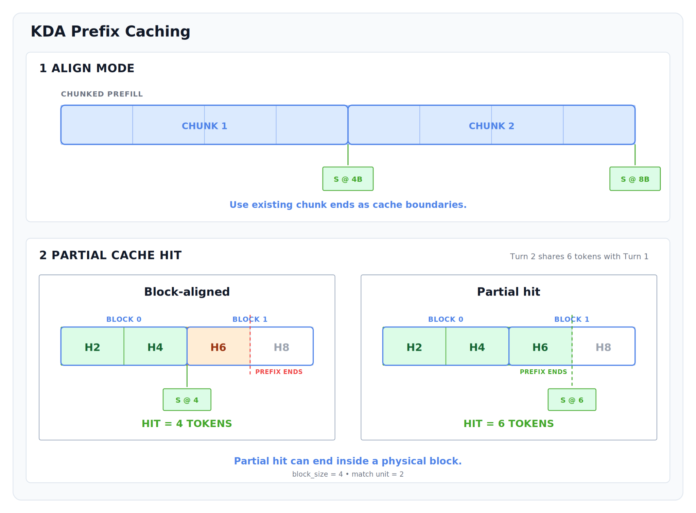

# Kimi K3 preview：权重还没到，cache 先改了

英文对照：[en/vllm/blog/serving/kimi-k3-preview.md](../../../../en/vllm/blog/serving/kimi-k3-preview.md)  
原文：https://vllm.ai/blog/2026-07-22-kimi-k3-preview  
2026-07-22。权重计划 2026-07-27；落地数字见 [k3](kimi-k3.md)。

2.8T、1M、原生视觉、KDA + AttnRes + 896/16 LatentMoE + MXFP4 + SiTU。这不是 K2 放大。KDA 用定长 recurrent，不能按 token 存 KV；物理 state block 很大，旧设计让「前缀命中」只能落在整块边界——几乎共用整段 prompt 也会 miss。

新设计把三件事拆开：**物理块大小**、**调度对齐**、**前缀匹配粒度**。大块里登记细粒度 KDA 快照，命中后 copy-on-write 再往前走。full attention 与 KDA 必须同意同一个 `num_computed_tokens`。这是 **core 基础设施**，不是 K3 私房。

本地图（原文版权仍归原站；学习对照用）：

## 热路径（当时进度）

FlashKDA prefill；NVIDIA fused decode（conv + recurrent + gate + norm）；AttnRes Triton/CUDA；MLA 手写融合、P/D 分路径；MXFP4 MoE 接通 SiTU（DP16+EP16 验过）；AMD FlyDSL A16W4/A8W4。非分离 serving 已能跑；Dynamo+Mooncake 分离还在收尾。

宣布与开权拆开：产品先冻 checkpoint，引擎再有窗口做对、做配方。**不是引擎换代文。**
