# Kimi K3 day-0：2.8T 怎么端上桌

英文对照：[en/vllm/blog/serving/kimi-k3.md](../../../../en/vllm/blog/serving/kimi-k3.md)  
原文：https://vllm.ai/blog/2026-07-27-k3  
2026-07-27。署名 **vLLM Team and Inferact**。数字是 GB300 NVL72 上的演示。KDA 前缀缓存设计见 [preview](kimi-k3-preview.md)。tool-calling 握手那篇：[kimi-k2-accuracy.md](kimi-k2-accuracy.md)。投机亲戚：[dspark-adaptive](../performance/dspark-adaptive.md)、[spec-decode](../performance/spec-decode.md)。缓存池：[mooncake.md](mooncake.md)、[kv-offload.md](kv-offload.md)。当时只能 Docker（含预发布 FlashInfer）。**引擎骨架没换**；换的是 hybrid cache、kernel、配方。

`moonshotai/Kimi-K3`：2.8T MoE，896 expert 里激活 16，1M 上下文，原生视觉，权重 MXFP4。注意力是 Kimi Delta Attention（KDA，定长 recurrent）夹 periodic full attention，再加 AttnRes、Stable LatentMoE。聊天模板是 Python 渲 token，不是 Jinja。

**Figure（social preview，未收录）：** “Kimi K3 day-0 support on vLLM.”

本地图（原文版权仍归原站；学习对照用）：

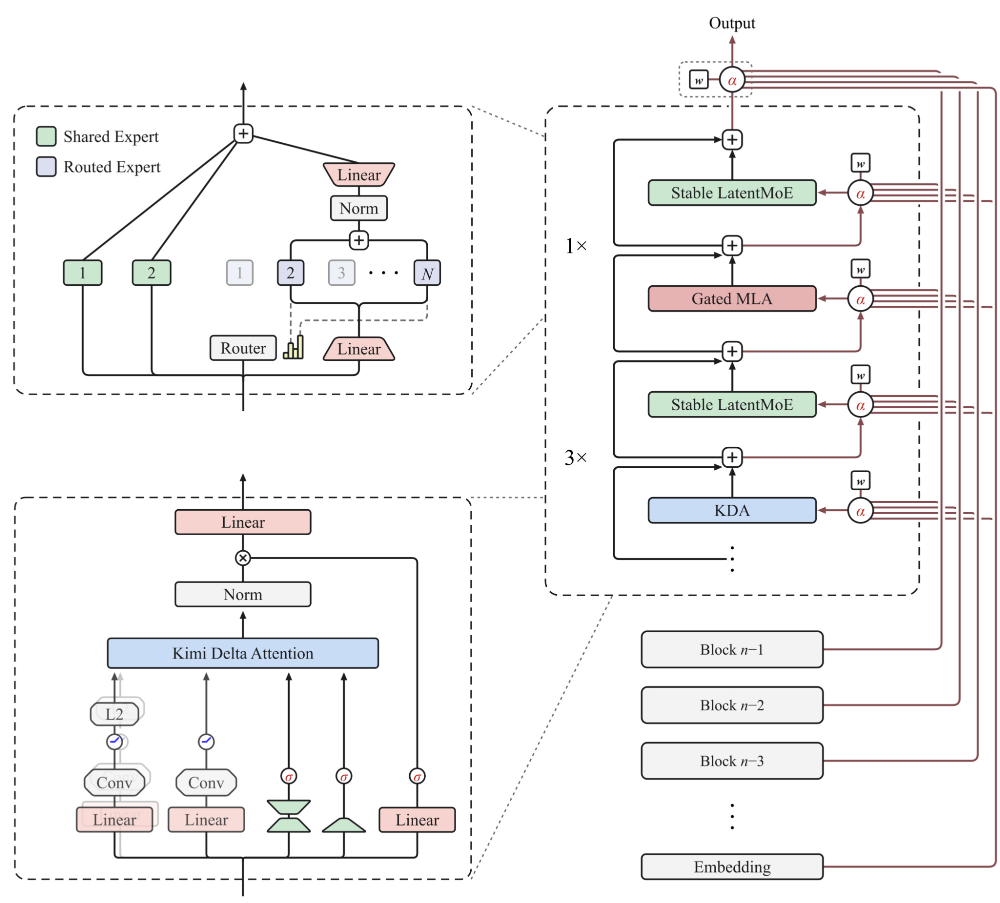

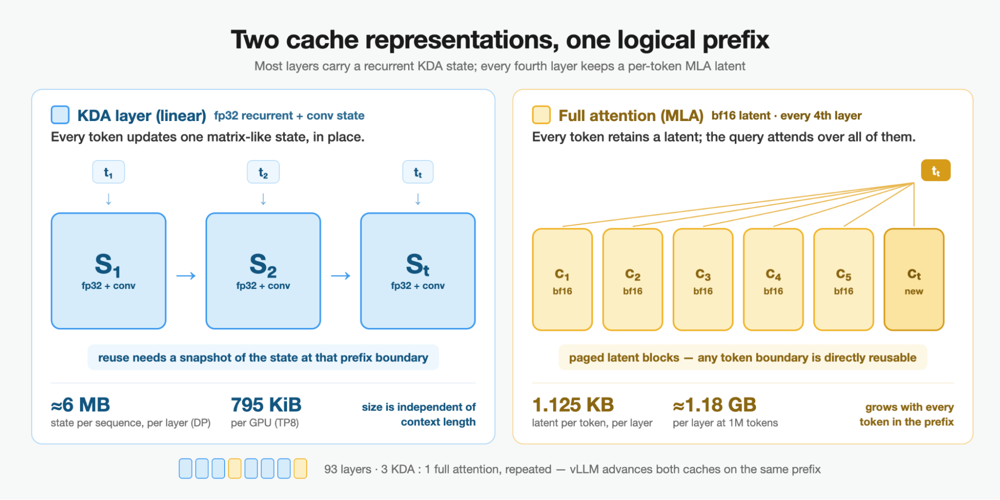

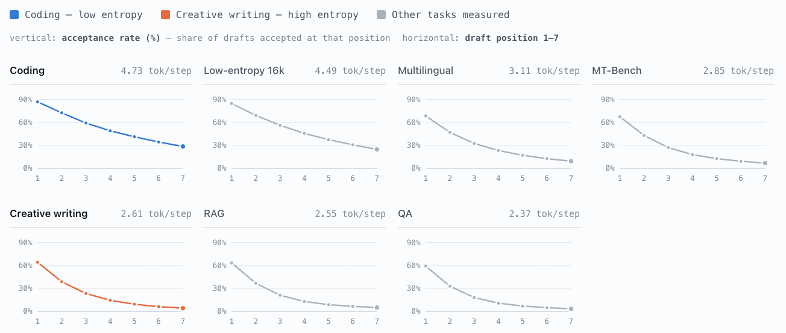

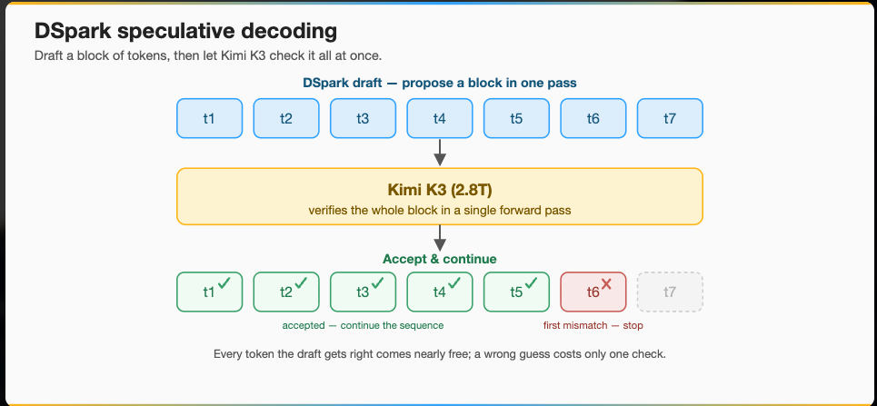

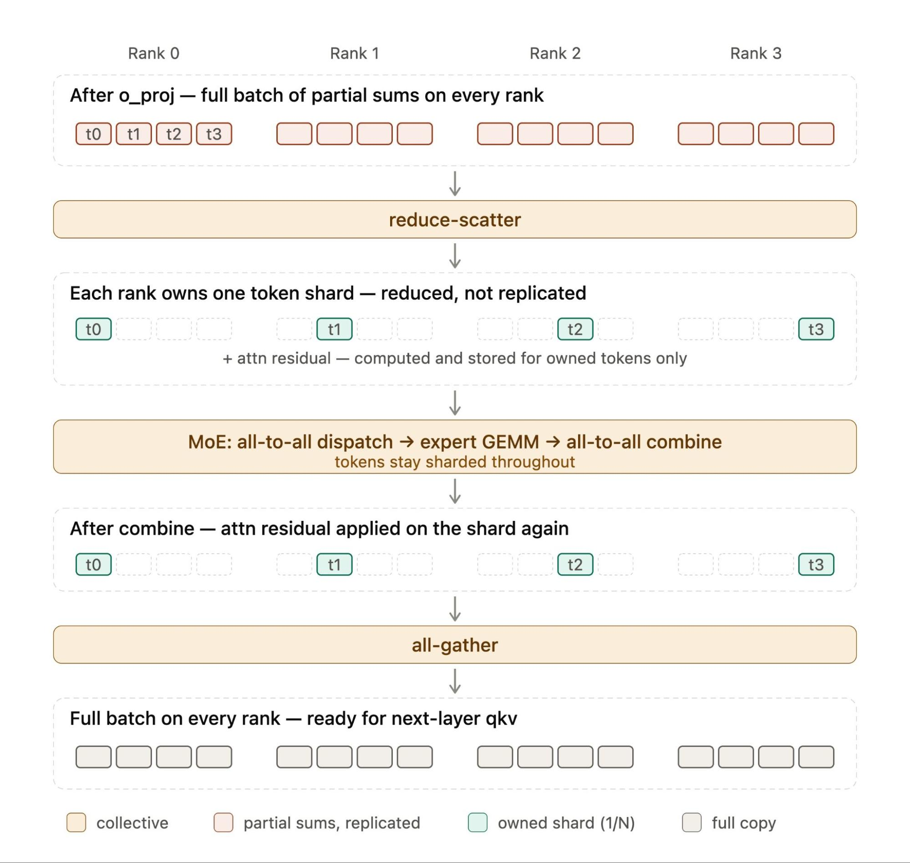

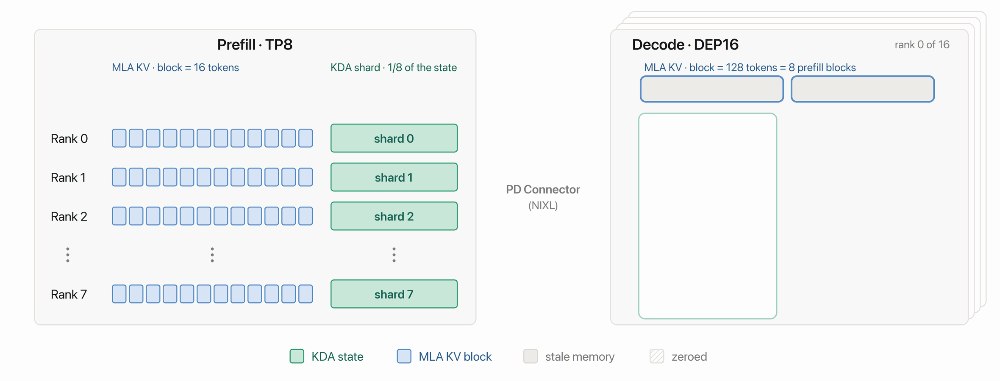

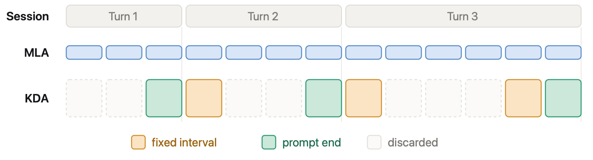

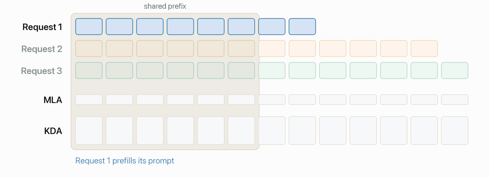

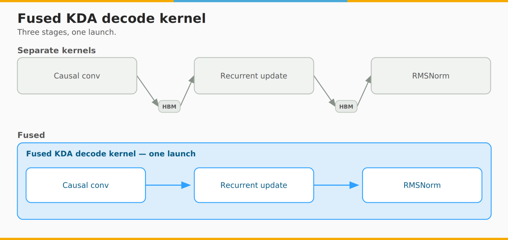

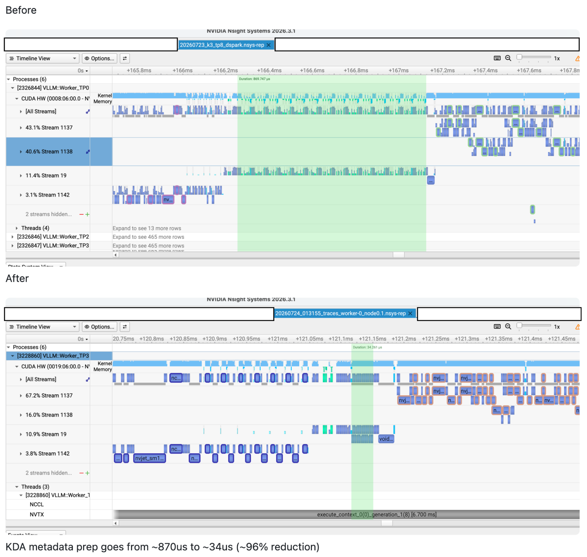

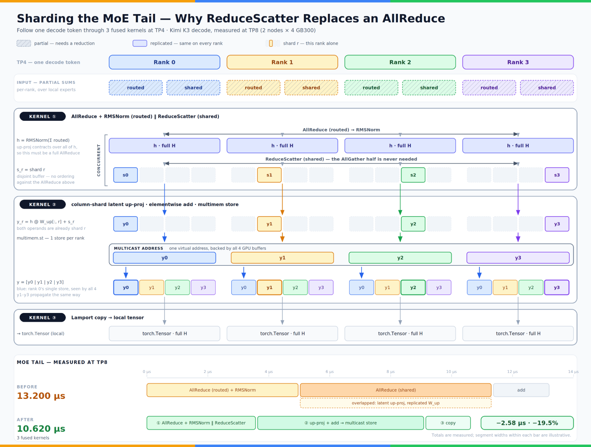

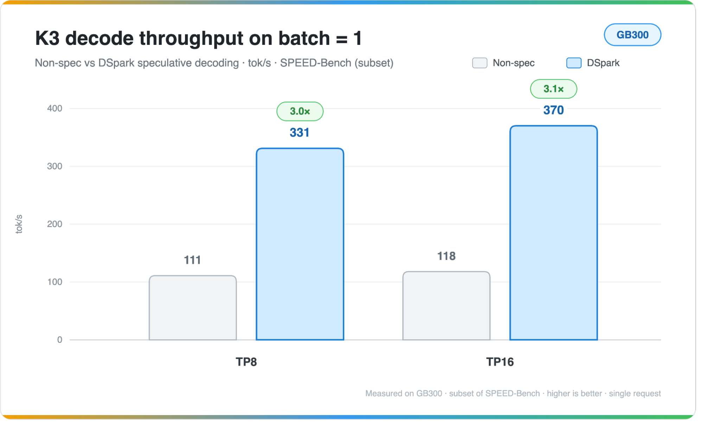

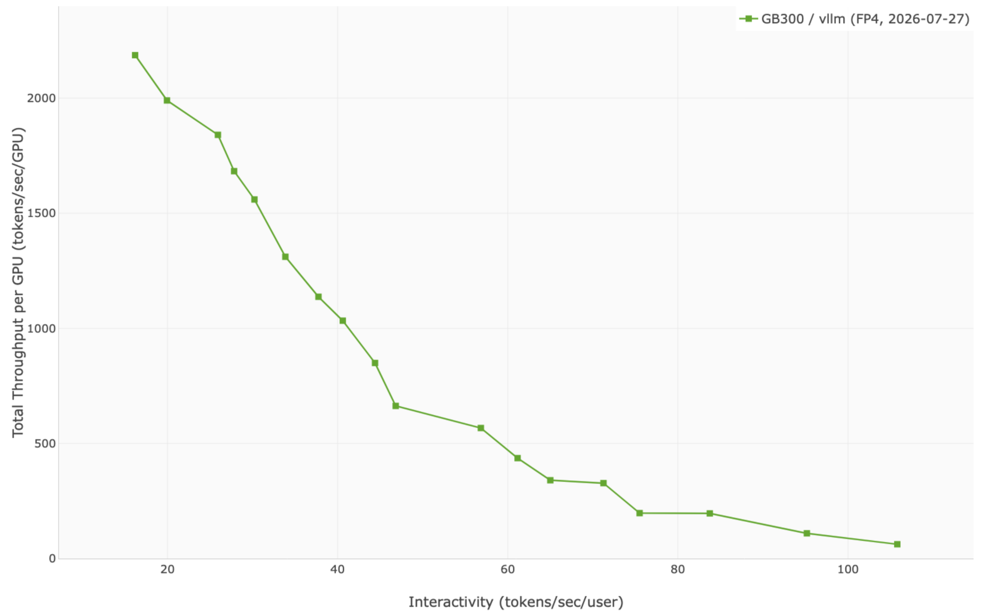

## Quick start

```bash
# See the linked recipes for the exact Docker command.
vllm serve moonshotai/Kimi-K3 \
  --tensor-parallel-size 8 \
  --trust-remote-code \
  --load-format fastsafetensors \
  --enable-prefix-caching \
  --enable-auto-tool-choice \
  --tool-call-parser kimi_k3 \
  --reasoning-parser kimi_k3
```

最省事：**8 张 NVIDIA B300** 或 **8 张 AMD MI355X**。Inferact 还开了 [DSpark speculator](https://huggingface.co/Inferact/Kimi-K3-DSpark)：

```bash
--speculative-config '{"model":"Inferact/Kimi-K3-DSpark","method":"dspark","num_speculative_tokens":7,"attention_backend":"FLASHINFER_MLA","draft_sample_method":"probabilistic","rejection_sample_method":"block"}'
```

菜谱与 Docker：[recipes.vllm.ai/moonshotai/Kimi-K3](https://recipes.vllm.ai/moonshotai/Kimi-K3)。当时 **只有 Docker 能跑**，里面绑着若干预发布依赖，包括 [FlashInfer](https://github.com/flashinfer-ai/flashinfer)。

## TL;DR

- **2.8T 多模态 MoE：** 每 token 激活 16/896，上下文到 1M，KDA + AttnRes + LatentMoE，原生 MXFP4。
- **单用户最高 370 tok/s：** 无投机 118 tok/s，DSpark **370 tok/s（3.14×）**，测在 **16 张 NVIDIA GB300 NVL72**。
- **上线就带生产件：** 投机解码、Prefill/Decode 分离、Mooncake 上的 agentic KV、tool calling、reasoning、structured output。NVIDIA Hopper/Blackwell 与 AMD MI355X。
- **开源 DSpark：** block-diffusion 投机，用 vLLM 和 [TorchSpec](https://github.com/lightseekorg/TorchSpec) 训，Inferact 发。
- **Hybrid 前缀缓存：** 为 recurrent KDA 状态重做；现在同类 hybrid 线性模型都能用。

## Kimi K3 的架构，以及 vLLM 怎么伺候它

**Figure.** 架构创新，出处 [Kimi K3 发布博](https://www.kimi.com/blog/kimi-k3)。内部细节在 [preview](kimi-k3-preview.md)；这篇是落地指南。

### Kimi Delta Attention：recurrent 夹满 attention

**新在哪：** 大多数层是 KDA——线性注意力，**定长 recurrent state**，KV 不随序列涨——中间周期性插入 **full attention**，保住精确全局回忆。1M 上下文靠这个才买得起。

**vLLM 怎么做：** 一个 hybrid KV-cache manager，同一调度器下两套内存：满 attention 用 paged KV，KDA 用紧凑 recurrent 块。KDA backend：Prefill 走 **FlashKDA**；Decode 走 fused CUDA（投机解码时也可 Flash-Linear-Attention/Triton）。

最难的是前缀缓存。满 attention 按 token 存 KV；KDA 每步改 recurrent 和 convolution，**不能**在每个前缀边界拍快照。vLLM 把大块物理 KDA 状态和细粒度前缀匹配拆开，块内登记快照，**往前延伸前先拷**，长共享 prompt 才能同时复用 KDA 状态和 paged KV。这是 core，不是 K3 私房。

**Figure.** Hybrid cache：KDA 与周期性满 attention 交错；recurrent 与 paged KV 一起管。

### Attention Residuals：沿深度学着混残差

**新在哪：** Block AttnRes 不用普通残差累加，改成 **depth-wise attention**：每个 Transformer 子层用学来的 pseudo-query，给前面层块里 RMS-normalized 的残差状态加权。

**vLLM 怎么做：** Triton / CUDA 把 depth-wise logits、softmax、hidden 聚合焊成 **一次 fused op**。残差更新和输出 RMSNorm 能进同一 kernel 就进。

### Stable LatentMoE：分位数均衡的 16/896 潜空间专家

**新在哪：** NVIDIA 的 [LatentMoE](https://research.nvidia.com/labs/nemotron/LatentMoE/) 把派发激活投到更窄的 latent 维做 routed-expert，再投回来——专家权重带宽和 all-to-all 都轻，同样代价能养更多专家。Kimi 的 [Stable LatentMoE](https://www.kimi.com/blog/kimi-k3) 拉到 **896 专家、激活 16**，用 [Quantile Balancing](https://kexue.fm/archives/11619) 替代启发式均衡。

**vLLM 怎么做：** expert parallelism 切专家。两套 MoE backend：TP > 1 用 **TRT-LLM-Gen**；DEP 用 **MegaMoE**。可选 EPLB。权重在 MoE 路径上 **原生 MXFP4**。

### Chat template：一段渲程序，不是 Jinja

**新在哪：** system / user / assistant、多模态、工具定义和工具结果都要用精确 control token。K2 是 [Jinja](https://huggingface.co/moonshotai/Kimi-K2.7-Code/blob/main/chat_template.jinja)；K3 是 **Python 程序直接造 token 序列**。输出还得分 reasoning、答案、tool call 三块。

**vLLM 怎么做：** Python 和 Rust frontend 都实现输入渲染和流式解析。用户/工具给的文本当普通内容。[XGrammar](https://xgrammar.mlc.ai/) 约束 structured 区域，API 里 reasoning、content、tool-call 分字段返回。

## 为生产而做

### 超低延迟：DSpark 投机解码

Day-0 就接 DSpark；draft 用 vLLM + TorchSpec 训，投机推理和训练数值对齐。block-diffusion 骨架从 K3 中间状态一次并行出多 token，块加深，起草代价仍平。块内依赖靠 low-rank Markov head；confidence head 估接受概率。Draft **原生 MLA**，跟 K3 注意力同构，KV 布局才能跟高级 KV 管理和 P/D 兼容。

**Figure.** 各数据集上的 DSpark 位置接受率。

SPEED Bench、单用户：**3.14×**，**118 tok/s → 370 tok/s**。编码/低熵约 **4.73** accept/step；高熵（创意写作）约 **2.61**。用 confidence head 排优先级、剪弱草稿——**还在做**。Draft 模型和推理支持都开源。

**Figure.** 轻量 DSpark 提候选，K3 一次并行核验。

### Sequence parallelism 给 TEP Prefill

**Figure.** 按 token 所有权切分；AttnRes 在分片上做；一次 all-gather 在下一层 QKV 前把 batch 拼回来。

Prefill 把 attention 的 tensor parallelism 和 MoE 的 expert parallelism 绑成 **TEP**。相对纯 TP：通信少，专家整块留在 rank 上，GEMM 形状更好。

朴素 TEP：**每层两次 all-reduce**（attention `o_proj` 后一次、MoE 后一次）——每个 rank 都物化整 batch，AttnRes 也白算一遍。Sequence parallelism（[arXiv:2205.05198](https://arxiv.org/abs/2205.05198)）：`o_proj` 后改 **reduce-scatter**；AttnRes 按分片；MoE all-to-all dispatch/combine；下一层 QKV 前 **一次 all-gather**。

两处好处：

- **理论上通信更便宜**（reduce-scatter + A2A dispatch + A2A combine + all-gather 对两次 all-reduce）。NCCL 的 reduce-scatter / all-gather **不适合** Prefill 那种消息尺寸，于是自写 kernel，比 NCCL **1.7×–4.5×**，小到中等消息尤其明显。
- **AttnRes 跟着分片：** 每个 rank 只养自己那份 token。AttnRes 把残差变成跨层常驻状态，这件事特别贵。

TP + MegaMoE，或 TP + DP + EP，默认开。**没有额外 flag。**

### 大规模：Prefill/Decode 分离

高吞吐：跨节点 EP + DP，P/D 分 replica。验证过的一套：**TEP8 Prefill → DEP16 Decode**，KV 走 **NIXL**。

Hybrid 模型的 P/D 不留情：recurrent KDA、满 attention 的 paged KV、block table 都得对上。NIXL 把共享页看成两套逻辑视图——token 级 MLA cache，和 request 级 KDA 状态（convolution + recurrent）。握手先换 MLA/KDA metadata，再为各次传输建 **分开的 descriptor**。

异构 TP 下，hybrid allocator 给 Prefill 和 Decode 用不同 block size。NIXL 跟踪 logical→physical，**没传完的尾巴清零**，免得旧请求的脏数据从 padding 里漏出来。

**Figure（GIF）。** Prefill/Decode 分离流程。

### 部分块命中和 KV offload 怎么和解

细粒度前缀命中可能停在物理块 **内部**（[preview](kimi-k3-preview.md)）。Offload 时：本地 GPU 先打到一段残尾，外部存储（Mooncake）又发现 **更长** 前缀。整块命中可以干净往外延；残尾会跟远端结果 **重叠**。

调度器比两边「真正能复用的 token 数」，取 **更长** 的。远端赢了，就放掉为较短本地残尾预留的块，并把 **所有 cache group** 对齐到新前缀长度。

整套走现成 KV Connector API——`MooncakeStoreConnector`、`SimpleCPUOffloadConnector` 等，不必为模型再开一条路。RFC [issue #45702](https://github.com/vllm-project/vllm/issues/45702)；PR [#45939](https://github.com/vllm-project/vllm/pull/45939)、[#46384](https://github.com/vllm-project/vllm/pull/46384)、[#49502](https://github.com/vllm-project/vllm/pull/49502)。

### Agentic serving：更聪明的缓存保留策略

一层 KDA 状态大约等于几千 token 的 MLA cache——大，但 **不随序列涨**。Agent 跑到几十万到 1M token，这件事才显出来。每个 token 都存一份 KDA，分布式池也会被吃光（一份 checkpoint ≫ 一个 token 的 MLA）。两条政策：

#### Interval-based retention

把选中的位置当 checkpoint——例如每 **32K** token 一份。**Prompt 边界**更好：下一轮通常回放上一轮 prompt。vLLM 自动留这些。

`VLLM_PREFIX_CACHE_RETENTION_INTERVAL`：`0` 关掉周期性 checkpoint，**只留 prompt 末**（多轮对话）。间隔拉大，用重算换缓存。

DeepSeek V4 和 hybrid SWA 先走 [PR #43447](https://github.com/vllm-project/vllm/pull/43447)；K3 / hybrid 线性 Day-0 是 [PR #45845](https://github.com/vllm-project/vllm/pull/45845)。

**Figure.** MLA 每块都存 KV；KDA 只在 checkpoint——prompt 末（绿）必留，固定间隔（橙）可配。

#### Marconi-style selective retention

系统提示、仓库快照、工具说明书，复用时 **不一定** 落在 prompt 边界。[Marconi-style（MLSys ’25）](https://mlsys.org/virtual/2025/poster/3260)：**第二次命中才缓存**。第一次证明前缀存在，第二次证明它被共享。一次性前缀不占坑。

[PR #37898](https://github.com/vllm-project/vllm/pull/37898)；K3 Day-0 [PR #47782](https://github.com/vllm-project/vllm/pull/47782)。

**Figure（GIF）。** 请求 1 只在自己的 prompt 末留 KDA（过了共享前缀）→ 请求 2 KV 命中、KDA miss → 第二次目击才在前缀边界存状态 → 请求 3 复用。

合在一起：interval 钉结构边界；Marconi 学哪些别的前缀值得留。

## 性能优化

整模勉强塞进一张 DGX B300；那一代最少 **16 张 NVIDIA B200/GB200**。TP 对交互好，有效 KV 却小；大规模 EP 又可能把每用户输出速度卡在网上。不少条目 [preview](kimi-k3-preview.md) 已经写过。

### Attention Residuals

Block AttnRes 最多看 **八** 份缓存块表示，再加当前块内残差——最多 **九** 个源。像 FlashAttention 的 online-softmax，但轴是 **深度** 不是序列。一次 fused kernel（残差更新进，可选 RMSNorm 出）。通用 Triton；支持的 Blackwell 上有专用 CUDA。

### KDA Decode

**Figure.** Fused KDA Decode：因果卷积、recurrent 更新、RMSNorm 一次 launch。

一层 KDA：输入投影、因果 1D conv、QK norm、gate、recurrent、输出 gated RMSNorm。支持的配置里，投影之后的 Decode（conv 到 gated RMSNorm）是 **一个 CUDA kernel**，状态原地更新。否则 Triton。

### KDA Prefill

Moonshot 先发 [FlashKDA](https://github.com/MoonshotAI/FlashKDA)（CUTLASS）。vLLM 接进来（覆盖更多 GPU、metadata dtype、布局、vendoring）。[Shikhar Mishra](https://github.com/Itssshikhar) 再为 H100 发 [Flash-Flash-KDA](https://github.com/Itssshikhar/Flash-Flash-KDA)。一天内在 GB300 NVL72 上验过，折进 FlashKDA 集成。开源回路，不是单向交接。

### KDA metadata builder

**Figure.** 优化前后的 Nsight Systems。

DSpark bring-up 时，K3 先复用通用 GDN metadata builder：会准备 K3 不用的 FLA metadata，再用一串小 eager PyTorch op 拼 GPU metadata。专用 builder 剪掉闲路径，把那些序列焊成 Triton。bs=1：准备延迟 **870 µs → 34 µs（96%）**；DSpark 端到端 **−6%**。

### 低延迟 BF16 GEMM

小 batch、延迟敏感：若干线性投影不用通用 BF16 GEMM，改 `skinnyGEMM`——跳过 shared memory 中转，激活和权重直接进寄存器，CUDA Core FMA（避开 TMA / Tensor Core 那套吞吐启动）。微基准：kernel **8%–100%**；小 batch 端到端约 **10%**。

### 低延迟 MoE tail fusion

**Figure.** LatentMoE 尾巴：两次 all-reduce + RMSNorm + latent 上投影 + add，换成三个 kernel，通信和计算更好叠。

LatentMoE 结束，routed 激活要 RMSNorm 再上投影，才能加到 shared-expert 输出上。普通 TP：两次 all-reduce（或 concat 后一次），上投影还 **复制一份**。

改法：shared expert 走 **reduce-scatter**；routed 走 **all-reduce**（要先归一化）；复制出来的 routed 激活做列并行上投影；加到已经分片的 shared 输出上；broadcast 做 all-gather。这一步大约 **20%**；端到端约 **7%–8%**。

## Quality and Performance Benchmarks

### 准确率与正确性

走 OpenAI-compatible 端点验，精确配置在菜谱里。最大 reasoning-effort：

| Benchmark | Score |
| --- | ---: |
| GSM8K | 0.976 |
| GPQA-Diamond | 0.939 |
| OCRBench | 0.889 |
| MMMU Pro Vision | 0.818 |

**Caveat：** K3 想很久。分数低，更常见是答案被 **截断**，不是算错——先加大 reasoning、把 `max_tokens` 给足，再查截断，别先怀疑 kernel。

### Serving performance

**Figure.** GB300 NVL72、bs=1 Decode 吞吐，TP8 与 TP16。

| Config | tok/s per user (bs=1) |
| --- | ---: |
| TP8，无投机 | 111 |
| TP16，无投机 | 118 |
| TP8 + DSpark | 331（约 3×） |
| TP16 + DSpark | 370 |

**Figure.** GB300 NVL72 上的初始 Pareto：高吞吐 **2K+ TPGS**，到低延迟 **100+ TPS/user**。

### 复现基准

TP8 + DSpark 的 Decode 吞吐：

```bash
export NCCL_DMABUF_ENABLE=0
export VLLM_ALLREDUCE_USE_FLASHINFER=1
export VLLM_USE_RUST_FRONTEND=1
export VLLM_ENGINE_READY_TIMEOUT_S=3600
export HEAD_ADDR=127.0.0.1  # Change if vllm-bench runs on another host.

vllm serve moonshotai/Kimi-K3 \
  --enable-prefix-caching \
  --tensor-parallel-size 8 \
  --nnodes 2 \
  --node-rank 0 \
  --moe-backend auto \
  --trust-remote-code \
  --load-format fastsafetensors \
  --max-num-seqs 512 \
  --gpu-memory-utilization 0.9 \
  --max-model-len auto \
  --max-cudagraph-capture-size 256 \
  --kv-cache-dtype fp8 \
  --attention-config '{"mla_prefill_backend":"FLASHINFER","use_prefill_query_quantization":true}' \
  --speculative-config '{"model":"Inferact/Kimi-K3-DSpark","method":"dspark","num_speculative_tokens":7,"attention_backend":"FLASHINFER_MLA","draft_sample_method":"probabilistic","rejection_sample_method":"block"}'
```

bs=1，8K/1K random（不开投机）：

```bash
vllm-bench \
  --backend openai \
  --base-url "http://${HEAD_ADDR}:8000" \
  --model moonshotai/Kimi-K3 \
  --dataset-name random \
  --random-input-len 8192 \
  --random-output-len 1024 \
  --random-range-ratio 0.8 \
  --prompt-token-ids \
  --ignore-eos \
  --sweep-max-concurrency 1 \
  --sweep-num-prompts-factor 10 \
  --seed 42 \
  --percentile-metrics "ttft,tpot,itl,e2el" \
  --metric-percentiles "50,90,99" \
  --save-result
```

bs=1，SPEED Bench（投机）：

```bash
vllm-bench \
  --backend openai \
  --base-url "http://${HEAD_ADDR}:8000" \
  --model moonshotai/Kimi-K3 \
  --dataset-name speed-bench \
  --speed-bench-config throughput_16k \
  --speed-bench-max-input-len 10240 \
  --speed-bench-category low_entropy \
  --output-len 1536 \
  --num-prompts 10 \
  --no-oversample \
  --max-concurrency 1 \
  --temperature 1.0 \
  --top-p 0.95 \
  --save-result \
  --save-detailed
```

多节点、EP、视觉：[Kimi K3 recipes](https://recipes.vllm.ai/moonshotai/Kimi-K3)。

## Important Deployment Tips

1. **Prefix caching：** `--enable-prefix-caching`。vLLM 通常默认开；**K3 现在默认关**，hybrid-cache 还在长。要显式传。
2. **Tool calling：** 用自己的流量验。K3 偶尔吐出 parser 不认的格式 → `tool_calls` 空，同一套环境干净探针却能解析。跟 prompt 和这次 run 有关。生产 agent：按 schema 校验，空了就重试/回退，考虑 strict / structured tool calling。
3. **All-to-all：** `--all2all-backend`。NVLink：`flashinfer_nvlink_one_sided`。RDMA：`deepep_v2`。
4. **MoE backend：** 任何 DEP 用 `deep_gemm_mega_moe`。TP > 1 用 `flashinfer_trtllm`（FAQ）。
5. **Rust frontend：** `VLLM_USE_RUST_FRONTEND=1`，这个模型全支持。
6. **ViT 并行：** `--mm-encoder-tp-mode=data` 是 **默认**。视觉编码器 `head_size=12`，TP=8 切不匀。ViT 不到 1B，backbone 约 2T，所以默认 ViT DP，躲开编码器 all-reduce。

## Kimi K3 vLLM FAQ

### 伺候 Kimi K3 要几张卡？

至少一台 **8× B300**（或 GB300 NVL72）；**16× B200** 也行。生产多半是多节点 EP + DP，RDMA 或 NVLink。

### 怎么开 DSpark？

上面那段 `--speculative-config` JSON。推理和编码的单流 Decode 大约三倍。

### MoE 和 all-to-all 用哪个？

DEP 用 `deep_gemm_mega_moe`；TP > 1 用 `flashinfer_trtllm`。互联：NVLink `flashinfer_nvlink_one_sided`，RDMA `deepep_v2`。

### 支持前缀缓存吗？默认开吗？

满 attention KV 和 recurrent KDA 都支持。**默认不开**，要 `--enable-prefix-caching`。

### AMD 上能跑吗？

能。ROCm 随 Day-0 发；更宽的调优在 roadmap。

### 跟 preview 有什么不同？

[Preview](kimi-k3-preview.md) 是架构和 kernel 深潜（KDA 前缀缓存、kernel）。这篇是发布指南：菜谱、flag、性能、哪些能进生产。

## Roadmap and Future Work

- **RL：** rollout 已经接上；下一步跟生态做端到端 RL 训练。
- Day-0 之后继续挤性能。
- **Decode Context Parallelism (DCP)：** 原型加速不错；选定负载上比 TP8 **吞吐高 40%**。很快上游。
- 把 **EPLB** 再做好。
- 用 DSpark 的 confidence head 做 **confidence-based scheduling**。
- 更宽的 AMD ROCm 调优。

## Quick links

- 模型：[moonshotai/Kimi-K3](https://huggingface.co/moonshotai/Kimi-K3)
- DSpark draft：[Inferact/Kimi-K3-DSpark](https://huggingface.co/Inferact/Kimi-K3-DSpark)
- 菜谱 / Docker：[recipes.vllm.ai/moonshotai/Kimi-K3](https://recipes.vllm.ai/moonshotai/Kimi-K3)
- 技术博：[kimi.com/blog/kimi-k3](https://www.kimi.com/blog/kimi-k3)
- 设计：[preview](kimi-k3-preview.md)

## Acknowledgements

Moonshot AI（发布前共享架构、共设计 KDA 感知缓存）。Inferact（端到端集成和部署验证）。NVIDIA（fused KDA Decode、KDA Prefill、AttnRes kernel、MXFP4 MoE）。AMD（ROCm 起盘）。推理伙伴包括 Alibaba Cloud、Baseten、DigitalOcean、Modal。Shikhar（Flash-Flash-KDA）。vLLM 社区。为 K3 长出来的 cache 基础设施，现在属于每一家具有同类架构的 hybrid 模型。
