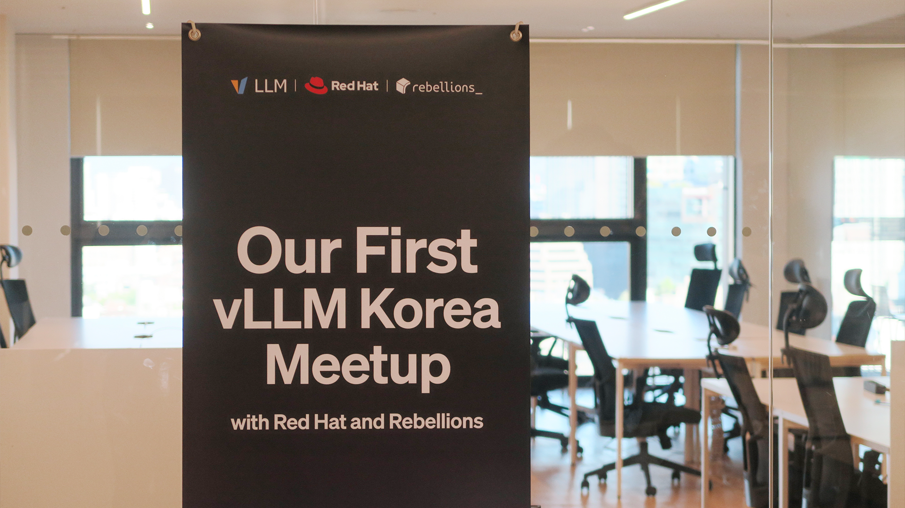
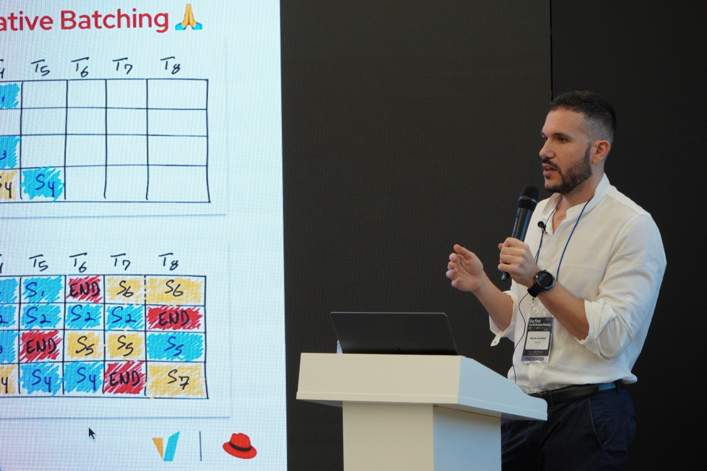
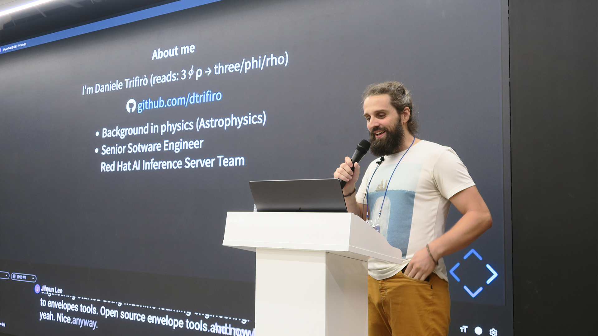
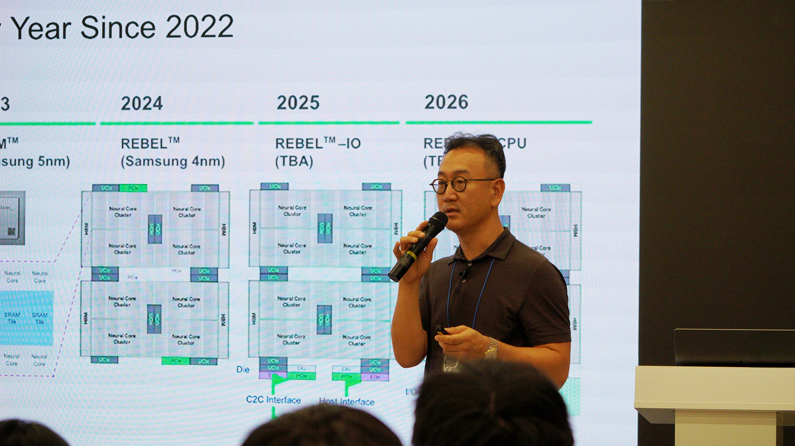
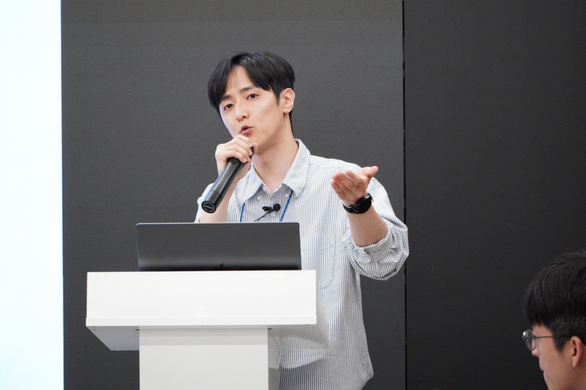
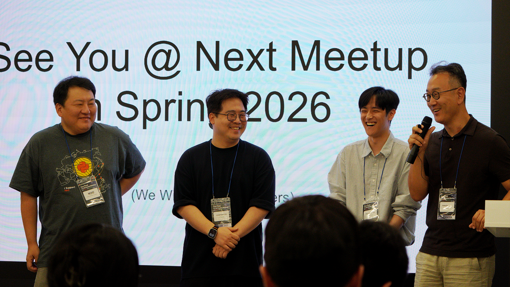
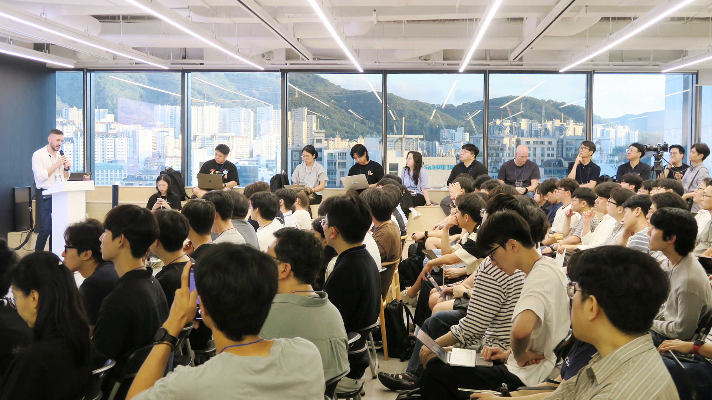

# 韩国首场 Meetup：350+ 报名，插件、TPU、量化评测

英文对照：[en/vllm/blog/serving/korea-meetup-2025.md](../../../../en/vllm/blog/serving/korea-meetup-2025.md)  
原文：https://vllm.ai/blog/2025-09-16-vllm-meetup  
2025-09-16 写的是 **2025-08-19** 首尔那场。署名 **vLLM Team**。主办：Rebellions + Red Hat。支持：PyTorch Korea User Group、SqueezeBits。社区纪要，不是 kernel 论文。续篇：[korea-meetup-2026.md](korea-meetup-2026.md)。亲戚：[paged-attention.md](../architecture/paged-attention.md)、[vllm-tpu.md](../architecture/vllm-tpu.md)、[hardware-plugin.md](../architecture/hardware-plugin.md)、[plugin-system.md](../architecture/plugin-system.md)。标题数字：**350+** 报名，**75+** 家公司，**80%** 产业（其中 80% 是软件工程师 / 研究员）。NPU 被点进范围。

本地开发者、研究员、AI 基建工程师。主题：高效 LLM 推理，对硬件友好的 serving。

## Nicolo Lucchesi — vLLM + llm-d，TPU

Nicolò Lucchesi（Red Hat Senior ML Engineer）。立项：用 PagedAttention 解 KV cache 和动态 batch。页上那句：“modern problems require traditional solutions”——调度和内存 OS 分页已经解过；vLLM 把同一套搬到推理。

**llm-d：** Kubernetes 原生编排多实例 vLLM，带 autoscaling——“vLLM meeting Kubernetes。”

收尾：Google TPU 接入还在做，加速器再往外扩。TPU 笔记：[vllm-tpu.md](../architecture/vllm-tpu.md)。

## Daniele Trifirò — 编、测、贡献

Daniele Trifirò（Red Hat Senior Software Engineer）。周发版、贡献者在涨、diff 很大。硬件让本地编译不容易；给新贡献者实操提示。按硬件编译：内存会按目标（CUDA / ROCm / TPU）尖起来。新的 **hardware plugin** 让设备别再 fork 核心——serving 更不绑死某一块硅。

## Hong-seok Kim — Rebellions NPU

Hong-Seok Kim（Rebellions Chief Software Architect）。加速器创业公司为什么在乎 vLLM；他们怎么往生态里塞。插件路径：定制硅上部署，体验接近 GPU。有了 vLLM：Rebellions NPU 上直接跑 MoE，并行和 continuous batching 也不必另做一套接入。给下一代加速器留门。

## Hyungjun Kim — 量化和评测

Hyungjun Kim（SqueezeBits）。量化已经是部署的一部分。vLLM 两条路：加载预量化盘，或自己量化再 serve。[LLM Compressor](https://github.com/vllm-project/llm-compressor) 是把量化接进流水线的开源子项目。**Fits on Chips**（SqueezeBits 工具）：在 vLLM 里比 TPS / 延迟 / 精度 / 硬件，选 serving 配置。

## 往后看

和 PyTorch Korea User Group、Python Korea 一起办定期韩国 meetup：workshop、开发者聚会、小班。页上的框：早期开源贡献更均匀；LLM + 加速器让个人和学术界更难上手。社区基建当可持续的学习环境；欢迎志愿者。

首场：实用、能规模化的真实 serving。Rebellions、Red Hat 和本地工程师答应继续办、继续往上游扔。
